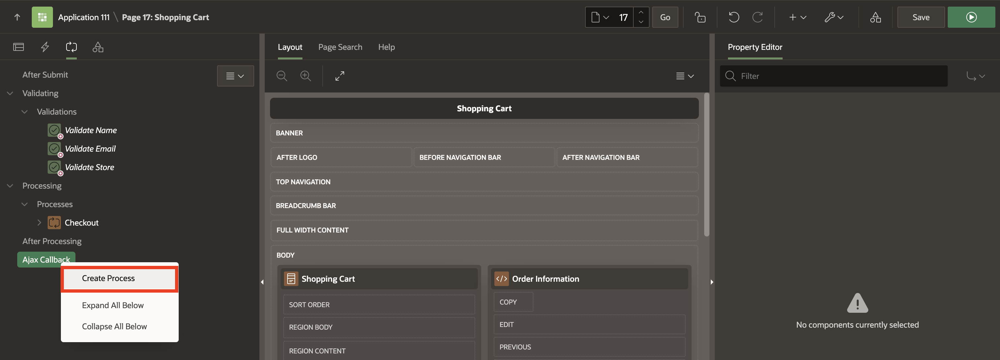

# Add Validations and Processes to the Shopping Cart Page

This lab is a collection of six tasks.  After completing this lab, your application will enable customers to:

This Hands-on Lab is a collection of six tasks.  After completing this lab, your application will enable customers to:

- Create validations on the Page Items.
- Create a Page process to create the Order
- Clear the shopping cart
- Proceed to checkout

Estimated Time: 15 minutes

### Objectives
In this lab, you:
- Create Validations, Processes and Branches to manage the Shopping Cart.

### Downloads

- Did you miss out on trying the previous labs?  Don't worry!  You can download the application from [here](https://c4u04.objectstorage.us-ashburn-1.oci.customer-oci.com/p/EcTjWk2IuZPZeNnD_fYMcgUhdNDIDA6rt9gaFj_WZMiL7VvxPBNMY60837hu5hga/n/c4u04/b/livelabsfiles/o/data-management-library-files/apex-23-2-object-storage-files/hol8.sql) and import it into your workspace.  To run the app, please run the steps described in **[Get Started with Oracle APEX](https://livelabs.oracle.com/pls/apex/r/dbpm/livelabs/run-workshop?p210_wid=3509)** and **[Using SQL Workshop](https://livelabs.oracle.com/pls/apex/r/dbpm/livelabs/run-workshop?p210_wid=3524)** workshops.

## Task 1: Create Validations on the Page

1.  Navigate to the **App Builder**.

    

2. Then Click on **Online Shopping Application**.

    

2. Then, select **Online Shopping Application**.

    

3.  In the Rendering tree (left pane), click the **Processing** tab.

    

       

5.  Create three validations for the following items: Name, Email, and Store

    

6.  Create three validations for the following items: **Name**, **Email**, and **Store**.

    

    | Name           | Validation > Type | Validation > Item       | Error Message                   | Display Location                      | Associated Item         |
    | -------------- | ----------------- | ----------------------- | ------------------------------- | ------------------------------------- | ----------------------- |
    | Validate Name  | Item is NOT NULL  | P16\_CUSTOMER\_FULLNAME | Please enter your name          | Inline with Field and in Notification | P16\_CUSTOMER\_FULLNAME |
    | Validate Email | Item is NOT NULL  | P16\_CUSTOMER\_EMAIL    | Please enter your email address | Inline with Field and in Notification | P16\_CUSTOMER\_EMAIL    |
    | Validate Store | Item is NOT NULL  | P16_STORE               | Please select a store           | Inline with Field and in Notification | P16_STORE               |
    {: title="Validation Properties"}

     

     These validations only apply when the user proceeds to checkout; let's create that condition.
     Under Server-side Condition, set the following:

    | Name           | When Button Pressed |
    | -------------- | ------------------- |
    | Validate Name  | Proceed             |
    | Validate Email | Proceed             |
    | Validate Store | Proceed             |
    {: title="Server-side Conditions"}

            

## Task 2: Add a Process to Create the Order

1. On the **Processing** tab (left pane).
2. Right- click **Processing** and click **Create Process**.

     

3.  In the Property Editor, enter the following:
  Under Identification:
    - For Name - enter **Checkout**
    - For Type, Select **Invoke API**

  Under Settings, select what Process Executes:
    - For Type, Select **PL/SQL Package**
    - For Package, Enter the case-sensitive PL/SQL package name, **MANAGE_ORDERS**.  You can type in the name or pick from the list.
    - For Procedure or Function, Enter the case-sensitive procedure or function name, **CREATE_ORDER**,  defined in the selected PL/SQL package.  You can type in the name or pick from the list.

       

       

4. On the **Processing** tab (left pane), Expand the Process **Checkout**. Under **Parameters**, Click **p_customer**.
   Under **Property Editor**, enter the following:
   Under Value :
   - For Type: Select **Item**
   - For Value: Select **P16_CUSRTOMER_FULLNAME**

  

5. Repeat the Above steps for the other parameters **p_customer_email**,**p_store**,**p_order_id**,**p_customer_id**. Set the Item Names as follows.
    | Parameter Name   | When Button Pressed |
    | ---------------- | ------------------- |
    | p_customer_email | P16_CUSTOMER_EMAIL  |
    | p_store          | P16_STORE           |
    | p_order_id       | P16_ORDER_ID        |
    | p_customer_id    | P16_CUSTOMER_ID     |

    

6. Click **Save**.

## Task 3: Add Process to Clear the Shopping Cart

1. On the **Processing** tab (left pane).
2. Right-click **Processing** and click **Create Process**.

    

3.  In the property editor,
    Under Identification:
      - For Name - Enter **Clear Shopping Cart**.
      - For Type - Select **Execution Chain**.
      - For Execution Chain - This attribute enables support for nested execution chains.  Use this attribute to define another execution chain as the parent for this chain.  For this example, select None.

    Under Settings:
      - Set **Run in Background** to **Yes**.

    

4.  Now, create a child process.  In the Processing tab, select the Execution Chain process, right-click and select Create Child Process.  The new child process is displayed under Processes.

    

5.  In the Property Editor, enter the following:
  Under Identification:
    - For Name - enter **Clear shopping Cart - Child**
    - For Type, Select **Invoke API**

  Under Settings, select what Process Executes:
    - For Type, Select **PL/SQL Package**
    - For Package, Enter the case-sensitive PL/SQL package name, **MANAGE_ORDERS**.  You can type in the name or pick from the list.
    - For Procedure or Function, Enter the case-sensitive procedure or function name, **CLEAR_CART**,  defined in the selected PL/SQL package.  You can type in the name or pick from the list.

     

Click Save.

## Task 4: Add Branches to the Page

1. In the **Processing** tab (left pane), right-click **After Processing** and select **Create Branch**.

       

3.  In the Property Editor, enter the following:  

    - Name: **Go to Orders**

    - Navigate to the Target attribute and click **No Link Defined**.
        - For Type - select **Page in this application**
        - For Page - enter **16**
        - For Set Items - enter:

          | Name           | Value            |
          | -------------- | ---------------- |
          | P16\_ORDER\_ID | &P16\_ORDER\_ID. |
          {: title="List of Taregt Item(s)"}

        - Clear Cache: **16**.

        Click **OK**.

    - Under the Server-side condition, for When Button Pressed, select **Proceed**.

    

4.  Create a  second branch when the user clears the shopping cart.  Right-click on **After Processing** and click **Create Branch**.

5.  In the Property Editor, enter the following:
    - For Name - enter **Go to Products**

    - Navigate to the Target attribute and click **No Link Defined**
        - For Type - select **Page in this application**
        - For Page - enter **1**
        - For Clear Cache - enter **1**
        - Click **OK**

    - Server-side condition > When Button Pressed: **Clear**

    

  Click Save.

## Summary
In this hands-on lab, You learned to create data validations for page items, ensuring data accuracy.  You also implemented a dedicated page process to streamline order creation.  Additionally, the lab covered clearing the shopping cart and enabling a seamless transition to the checkout process, enhancing the overall user experience.  You may now **proceed to the next lab**.

## What's Next
In the next lab, you explore the use of Dynamic Actions to manage the shopping cart, allowing for efficient real-time updates.  Additionally, you learn how to review product details and enable users to add, edit, or remove items from their cart with the help of Page Process.

## Acknowledgements
- **Author** - Roopesh Thokala, Senior Product Manager
- **Contributor** - Ankita Beri, Product Manager
- **Last Updated By/Date** - Roopesh Thokala, Senior Product Manager, January 2024
