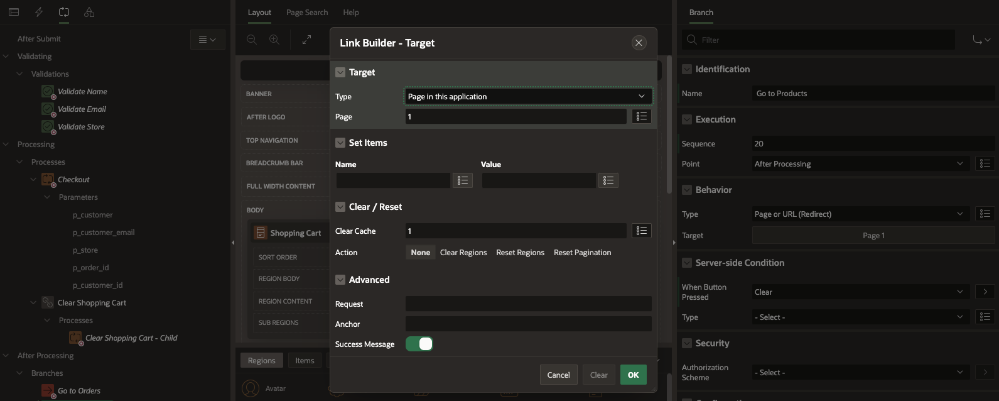

# Add Validations and Processes to the Shopping Cart Page

This lab is a collection of six tasks.  After completing this lab, your application will enable customers to:

- Create a Page process to create the Order
- Clear the shopping cart
- Proceed to checkout

Estimated Time: 15 minutes

### Objectives
In this lab, you:
- Create Validations, Processes and Branches to manage the Shopping Cart.

### Downloads

- Did you miss out on trying the previous labs?  Don't worry!  You can download the application from **[here](files/hol8.sql)** and import it into your workspace. To run the app, please run the steps described in the following workshops:
1. **[Get Started with Oracle APEX](https://apexapps.oracle.com/pls/apex/r/dbpm/livelabs/run-workshop?p210_wid=3509)** 
2. **[Using SQL Workshop](https://apexapps.oracle.com/pls/apex/r/dbpm/livelabs/run-workshop?p210_wid=3524)** 

## Task 1: Create Validations on the Page

1.  Navigate to the **App Builder**.

    

2. Then, select **Online Shopping Application**.

    

3. Select the **Shopping Cart** page.

    

4.  In the Rendering tree (left pane), click the **Processing** tab.

5. Right-click on **Validating** and select **Create Validation**.

       

6.  Create three validations for the following items: **Name**, **Email**, and **Store**.

    

    | Name |  Validation > Type | Validation > Item  | Error Message | Display Location | Associated Item |
    | --- |  --- | --- | --- |  --- | --- |
    | Validate Name | Item is NOT NULL | P16\_CUSTOMER\_FULLNAME | Please enter your name | Inline with Field and in Notification | P16\_CUSTOMER\_FULLNAME | 
    | Validate Email | Item is NOT NULL | P16\_CUSTOMER\_EMAIL | Please enter your email address | Inline with Field and in Notification | P16\_CUSTOMER\_EMAIL |
    | Validate Store | Item is NOT NULL | P16_STORE | Please select a store | Inline with Field and in Notification | P16_STORE |
    {: title="Validation Properties"}

     

7. These validations only apply when the user proceeds to checkout. Let's create that condition.
     
    Under Server-side Condition, set the following:

    | Name  | When Button Pressed |
    | ---   |  --- |
    | Validate Name  | Proceed |
    | Validate Email | Proceed |
    | Validate Store | Proceed | 
    {: title="Server-side Conditions"} 

            

## Task 2: Add a Process to Create the Order

1. In the Processing tab (left pane), right- click **Processing** and select **Create Process**.

     

2. In the Property Editor, enter/select the following:
  
    Under Identification:
    - Name: **Checkout**
    - Type: **Invoke API**

  Under Settings:
    - Type: **PL/SQL Package**
    - Package: **MANAGE_ORDERS** (You can type in the name or pick from the list.)
    - Procedure or Function: **CREATE_ORDER**. The function is defined in the selected PL/SQL package.

       

    - Success Message: **Order successfully created: &P16\_ORDER\_ID.**
    - Server-side condition > When Button Pressed: **Proceed**

3. In the Processing tab (left pane), expand and select **Processes > Checkout > Parameters > p_customer**.
   
   In the Property Editor, select the following:
   
    Under Value :
    - Type: **Item**
    - Value: **P16\_CUSTOMER\_FULLNAME**

    

4. Repeat the above steps for the other parameters **p\_customer\_email**, **p\_store**, **p\_order\_id**, **p\_customer\_id**. 
  
    For the parameters, enter/select the following in the Property Editor:
    | Name  | Item |
    | ---   |  --- |
    | p\_customer_email | P16\_CUSTOMER\_EMAIL |
    | p\_store | P16\_STORE |
    | p\_order\_id | P16\_ORDER\_ID |   
    | p\_customer\_id | P16\_CUSTOMER\_ID|
    {: title="Parameter Names and Item Values"}

    

6. Click **Save**.

## Task 3: Add Process to Clear the Shopping Cart

1. In the **Processing** tab (left pane), right-click **Processing** and select **Create Process**.

    

3.  In the property editor, enter/select the following:
    
    - Under Identification:
        - Name: **Clear Shopping Cart**.
        - Type: **Execution Chain**.
        - Execution Chain: **None**. This attribute enables support for nested execution chains. You can use this attribute to define another execution chain as the parent for this chain.

    - Under Settings:
        - Run in Background: **Enable** the toggle button.

    

4.  Now, create a child process.  In the Processing tab, right-click **Clear Shopping Cart** process, and select **Add Child Process**. 
    

5.  In the Property Editor, enter/select the following:

    - Under Identification:
        - Name: **Clear shopping Cart - Child**
        - Type: **Invoke API**

    - Under Settings:
        - Type: **PL/SQL Package**
        - Package: **MANAGE_ORDERS**
        - Procedure or Function: **CLEAR_CART**

     

    Click **Save**.

## Task 4: Add Branches to the Page

1. In the **Processing** tab (left pane), right-click **After Processing** and select **Create Branch**.

       

3.  In the Property Editor, enter/select the following:  

    - Name: **Go to Orders**

    - Target: click **No Link Defined** and enter the following:
        - Type: **Page in this application**
        - Page: **16**
        - Set Items: enter:

          | Name | Value  |
          | --- |  --- |
          | P16\_ORDER\_ID | &P16\_ORDER\_ID. |
          {: title="List of Taregt Item(s)"}

        - Clear Cache: **16**.
        
        Click **OK**.

    - Server-side condition > When Button Pressed: **Proceed**.

    

4. Create a second branch when the user clears the shopping cart. Right-click on **After Processing** and select **Create Branch**.

5.  In the Property Editor, enter/select the following:
    - Name: **Go to Products**

    - Target: click **No Link Defined** and enter/select the following:
        - Type: **Page in this application**
        - Page: **1**
        - Clear Cache: **1**
        
        Click **OK**.

    - Server-side condition > When Button Pressed: **Clear**

    

  Click **Save**.

## Summary
In this lab, you learned to create data validations for page items, ensuring data accuracy. You also implemented a dedicated page process to streamline order creation. Additionally, the lab covered clearing the shopping cart and enabling a seamless transition to the checkout process, enhancing the overall user experience. You may now **proceed to the next lab**.

## What's Next?
In the next lab, you explore the use of Dynamic Actions to manage the shopping cart, allowing for efficient real-time updates. Additionally, you learn how to review product details and enable users to add, edit, or remove items from their cart with the help of Page Process.

## Acknowledgements
- **Author** - Roopesh Thokala, Senior Product Manager
- **Contributor** - Ankita Beri, Product Manager
- **Last Updated By/Date** - Roopesh Thokala, Senior Product Manager, January 2024
