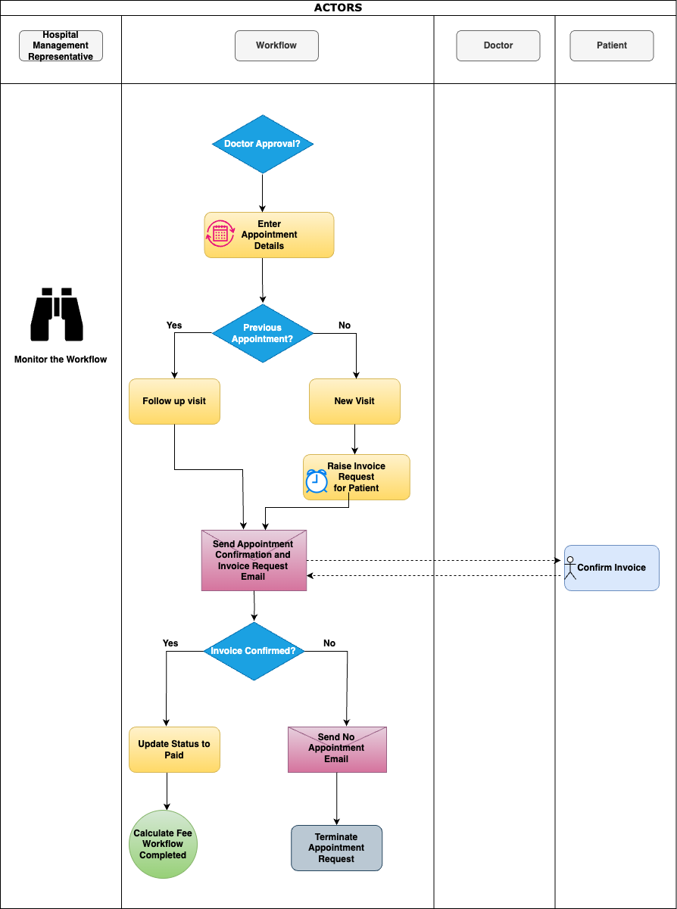
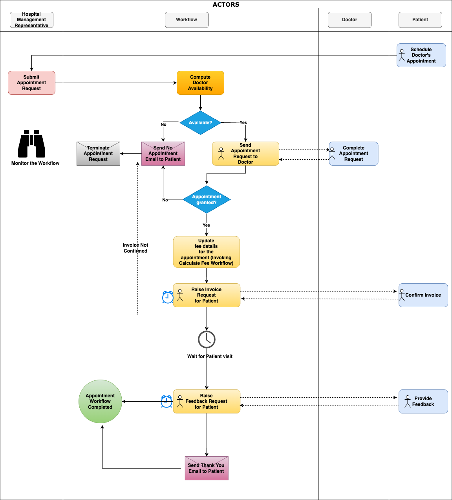

# Identify Business steps

## Introduction

In this lab, you learn to implement an efficient system to schedule and manage doctor consultations by designing an APEX Application called **Doctor Appointments Made Easy!**, that leverages the Workflow component to schedule and manage doctor consultations efficiently. To achieve this, we need to follow a structured approach:

- Break down the business logic into manageable, executable steps.
- Identify the sequences and conditions that govern the execution of these steps.
- Identify the key participants in the organization that are involved in this business process.

> **Note:** _In APEX Workflow terminology, we refer to an executable step as an **Activity** and a sequence/condition as a **Connection**._

### Objectives

In this lab, you will:

- Identify Business steps required to create 'Doctor Appointments Made Easy!' Application.

Estimated Time: 10 minutes

### Prerequisites

1. Access to Oracle APEX.

## Breaking down the Business Logic

We begin by dissecting the medical appointment business process into distinct steps and identifying the actors or participants associated with each step. Here's an overview:

### Steps in the Medical Appointment Business Process

**Calculate Fees Workflow (Invoke Workflow):**

| Step No. | Step Description                                             | Step Type | Actor                  |
|---------|-------------------------------------------------------------|-----------|------------------------|
| 1      | If the doctor approves, enter appointment details in the system with the status 'Confirmed'. | Automatic | Workflow |
| 2     | Check if the patient had a previous appointment with the same doctor in the last seven days. | Automatic | Workflow |
| 3      | If the patient had a previous appointment, mark this as a follow-up visit, don't charge fees, and raise an invoice with zero payment request for the patient to confirm. | Automatic | Workflow |
| 4     | If it's a new visit, raise an invoice with fees and payment request for the patient to confirm. | Automatic | Workflow |
| 5     | In both cases, send an email notifying the patient of the appointment confirmation and the invoice request. | Automatic | Workflow |
| 6      | Log in to the application to confirm the invoice. | Manual    | Patient                |
| 7      | If the patient doesn't confirm the invoice within a specific period, send a 'No-Appointment' email and close the appointment request. | Automatic | Workflow |
| 8      | If the patient confirms the invoice, update the appointment status to 'PAID' in the system of records | Automatic. | Workflow |

**Doctor Appointment Workflow:**

| Step No. | Step Description                                             | Step Type | Actor                  |
|---------|-------------------------------------------------------------|-----------|------------------------|
| 1       | Schedule a doctor's appointment.                               | Manual    | Patient                |
| 2       | Login to the application, fill in patient details, and submit an appointment request on behalf of the patient. | Manual    | Hospital Management Representative/Staff |
| 3       | Check doctor's availability for the requested appointment date/time. | Automatic | Workflow              |
| 4       | If the doctor is busy, send a 'No-Appointment' email to the patient and close the appointment request. | Automatic | Workflow              |
| 5       | If the doctor is available, raise an 'Approval Task' for the doctor to confirm the appointment request. | Automatic | Workflow              |
| 6       | Log in to the application to access the appointment request. | Manual    | Doctor                 |
| 7       | Approve the appointment request. | Manual    | Doctor                 |
| 8       | Reject the appointment request. | Manual    | Doctor                 |
| 9       | If the doctor rejects, send a 'No-Appointment' email to the patient and close the appointment request. | Automatic | Workflow              |
| 10      | Calculate Fees Workflow | Automatic | Invoke Workflow |
| 11      | Wait until the appointment is completed. | Automatic | Workflow |
| 12     | Raise a feedback request to the patient. | Automatic | Workflow |
| 13      | Log in to the application and provide feedback. | Manual    | Patient                |
| 14      | If the patient doesn't complete the feedback request within a specified period, close the appointment request. | Automatic | Workflow |
| 15      | If the patient provides feedback, send a 'Thank You' email to the patient and then close the appointment request. | Automatic | Workflow |

This comprehensive breakdown illustrates the significance of workflow in managing complex business processes, making the system efficient and responsive.

- Calculates Fees Workflow

- Doctor Appointment Workflow

## Summary

You now understand the significance of workflow in managing complex business processes, making the system efficient and responsive.

## What's Next

In the next lab, you will create a flowchart based on the automated steps, helping us visualize the flow of the business logic and its seamless execution. Stay tuned as we dive into the practical implementation of this intuitive doctor appointment management system!

You may now **proceed to the next Lab**.

## Acknowledgements

- **Author(s)** - Roopesh Thokala, Senior Product Manager & Ananya Chatterjee, Consulting Member of Technical Staff.
- **Last Updated By/Date** - Ankita Beri, Product Manager, December 2024
