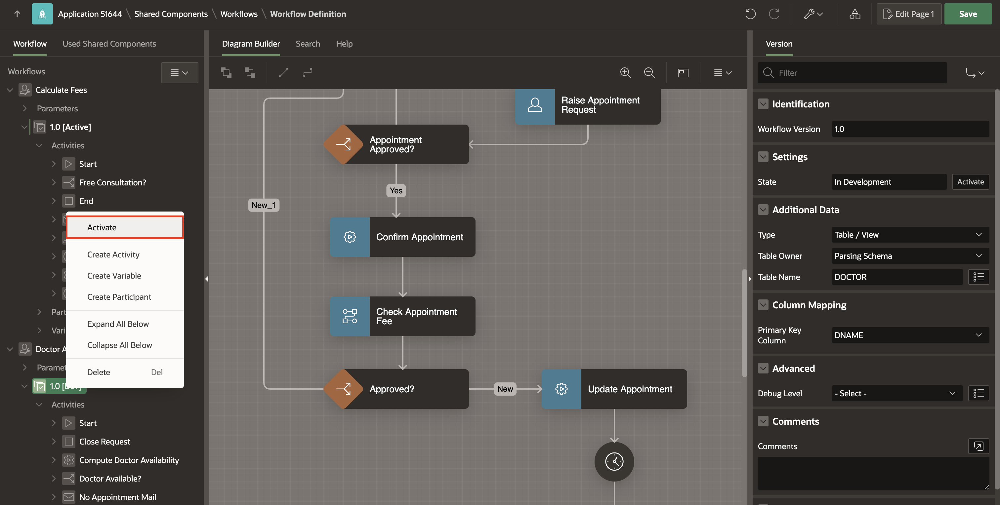

# Activate the 'Doctor Appointments Made Easy!' Application

## Introduction

In this lab, you add an ADMIN participant and activate the workflow.

### Objectives

- Add a Participant.

- Activate the Workflow.

Estimated Time: 5 minutes

### Prerequisites

- All the previous Labs have been completed.

## Task 1: Add Participant

1. Navigate to **Shared Components**.

2. Under **Workflows and Automations**, select **Workflows**.

3. Select **Calculate Fees**.

4. Navigate to **Calculate Fees** workflow. Under **1.0** workflow version, right-click **Participants** and select **Create Participant**.

    

5. In the Property Editor, enter/select the following:

    - Under Identification:

        - Name: **ADMIN**

        - Type: **Workflow Administrator**

    - Under Value:

        - Type: **Static Value**

        - Static Value: **PATRICK**

    

6. Follow the same steps for **Doctor Appointment** workflow to add a participant.

    

    

7. Click **Save**.

## Task 2: Activate the Workflow

1. On the Workflow Definition page, go to **Calculate Fees** workflow and under **1.0** workflow version, right-click and select **Activate** as well as click **OK** to confirm.

    

    

2. Now, right-click **Doctor Appointment** workflow and select **Activate**.

    

3. Click **Save**.

## Summary

In this hands-on lab, you learned how to:

- Add a Participant.

- Activate the Workflow.

## Acknowledgements

- **Author(s)** - Roopesh Thokala, Senior Product Manager; Ankita Beri, Product Manager
- **Last Updated By/Date** - Ankita Beri, Product Manager, December 2024
