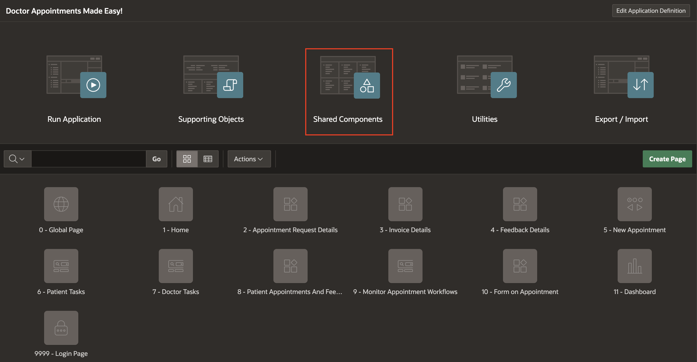
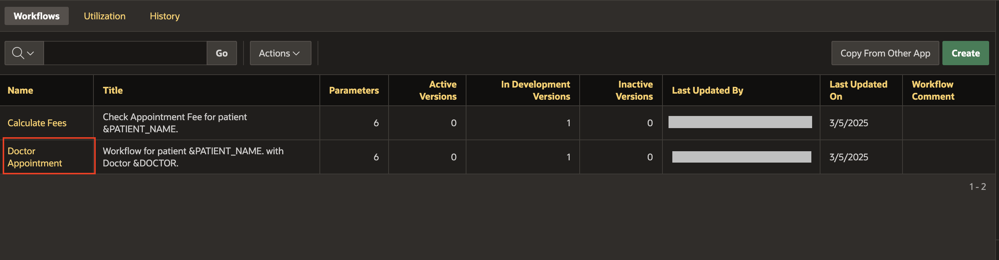
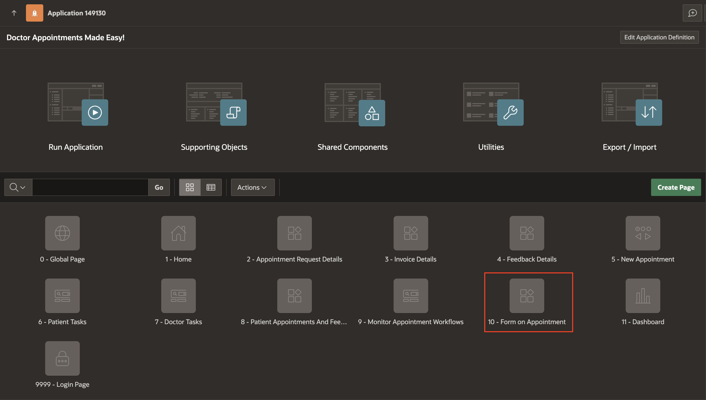
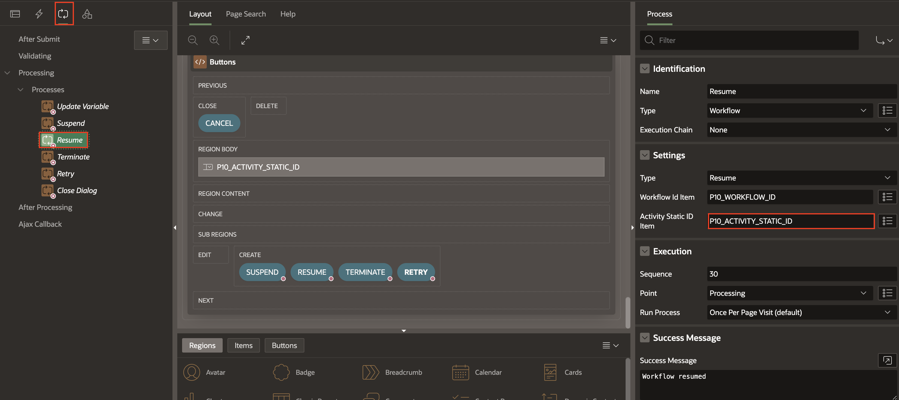
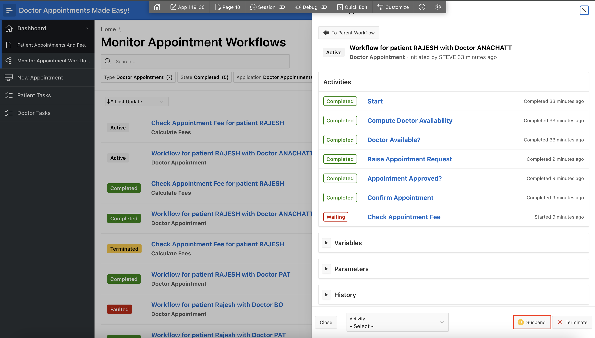

# Enhance Workflow Management (Optional)

## Introduction

This lab focuses on enhancing workflow management capabilities within the Doctor Appointments Made Easy! application. You will learn to monitor workflows, handle human task termination automatically, and resume suspended workflows at any activity.

### Objectives

In this lab, you will:

- View the Workflow Instance ID in Debug Messages to improve workflow traceability.

- Learn how human tasks are automatically canceled when a workflow is terminated.

- Suspend and Resume workflows at any activity to enhance workflow control and flexibility.

Estimated Time: 5 minutes

### Prerequisites

- All the previous Labs have been completed.

## Task 1: View the Workflow Instance ID in Debug Messages

Display the workflow instance ID in Debug Messages when viewing workflow debug reports. To view workflow debug messages, the workflow must have a Debug Level set. You can specify the debug level in the workflow version. For more information on setting the debug level, see Creating a Workflow Version.

To view debug messages for a specific workflow instance:

1. On the Workspace home page, click **App Builder**.

    

2. Select **Doctor's Appointment** application.

    

3. Click **Shared Components**.

    

4. Under **Workflows and Automations**, click **Workflows**.

    

5. Select **Doctor Appointment** workflow.

    

6. Under **Doctor Appointment** workflow select **1.0 [Dev]**. In the Property Editor, enter/select the following:

    - Under Advanced:

        - Debug Level: **Info**

    
    
7. Navigate back to Application Id and click **Utilities**.

     

    

8. On the **Utilities** page, click **Debug Messages**.

    

9. Click **Actions**, **Columns**. The Select Columns window appears.

    

10. In the **Do Not Display** section, select **Workflow Instance**.

11. Click **Move** to move **Workflow Instance** to **Display in Report**.

12. Click **Apply**.

    

    Note: The workflow instance ID now displays in the report. For more information on working with debug messages, see Utilizing Debug Mode.

## Task 2: Human Tasks and Workflow Termination 

In APEX 23.2, when a workflow was terminated, if there was a human task activity that was still waiting to be completed this human task stayed assigned in spite of the termination of the workflow. The initiator of the task could manually cancel it of course, but the workflow termination did not take care of canceling these tasks automatically.

This has been addressed now. Try the following steps:

1. In the runtime environment, navigate to **Monitor Appointment Workflows**.

2. Now, terminate one of the Patient Appointment in **Active** State.

    *Note the Workflow Instance ID from the Details section.*

    

    

3. Let's check the state of the human task by performing the following query in **SQL Workshop -> SQL Commands**

    ```
    <copy>
    select state from apex_tasks where workflow_id = <provide the workflow instance ID here >;
    </copy>
    ```

4. The state is **Canceled**.

    

    

## Task 3: Resume Workflow at any Activity

Let’s say a hospital is using the Doctor Appointments Made Easy! application to manage patient appointments. A patient named Rajesh has already received verbal approval for his appointment before the workflow was submitted. However, the system doesn’t recognize this verbal approval, and the workflow is currently waiting for Dr. Anachatt to approve it.

1. Go to **Doctor Appointments Made Easy!** application page, click **10 - Form on Appointment**.

    

2. In the left pane, right click on Buttons and select **Create Page Item**.

    

3. In the Property Editor, enter/select the following:

    - Under Identification:

        - Name: **P10\_ACTIVITY\_STATIC\_ID**
        - Type: **Select List**

    - Under List of Values:

        - Type: **SQL Query**
        - SQL Query: Copy and paste the below code
        ```
        <copy>
        select wa.name as name,
        wa.static_id as value
        from apex_appl_workflow_activities wa,
        apex_appl_workflow_versions   wv,
        apex_workflows                wf$
        where wf$.workflow_id = :P10_WORKFLOW_ID
        and wf$.workflow_version_id  = wv.version_id
        and wv.version_id   = wa.version_id
        and wv.workflow_static_id = wa.workflow_static_id
       </copy>
       ```
       - Display Extra Values: **Toggle Off**
       - Null Display Value: **- Select -**

    

4. Go to Processing tab, select **Resume** process. In the Property Editor, enter/select the following:

    - Under Settings:

        - Activity Static ID Item: **P10\_ACTIVITY\_STATIC\_ID**

    Save the changes.

    

5. In the runtime environment, login as **STEVE** and navigate to **New Appointment**. Enter/select the following:

    - Name: **RAJESH**
    - Email: Enter any email id
    - Problem: **Psychiatric**
    - Appointment Date: Choose any date
    - Doctor: **ANACHATT**
    - Age: 45

    Click on Submit.

    

6. Now, logout from the app and login as **ANACHATT**. Navigate to **Doctor Tasks** from the **Navigation Menu**.

    

7. Click on **Approve** for Appointment for RAJESH.

    

8. Login again as **Steve**.

9. Navigate to **Monitor Appointment Workflows** from the Navigation Menu by expanding **Dashboard**. Click on **Doctor Appointment** workflow.

    

10. Click on **Suspend** to suspend the current activity.

    

11. Again, click on **Doctor Appointment** workflow.

    

12. Select **Send Thank You Note To Patient** from the activity select list and click on **Resume** button.

    

13. The selected activity is now resumed and the workflow status has been changed to **COMPLETED**.

## Summary

In this lab, you learned to display the Workflow Instance ID in debug messages to simplify workflow monitoring. Observed how terminated workflows automatically cancel human tasks, reducing manual workload and suspended workflows and resumed them at any activity, showcasing enhanced flexibility in workflow execution.

## Acknowledgements

- **Author(s)** - Roopesh Thokala, Senior Product Manager; Ankita Beri, Product Manager
- **Last Updated By/Date** - Ankita Beri, Product Manager, March 2025