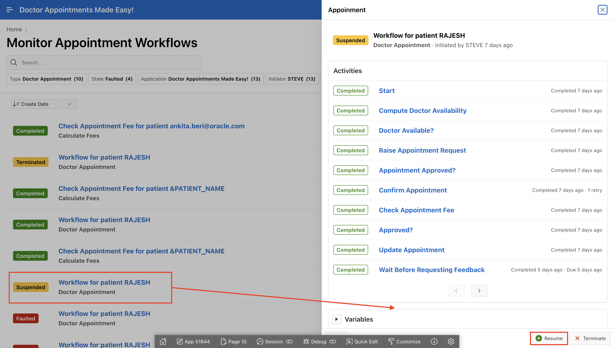

# Enhance Workflow Management (Optional)

## Introduction

This lab focuses on enhancing workflow management capabilities within the Doctor Appointments Made Easy! application. You will learn to monitor workflows, handle human task termination automatically, and resume suspended workflows at any activity.

### Objectives

In this lab, you will:

- View the Workflow Instance ID in Debug Messages to improve workflow traceability.

- Learn how human tasks are automatically canceled when a workflow is terminated.

- Suspend and Resume workflows at any activity to enhance workflow control and flexibility.

Estimated Time: 5 minutes

### Prerequisites

- All the previous Labs have been completed.

## Task 1: View the Workflow Instance ID in Debug Messages

Display the workflow instance ID in Debug Messages when viewing workflow debug reports. To view workflow debug messages, the workflow must have a Debug Level set. You can specify the debug level in the workflow version. For more information on setting the debug level, see Creating a Workflow Version.

To view debug messages for a specific workflow instance:

1. On the Workspace home page, click **App Builder**.

    

2. Select **Doctor's Appointment** application.

3. Click **Utilities**.

    

4. On the **Utilities** page, click **Debug Messages**.

    

5. Click **Actions**, **Columns**.The Select Columns window appears.

    

6. In the **Do Not Display** section, select **Workflow Instance**.

7. Click **Move** to move **Workflow Instance** to **Display in Report**.

8. Click **Apply**.

    

    Note: The workflow instance ID now displays in the report. For more information on working with debug messages, see Utilizing Debug Mode.

## Task 2: Human Tasks and Workflow Termination 

In APEX 23.2, when a workflow was terminated, if there was a human task activity that was still waiting to be completed this human task stayed assigned in spite of the termination of the workflow. The initiator of the task could manually cancel it of course, but the workflow termination did not take care of canceling these tasks automatically.

This has been addressed now. Try the following steps:

1. In the runtime environment, navigate to **Monitor Appointment Workflows**.

2. Now, terminate one of the Patient Appointment in **Active** State.

    *Note the Workflow Instance ID from the Details section.*

    

    

3. Let's check the state of the human task by performing the following query in **SQL Workshop -> SQL Commands**

    ```
    <copy>
    select state from apex_tasks where workflow_id = <provide the workflow instance ID here >;
    </copy>
    ```

4. The state is **Canceled**.

    

    

## Task 3: Resume Workflow at any Activity

When a workflow is suspended and eventually variables are modified, the workflow can be resumed at any activity in the workflow, not just the current activity

1. In the runtime environment, navigate to **Monitor Appointment Workflows**.

2. Now, suspend one of the Patient Appointment in **Active** State. Select **Active** workflow and click **Suspend**.

    

3. To resume the suspended workflow, select **Suspended** state workflow and click **Resume**.

    

4. The state is **Resumed**.

    

## Summary

In this lab, you learned to display the Workflow Instance ID in debug messages to simplify workflow monitoring. Observed how terminated workflows automatically cancel human tasks, reducing manual workload and suspended workflows and resumed them at any activity, showcasing enhanced flexibility in workflow execution.

## Acknowledgements

- **Author(s)** - Roopesh Thokala, Senior Product Manager; Ankita Beri, Product Manager
- **Last Updated By/Date** - Ankita Beri, Product Manager, December 2024