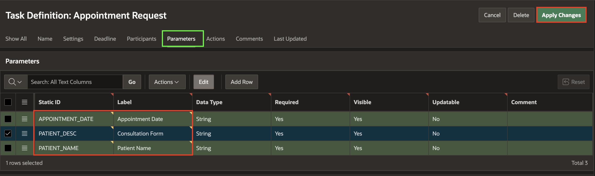

# Add Human Tasks to the Workflow

## Introduction

In this lab, you will explore the process of creating Human Tasks using the Approvals Component in Oracle APEX. Human Tasks are essential steps in Doctor Appointment Workflow, requiring manual approval, rejection, or completion by either the Doctor or the Patient. Specifically, you will focus on tasks such as **Send Appointment Request To Doctor**, **Raise Invoice Request For Patient**, and **Raise Feedback Request For Patient**.

The above steps correspond to Human Task Activities. Before using them in the workflow, you use the Approvals Component to create the task definitions.

### Objectives

In this lab, you will learn how to create Human Tasks to:

- Send Appointment Request To Doctor.

- Raise Invoice Request For Patient.

- Raise Feedback Request For Patient.

Estimated Time: 20 minutes

### Prerequisites

- All the previous Labs have been completed.

## Task 1: Create Task Definition for Appointment Request

1. Navigate to **Shared Components**.

   

2. Under **Workflows and Automations**, select **Task Definitions**.

   

3. Click **Create**.

   

4. In the **Create Task Definition** dialog, enter/select the following details:

    - Name: **Appointment Request**

    - Subject: **Appointment for &PATIENT\_NAME. on &APPOINTMENT\_DATE.**

    - Priority: **3-Medium**

    Click **Create**.

   

5. Under **Settings** notice that the Task Details Page Number is empty. Click **Create Task Details Page** button to generate the details page for this task.

  You get a popup dialog asking if the next available page number should be used. Click **OK**.

    

    

6. In the **Task Definitions** page, select **Appointment Request**.

    

7.  Under **Settings**, enter/select the following:

    - Actions Source: **SQL Query**.

    - Actions SQL Query: Copy and paste the below SQL Query:

      ```
      <copy>
      select * from doctor where dno = :APEX$TASK_PK
      </copy>
      ```

    

    This step ties our task to the system of records, in this case, the doctor's records.

    > **Note:** _APEX$TASK\_PK is a substitution string holding the primary key value of the system of records (in this case, the doctor's employee number)._

8. Navigate to **Participants** tab, and click **Add Row**. Enter/select the following details:

    - Participant Type: **Potential Owner**

    - Value Type: **Expression**

    - Value: **:DNAME** (where **DNAME** refers to the DNAME column in the DOCTOR Table).

    

9. Under **Parameters**, add the below Parameters by clicking **Add Row**.

    | Parameter Name     |   Label    |
    |--------------------|------------|
    | APPOINTMENT_DATE   | Appointment Date |
    | PATIENT_DESC       | Consultation Form|
    | PATIENT_NAME       | Patient Name |
    {: title="List of Parameters to be added for the Task Definition"}

    

10. Click **Apply Changes**.

## Task 2: Create Task Definitions for Invoice Requests

1. Navigate to **Shared Components**. Under **Workflows and Automations**, select **Task Definitions**. Then, click **Create**.

    

2. In the **Create Task Definition** dialog, enter/select the following details:

    - Name: **Invoice Request**

    - Type: **Action Task**

    - Subject: **Invoice for &PATIENT_USERNAME. for consultation on &SCHEDULE.**

    Click **Create**.

   

3. Under **Settings**, notice that the Task Details Page Number is empty. Click **Create Task Details Page**  to generate the details page for this task.

  You get a popup dialog asking if the next available page number should be used. Click **OK**.

    

    

4. Select **Invoice Request** to open the task definition in edit mode and enter/select the following:

    - Under Settings:

        - Actions Source: **SQL query**

        - Actions SQL Query: Provide the following SQL statement:
        ```
        <copy>
        select * from appointment where BOOKING_ID = :APEX$TASK_PK
        </copy>
        ```

    

    

    > **Note:** _APEX$TASK\_PK is a substitution string holding the primary key value of the system of records (in this case, the doctor's employee number)._

5. Now, navigate to **Participants**, and enter/select the following:

    - Participant Type: **Potential Owner**

    - Value Type: **Static**

    - Value: **&PATIENT_USERNAME.**

    

6. Navigate to **Parameters** tab. Add the below Parameters by clicking **Add Row**.

    | Static ID     | Label |
    |---------------|---------|
    | DOCTOR\_NAME        | Doctor Name |
    | FEES               | Fees |
    | PATIENT\_NAME       | Patient Name |
    {: title="List of Task Parameters to be added"}

    

7. Click **Apply Changes**.

## Task 3: Create Task Definitions for Feedback Request

1. Navigate to **Shared Components**. Under **Workflows and Automations**, select **Task Definitions**. Then, click **Create**.

    

2. In the **Create Task Definition** Dialog, enter/select the following details:

    - Name: **Feedback Request**

    - Type: **Action Task**

    - Subject: **Feedback for Consultation on &SCHEDULE.**

    Click **Create**.

   

3. Under **Settings**, notice that the Task Details Page Number is empty. Click **Create Task Details Page** to generate the details page for this task.
You get a popup dialog asking if the next available page number should be used. Click **OK**.

    

   

4. Select **Feedback Request** and enter/select the following:

    - Under Settings:

        - Actions Source: **SQL query**

        - Actions SQL Query: Provide the following SQL statement:

    ```
    <copy>
    select * from appointment where BOOKING_ID = :APEX$TASK_PK
    </copy>
    ```

    

    

    > **Note:** _APEX$TASK\_PK is a substitution string holding the primary key value of the system of records (in this case, the doctor's employee number)._

5. Navigate to **Participants**, and enter/select the following values:

    - Participant Type: **Potential Owner**

    - Value Type: **Static**

    - Value: **&PATIENT_USERNAME.**

    

6. Under **Parameters**, add the below Parameter by clicking **Add Row**.

    | Static ID    | Label |
    |--------------|--------|
    | BOOKING_ID   | Booking Id |
    {: title="List of Task Parameter(s) to be added"}

    

7. Click **Apply Changes**.

## Summary

You have successfully created Human Task definitions for the Doctor Appointment Workflow using the Approvals Component. In the next section, we will integrate these tasks into the workflow to complete the design process.

## What's Next

In the next lab, you continue building the Calculates Fess Workflow, focusing on defining activities, setting parameters, and creating conditional branches.

You may now **proceed to the next lab**.

## Acknowledgements

- **Author(s)** - Roopesh Thokala, Senior Product Manager & Ananya Chatterjee, Consulting Member of Technical Staff.
- **Last Updated By/Date** - Ankita Beri, Product Manager, December 2024
