# Add Calculate Fees Workflow Activities and Connections

## Introduction

In this lab, you will continue building the Calculate Fees Workflow, focusing on defining activities, setting parameters, and creating conditional branches.

### Objectives

In this lab, you will:

- Create and configure the Calculate Fees workflow by adding activities and connections.

Estimated Time: 45 minutes

### Prerequisites

- All the previous Labs have been completed.

## Task 1: Navigate to Workflow Designer

Now that we have defined the Approval and Action tasks, let us go back to the Calculate Fees Workflow and resume from where we left off.

1. Navigate to **Shared Components**.

   

2. Under **Workflows and Automations**, select **Workflows**.

   

3. Click **Calculate Fees** workflow to access the Workflow Designer.

   

## Task 2: Add the Switch Activity for followup-check

The first step in the business logic is to check if the appointment is a follow-up visit for the patient. If this is a patient returning in less than a week, the visit is considered to be a follow-up and is free of charge, otherwise, a charge of 500 is levied.

1. Open the workflow diagram in the workflow editor.

2. From the **Activities Palette**, drag a **Switch** Activity into the **Diagram Builder** area and drop it on the connection joining the Start and End activities.

   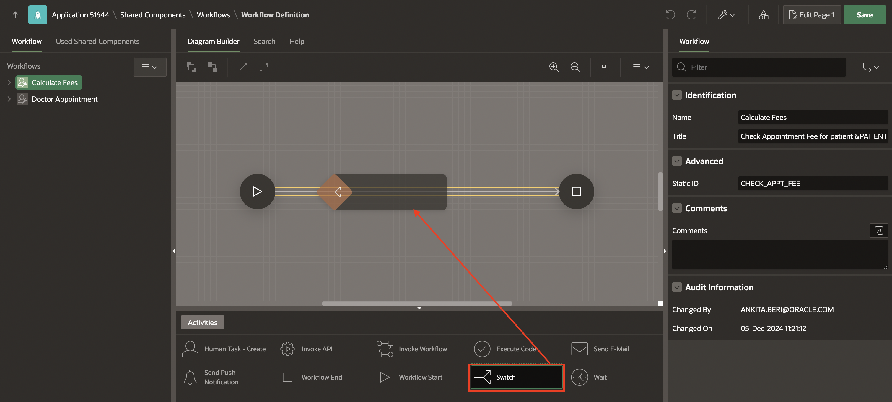

3. In the Property Editor, enter/select the following:

    - Identification > Name: **Free Consultation?**

    

4. Now, select the connection(Arrow) leading out of the Switch activity, Free Consultation?, you created in the previous task.

5. In the Property Editor, enter/select the following:

    - Condition > When: True

    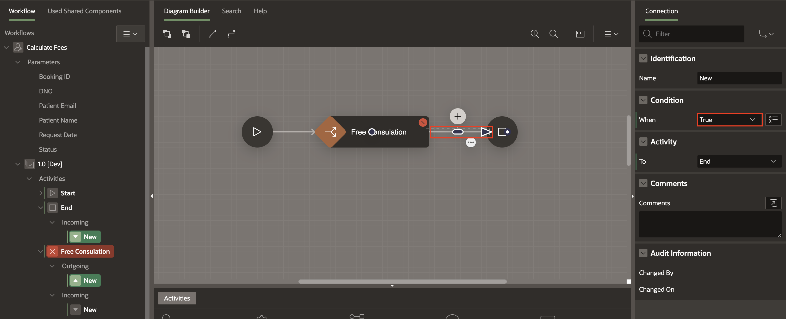

## Task 3: Create Activity Variable for Free Consultation

The Switch condition's outcome should be based on a calculation of the number of days since the patient's last visit to the same doctor. To store the calculation result, we will create an Activity Variable for the **Free Consultation?** activity.

>**Points to be Noted:**
>- **Workflow Activity variables** are specific/local to the execution of a workflow activity. These variables may be referenced:
    - During Activity execution.
    - During the evaluation of a Switch condition.
    - During the evaluation of any Timeout or Error-handling routes defined for the activity.
>- Unlike **Workflow Variables**, they cannot be referenced by other activities of the workflow once the activity execution is completed.

1. To create an **Activity Variable**, right-click **Free Consultation?** activity and select **Create Activity Variable**.

   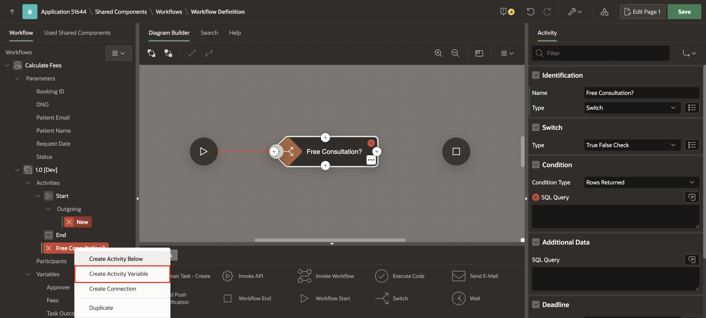

2. Select the new activity variable, and in the Property Editor, enter/select the following:

    - Identification > Static ID: **FREE**

    - Label > Label: **Free**

    - Under Value:

        - Type: **Function Body**

        - PL/SQL Function Body: Enter the following code:
        ```
        <copy>
        DECLARE
            l_free NUMBER := 1;
        BEGIN
        SELECT 1
        INTO   l_free
        FROM   dual
        WHERE  EXISTS (SELECT patient_username
                   FROM   appointment
                   WHERE  patient_username = :PATIENT_NAME
                          AND doctor_no = :DNO
                          AND schedule >= To_timestamp_tz(:REQUEST_DATE,
                                          'DD-MON-YYYY HH24:MI:SS')
                                          - 7
                          AND status = 'PAID');

        RETURN 1;
        EXCEPTION
        WHEN OTHERS THEN
        RETURN 0;
        END;
       </copy>
       ```

  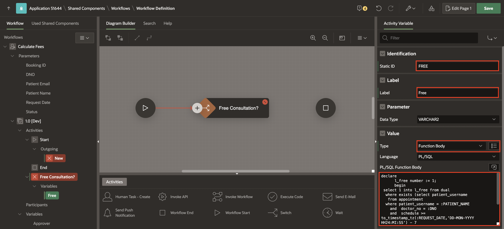

## Task 4: Configure the 'Free Consultation Switch Activity'

1. In the **Rendering** tab , select **Free Consultation?** activity. In the Property Editor, enter/select the following:

    - Under Condition:

        - Condition Type: **Workflow Variable = Value**

        - Workflow Variable > Activity Variables: **FREE**

        - Value: **1**

   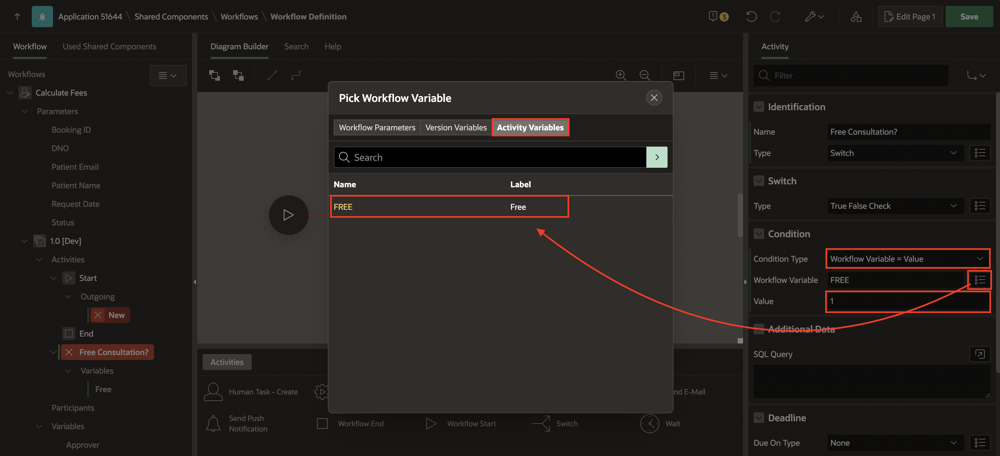

## Task 5: Create the 'Update Fees' and 'Send Invoice Email to Patient' Activities

The next step is to establish connections for Free Consultation branches with activities such as Updating Fees and sending invoice Email to Patients.

1. From the **Activities Palette**, drag an **Invoke API** activity into the **Diagram Builder** area and drop it below the **Free Consultation?** activity.

    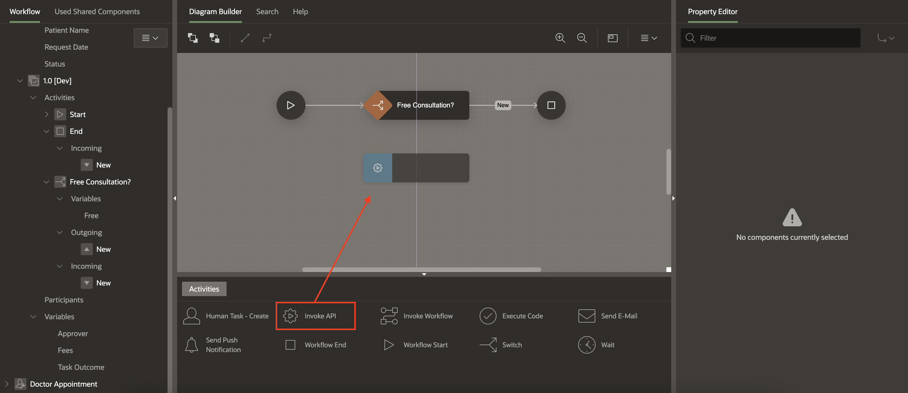

2. Click the newly added **Invoke API** and in the Property Editor, enter/select the following:

    - Identification > Name: **Update Fees**

    - Under Settings:

        - Package: **EBA\_DEMO\_WF\_DOC\_APT**

        - Procedure or Function: **UPDATE_FEES**

        This procedure will update the Consultation Fee (FEE) in the APPOINTMENT Table record and also populate the Workflow Variable FEE.

   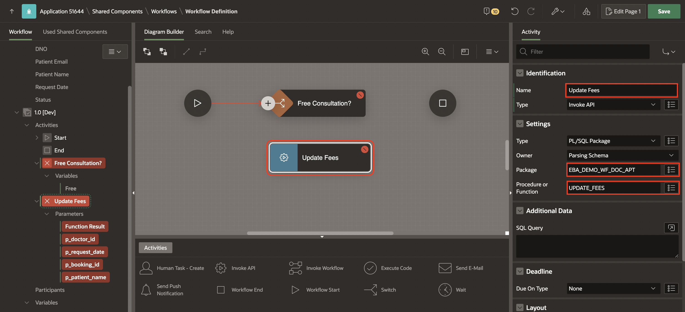

3. Notice, there are some fields marked in Red. The **Update Fees** function has five Parameters, highlighted in RED to show that they are required.

4. Under **Update Fees** activity and select **Function Result** parameter. In the Property Editor, enter/select the following:

    - Value > Item > **Version Variables**: **FEES**

    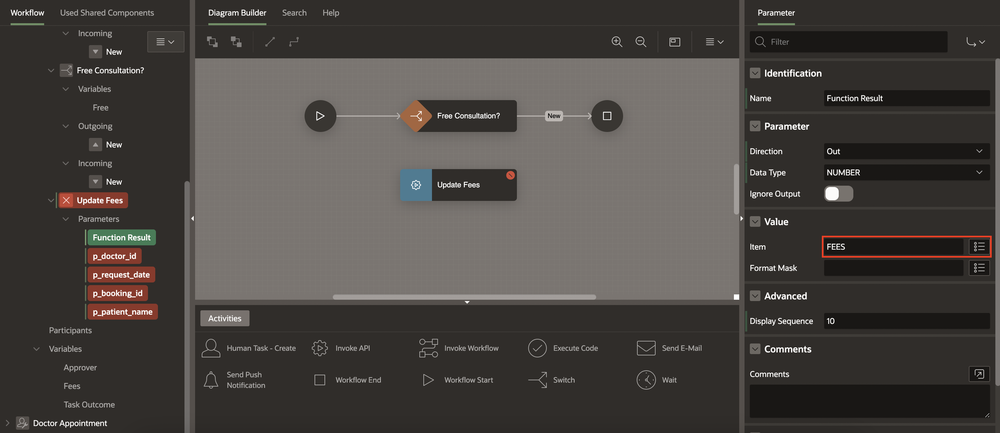

5. Similarly, configure the remaining parameters under **Confirm Appointment** as follows:

     |Parameter | Value |
    |---------|--------|
    |p\_doctor\_id| Static Value > **&DNO.**|
    |p\_request\_date| Workflow Parameters > **REQUEST_DATE**|
    |p\_booking\_id| Workflow Parameters > **BOOKING_ID**|
    |p\_patient\_name| Workflow Parameters > **PATIENT\_NAME**|

    

6. From the **Activities Palette**, drag and drop a **Send E-Mail** activity next to the **Update Fees** activity.

    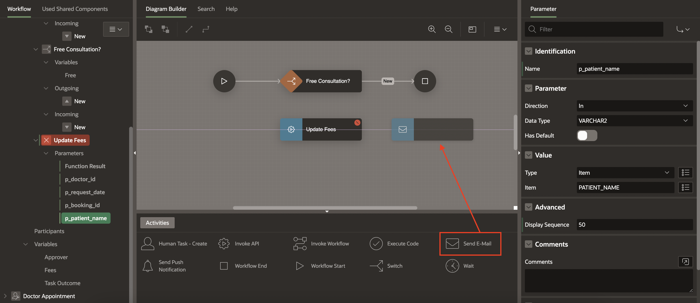

7. In the Property Editor, enter/select the following:

    - Identification > Name: **Send Invoice Email To Patient**

    - Under Settings:

        - To: **&PATIENT_EMAIL.**

        - Subject: **Appointment Confirmed!**

        - **Body Plain Text**: Enter/Replace the text with the text below:
            ```
            <copy>
            Hello &PATIENT_NAME. ,
            Your appointment for &REQUEST_DATE. with Dr. &DNAME. is confirmed, The consultation charge is Rs &FEE. .
            An invoice has been raised for this appointment. Kindly make the required payment and confirm the same at the earliest.
            Please note that no payment will be required if this is a follow-up consultation.

            Regards,
            Management Team
            ABC Hospital
            </copy>
            ```

    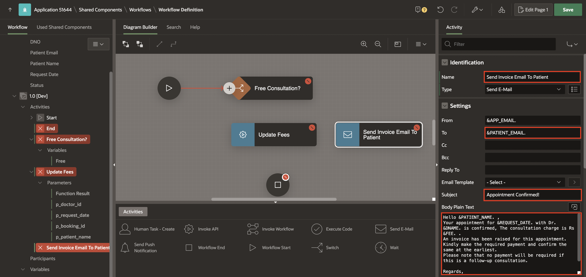

8. Now, draw a Connection from the **Free Consultation?** activity to the **Update Fees** activity. In the Property Editor, enter/select the following:

    - Identification > Name: **No**

    - Condition > When: **False**

    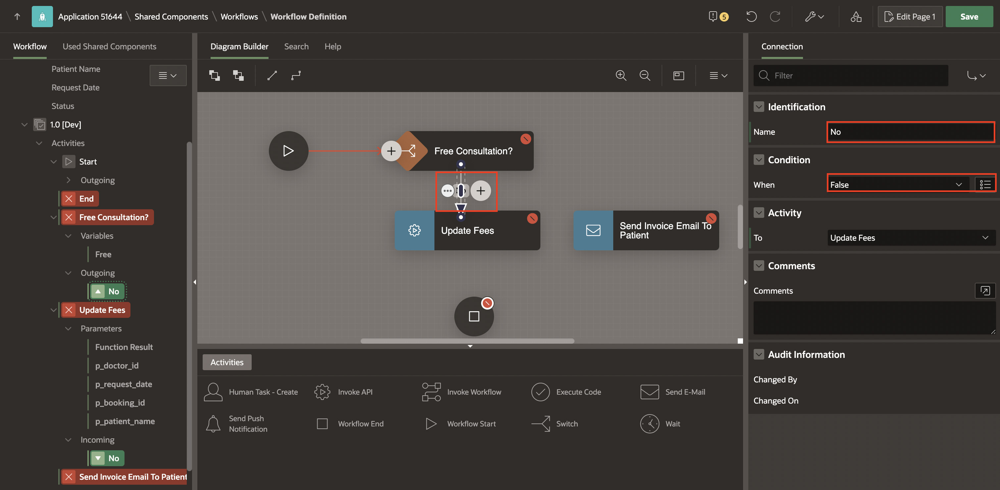

9. Now, draw a **Connection** from the **Free Consultation?** activity to the **Send Invoice Mail To Patient** activity. In the Property Editor, enter/select the following:

    - Identification > Name: **Yes**

    - Condition > When: **True**

    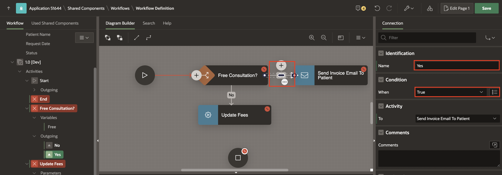

10. Finally, draw Connections from **Send Invoice Mail To Patient** and **Update Fees** to the **Complete Appointment** end activity to eliminate the Workflow Model's validation errors.

    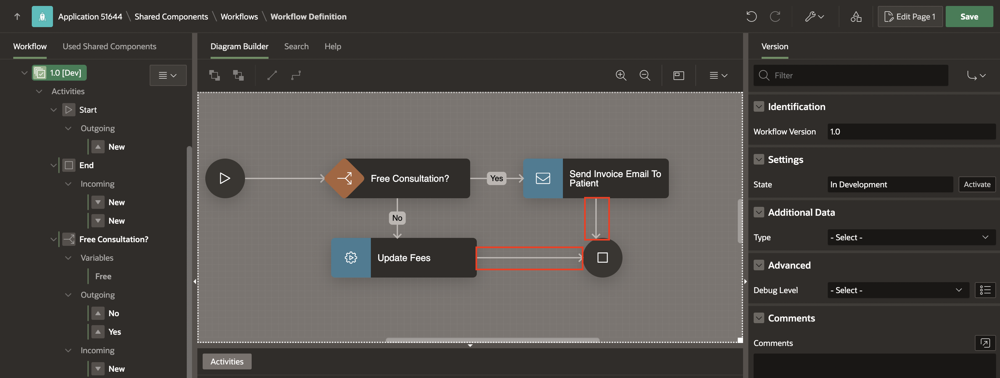

11. Click **Save** to save the changes.

## Task 6: Add the Invoice Request Human Task Activity

At this point, the workflow needs to raise an Invoice Request for the patient to confirm.

1. From the **Activities Palette**, drag and drop a **Human Task - Create** activity and place it between **Update Fees** and **Complete Appointment End** activity.

    

2. With **Human Task - Create** selected, in the Property Editor, enter/select the following:

    - Identification > Name: **Raise Invoice Request**

    - Under Settings:

        - Definition: **Invoice Request**

        - Details Primary Key Item: **BOOKING_ID**

    - Under Deadline:

        - Due On Type: **Interval**

        - Interval: **PT30M** (This means that if the payment is not made and the patient does not confirm the invoice within 30 minutes, then the Appointment request will be terminated.)

    

3. Then, detach the connection from **Send Invoice Mail To Patient** activity and attach them to the **Raise Invoice Request** activity.

     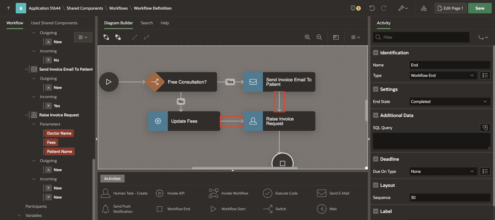

4. In the **Rendering** tab, notice some fields marked in Red. The **Raise Invoice Request** has three Parameters, highlighted in RED, to show that they are required.

5. Navigate to **Raise Invoice Request** activity and select **Doctor Name** parameter. In the Property Editor, enter/select the following:

    - Value > SQL Query:

    ```
    <copy>
    select dname from doctor where dno = :DNO
    </copy>
    ```

   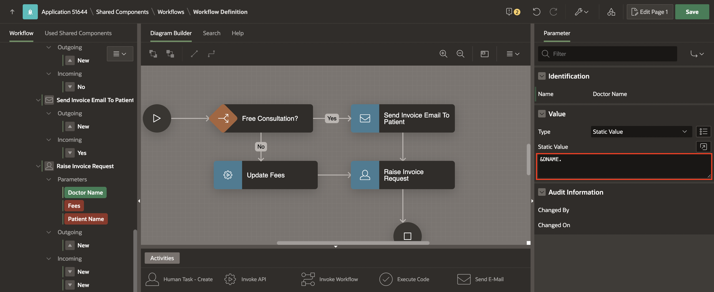

6. Similarly, set the remaining parameters under **Raise Invoice Request** as follows:

    - For **Fees**, under Value:

        - Type: **Item**

        - Item > Version Variables **FEES**

    - For **Patient Name**, under Value:

        - Type: **Item**

        - Item > Workflow Parameters: **PATIENT_NAME**

    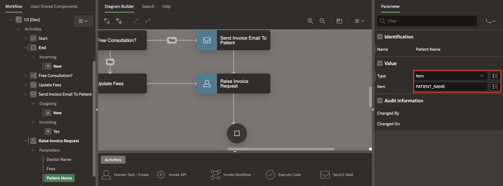

7. Click **Save** to save the changes.

## Task 7: Add Execute Activity to set Status as Rejected

1. From the **Activities Palette**, drag and drop an **Execute Code** activity and place it beside **Raise Invoice Request** activity.

2. In the Property Editor, enter/select the following:

    - Identification > Name: **Set Status to Rejected**

    - Source > PL/SQL Code: **:STATUS := 'REJECTED';**

    

## Task 8: Add a Timeout Connection for the Invoice Request Completion

1. Click on the three dots at the bottom-right corner of the **Raise Invoice Request** activity to open the context menu and select **Create Connection**.

    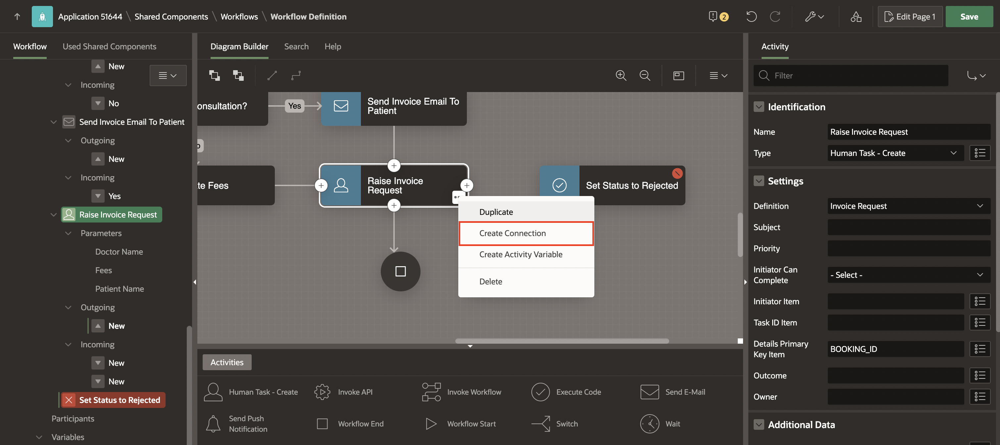

2. In the Property Editor, enter/select the following:

    - Under Identification:

        - Name: **Invoice Incomplete**

        - Type: **Timeout**

        - To: **Set Status to Rejected**

   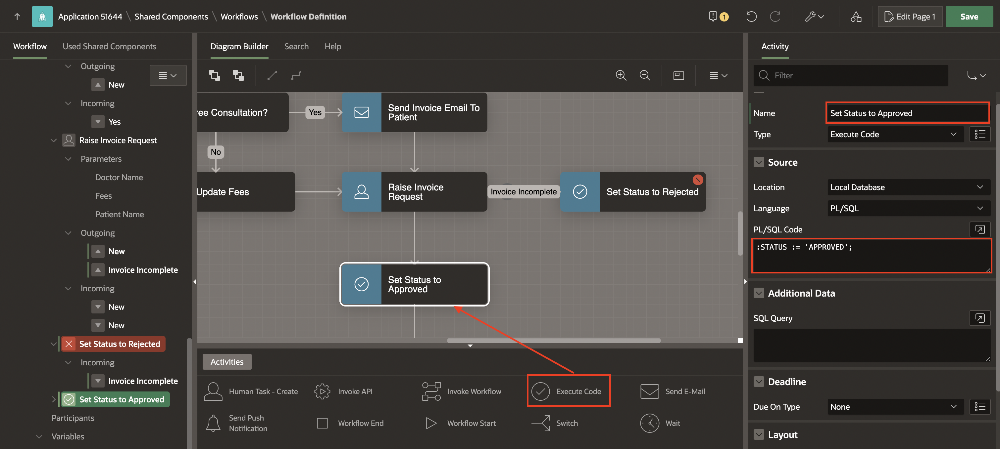

3. Select the connection between **Raise Invoice Request** and **End** activity and update the following:

    - Activity > To: **End**

    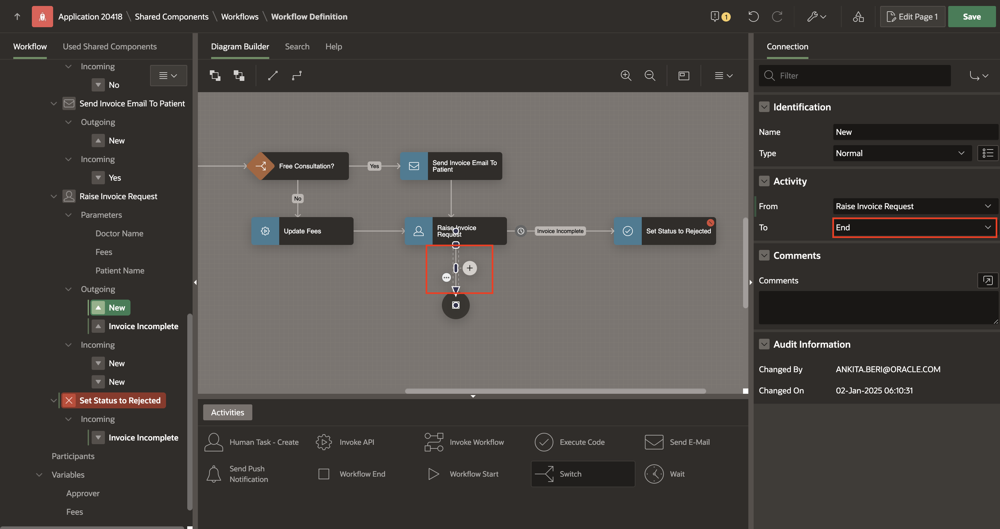

## Task 9: Add Execute Activity to set Status as Approved

1. From the **Activities Palette**, drag and drop a **Execute Code** activity and place it between **Raise Invoice Request** and **End** activity.

    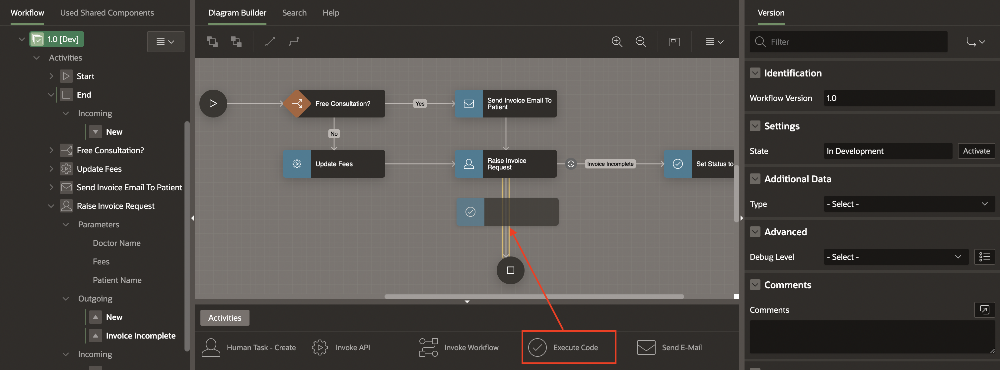

2. In the Property Editor, enter/select the following:

    - Identification > Name: **Set Status to Approved**

    - Source > PL/SQL Code: **:STATUS := 'APPROVED';**

    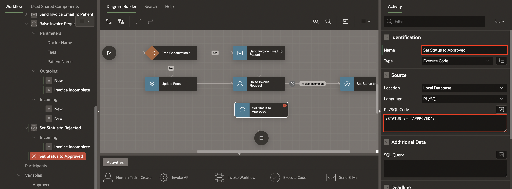

3. Draw a Connection from the **Set Status to Rejected** to the **End** Activity.

    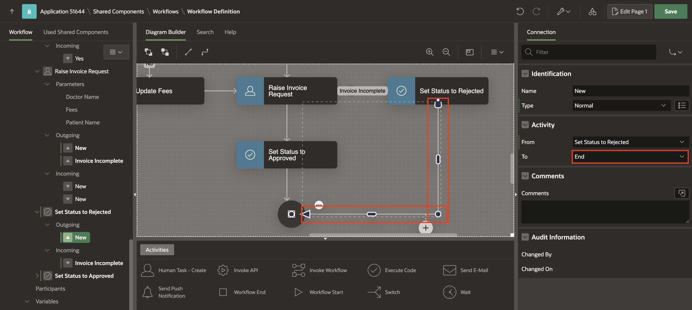

4. Re-adjust the Workflow Diagram to make the diagram more aesthetic.

    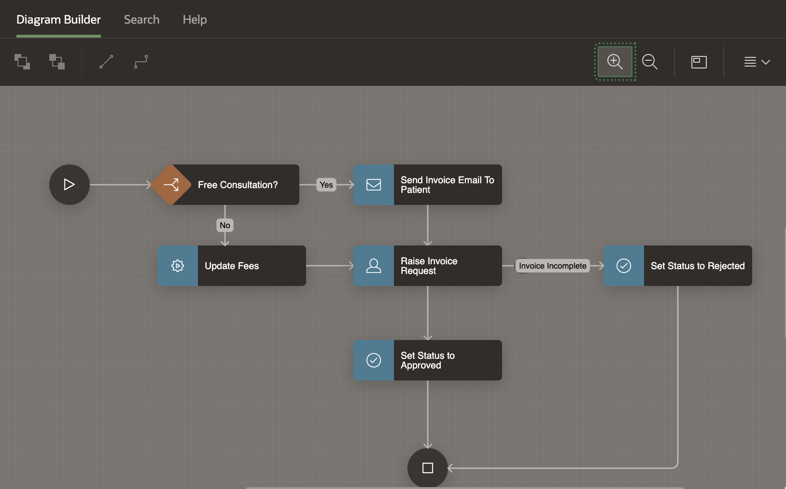

5. Click **Save**.

## Summary

You have successfully created and configured the Calculate Fees workflow for the 'Doctor's Appointment Made Easy!' application.

### What's Next

In the next lab, you will create a doctor appointment workflow in the application.

You may now **proceed to the next lab**.

## Acknowledgements

- **Author(s)** - Roopesh Thokala, Senior Product Manager & Ananya Chatterjee, Consulting Member of Technical Staff.
- **Last Updated By/Date** - Ankita Beri, Product Manager, December 2024
