# Add Activities and Connections

## Introduction

In this lab, you will continue building the Doctor Appointment Workflow, focusing on defining activities, setting parameters, and creating conditional branches.

### Objectives
In this lab, you will:
- Create and configure the workflow by adding activities and connections.

Estimated Time: 45 minutes

### Prerequisites
- All the previous Labs have been completed.

## Task 1: Navigate to Workflow Designer

Now that we have defined the Approval and Action tasks, let us go back to the Doctor Appointment Workflow and resume from where we left off.

1. Navigate to **Shared Components**.

   

2. Under **Workflows and Automations**, select **Workflows**.

  

3. Click the **Doctor Appointment** link to access the Workflow Designer.

  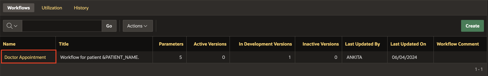

## Task 2. Add Compute Doctor Availability Activity

1. From the **Activities Palette**, Drag an **Invoke API** Activity into the **Diagram Builder** area and drop it on the connection joining the Start and End activities.

  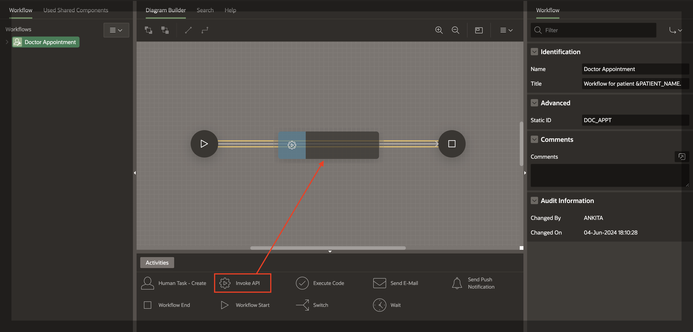

2. Click the newly added **Invoke API** and in the Property Editor, enter/select the following:

    - Identification > Name: **Compute Doctor Availability**

    - Under Settings:

        - Package Name: **EBA\_DEMO\_WF\_DOC\_APT**

        - Function: **CHECK_AVAILABILITY**

  

    In the Rendering Tree, notice that there are some Fields marked in Red. The **CHECK_AVAILABILITY** function has 3 Parameters, highlighted in RED, to show that they are required.

3. Under **Compute Doctor Availability**, expand **Parameters** and Select **Function Result**, in the Property Editor, enter/select the following:

    - Parameter > Direction: **Out**

    - Value > Item: **Version Variables > AVAILABILITY**

  

  > **Note:** _The Item Picker in the Workflow Designer allows you to select Workflow Parameters, Version Variables, and Activity Variables. You may also reference Additional Workflow Data by using the Substitution String Syntax._

4. Select **p\_doctor\_id** and in the Property Editor, enter/select the following:

    - Parameter > Direction: **In**

    - Under Value:

        - Type: **Static Value**

        - Static Value: **&DNO.**

  


5. Select **p\_request\_date** and in the Property Editor, enter/select the following:

    - Under Value:

        - Item: **Workflow Parameter > REQUEST_DATE**

        - Format Mask: **DD-MON-YYYY HH24:MI:SS**

  

6. Click **Save**.

Upon execution, this activity will determine if the doctor is available or engaged on the requested date and time by consulting the appointment schedule.

## Task 3: Use Workflow Switch Activity

Based on the Doctor's availability, the workflow needs to branch conditionally. Let us revise the workflow diagram.

1. Drag and Drop a **Switch Activity** on the connection between the *Compute Doctor Availability* and the *End* Activities.

    

2. Configure the Switch Activity in the Property Editor for Doctor Availability conditions. Click the Workflow activity you just placed in the workflow Diagram, and then in the Property Editor, enter/select the following:

    - Identification > Name: **Doctor Available?**

    - Switch > Type: **True False Check**

    - Under Condition:

        - Condition Type: **Workflow Variable = Value**

        - Workflow Variable: **AVAILABILITY**

        - Value: **BUSY**

  

  > **Note:** _The Switch Type is defaulted to True False Check. Switch Activity can be of 4 types. Learn about the different Switch types in the APEX 23.2 App Builder Documentation Guide._

## Task 4: Create Conditional Connections(Branches) and No Appointment Mail Activity

Next, we need to create the Conditional Connections (branches) for this Switch Activity. A True False Check Activity typically has a True Branch, a False Branch, and a Null Branch, depending on the evaluation of the Condition.

1. Going by the flowchart created earlier, if AVAILABILITY is set to BUSY, our Workflow sends a 'No Appointment' Mail and terminates the business process. Otherwise, it proceeds to Raise an Appointment Request for the Doctor to Approve or Reject.

2. Now, select the Connection(Arrow) leading out of the Switch Activity, **Doctor Available?**, you created in the previous task.

3. In the Property Editor, enter/select the following:

    - Identification > Name: **No**

    - Condition > When: **True**

  

4. After Configuring the Connection, Drag and Drop a **Send E-Mail Activity** on the **+** (Plus) symbol in the middle of the arrow.

    

5. Select the **Send E-Mail** Activity and in the property editor, edit the name to **No Appointment Mail**.

6. Re-adjust the arrow and the activity by dragging them to the left in order to make the diagram more aesthetic.

7. Select the **True connection** and in the Property Editor, verify that the **To** is correctly set to **No Appointment Mail**.

  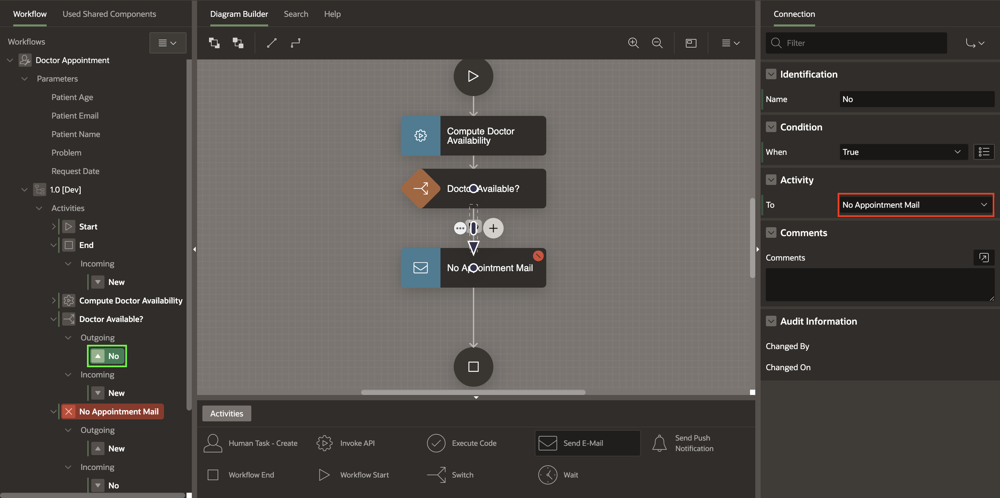  

## Task 5: Configure 'No Appointment Mail' Activity

1. Select **No Appointment Mail** Activity.

2. In the Property Editor, enter/select the following:

   Under Settings:

    - To: **&PATIENT_EMAIL.**

    - Subject: **Appointment Canceled**

    - Body Plain Text: Copy and Paste the below text:

        ```
        <copy>
        Hello &PATIENT_NAME. ,

        We regret to inform you that your appointment request for &REQUEST_DATE. It could not be confirmed due to the unavailability of the doctor/non-confirmation of the invoice.
        The requested appointment has been canceled.
        Please try again at a later date.
        We regret the inconvenience caused.

        Regards,
        Management Team
        ABC Hospital
        </copy>
        ```

    

## Task 6: Adjust Workflow End Activity

1. Select the **Workflow End Activity**, and in the Property Editor enter/select the following:

    - Identification > Name: **Close Request**

    - Settings > End State: **Terminated**

    

2. At this point, make sure there are no validation errors in the workflow model. Click **Save** to save your changes.

## Task 7: Create the 'Raise Appointment Request' Activity

1. From the Activities palette, drag and drop a **Human Task - Create** Activity.

      

2. In the Property Editor, for Name: Enter **Raise Appointment Request**.

    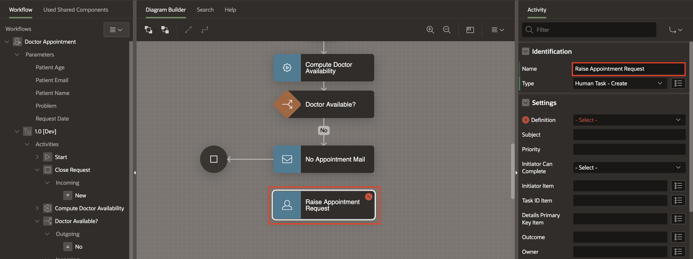

## Task 8: Connect 'Raise Appointment Request' to Workflow

Re-adjust the Workflow Diagram to make the diagram more aesthetic.

1. Click on the **Doctor Available?** activity and draw a connection to the **Raise Appointment Request** activity.

    

2. With the **Raise Appointment Request** activity selected, in the Property Editor, enter/select the following:

    - Name: **Yes**

    - When: **False**

  

## Task 9: Verify the Variables in Workflow Tree

At this point, check the Variables in your Workflow Tree. You will notice there are two new workflow variables automatically created under Variables.

1. The two Variables created are:

    - **TaskOutcome** with a static Id **TASK_OUTCOME**.

    - **Approver** with Static ID **APPROVER**.

  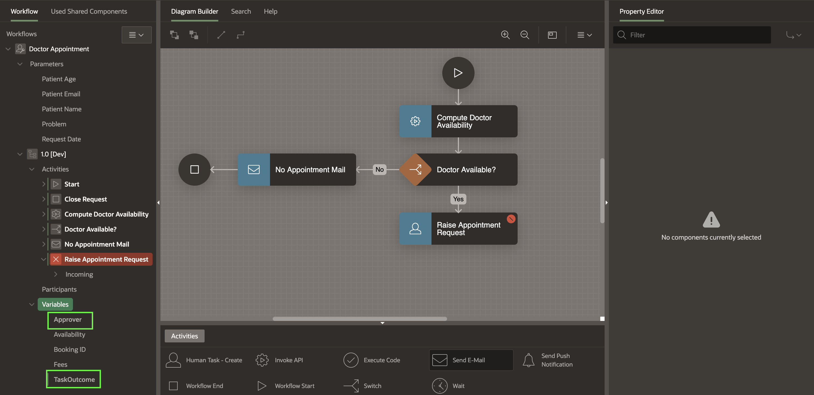

> **Note:** _The developer can choose to set the Human Task properties Approver and TaskOutcome to these Workflow Variables. At runtime, when the Human Task activity has been completed, i.e., when the actual owner of the task has approved, rejected, or completed the task, the approver and the task outcome values are saved into the Workflow Variables and can be used later by other workflow activities. Alternatively, the developer can choose to ignore the outcome and approver details and, in that case, delete those auto-generated Workflow variables and leave the corresponding Task attributes empty._

## Task 10: Configure 'Raise Appointment Request' Parameters

1. In the Rendering Tree or in the Workflow Designer, select **Raise Appointment Request**.

2. In the Property Editor, enter/select the following:

    - Under Settings:

        - Definition: **Appointment Request**

        - Detail Primary Key Item: **DNO** (Doctor No. from the DOCTOR table)

        - Outcome: **Workflow Variables > TASK_OUTCOME**

        - Owner: **Workflow Variables > APPROVER**

  

3. In the Rendering Tree, notice that there are some Fields marked in Red. The **Raise Appointment Request** function has 3 Parameters, highlighted in RED, to show that they are required.

4. In the Rendering Tree, under **Raise Appointment Request**, update the following parameters one after the other:

    |Parameter | Type | Item|
    |---------|--------|------------|
    | Appointment Date | Item | REQUEST_DATE |
    | Consultation Form | Item | PROBLEM |
    | Patient Name | Item | PATIENT_NAME |

  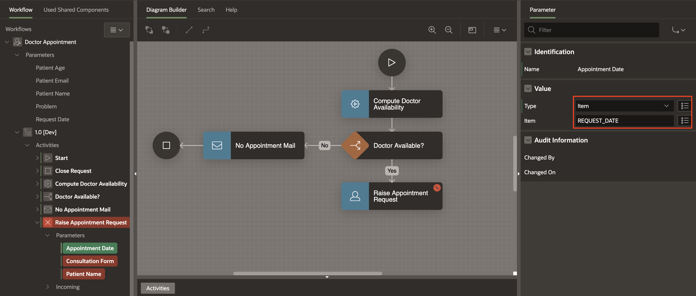

5. At this point, we still have a validation error. Click the **Error Icon** at the Top of your Page Designer.

    

6. To resolve this error, you need to drag and drop another **Workflow End** Activity.

    

7. Select the **Workflow End Activity** and enter the following in the Property Editor:

    - Identification > Name: **Complete Appointment**

    

8. Create a connection from the **Raise Appointment Request** to **Complete Appointment**. Note that the validation error no longer shows up. Click **Save** to save the workflow model.

    


## Task 11: Handle the Task Outcome

In this task, you learn to manage appointment requests using a Switch Activity in a workflow. The Appointment Request Task can result in two outcomes: APPROVED or REJECTED.
- In case it is **APPROVED**, we create an entry in the **APPOINTMENT** table with details of the appointment and set the status to **CONFIRMED**.
- In case it is **REJECTED**, we send a **No Appointment Mail** to the patient.

1. To add a Switch Activity, open the workflow diagram in the workflow editor.

2. Drag and drop a **Switch Activity** to the left of the **Raise Appointment Request** Activity.

  

3. Select the **Switch** Activty you just created and in the Property Editor, enter/select the following:

    - Identification > Name: **Appointment Approved?**

    - Switch > Type: **Check Workflow Variable**

    - Compare > Compare Variable: **TASK_OUTCOME**

  

4. In the Workflow Designer, detatch the end of the arrow connecting between the **Raise Appointment Request** and the **Complete Appointment** activities and attach it to the **Appointment Approved?** activity.

    

5. Now, select the **Appointment Approved?** activity and draw an arrow to the **No Appointment Mail** activity. In the Property Editor, enter/select the following:

    - Identification > Name: **No**

    - Under Condition:

        - Operator: **Is Equal To**

        - Value: **REJECTED**

  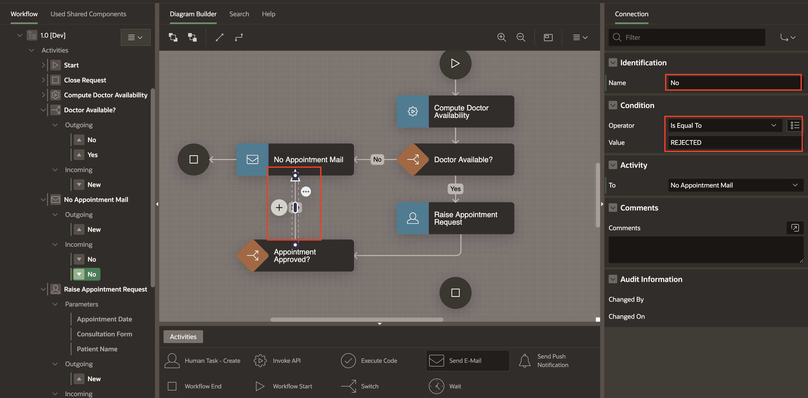

6. Click **Save**.

## Task 12: Add Invoke API for Confirm Appointment

1. From the Activities Palette, drag an **Invoke API** Activity into the Diagram Builder area and drop it below the **Appointment Approved?** activity.

  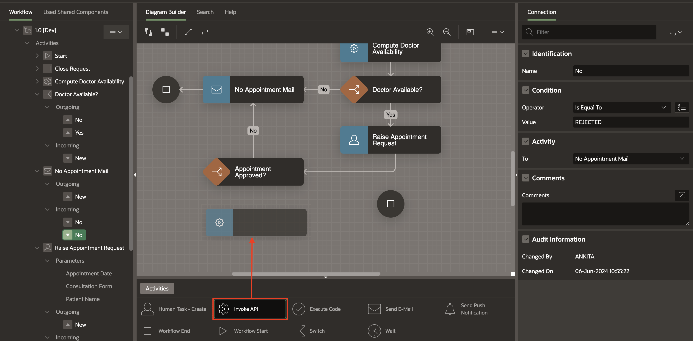

2. Select the newly added **Invoke API** Activity and in the Property Editor, enter/select the following:

    - Identification > Name: **Confirm Appointment**

    - Under Settings:

        - Package: **EBA\_DEMO\_WF\_DOC\_APT**

        - Procedure or Function: **CONFIRM_APPOINTMENT**

  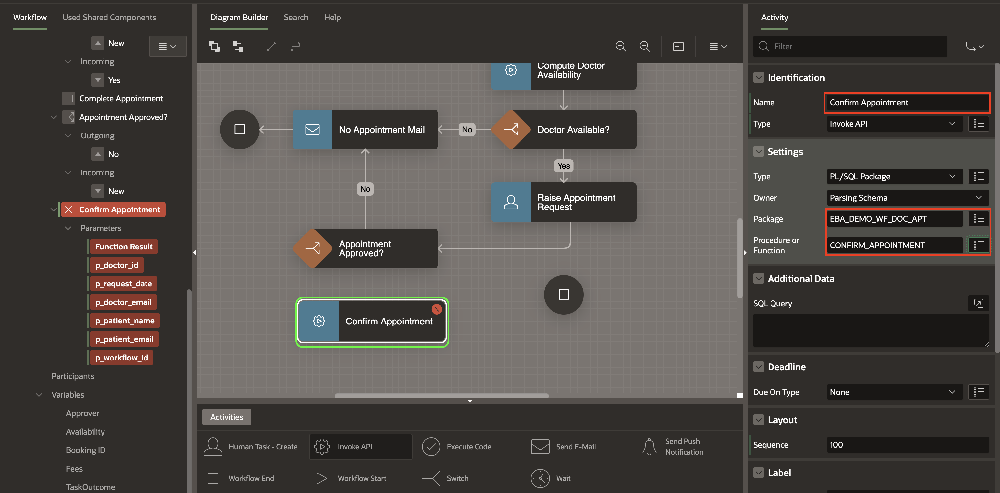

3. In the Rendering Tree, notice some Fields marked in Red. The **Confirm Appointment** function has several Parameters, highlighted in RED, to show that they are required.

4. In the Left Pane, select **Confirm Appointment > Function Result** and in the **Property Editor**, enter/select the following:

    - Value > Item: **Version Variables > BOOKING_ID**

  

5. Similarly, set the remaining parameters under **Confirm Appointment** as follows:

    |Parameter | Value | Format Mask|
    |---------|--------|------------|
    |p\_doctor\_id|Static Value: **&DNO.**||
    |p\_request\_date|Workflow Parameters: **REQUEST_DATE**|DD-MON-YYYY HH24:MI:SS|
    |p\_doctor\_email| Static Value: **&DOC_EMAIL.**||
    |p\_patient\_name| Workflow Parameters: **PATIENT_NAME**||
    |p\_patient\_email| Workflow Parameters: **PATIENT\_EMAIL**||
    |p\_workflow\_id| Static Value: **&APEX$WORKFLOW_ID.**||

> **Note:** _APEX$WORKFLOW\_ID is a substitution string that holds the ID of the workflow instance while it runs. You will learn more about the available substitution strings for Workflows in the App Builder Documentation Guide._


6. Now, click the **Appointment Approved?** activity and draw an arrow to the **Confirm Appointment activity**.

7. With the arrow selected, in the Property Editor, enter/select the following:

    - Identification > Name: **Yes**

    - Under Condition:

        - Operator: **Is Equal To**

        - Value: **APPROVED**

  

8. To be able to save the model at this point, we need to get rid of validation errors. Create a **Connection** from **Confirm Appointment** to **Complete Appointment** End activity.

    

9. Click **Save** to save the workflow model.

## Task 13: Add the Switch Activity for followup-check

The next step in the business logic is to check if the appointment is a follow-up visit for the patient. If this is a patient returning in less than a week, the visit is considered to be a follow-up and is free of charge, otherwise, a charge of 500 is levied.

1. Open the workflow diagram in the workflow editor.

2. Drag and drop a **Switch Activity** below the **Confirm Appointment** Activity.

  

3. Select the Switch Activity you just created, and then in the Property Editor, enter/select the following:

    - Identification > Name: **Free Consultation?**

  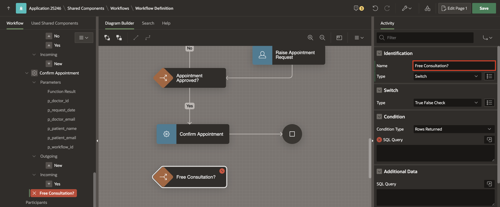

4. Now, detach the connection from the **Confirm Appointment** Activity and re-attach it to this **Switch** Activity.

  

## Task 14: Create Activity Variable for Free Consultation
The Switch condition's outcome should be based on a calculation of the number of days since the patient's last visit to the same doctor. To store the calculation result, we will create an Activity Variable for the **Free Consultation?** Activity.

> *Points to Note:*

>- **Workflow Activity variables** are specific/local to the execution of a workflow activity. These variables may be referenced:                                        
    - During Activity execution.
    - During the evaluation of a Switch condition.
    - During the evaluation of any Timeout or Error-handling routes defined for the activity.
- Unlike **Workflow Variables**, they cannot be referenced by other activities of the workflow once the activity execution is completed.


1. To create an Activity Variable, right-click on the **Free Consultation?** activity in the Workflow Tree and select **Create Activity Variable**.

  

2. Select the New activity variable, and in the Property Editor, enter/select the following:

    - Identification > Static ID: **FREE**

    - Label > Label: **Free**

    - Under Value:

        - Type: **Function Body**

        - PL/SQL Function Body: Enter the following code:
        ```
       <copy>
      declare
      l_free number := 1;
      begin
        select 1 into l_free from dual
         where exists (select patient_username
          from appointment
         where patient_username = :PATIENT_NAME
           and  doctor_no = :DNO
           and  schedule >= to_timestamp_tz(:REQUEST_DATE,'DD-MON-YYYY HH24:MI:SS') - 7
           and status = 'PAID');
       return 1;
      exception
        when others then
        return 0;
      end;
       </copy>
       ```

  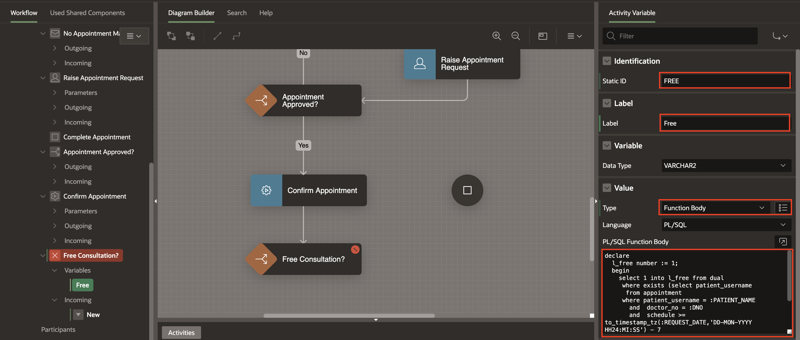


## Task 15: Configure the 'Free Consultation Switch Activity'

1. In the Rendering Tree, select **Free Consultation?** activity.

2. In the Property Editor, enter/select the following:

    - Under Condition:

        - Condition Type: **Workflow Variable = Value**

        - Workflow Variable > Activity Variables: **FREE**

        - Value: **1**

  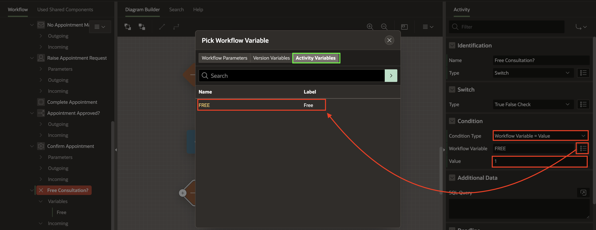

## Task 16: Create the 'Update Fees' and 'Send Invoice Email to Patient' Activities

The next step is to establish connections for Free Consultation branches with activities such as Updating Fees and sending invoice Email to Patients.

1. From the Activities Palette, drag an **Invoke API** Activity into the Diagram Builder area and drop it below the **Free Consultation?** activity.

2. Click the newly added **Invoke API** and in the Property Editor, enter/select the following:

    - Identification > Name: **Update Fees**

    - Under Settings:

        - Package: **EBA\_DEMO\_WF\_DOC\_APT**

        - Procedure or Function: **UPDATE_FEES**

        This procedure will update the Consultation Fee (FEE) in the APPOINTMENT Table record and also populate the Workflow Variable FEE.

  

3. In the **Rendering Tree**, notice that there are some Fields marked in Red. The **Update Fees** function has 5 Parameters, highlighted in RED to show that they are required.

4. In the Left Pane, select **Update Fees > Function Result**. In the Property Editor, enter/select the following:

    - Value > Item > Version Variables: **FEES**

  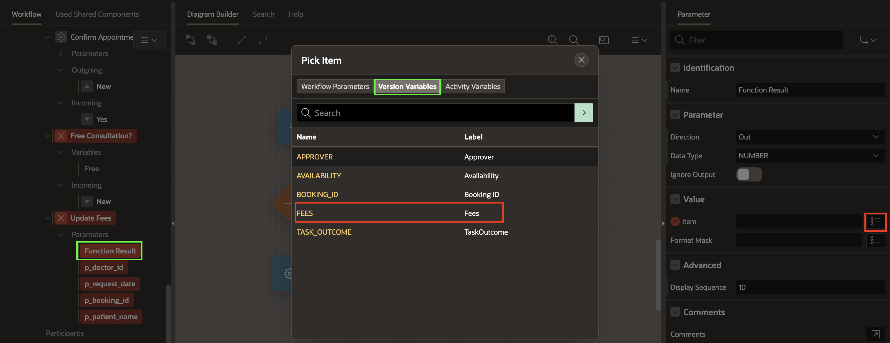

5. Similarly, configure the remaining parameters under **Confirm Appointment** as follows:

     |Parameter | Value |
    |---------|--------|
    |p\_doctor\_id| Static Value > **&DNO.**|
    |p\_request\_date| Workflow Parameters > **REQUEST_DATE**|
    |p\_booking\_id|Version Variables > **BOOKING_ID**|
    |p\_patient\_name| Workflow Parameters > **PATIENT\_NAME**|

6. From the Activities Palette, drag and drop a **Send E-Mail** activity next to the **Update Fees** activity.

7. In the Property Editor, enter/select the following:

    - Identification > Name: **Send Invoice Email To Patient**

    - Under Settings:

        - To: **&PATIENT_EMAIL.**

        - Subject: **Appointment Confirmed!**

        - **Body Plain Text**: Enter/Replace the text with the text below:
            ```
            <copy>
            Hello &PATIENT_NAME. ,
            Your appointment for &REQUEST_DATE. with Dr. &DNAME. is confirmed, The consultation charge is Rs &FEE. .
            An invoice has been raised for this appointment. Kindly make the required payment and confirm the same at the earliest.
            Please note that no payment will be required if this is a follow-up consultation.

            Regards,
            Management Team
            ABC Hospital
            </copy>
            ```

      

8. Now, draw a Connection from the **Free Consultation?** activity to the **Update Fees** activity. In the Property Editor, enter/select the following:

    - Identification > Name: **No**

    - Condition > When: **False**

    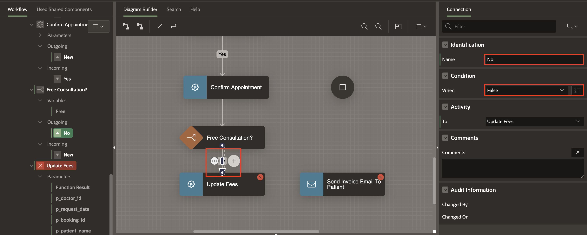  

9. Now, draw a **Connection** from the **Free Consultation?** activity to the **Send Invoice Mail To Patient** activity. In the Property Editor, enter/select the following:

    - Identification > Name: **Yes**

    - Condition > When: **True**

      

10. Finally, draw Connections from **Send Invoice Mail To Patient** and **Update Fees** to the **Complete Appointment** End Activity to eliminate the Workflow Model's validation errors.

      

11. Click **Save** to save the changes.


## Task 17: Add the Invoice Request Human Task Activity

At this point, the workflow needs to raise an Invoice Request for the patient to confirm.

1. From the Activities Palette, drag and drop a **Human Task - Create** Activity and place it between **Update Fees** and **Complete Appointment End** Activity.

     

2. With **Human Task - Create** selected, in the Property Editor, enter/select the following:

    - Identification > Name: **Raise Invoice Request**

    - Under Settings:

        - Definition: **Invoice Request**

        - Details Primary Key Item: **BOOKING_ID**

    - Under Deadline:

        - Due On Type: **Interval**

        - Interval: **PT30M** (This means that if the payment is not made and the patient does not confirm the invoice within 30 minutes, then the Appointment request will be terminated.)

  

3. Then, detach the connection from **Send Invoice Mail To Patient activities** and attach them to the **Raise Invoice Request** activity.

     

4. In the Rendering Tree, notice some Fields marked in Red. The **Raise Invoice Request** has 3 Parameters, highlighted in RED, to show that they are required.

5. In the Left Pane, select **Raise Invoice Request > Doctor Name**. In the Property Editor, enter/select the following:

    - Value > Static Value: **&DNAME.**

  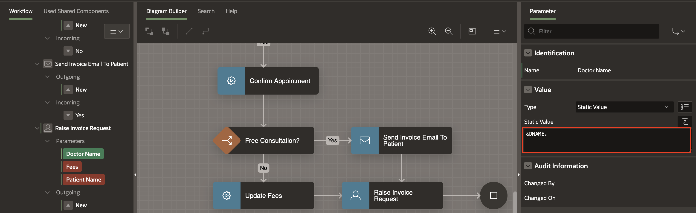

6. Similarly, set the remaining parameters under **Raise Invoice Request** as follows:

    - For **Fees**, Under Value:

        - Type: **Item**

        - Item > Version Variables **FEES**

    - For **Patient Name**, Under Value:

        - Type: **Item**

        - Item > Workflow Parameters: **PATIENT_NAME**

7. Click **Save** to save the changes.


## Task 18: Add a Timeout Connection for the Invoice Request Completion

1. Click on the 3 Dots at the bottom-right corner of the **Raise Invoice Request** Activity to open the Context Menu and select **Create Connection**.

    

2. Now, click on the newly created Connection, and then in the Property Editor, enter/select the following:

    - Under Identification:

        - Name: **Invoice Incomplete**

        - Type: **Timeout**

    - Under Activity > To: **No Appointment Mail**

  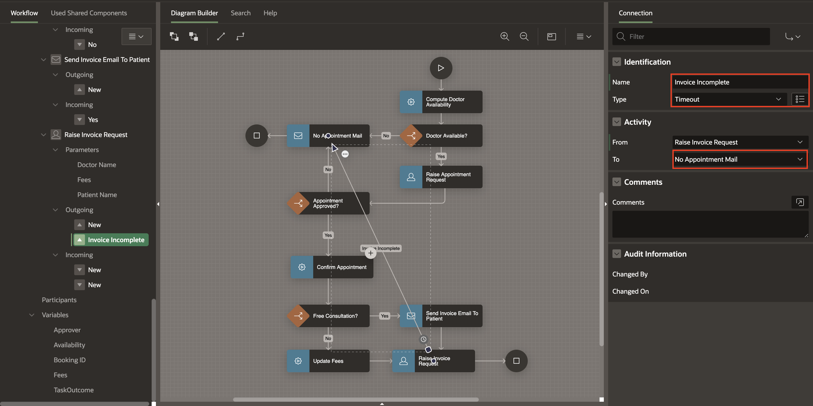

3. Re-adjust the Workflow Diagram to make the diagram more aesthetic.

  

## Task 19: Update Status of the Workflow

Once the Patient confirms the invoice / makes the payment, the Appointment record status needs to be updated to PAID.

1. Drag and Drop an **Invoke API** activity on the Connection between the **Raise Invoice Request** and **Complete Appointment** activities.

2. In the Property Editor, enter/select the following:

    - Identification > Name: **Update Appointment**

    - Under Settings:

        - Package: **EBA\_DEMO\_WF\_DOC\_APT**

        - Procedure or Function: **UPDATE_APPOINTMENT**

  

3. The procedure **UPDATE_APPOINTMENT** will update the Status in the *APPOINTMENT* table record to **PAID**.

4. In the Rendering Tree, notice that there are some Fields marked in Red. The **Update Appointment** has Parameters, highlighted in RED to show that they are required. Set the Parameters for the Invoke API activity by clicking on them in the Workflow Tree.

5. In the Left Pane, select **Update Appointment > p\_booking\_id**. In the Property Editor, enter/select the following:

    - Value > Item > Version Variables: **BOOKING_ID**

  

6. Similarly, set the remaining parameters under **Update Appointment** as follows:

    - For **p_status**, under Value:

        - Type: **Static Value**

        - Static Value: **PAID**

## Task 20: Final steps

Going back to our flowchart, at this point the Workflow waits for the appointment to happen and after that it raises a Feedback Request for the Patient. If the feedback is not received within a specific period, the Workflow is Completed without Feedback, else a Thank You Email is sent to the Patient.

1. From the Activities Palette , drag a **Wait** Activity and drop it on the connection between the **Update Appointment** and the **Complete Appointment** activities.

2. In the Property Editor, enter/select the following:

    - Identification > Name: **Wait Before Requesting Feedback**

    - Under Settings:

        - Timeout Type: **SQL Query**

        - SQL Query: Enter the following SQL Code:

        ```
        <copy>
            select schedule
            from appointment
            where booking_id = :BOOKING_ID
        </copy>
        ```

  

3. From the Activities Palette , drag a **Human Task - Create** Activity and drop it on the connection between the **Wait Activity** and the **Complete Appointment** activities.

4. In the Property Editor, enter/select the following:

    - Identification > Name: **Request For Feedback**

    - Under Settings:

        - Definition: **Feedback Request**

        - Detail Primary Key Item: **BOOKING_ID**

    - Under Deadline:

        - Due On Type: **Interval**

        - Interval: **PT24H** (This implies that the Workflow will wait for at most 24 hours for the feedback activity to be completed.)

  

5. In the Rendering Tree under **Request For Feedback**, select **Booking Id**. In the Property Editor, enter/select the following:

    - Under Value:

        - Type: **Item**

        - Item > Version Variables: **BOOKING_ID**

  

6. Drag a **Workflow End** Activity from the Activity Palette and drop it on the Diagram area to the left of the **Request for Feedback** activity.

7. In the Property Editor, for Identification > Name, enter **End Without Feedback**.

    

8. Draw a Connection from the **Request for Feedback** to the **End Without Feedback** Activity.

    

9. Notice that the connection is in RED and this is because an activity cannot have more than one outgoing connection of type Normal.

10. Click on the Connection and then in the Property Editor, enter/select the following:

    - Under Identification:

        - Name: **No Feedback Received**

        - Type: **Timeout**

    

> **Note:** _Connections of type Timeout can only be added to an activity if the activity has 'Due On' Type and value populated in the 'Deadline' section of the Property Editor._

11. Finally, drag a **Send E-Mail** Activity from the Activities Palette and drop it on the connection between **Request for Feedback** and **Complete Appointment** End Activities.

12. In the Property Editor, enter/select the following:

    - Identification > Name: **Send Thank You Note To Patient**

    - Under Settings:

        - To: **&PATIENT_EMAIL.**

        - Subject: **Thank You!**

        - Body Plain Text: Enter as given below.

        ```
        <copy>
        Dear &PATIENT_NAME. ,

        Thank you for your feedback regarding your recent appointment with Dr. &DNAME.
        We hope to keep serving you in the future!

        Regards,
        Management Team,
        ABC Hospital Pvt Ltd.

        </copy>
        ```

    

13. Click **Save**. At this point, our Appointment Workflow model is **Complete!**.


## Summary

You have successfully created and configured the workflow for the 'Doctor's Appointment Made Easy!' application.

### What's Next
In the next section, you will create pages in the application that will utilize this workflow.

You may now **proceed to the next lab**.

## Acknowledgements
- **Author(s)** - Roopesh Thokala, Senior Product Manager & Ananya Chatterjee, Consulting Member of Technical Staff.
- **Last Updated By/Date** - Ankita Beri, Product Manager, June 2024   
