# Add Human Tasks to the Workflow

## Introduction

In this hands-on lab, you will continue building the Doctor Appointment Workflow, focusing on defining activities, setting parameters, and creating conditional branches.

### Objectives
In this lab, You will
- create and configure the workflow for Doctor's Appointment Made Easy! Application.

Estimated Time: 45 minutes

### Prerequisites
1. Access to Oracle APEX.
2. Ensure that you have completed the Previous labs.

## Task 1: Navigate to Workflow Designer

Now that we have defined the Approval and Action tasks let us go back to the Doctor Appointment Workflow and resume from where we left off.

1. In the App Builder, navigate to **Doctors Appointments Made Easy!** application and then select **Shared Components**.

2. Under Workflows and Automations, Select **Workflows**.

  

3. Click on the **Doctor Appointment** link to access the Workflow Designer.

  

## Task 2. Add Compute Doctor Availability Activity

1. From the Activities Palette, **Drag** an **Invoke API** Activity into the Diagram Builder area and drop it on the connection joining the Start and End activities.

2. Drop it on the **connection** between the Start and End activities.

  

3. Click the newly added **Invoke API** and in the Property Editor,
    - Under Identification
        - Change the Name to **Compute Doctor Availability**.
    - In the Settings section,
        - Select the Package Name as **EBA\_DEMO\_WF\_DOC\_APT**
        - For Function, select **CHECK_AVAILABILITY**.

  

4. In the **Rendering Tree**, notice that there are some Fields marked in Red. The **CHECK_AVAILABILITY** function has 3 Parameters, highlighted in RED, to show that they are required.

5. In the **Left Pane**, select **Function Result** under **Compute Doctor Availability** and change the following in the **Property Editor**.
    - Under Parameter, Set Direction to **Out**.
    - Under Value, for **Item**, Select  **Version Variable** -> **AVAILABILITY** using the Item Picker.

    

  > **Note:** _The Item Picker in the Workflow Designer allows you to select Workflow Parameters, Version Variables, and Activity Variables. You may also reference Additional Workflow Data by using the Substitution String Syntax._

6. In the **Rendering Tree**, select **p\_doctor\_id** under **Compute Doctor Availability** and change the following in the **Property Editor**.
    - Under Parameter, Set Direction to **In**.
    - Under Value,
        - For **Type**, Select **Static Value**.
        - For **Static Value**, Enter **&DNO.**.

    

7. In the **Rendering Pane**, select **p\_request\_date** under **Compute Doctor Availability** and change the following in the **Property Editor**.
    - Under Parameter, Set Direction to **In**.
    - Under Value,
        - For **Type**, Select **Item**.
        - For **Item**, Select  **Workflow Parameter** -> **REQUEST_DATE** using the Item Picker.
        - For **Format Mask**, select **DD-MON-YYYY HH24:MI:SS**.

    

8. Click the **Save** button to share the workflow.

Upon execution, this activity will determine if the doctor is available or engaged at the requested date and time by consulting the appointment schedule.

## Task 3: Use Workflow Switch Activity

Based on the Doctor's availability, the workflow needs to branch conditionally. Revise the workflow diagram at your discretion.

1. Drag and Drop a **Switch Activity** on the connection between the Compute Doctor Availability and the End Activities.

    

2. Configure the Switch Activity in the Property Editor for Doctor Availability conditions. Click the Workflow activity you just placed in the workflow Diagram, and then in the Property Editor, do the following changes
    - Under Identification, Change the name to **Doctor Available?**.
    - Under Switch, make sure that the Type is **True False Check**.
    - Under Condition,
        - Set **Condition Type** as **Workflow Variable = Value**
        - Select the **Workflow Variable** using the **Item Picker**. Set it to **AVAILABILITY**.
        - Set the Value as **BUSY**.

    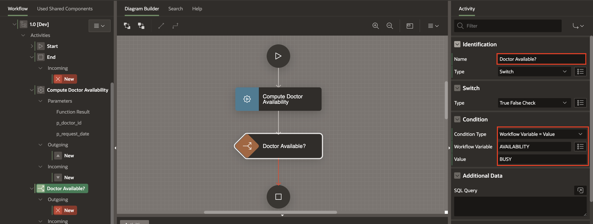

  > **Note:** _The Switch Type is defaulted to True False Check. Switch Activity can be of 4 types. You will learn about the different Switch types in the soon-to-be-released 23.2 App Builder Documentation Guide._

## Task 4: Create Conditional Connections(Branches) and No Appointment Mail Activity

Next, we need to create the Conditional Connections (branches) for this Switch Activity. A True False Check Activity typically has a True Branch, a False Branch, and a Null Branch, depending on the evaluation of the Condition.

1. Going by the flowchart created earlier, if AVAILABILITY is set to BUSY, our Workflow sends a No Appointment Mail and terminates the business process. Otherwise, it proceeds to Raise an Appointment Request for the Doctor to Approve or Reject.

2. Now, select the Connection(Arrow) leading out of the Switch Activity, **Doctor Available?**, we have created in the previous step.

3. In the Property Editor
  - Under **Identification**, set the Name to **No**
  - Under **Condition**, set  When to **True**.

  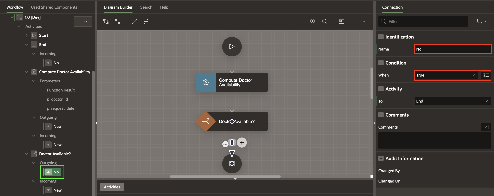

4. After Configuring the Connection, Drag and Drop a **Send E-Mail Activity** on the **+** (Plus) symbol in the middle of the arrow.

    

5. Select the Send E-Mail Activity and change its name to **No Appointment Mail**.

6. Re-adjust the arrow and the activity by dragging them to the left to make the diagram more aesthetic.

7. Once again, Select the **True connection** and verify that the **To** attribute in the Property Editor is correctly set to **No Appointment Mail**.

    

## Task 5: Configure No Appointment Mail Activity

1. Click on the **No Appointment Mail** Activity to select it.

2. In the Property Editor, edit the following under **settings**,
    - Set **To** as **&PATIENT_EMAIL.**
    - Set **Subject** as **Appointment Canceled**.
    - Enter/Replace the text in the **Body Plain Text** with the text below.
      ```
      <copy>
      Hello &PATIENT_NAME. ,

      We regret to inform you that your appointment request for &REQUEST_DATE. It could not be confirmed due to the unavailability of the doctor/non-confirmation of the invoice.
      The requested appointment has been canceled.
      Please try again at a later date.
      We regret the inconvenience caused.

      Regards,
      Management Team
      ABC Hospital
      </copy>
      ```

      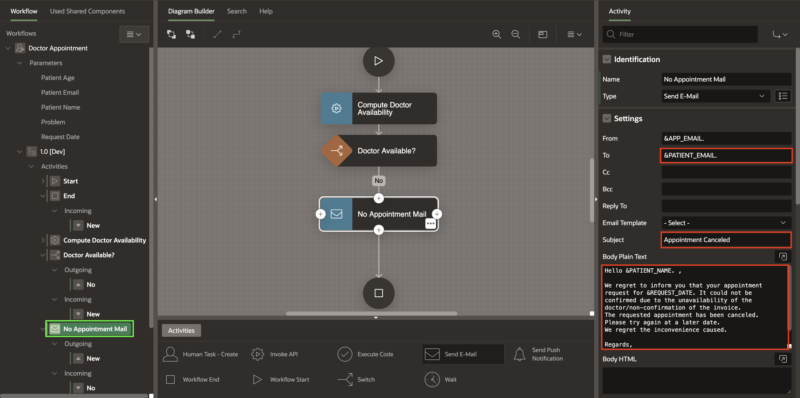  

## Task 6: Adjust Workflow End Activity

1. Select the **Workflow End Activity** and do the following changes in the Property Editor.
    - Under Identification, Change **Name** to **Close Request**.
    - Under Settings, Set the **End State property** to **Terminated**.

    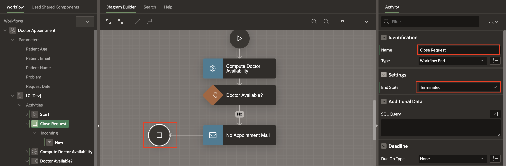  

2. At this point, Make sure there are no validation errors in the workflow model. Click on the **Save** button to save your changes.

## Task 7: Create Raise Appointment Request Activity

1. From the Activities palette, Drag and drop a **Human Task - Create Activity** below the **Doctor Available?** Activity.

      

2. Change the Name of the activity to **Raise Appointment Request** in the Property Editor.

    

## Task 8: Connect Raise Appointment Request to Workflow

Re-adjust the Workflow Diagram to make the diagram more aesthetic.

1. Click on the **Doctor Available?** activity and draw a connection to the **Raise Appointment Request** activity.

    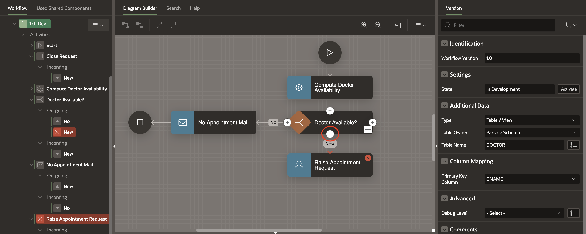

2. In the Property Editor for this connection, set the Name as Yes and When as False.

    

## Task 9: Check Variables in Workflow Tree

1. At this point, check the Variables in your Workflow Tree. You will notice there are two new workflow variables automatically created under Variables.

2. The two Variables created are **TaskOutcome** with a static Id **TASK_OUTCOME** and **Approver** with Static ID **APPROVER**.

  

> **Note:** _The developer can choose to set the Human Task properties Approver and TaskOutcome to these Workflow Variables. At runtime, when the Human Task activity has been completed, i.e., when the actual owner of the task has approved, rejected, or completed the task, the approver and the task outcome values are saved into the Workflow Variables and can be used later by other workflow activities. Alternatively, the developer can choose to ignore the outcome and approver details and, in that case, delete those auto-generated Workflow variables and leave the corresponding Task attributes empty._


## Task 10: Configure Raise Appointment Request Parameters

1. In the rendering Tree or in the Workflow Designer, select **Raise Appointment Request**.

2. In the Property Editor,
    - Under Settings,
        - For **Definition**, Select **Appointment Request**.
        - Set the **Detail Primary Key** Item as **DNO** (Doctor No. from the DOCTOR table)
        - Set the **Outcome** Item to **TASK_OUTCOME** workflow variable
        - Set the **Owner** to **APPROVER** workflow variable

  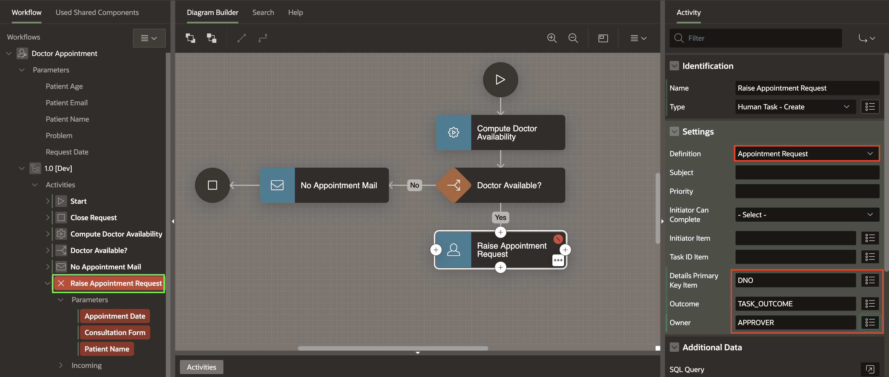

3. In the **Rendering Tree**, notice that there are some Fields marked in Red. The **Raise Appointment Request** function has 3 Parameters, highlighted in RED, to show that they are required.

4. In the **Left Pane**, select **Appointment Date** under **Raise Appointment Request** and change the following in the **Property Editor**.

    - Under Value,
        - Set Type as **Item** and for **Item**,
        - Set **Item** as **REQUEST_DATE** using the Item Picker.

    

5.  In the **Rendering Tree**, select **Consultation For** under **Raise Appointment Request** and change the following in the **Property Editor**.
    - Under Value,
        - For **Type**, Select **Item**.
        - For **Item**, Enter **PROBLEM**.

    

6. In the **Rendering Pane**, select **Patient Name** under **Raise Appointment Request** and change the following in the **Property Editor**.
    - Under Value,
        - For **Type**, Select **Item**.
        - For **Item**, Enter **PATIENT_NAME**.

    

7. At this point, we still have a validation error. Click on the Error Icon at the Top of your Page Designer to see it.

    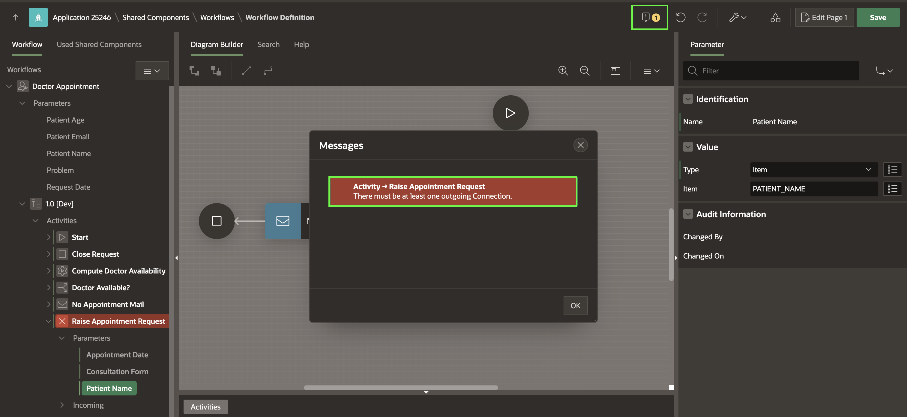

8. To resolve this error, you need to drag and drop another **Workflow End** Activity.

    

9. Select the **Workflow End Activity** and make the following changes in the Property Editor.
    - Under Identification, Change **Name** to **Complete Appointment**.

    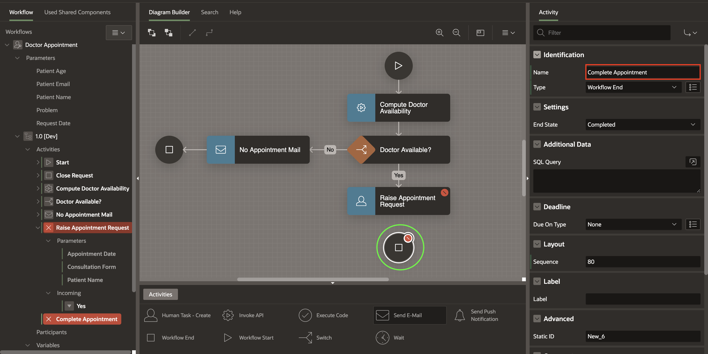  

10. Create a connection from the **Raise Appointment Request** to **Complete Appointment**. Note that the validation error no longer shows up. Click on the Save button to save the workflow model.


## Task 11: Handle the Task Outcome

In this task, you will learn how to manage appointment requests using a Switch Activity in a workflow. The Appointment Request Task can result in two outcomes: APPROVED or REJECTED. In case it is **APPROVED**, we create an entry in the **APPOINTMENT table** with details of the appointment and the status set to **CONFIRMED**. In case it is **REJECTED** we send a **No Appointment Mail** to the patient.

1. To add a Switch Activity, Open the workflow diagram in the workflow editor.

2. Drag and drop a **Switch Activity** to the left of the **Raise Appointment Request** Activity.

  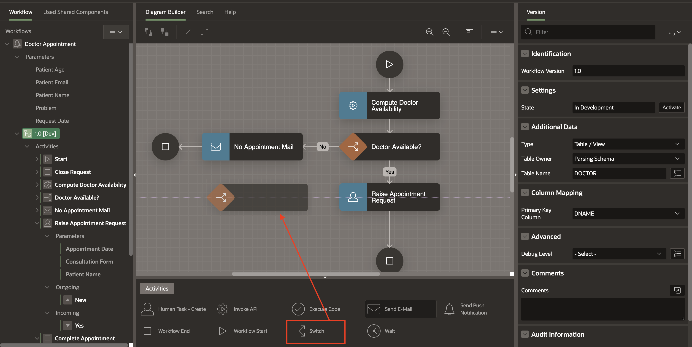

3. Select the Switch Activty you just created and then in the Property Editor, configure the following:
   - Under Identification, Change the name to **Appointment Approved?**
   - Under Switch, Set the **Type** as **Check Workflow Variable**.
   - Under **Compare**, for **Compare Variable**, Select **TASK_OUTCOME** from the item picker.
   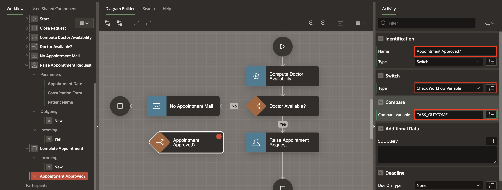

4. In the Workflow Designer, Detatch the end of the arrow connecting the **Raise Appointment** Request and the **Complete Appointment** activities and attach it to the **Appointment Approved?** activity.

5. Now, select the **Appointment Approved?** activity and draw an arrow to the No Appointment Mail activity. In the Property Editor,
    - Under **Identification**, Change the **Name** of the Connection to **No**
    - Under **Condition**,
          - Set the Operator to **Is Equal To**
          - Set the Value to **REJECTED**.
  

6. Click **Save**.

## Task 12: Add Invoke API for Confirm Appointment

1. From the Activities Palette, **Drag** an **Invoke API** Activity into the Diagram Builder area and drop it below the **Appointment Approved?** activity.

  

3. Click the newly added **Invoke API** and in the Property Editor,
    - Under Identification
        - Change the Name to **Confirm Appointment**.
    - In the Settings section,
        - Select the Package Name as **EBA\_DEMO\_WF\_DOC\_APT**
        - For Function, select **CONFIRM_APPOINTMENT**.

  

4. In the **Rendering Tree**, notice some Fields marked in Red. The **Confirm Appointment** function has several Parameters, highlighted in RED, to show that they are required.

5. In the **Left Pane**, select **Function Result** under **Confirm Appointment** and change the following in the **Property Editor**.
    - Under Value, for **Item**, Select  **Version Variable** -> **BOOKING_ID** using the Item Picker.

    

6. Similarly, Set the remaining parameters under **Confirm Appointment** as follows:
    - Set **p\_doctor\_id** as Static value **&DNO.**
    - Set **p\_request\_date** as the **REQUEST_DATE** Workflow Parameter . Set the Format Mask to **DD-MON-YYYY HH24:MI:SS**
    - Set **p\_doctor\_email** as Static value **&DOC_EMAIL.**
    - Set **p\_patient\_email** as **Item Picker** -> **Workflow Parameter** -> **PATIENT\_EMAIL**
    - Set **p\_workflow\_id** as Static value **&APEX$WORKFLOW_ID.**
    - Set **p\_patient\_name** to **Workflow Parameter** **PATIENT_NAME** using Item Picker.

> **Tip:** _APEX$WORKFLOW_ID is a substitution string that hold the ID of the workflow instance while it runs. You will learn more about the available substitution strings for Workflows in the soon-to-be-released App Builder Documentation Guide._


7. Now, click on the **Appointment Approved?** activity and draw an arrow to the **Confirm Appointment activity**.

8. In the Property Editor,
    - Under **Identification**, Change the **Name** to **Yes**.
    - Under **Condition**,
        - Set the Operator to **Is Equal To**
        - Set the Value to **APPROVED**.

    

9. To be able to save the model at this point, we need to get rid of validation errors. Create a **connection** from **Confirm Appointment** to **Complete Appointment** End activity.

    

10. Save The workflow model by clicking the **Save** button.

## Task 13: Add the Switch Activity for followup-check

In this Task, The next step in the business logic is to check if this is a follow-up visit for the patient. If this is a patient returning in less than a  week, the visit is considered to be a follow-up and is free of charge, otherwise, a charge of 500 is levied.

Drag and Drop a Switch Activity into the Diagram area, and place the activity below the Confirm Appointment Activity.

In the property editor, rename the Switch Activity to Free Consultation? .

Detach the connection from the Confirm Appointment Activity and re-attach it to this Switch Activity.

1. To add a Switch Activity, Open the workflow diagram in the workflow editor.

2. Drag and drop a **Switch Activity** below the **Confirm Appointment** Activity.

  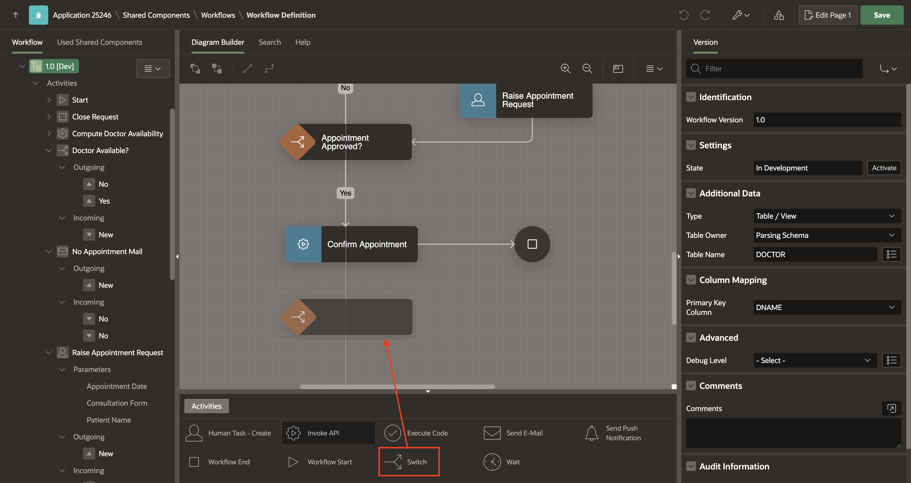

3. Select the Switch Activity you just created, and then in the Property Editor, configure the following:
    - Under Identification, Change the name to **Free Consultation?**
    - Under Switch, Set the **Type** as **True False Check**.
  

4. Now, detach the connection from the Confirm Appointment Activity and re-attach it to this Switch Activity.

  

## Task 14: Create Activity Variable for Free Consultation
We need to base the Switch condition outcome on a calculation (the number of days since the patient's last visit to the same doctor). To store the calculation result, we will create an Activity Variable for the Free Consultation? Activity.

*TechTip:*

| Description                                                                                                                      |
|----------------------------------------------------------------------------------------------------------------------------------|
|Workflow Activity variables are specific/local to the execution of a workflow activity.                                         |
| 1. During Activity execution |
| 2. During the evaluation of a Switch condition |
| 3. During the evaluation of any Timeout or Error-handling routes defined for the activity |
|Unlike Workflow Variables, they cannot be referenced by other activities of the workflow once the activity execution is completed. |


1. To create an Activity Variable, right-click on the **Free Consultation?** activity in the Workflow Tree and select Create Activity Variable.

  

2. Select the New activity variable, and in the Property Editor, perform the following
    - Under Identification, Change the Static ID to **FREE**.
    - Change the Label to Free
    - Under Value, Set the **Type** as **Function Body**, and in the **PL/SQL Function Body**, enter the following code
    ```
    <copy>
      declare
      l_free number := 1;
      begin
        select 1 into l_free from dual
         where exists (select patient_username
          from appointment
         where patient_username = :PATIENT_NAME
           and  doctor_no = :DNO
           and  schedule >= to_timestamp_tz(:REQUEST_DATE,'DD-MON-YYYY HH24:MI:SS') - 7
           and status = 'PAID');
       return 1;
      exception
        when others then
        return 0;
      end;
    </copy>
    ```
    


## Task 15: Configure Free Consultation Switch Activity

1. Now, select the **Free Consultation?** activity again.

2. In the Property Editor, make the following changes.
    - Under **Switch**, Set the **Type** as **True False Check**
    - Under **Condition**,
        - set **Condition Type** as **Workflow Variable = Value**
        - Select the **Workflow Variable** as **FREE** from the **Item Picker** -> **Activity Variables** Tab
        - Set the Value as **1**

    

## Task 16: Create the Update Fees Activity and the Send Invoice Email to Patient Activity

The next step is establishing connections for Free Consultation branches with activities such as Update Fees and sending invoice Email to Patients.

1. From the Activities Palette, **Drag** an **Invoke API** Activity into the Diagram Builder area and drop it below the **Free Consultation? activity**.

2. Click the newly added **Invoke API** and in the Property Editor,
    - Under Identification
        - Change the Name to **Update Fees**.
    - In the Settings section,
        - Select the Package Name as **EBA\_DEMO\_WF\_DOC\_APT**
        - For Function, select **UPDATE_FEES**.
    This procedure will update the Consultation Fee (FEE) in the APPOINTMENT Table record and also populate the Workflow Variable FEE.

    

3. In the **Rendering Tree**, notice that there are some Fields marked in Red. The **Update Fees** function has 5 Parameters, highlighted in RED to show that they are required.

4. In the **Left Pane**, select **Function Result** under **Update Fees** and change the following in the **Property Editor**.
    - Under Parameter, Set Direction to **Out**.
    - Under Value, for **Item**, Select  **Version Variable** -> **FEE** using the Item Picker.

    

5. Similarly, Set the remaining parameters under **Confirm Appointment** as follows:
    - Set **p\_booking\_id** to **Item**-> Version Variable **BOOKING_ID**.
    - Set **p\_doctor\_id** to Static Value -> **&DNO.**
    - Set **p\_request\_date** to **Item** -> Workflow Parameter **REQUEST_DATE**
    - Set **p\_patient\_name** to **Item** -> Workflow Parameter **PATIENT_NAME**

6. From the Activities Palette, drag and drop a **Send E-Mail** activity next to the **Update Fees** activity.

7. In the Property Editor, edit the following:
    - Under **Identification**, Change the name to **Send Invoice Email To Patient**.
    - under **settings**,
      - Set **To** as **&PATIENT_EMAIL.**
      - Set **Subject** as **Appointment Confirmed!**.
      - Enter/Replace the text in the **Body Plain Text** with the text below.
        ```
        <copy>
        Hello &PATIENT_NAME. ,
        Your appointment for &REQUEST_DATE. with Dr. &DNAME. is confirmed, The consultation charge is Rs &FEE. .
        An invoice has been raised for this appointment. Kindly make the required payment and confirm the same at the earliest.
        Please note that no payment will be required if this is a follow-up consultation.

        Regards,
        Management Team
        ABC Hospital
        </copy>
        ```

        

8. Now, draw a Connection from the **Free Consultation?** activity to the **Update Fees** activity. In the Property Editor,
    - Under Identification, Set Name to **No**
    - Under Condition, Set When to **False**

      

9. Now, draw a Connection from the **Free Consultation?** activity to the **Send Invoice Mail To Patient** activity. In the Property Editor,
    - Under Identification, Set Name to **Yes**
    - Under Condition, Set When to **True**

    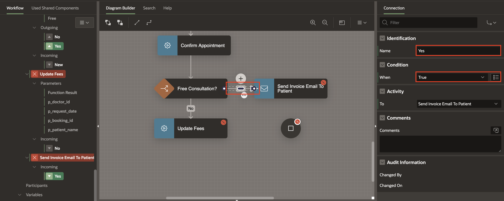  

10. Finally, draw Connections from **Send Invoice Mail To Patient** and **Update Fees** to the **Complete Appointment** End Activity to eliminate the Workflow Model's validation errors.

      

11. Click on the **Save** button to save the changes.


## Task 17: Adding the Invoice Request Human Task Activity

At this point, the workflow needs to raise an Invoice Request for the patient to confirm.

1. From the Activities Palette, drag and drop a **Human Task - Create** Activity and place it next to the **Complete Appointment End** Activity.
     

2. Then, detach the two connections from **Update Fees** and **Send Invoice Mail To Patient activities** and attach them to the **Human Task** activity.
     

3. In the property editor for the Human Task Activity,
    - Under **Identification**, Set the Name as **Raise Invoice Request**
    - Under **Settings**,
        - Set the **Definition** as **Invoice Request**
        - Set the **Details Primary Key Item** as **BOOKING_ID**
    - Under Deadline,
        - Set the **Due On Type** to **Interval**
        - Set the **Interval** to **PT30M** (this means that if the payment is not made and the patient does not confirm the invoice within 30 minutes, then the Appointment request will be closed)

    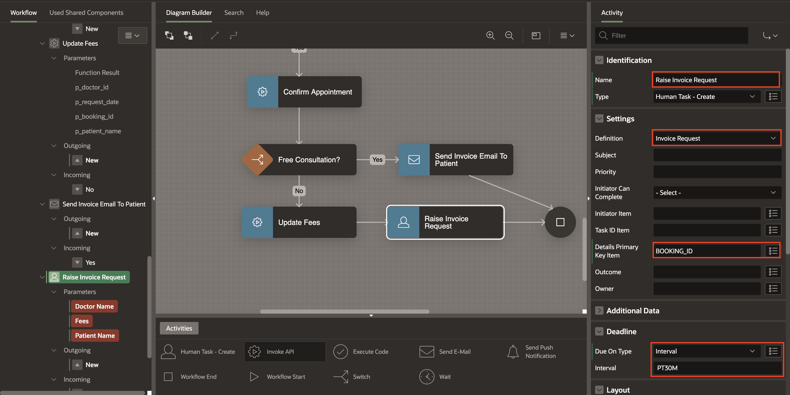

4. In the **Rendering Tree**, notice some Fields marked in Red. The **Raise Invoice Request** has 3 Parameters, highlighted in RED, to show that they are required.

5. In the **Left Pane**, select **Doctor Name** under **Raise Invoice Request** and change the following in the **Property Editor**.
    - Under Value, Select **Type** as **Static Value** and then set **Static Value** as **&DNAME.**

    

6. Similarly, Set the remaining parameters under **Raise Invoice Request** as follows:
    - Set **Fees** as Item Picker -> Version Variable -> **FEE**
    - Set **Patient Name** as Item Picker -> Workflow Parameter -> **PATIENT_NAME**

7. Click on **Save** button to save the changes.


## Task 18: Add a Timeout Connection for the Invoice Request completion.

1. Click on the 3 Dots at the top right corner of the **Raise Invoice Request** Activity to open the Context Menu and Select **Create Connection**.

    

2. Now, click on the newly created Connection, and then in the Property Editor, make the following changes.
    - Under **Identification**,
        - set the Name to **Invoice Incomplete**
        - Set the Type to Timeout
    - Under **Activity**
        - Make sure that From is set as **Raise Invoice Request**.
        - set To as **No Appointment Email**
  

3. Re-adjust the Workflow Diagram to make the diagram more aesthetic.

  


## Task 19: Update Status of the Workflow

Once the Patient confirms the invoice / makes the payment, the Appointment record status needs to be updated to PAID.

1. For that, Drag and Drop an **Invoke API** activity on the Connection between the **Raise Invoice Request** and **Complete Appointment** activities.

2. In the Property Editor, do the following changes.
    - Under Identification, Inout **Name** as **Update Appointment**.
    - Under Settings,
        - select Package as **EBA\_DEMO\_WF\_DOC\_APT**.
        - set **Procedure or function** to **UPDATE_APPOINTMENT**.

    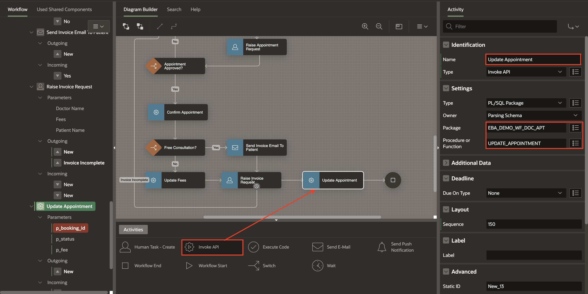

3. The procedure **UPDATE_APPOINTMENT** will update the Status in the **APPOINTMENT** Table record to **PAID**.

4. In the **Rendering Tree**, notice that there are some Fields marked in Red. The **Update Appointment** has Parameters, highlighted in RED to show that they are required. Set the Parameters for the Invoke API activity by clicking on them in the Workflow Tree

5. In the **Left Pane**, select **p\_booking\_id** under **Update Appointment** and change the following in the **Property Editor**.
    - Under Parameter, Set Direction to **In**.
    - Under Value, Select **Type** as **Item** and then set **Item** as Version Variable **BOOKING_ID**

    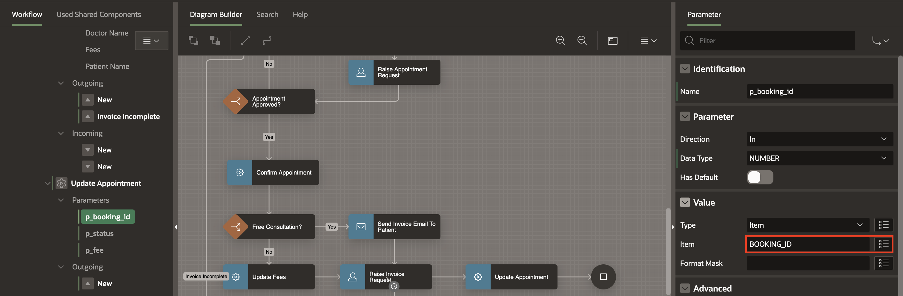


6. Similarly, Set the remaining parameters under **Update Appointment** as follows:
    - Set **p_status** to **Static** Value -> **PAID**
    - Set **p_fee** to **API Default**


## Task 20: Final steps

Going back to our flowchart, at this point the Workflow waits for the appointment to happen and after that it raises a Feedback Request for the Patient. If the feedback is not received within a specific period, the Workflow is Completed without Feedback, else a Thank You Email is sent to the Patient.

1. From the Activities Palette , drag a **Wait** Activity and drop it on the connection between the **Update Appointment** and the **Complete Appointment** activities.

2. In the Property Editor,
    - Under Identification, Set the Name to **Wait Before Requesting Feedback**
    - Under Settings,
        - Set **Timeout Type** as **SQL Query**
        - For **SQL Query**, enter the following SQL Code

        ```
        <copy>
            select schedule
            from appointment
            where booking_id = :BOOKING_ID
        </copy>
        ```
    

3. From the Activities Palette , drag a **Human Task - Create** Activity and drop it on the connection between the **Wait Activity** and the **Complete Appointment** activities.

4. In the Property Editor
    - Under **Identification**, Set Name to **Request For Feedback**
    - Under **Settings**,
        - set **Definition** to **Feedback Request**
        - set **Detail Primary Key Item** to **BOOKING_ID**
    - Under Deadline,
        - set **Due On Type** to **Interval**
        - **Interval** to **PT24H** (this implies that the Workflow will wait at most 24 hours for the feedback activity to be completed )

  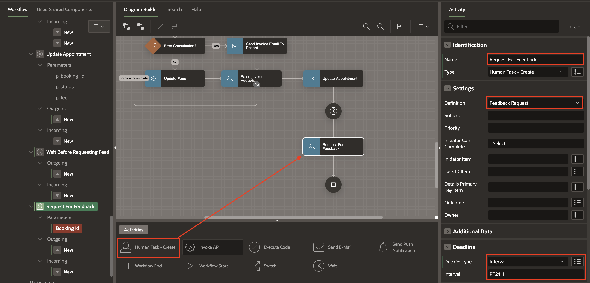

5. In the Rendering Tree, select **Booking Id** under **Request For Feedback** and change the following in the **Property Editor**.
    - Under Value, Select **Type** as **Item** and then set **Item** as Version Variable **BOOKING_ID**

    

6. Drag a **Workflow End** Activity from the **Activity Palette** and drop it on the Diagram area to the left of the **Request for Feedback** activity.

7. In the Property Editor, under identification, set Name to **End Without Feedback**.

    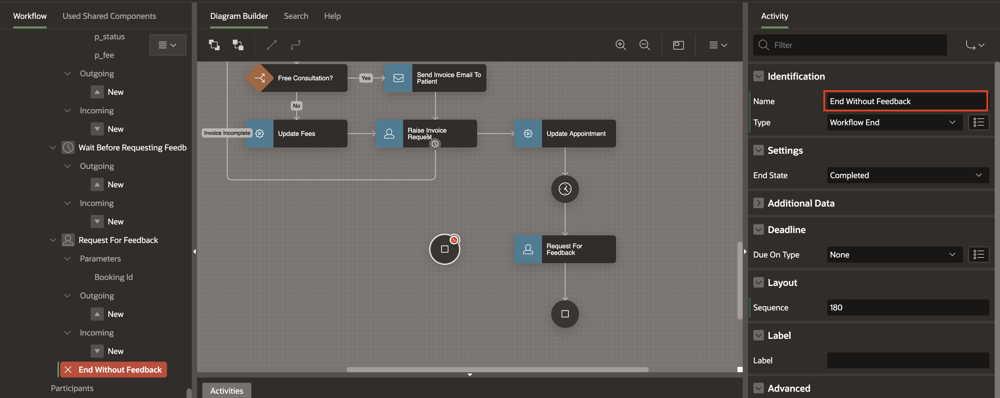

8. Draw a Connection from the **Request for Feedback** to the **End Without Feedback** Activity.

    

9. Notice that the connection is in RED and this is because an activity cannot have more than one outgoing connection of type Normal.

10. Click on the Connection and then in the Property Editor,
    - Under Identification,
        - set the Name to **No Feedback Received**
        - Set the Type to **Timeout**

    

> **Tech Tip:** _Connections of type Timeout can only be added to an activity if the activity has Due On Type and value populated in the Deadline section of the Property Editor._

11. Finally, Drag a **Send E-Mail** Activity from the Activities Palette and drop it on the connection between **Request for Feedback** and **Complete Appointment** End Activity.

12. In the Property Editor.
    - Under Identification, Set the Name to **Send Thank You Note To Patient**
    - Under Settings,
        - Set the **To** property in the Settings to **&PATIENT_EMAIL.**
        - Set the **Subject** to **Thank You!**
        - Set the **Body Plain Text** as shown below

        ```
        <copy>
        Dear &PATIENT_NAME. ,

        Thank you for your feedback regarding your recent appointment with Dr. &DNAME.
        We hope to keep serving you in the future!

        Regards,
        Management Team,
        ABC Hospital Pvt Ltd.

        </copy>
        ```

    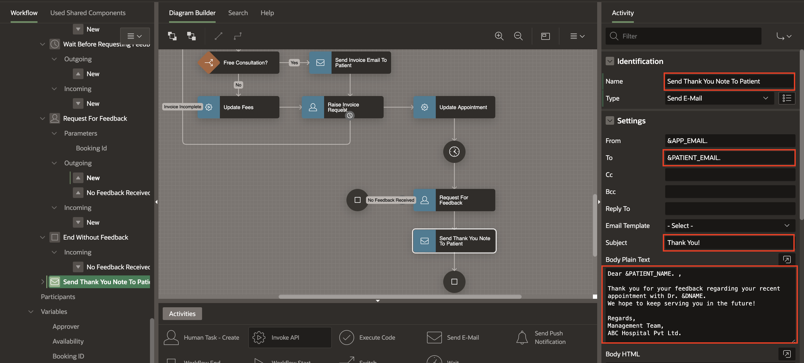

13. Save the changes by clicking the **Save** button.

14. At this point, our Appointment Workflow model is **Complete!**

## Summary

You have successfully created and configured the workflow for the Doctor's Appointment Made Easy application.

### What's Next
In the next section, you will create pages in the application that will utilize this workflow.

You may now **proceed to the next lab**.

## Acknowledgements
- **Author(s)** - Roopesh Thokala, Senior Product Manager & Ananya Chatterjee, Consulting Member of Technical Staff.
- **Contributor** -
- **Last Updated By/Date** - Roopesh Thokala, Senior Product Manager, December 2023   
