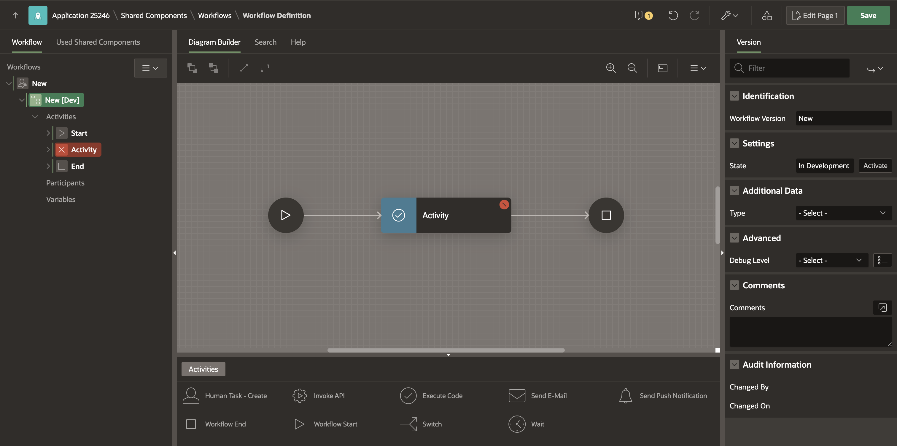
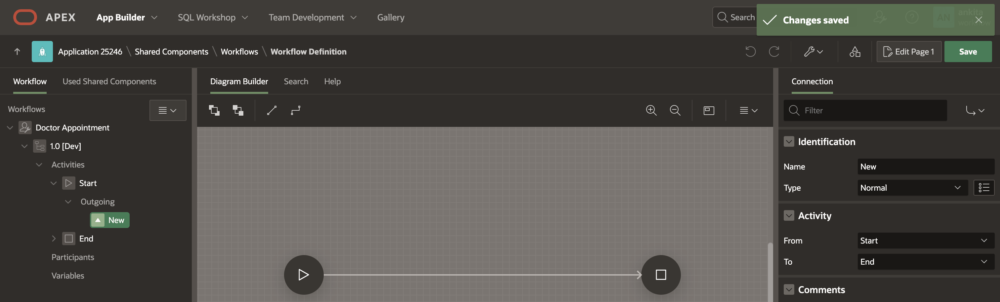
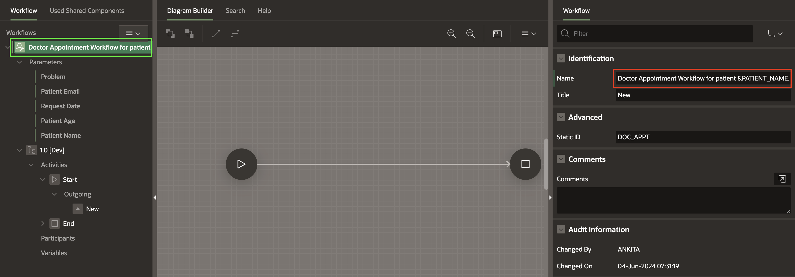
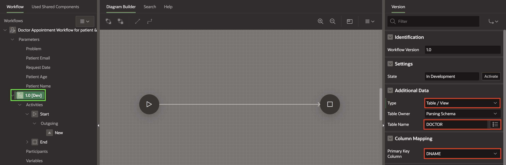
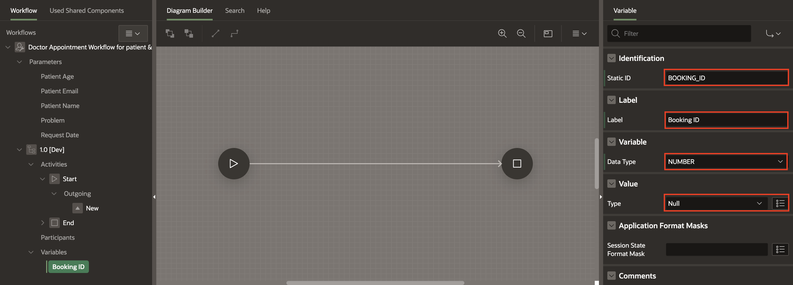
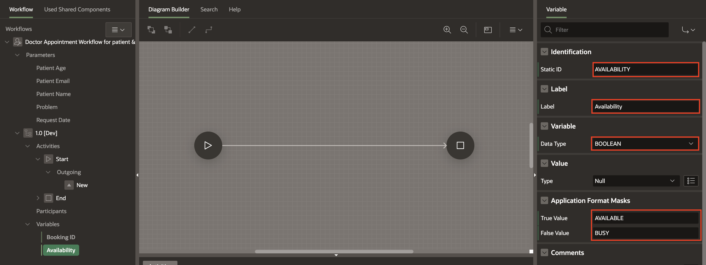
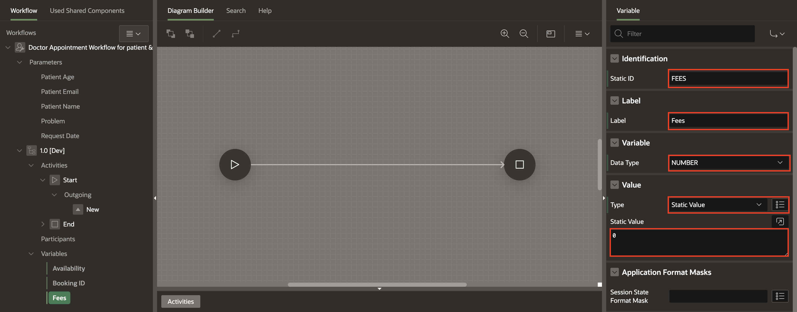

# Create a Doctor Appointment Workflow

## Introduction

In this hands-on lab, you will learn the process of creating a Doctor Appointment Workflow using Oracle APEX.

### Objectives

In this lab, You will learn how to
  - Create the Workflow
  - Modify the Workflow details
  - Define Workflow Data
  - Add Workflow Variables

Estimated Time: 20 minutes

### Prerequisites
1. Access to Oracle APEX.
2. Ensure that you have completed the Previous labs.

## Task 1: Create the Workflow

To create a Workflow:

1. In the App Builder, navigate to **Doctor Appointments Made Easy!** application and then select **Shared Components**.

  
  

2. Under Workflows and Automations, Select **Workflows**

  

3. In the Workflows Page, click on **Create**.

  

4. This will lead you to the Workflow Designer (Shared Components -> Workflows -> Workflow Definition Page). A new workflow with a Start Activity, Execute Code Activity, and End Activity will be auto-created.

  

## Task 2: Modify Workflow Details

1. Change the Workflow Name to **Doctor Appointment** and then in the Property editor, under **Advanced**,set the Static ID to **DOC_APPT**.

  

2. Now change the Workflow Name by clicking on New[Dev] and modify the **Workflow Version** from **New** to **1.0**.

  

> **Note:** _You may have noticed the label [Dev] next to the version in the tree on the left pane. This means that this version of the Workflow is In Development and all parts of it are editable. We will learn about workflow versioning- Active vs. In Development versions in future blogs in this series._

3. The Workflow cannot be saved yet as the there are validation errors. Click on the error icon (Yellow exclamation mark) to see the error.

  

4. At this point, we will remove this activity since we plan to introduce new specific activities in subsequent sections of this lab. To do this, either right-click on the highlighted RED activity in the Workflow tree and select **Delete**, or click on the three dots at the bottom right corner of the activity in the Diagram. This will open a menu, and you can choose 'Delete' from the options provided.

  
  

5. The Workflow now contain just the Start and the End activities. Connect the Start and End activities and then save the Workflow by clicking the **Save** button at the top right corner.

  

> **Note:** _A workflow model cannot be saved until its validation errors have been fixed.._

6. The changes are saved successfully.

  

## Task 3: Familiarize with Workflow Elements

1. At this stage, let's engage in a hands-on exploration to better understand the fundamental elements and terminology of the workflow. We have introduced the notions of Activities and Connections in the Workflow. Now, let's take a moment to understand the different types of workflow elements and terms such as Activities, Connections, and Connection Types.

2. Refer to the Activity Palette in the Designer for a list of activity types.

  

  | Activity Type         | Description                                                                                                              | Blocks the workflow engine until execution completes? |
  |------------------------|--------------------------------------------------------------------------------------------------------------------------|--------------------------------------------------------|
  | Execute Code           | Executes PL/SQL Code                                                                                                     | Yes                                                    |
  | Invoke API             | Invokes a procedure or function inside a PL/SQL package or an API from a REST Data Source.                              | Yes                                                    |
  | Push Notifications    | Sends push notifications using PWA                                                                                      | Yes                                                    |
  | Send E-Mail            | Sends an Email based on the Email settings.                                                                             | Yes                                                    |
  | Human Task - Create    | Creates an Approval or Action Task based on the Task Definition specified. Once the task is created, the activity and workflow go into the Waiting state until the task is completed/approved/rejected by its owner/errors out/expires. | No                                                     |
  | Wait                   | Denotes a deliberate pause in the workflow execution. At runtime, the workflow pauses execution when it encounters a Wait Activity. A Wait Activity can have timeout specifications. When the specified time has elapsed, the workflow resumes execution. A Wait Activity can also be interrupted by calling apex\_workflow.continue\_activity() passing the Static ID of the Wait Activity and the Workflow Instance ID as parameters. | No                                                     |
  | Switch                 | Denotes a fork or conditional branching in a workflow execution. After adding a switch activity, the developer must define branches or connections out of the switch activities with the appropriate conditions specified. | Yes                                                    |
  | Workflow Start         | Denotes the Start of a workflow. A workflow model must have exactly one Start Activity.                                   | Yes                                                    |
  | Workflow End           | Denotes the End of a workflow. Depending on the End State attribute of this activity, the Workflow is either Completed or Terminated. | Yes                                                    |

  **Connection Types**
  | Connection Type | Description                                                                                                        |
  |------------------|--------------------------------------------------------------------------------------------------------------------|
  | Normal           | Connects two activities in the workflow. No conditions. Not applicable for Switch Activities                         |
  | Timeout          | If an activity has a due date specified, the timeout connection can be used to move the workflow to an alternate target activity in case the current activity execution times out. Not applicable for Switch and Wait activities.  |
  | Error            | Allows for efficient error management within the workflow without letting it go into a state of exception. Not applicable for Switch activities.                                      |
  | Switch connections | Connections leading out of a Switch Activity. They are conditional in nature.                                      |

## Task 4: Understand Workflow Data - Parameters, Variables, Activity Variables, and Additional Data

In any business process, managing and utilizing data is crucial. As we delve into the execution of workflows, it becomes essential to understand how data is handled. Workflows can receive input data, and depending on the business requirements, they may also need to access additional data beyond the provided input. Some of this data may be subject to modification during the workflow, and there can be activity-specific data relevant to particular steps in the process.

In this hands-on lab, we will explore various aspects of workflow data using the example of a medical appointment application that we are building. We will focus on understanding parameters, variables, activity variables, and additional data.

Referring to the flow chart illustrating the business logic, the appointment booking process initiates with the Hospital Staff submitting patient details to the system, marking the commencement of the workflow.

## Task 5: Adding Inputs to the Doctor Appointments Workflow

If we look back at the flow chart depicting the business logic, the appointment booking process starts with the Hospital Staff submitting the patient details to the system and this is when the workflow begins.

1. The inputs to the workflow will be the patient details. In workflow terminlogy, these are called Workflow Parameters

2. You will define the following parameters for the Doctor Appointment Workflow.
   PATIENT\_NAME, PATIENT\_AGE, PATIENT\_EMAIL, PROBLEM, REQUEST\_DATE

3. To create Workflow Parameters, Right-click on the Doctor Appointment Workflow in the Tree and then click **Create Parameter**.

  

4. This adds a Parameter with label "New" in the Workflow Tree. Go to the Property Editor and change
    - **Label** to **Patient Name**
    - **Static ID** to **PATIENT_NAME**
    - Leave the **Data Type** as **VARCHAR2**.

  

5. Similarly add the rest of the Parameters.
    - For PATIENT_AGE Parameter, select Data Type as Number.
    - For REQUEST_DATE, select Data Type as Timestamp with Time Zone.
    - Under Application Format Masks, set the Session State Format Mask as **DD-MON-YYYY HH24:MI:SS**.

      

    -  For PATIENT_EMAIL & PROBLEM, leave it to default.

## Task 6: Use the parameters in the Workflow Subject

The Workflow has a Title field which is a descriptive title for the Workflow and shows up in the Workflow Console that the Hospital Staff will eventually use to monitor the progress of the appointment process. The Title supports using workflow parameter static IDs as substitution strings.

1. To set the Workflow Title, Under Identification, click Doctor Appointment Workflow in the Rendering Tree.

2. In the Property Editor, Change the **Title** to **Doctor Appointment Workflow for patient &PATIENT_NAME**.

    

3. Click Save button to save your changes.

## Task 7: Add Additional Data to the Workflow

In addition to the input parameters, the Workflow also needs information about the available doctors based on the patient's particular problem. An understanding of the appointment process tells us that the doctor data will be needed by almost all activities of the workflow.

1. To define Additional Data, click on the **Workflow Version 1.0[Dev]** in the rendering Tree.

2. In the Version Property Editor, Navigate to the Additional Data section and set the below properties.
    - Set Type as **Table/View**.
    - For Table Name, Select **DOCTOR** from the list of Tables.
    - Under **Column Mapping**, For **Primary Key Column**, Select **DNAME**.

    

3. Click **Save**.

> **Note:** _Now the values of all columns of the DOCTOR table will be available as Bind Variables or Substitution Strings at all points and by all activities during the execution of this Workflow._

## Task 8: Add Workflow Variables

**Why are Parameters and Additional Data not enough?**

The inputs provided to the Appointment Workflow are read-only in nature. This means that once the workflow is submitted, their values will never be modified. The workflow needs to process and pass data from one activity to the next. As an example, consider the different business steps:

Before an appointment is confirmed, the workflow needs to compute the doctor's availability based on his/her current appointment schedule. So, Availability of the doctor is a variable that will be determined based on this computation.

When an appointment is confirmed, the Booking ID for the appointment entry needs to passed on to later activities which calculate and update the appointment fees.
Data such as Availability, Booking ID and Fee need to be updatable by the activities of the workflow as part of the execution. Data such as these need to be defined as Workflow Variables.

1. Right-click on 1.0 [DEV] (workflow version) in the Rendering Tree.

2. Select **Create Variable**.
    

3. A new variable with Name **New** gets created in the tree. Click on it and modify the following properties in the Property Editor.
    - Under Identification,
        - Set Static ID as **BOOKING_ID**
    - Under label
        - Set Label as **Booking Id**
    - Under Variable
        - Set Data Type as **NUMBER**
    - Under value
        - Select Type as **Null**. This is because we know that the Booking ID only gets generated later in the workflow after the appointment is confirmed, so it needs to be initialized to null

        

4. Similarly create variable **AVAILABILITY** with Data Type **BOOLEAN**.

5. And then,
    - under the **Application Format Masks** section,
      - specify the **True Value** as **AVAILABLE**
      - and **BUSY** as the **False** value
    - Under Value, set Type as **Null**.

  

6. Also, Create variable **FEE** with Data Type **NUMBER**, and Set Value -> Type as **Static Value** with the **Static Value** as **0**.

  

7. Click **Save**.

## Summary

In this lab, you learned the process of creating a Doctor Appointment Workflow using Oracle APEX.

### What's Next
Now you're ready to proceed to the next section where you'll learn how to add Human Tasks to your Workflow. Stay tuned for more hands-on guidance!

You may now **proceed to the next lab**.   

## Acknowledgements
- **Author(s)** - Roopesh Thokala, Senior Product Manager & Ananya Chatterjee, Consulting Member of Technical Staff.
- **Contributor** -
- **Last Updated By/Date** -  Roopesh Thokala, Senior Product Manager, December 2023   
