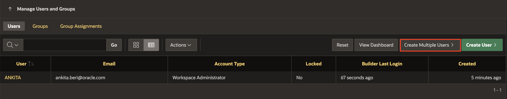
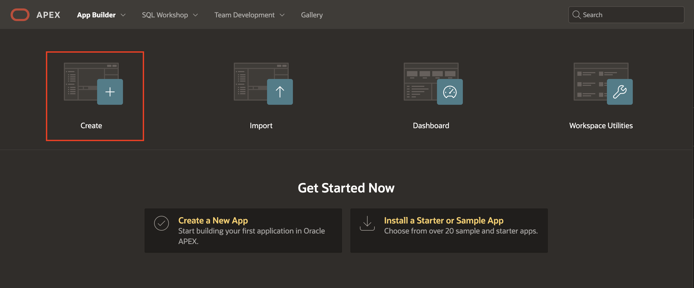
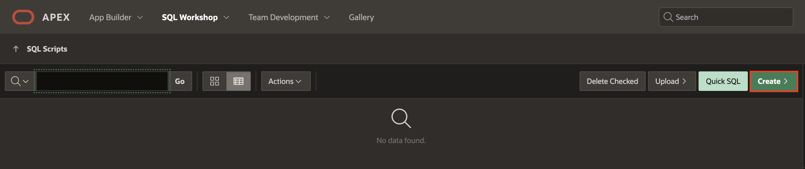
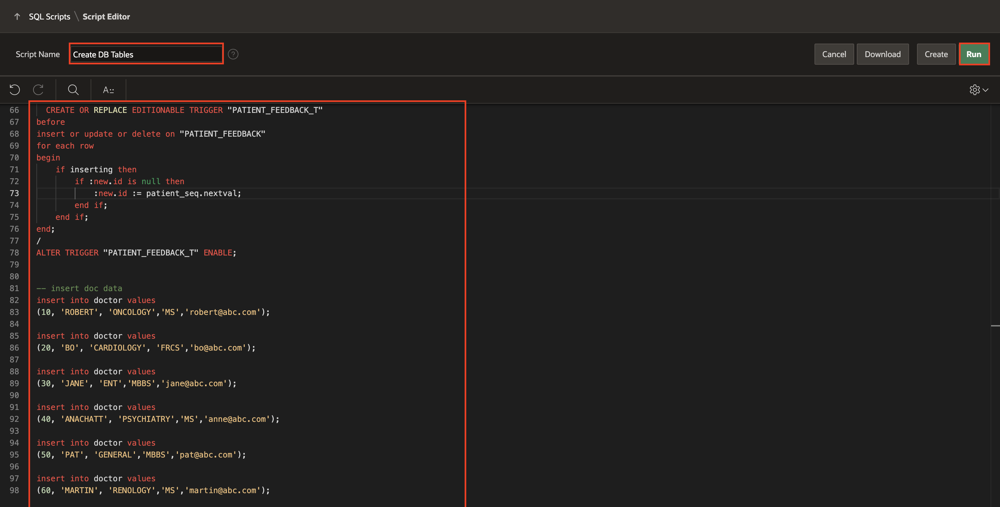
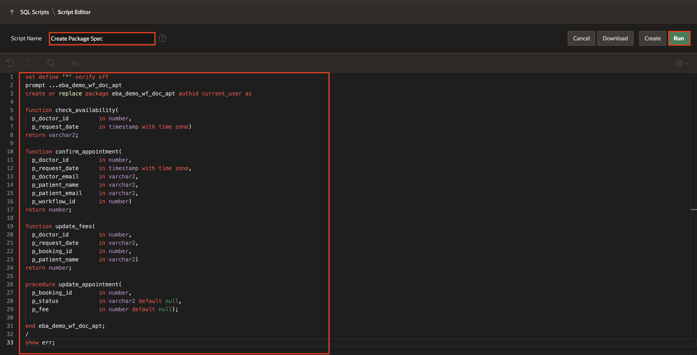
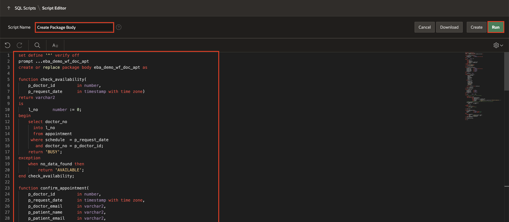
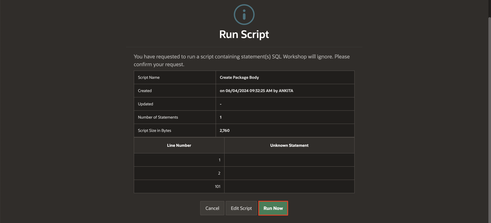

# Design the Doctor Appointments Made Easy Application

## Introduction

Hands-on Lab:

In this lab, you will design the Doctor Appointments Made Easy application using Oracle APEX. The application will streamline the doctor appointment process, allowing seamless interactions between doctors, patients, and hospital staff.

### Objectives

In this lab, you :
- Create the APEX Application.
- Create Application users
- Install Sample dataset

Estimated Time: 20 minutes

### Prerequisites
1. Access to Oracle APEX.
2. Ensure that users (doctors, patients, and hospital staff) are created using the Manage Users And Groups menu option under Workspace Administration. To create these users, follow the the instructions specified in Step 1.

## Task 1: Create Application Users
In this lab, you create users for Doctor Appointments made Easy Application.

1. Navigate to **Workspace Administration** by clicking the **Administration icon** on the Application home page and select **Manage Users and Groups** from the dropdown list.

  

2. Click **Create Multiple Users**

  

3. Under **Create multiple Users**, create the following users:

    | Persona        | User Name |
    | -------------- | --------- |
    | Doctors        | ROBERT    |
    |                | ANACHATT  |
    |                | JANE      |
    |                | BO        |
    |                | PAT       |
    |                | MARTIN    |
    | Patients       | SUSIE     |
    |                | DARYL     |
    |                | RAJESH    |
    | Hospital Staff | STEVE     |

4. Specify the following attributes:
    - For a List of Email Addresses: Enter **Email IDs of the Users**
    | List of Email Addresses |
    | --------- |
    | ROBERT@oracle.com    |
    | ANACHATT@oracle.com  |
    | JANE@oracle.com      |
    | BO@oracle.com        |
    | PAT@oracle.com       |
    | MARTIN@oracle.com    |
    | SUSIE@oracle.com     |
    | DARYL@oracle.com     |
    | RAJESH@oracle.com    |
    | STEVE@oracle.com     |
    - For Usernames : Select **Exclude @ domain as part of the username**
    - For password and Confirm Password: **Enter a password of your wish**
    - Click **Next**
    

5. And then, Click **Create Valid Users**
  
6. Users are now created in your Workspace.

## Task 2: Create the Doctor Appointments Made Easy Application

1. Navigate to **App Builder**.
  

2. Click **Create**.
  

3. Under **Create an Application**,
    - For Name, enter **Doctor Appointments Made Easy!**
      

4. Click **Create Application**.

## Task 3: Sample Table and Sample Data

1. Install the dataset.

2. Navigate to **SQL Workshop** and click **SQL Scripts**.
  

3. Click **Create**.
  

4. Copy and paste the SQL commands into the Script Editor to create tables for Doctor, Appointment, and Patient Feedback, along with sequences.
    ```
    <copy>
        begin
        execute immediate 'drop table appointment';
        execute immediate 'drop table doctor';
        execute immediate 'drop table patient_feedback';
        execute immediate 'drop sequence appoint_seq';
        execute immediate 'drop sequence patient_seq';
      exception
        when others then
            dbms_output.put_line('DB Objects not exist');
      end;
      /

      CREATE TABLE "APPOINTMENT"
       (    "BOOKING_ID" NUMBER(*,0),
        "PATIENT_USERNAME" VARCHAR2(40) NOT NULL ENABLE,
        "DOCTOR_NO" NUMBER(*,0) NOT NULL ENABLE,
        "SCHEDULE" TIMESTAMP (6) WITH TIME ZONE NOT NULL ENABLE,
        "PATIENT_EMAIL" VARCHAR2(40) NOT NULL ENABLE,
        "DOCTOR_EMAIL" VARCHAR2(40) NOT NULL ENABLE,
        "STATUS" VARCHAR2(10),
        "FEE" NUMBER,
        "WORKFLOW_ID" NUMBER,
         PRIMARY KEY ("BOOKING_ID")
      USING INDEX  ENABLE
       ) ;

      CREATE TABLE "DOCTOR"
       (    "DNO" NUMBER(*,0),
        "DNAME" VARCHAR2(20),
        "SPECIALIZATION" VARCHAR2(20),
        "QUALIFICATION" CHAR(15),
        "DOC_EMAIL" VARCHAR2(100) DEFAULT 'dname@abc.com',
         PRIMARY KEY ("DNO")
      USING INDEX  ENABLE
       ) ;

      CREATE TABLE "PATIENT_FEEDBACK"
       (    "ID" NUMBER(*,0),
        "PATIENT_NAME" VARCHAR2(40),
        "DOCTOR_NO" VARCHAR2(100),
        "APPOINTMENT" TIMESTAMP (6) WITH TIME ZONE,
        "FEEDBACK" VARCHAR2(4000),
        "RATING" NUMBER(*,0) NOT NULL ENABLE,
        "CREATED_AT" TIMESTAMP (6) WITH TIME ZONE,
        "UPDATED_AT" TIMESTAMP (6) WITH TIME ZONE
       ) ;

     CREATE SEQUENCE  "APPOINT_SEQ"  MINVALUE 1 MAXVALUE 9999999 INCREMENT BY 1 START WITH 901 CACHE 100 NOORDER  NOCYCLE  NOKEEP  NOSCALE  GLOBAL ;

     CREATE SEQUENCE  "PATIENT_SEQ"  MINVALUE 1 MAXVALUE 999999 INCREMENT BY 1 START WITH 201 CACHE 100 NOORDER  NOCYCLE  NOKEEP  NOSCALE  GLOBAL ;

      CREATE OR REPLACE EDITIONABLE TRIGGER "APPOINTMENT_T"
    before
    insert or update or delete on "APPOINTMENT"
    for each row
    begin
        if inserting then
            if :new.booking_id is null then
                :new.booking_id := appoint_seq.nextval;
            end if;
        end if;
    end;
    /
    ALTER TRIGGER "APPOINTMENT_T" ENABLE;

      CREATE OR REPLACE EDITIONABLE TRIGGER "PATIENT_FEEDBACK_T"
    before
    insert or update or delete on "PATIENT_FEEDBACK"
    for each row
    begin
        if inserting then
            if :new.id is null then
                :new.id := patient_seq.nextval;
            end if;
        end if;
    end;
    /
    ALTER TRIGGER "PATIENT_FEEDBACK_T" ENABLE;


    -- insert doc data
    insert into doctor values
    (10, 'ROBERT', 'ONCOLOGY','MS','robert@abc.com');

    insert into doctor values
    (20, 'BO', 'CARDIOLOGY', 'FRCS','bo@abc.com');

    insert into doctor values
    (30, 'JANE', 'ENT','MBBS','jane@abc.com');

    insert into doctor values
    (40, 'ANACHATT', 'PSYCHIATRY','MS','anne@abc.com');

    insert into doctor values
    (50, 'PAT', 'GENERAL','MBBS','pat@abc.com');

    insert into doctor values
    (60, 'MARTIN', 'RENOLOGY','MS','martin@abc.com');
    </copy>
    ```
5. For Script Name, enter **Create DB Tables** and Click **Run**.
  

6. Click **Run Now**.
  
  

## Task 4: Create Package Spec and Package Body

1. Navigate back to **SQL Workshop** and click **SQL Scripts**.

  

2. Click **Create**.
  

3. Copy and paste the provided commands to create a package spec named **eba\_demo\_wf\_doc\_apt.sql**.

    ```
    <copy>
    set define '^' verify off
    prompt ...eba_demo_wf_doc_apt
    create or replace package eba_demo_wf_doc_apt authid current_user as

    function check_availability(
      p_doctor_id         in number,
      p_request_date      in timestamp with time zone)
    return varchar2;

    function confirm_appointment(
      p_doctor_id         in number,
      p_request_date      in timestamp with time zone,
      p_doctor_email      in varchar2,
      p_patient_name      in varchar2,
      p_patient_email     in varchar2,
      p_workflow_id       in number)
    return number;

    function update_fees(
      p_doctor_id         in number,
      p_request_date      in varchar2,
      p_booking_id        in number,
      p_patient_name      in varchar2)
    return number;

    procedure update_appointment(
      p_booking_id        in number,
      p_status            in varchar2 default null,
      p_fee               in number default null);

    end eba_demo_wf_doc_apt;
    /
    show err;
    </copy>
    ```

4. For Script Name, enter **Create Package Spec** and Click **Run**.

    

5. Click **Run Now**.

  


6. Repeat steps 2-3 to create a package body named **eba\_demo\_wf\_doc\_apt.plb**.

    ```
    <copy>
    set define '^' verify off
    prompt ...eba_demo_wf_doc_apt
    create or replace package body eba_demo_wf_doc_apt as

    function check_availability(
        p_doctor_id         in number,
        p_request_date      in timestamp with time zone)
    return varchar2
    is
        l_no      number := 0;
    begin
        select doctor_no
          into l_no
          from appointment
         where schedule  = p_request_date
           and doctor_no = p_doctor_id;
        return 'BUSY';
    exception
        when no_data_found then
            return 'AVAILABLE';
    end check_availability;

    function confirm_appointment(
        p_doctor_id         in number,
        p_request_date      in timestamp with time zone,
        p_doctor_email      in varchar2,
        p_patient_name      in varchar2,
        p_patient_email     in varchar2,
        p_workflow_id       in number)
    return number
    is
        l_booking_id   number;
    begin
       insert into appointment (
           patient_username,
           doctor_no,
           schedule,
           patient_email,
           doctor_email,
           status,
           workflow_id)   
       values (
           p_patient_name,
           p_doctor_id,
           p_request_date,
           p_patient_email,
           p_doctor_email,
           'CONFIRMED',
           p_workflow_id
           )
        returning booking_id into l_booking_id;

        return l_booking_id;
    end confirm_appointment;

    function update_fees(
        p_doctor_id         in number,
        p_request_date      in varchar2,
        p_booking_id        in number,
        p_patient_name      in varchar2)
    return number
    is
        l_fee          number := 500;
    begin
        -- check that this is not a case of followup
        select 0
          into l_fee from dual
         where exists (select patient_username
                         from appointment
                        where patient_username = p_patient_name
                          and doctor_no        = p_doctor_id
                          and schedule         >= to_timestamp_tz(p_request_date,'DD-MON-YYYY HH24:MI:SS') - 7
                          and status           = 'PAID');
        -- Update the appointment table to reflect the revised fee for the consultation
        update_appointment(
            p_booking_id    => p_booking_id,
            p_fee           => l_fee);

        return l_fee;
    exception
        when no_data_found then
            -- this is not a followup
            return l_fee;

    end update_fees;

    procedure update_appointment(
        p_booking_id        in number,
        p_status            in varchar2 default null,
        p_fee               in number default null)
    is
    begin
        update appointment
           set status     = coalesce(p_status, status),
               fee        = coalesce(p_fee,    fee)
         where booking_id = p_booking_id;
    end update_appointment;

    end eba_demo_wf_doc_apt;
    /
    show err;
    </copy>
    ```

7. For Script Name, enter **Create Package Body** and Click **Run**.

    

8. Click **Run Now**.

  

## Summary
You have successfully completed the initial steps for designing the Doctor Appointments Made Easy application. You created Doctor Appointments Made Easy Application, and then added Application users, created Sample Datasets, and a Package.

### What's Next
In the next lab, you will learn how to create a Workflow using Oracle APEX.

You may now **proceed to the next Lab**.

## Acknowledgements
- **Author(s)** - Roopesh Thokala, Senior Product Manager & Ananya Chatterjee, Consulting Member of Technical Staff.
- **Contributor** -
- **Last Updated By/Date** - Roopesh Thokala, Senior Product Manager, December 2023
