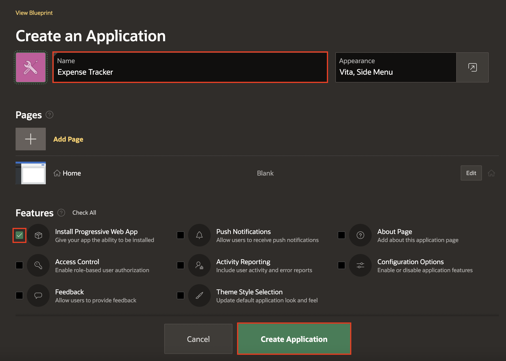
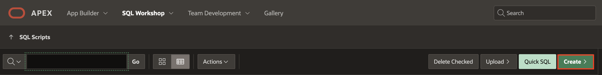
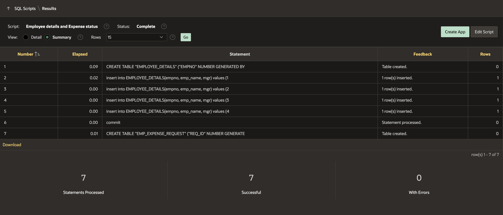

# Create an Expense Tracker Application

## Introduction

In this lab, you will learn to create an APEX Application named Expense Tracker and database objects using SQL script containing an Employee details table and Expense request table. Also, you will learn to make end users in your APEX application.

Estimated Time: 10 minutes

### Objectives

In this lab, you will:
- Create the Application
- Create SQL Script
- Add Users


## Task 1: Create the Application
In this lab, you create a new application named Expense Tracker.

1. If you have not already logged into your Oracle APEX workspace, sign in using the workspace name, email, and password you signed up with.

    

2. At the top left of your workspace, click **App Builder**.

    

3. On the App Builder page, click **Create**.

    

4. Click **New Application**

    

5. In the Create an Application wizard, set Name to **Expense Tracker**.

6. Click **Create Application** to create your app and go to the application home page.

    

## Task 2: Create a SQL Script
In this lab, you create database objects using SQL Script.

1. At the top of the application home page, click **SQL Workshop** and then **SQL Scripts**. The SQL Scripts page appears.

    

2. Click **Create**. The Script Editor appears.

    

3. In the Script Name, enter a name for the script - **Employee details and Expense status**

4. Enter the SQL statements.

   Copy the code below and paste it into  the code editor:
      ```
      <copy>
      CREATE TABLE "EMPLOYEE_DETAILS"
      ("EMPNO" NUMBER GENERATED BY DEFAULT ON NULL
      AS IDENTITY MINVALUE 1 MAXVALUE 9999999999999999999999999999
      INCREMENT BY 1 START WITH 8000 CACHE 20 NOORDER  NOCYCLE  NOKEEP  NOT NULL ENABLE,
      "EMP_NAME" VARCHAR2(100),
      "MGR" NUMBER(4,0),
      CONSTRAINT "EMP_PK" PRIMARY KEY ("EMPNO"));
      insert into EMPLOYEE_DETAILS(empno, emp_name, mgr) values (10, 'JOHN', 20);
      insert into EMPLOYEE_DETAILS(empno, emp_name, mgr) values (20, 'CLARA',30);
      insert into EMPLOYEE_DETAILS(empno, emp_name, mgr) values (30, 'JANE', 40);
      insert into EMPLOYEE_DETAILS(empno, emp_name, mgr) values (40, 'MATT', null);
     commit;
      CREATE TABLE "EMP_EXPENSE_REQUEST"
      ("REQ_ID" NUMBER GENERATED BY DEFAULT ON NULL
      AS IDENTITY MINVALUE 1 MAXVALUE 9999999999999999999999999999
      INCREMENT BY 1 START WITH 8000 CACHE 20 NOORDER NOCYCLE NOKEEP NOT NULL ENABLE,
      "EMP_NO" VARCHAR2(10),
      "EXPENSE_TYPE" VARCHAR2(100),
      "ESTIMATED_COST" NUMBER(8,0),
      "UPDATED_BY" VARCHAR2(100),
      "STATUS" VARCHAR2(20),
      CONSTRAINT "EMP_EXPENSE_REQUEST_PK" PRIMARY KEY ("REQ_ID"));  
      </copy>
      ```

5. Click **Run and Run Now**. Now you can see that SQL statements run successfully.

  

  

  

## Task 3: Add Users
   In this lab, you create users for multi-level management.

1. Navigate to the Administration icon on Application home page and select **Manage Users and Group** from the dropdown list.

     

2. Click **Create Multiple Users**

     

3. Specify the following attributes:

     - For a List of Email Addresses: Enter **MATT@oracle.com, JANE@oracle.com, CLARA@oracle.com, JOHN@oracle.com**

     - For Usernames : Select **Exclude @ domain as part of the username**

     - For password and Confirm Password: Enter a password of your wish

4. Click **Next** and **Create Valid Users**

   

   

     


## **Summary**
You now know how to create an application ,SQL script and add users.

You may now **proceed to the next lab**.   

## Acknowledgments
   - **Author** - Ankita Beri, Product Manager
   - **Contributor** - Roopesh Thokala, Senior Product Manager
   - **Last Updated By/Date** - Ankita Beri, Product Manager, June 2023
