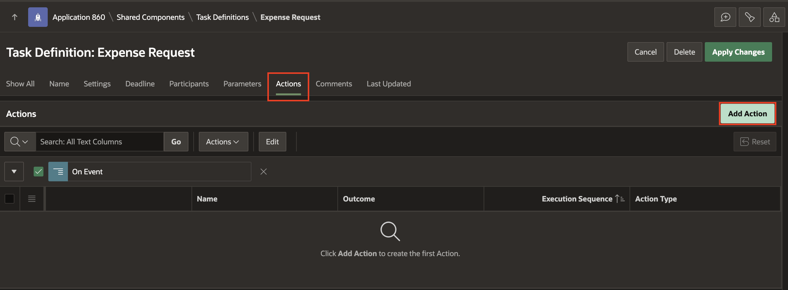
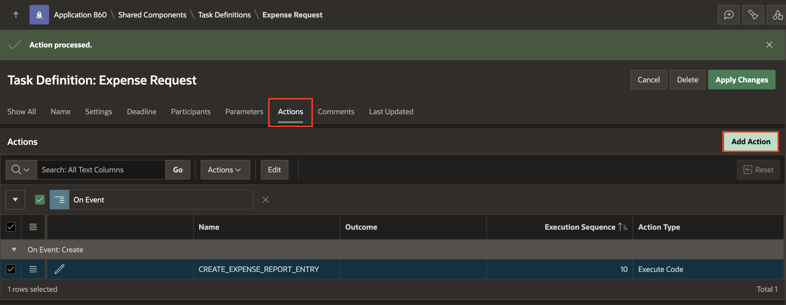
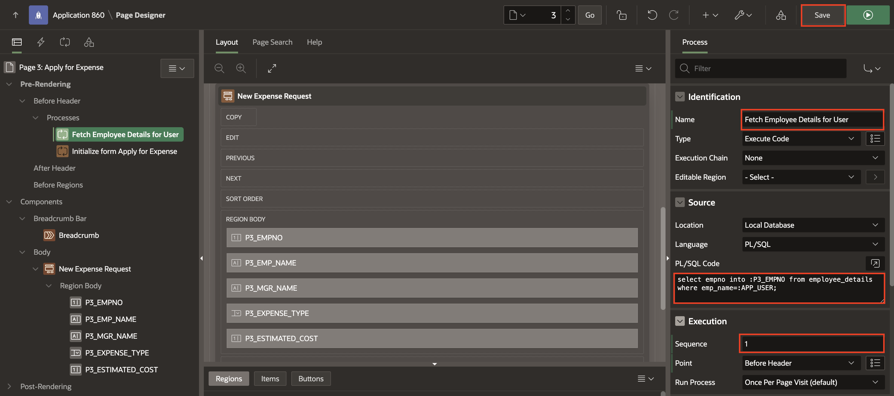
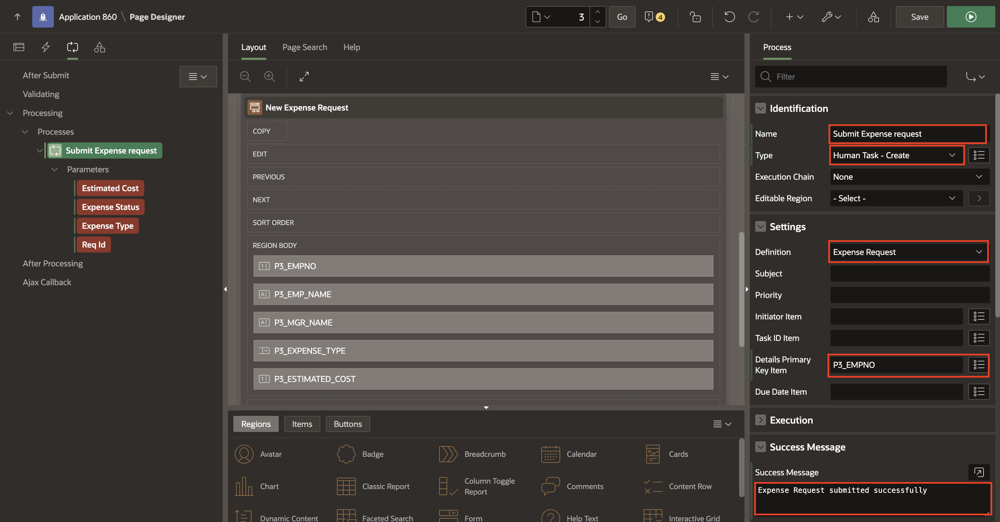
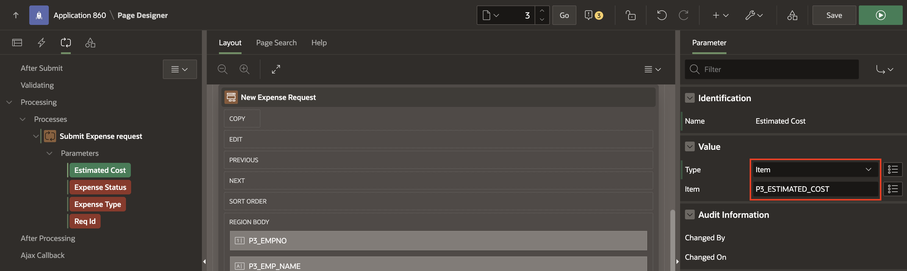
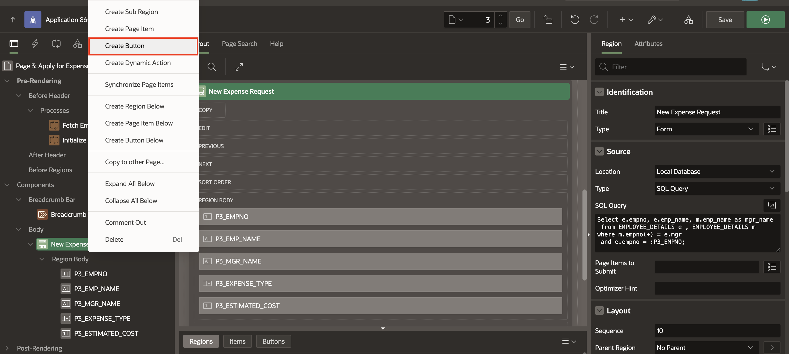
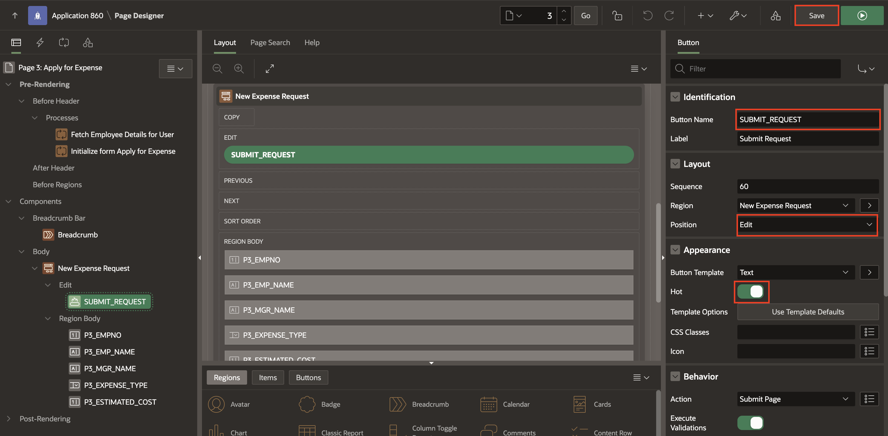
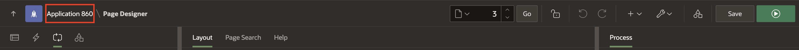
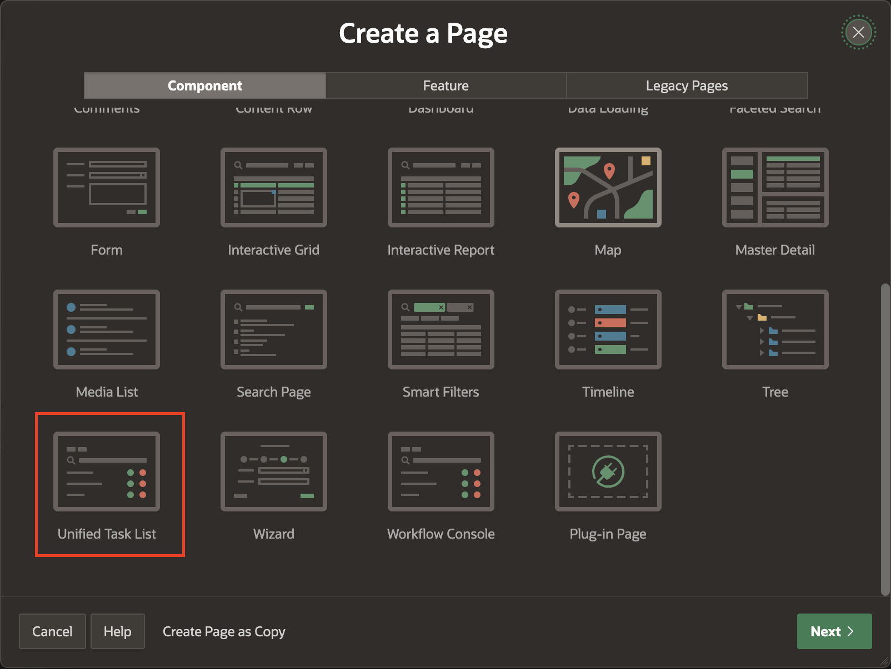

# Add Task Definition

## Introduction

Every approval management scenario needs its own kind of task. The kind of information that the task should carry, the users who will be approving the task are unique to every type of task. These configuration elements of a task are contained in a template known as the Task Definition.
In this lab, you learn to create a Task Definition to configure task parameters, participants, actions, and due dates for an expense request. Thereafter, you will create a form page to Submit an Expense request and add a Unified Task list page to see the submitted expense requests and the Approval list (approved or rejected) by the approver.

Estimated Time: 10 minutes

### Objectives

In this lab, you will:
- Create a Task Definition
- Create a Page to submit Expense
- Create Unified Task Lists

### Prerequisites

- Completion of workshop through Lab 1

## Task 1: Create a Task Definition

1. Navigate to **App Builder**.

   

2. Select **Expense Tracker** application.

   

3. Select **Shared Components**.

   

4. Under Workflows and Automations, Select **Task Definitions**.

   

5. Click **Create**.

   

6. Specify the task definition attributes and Click **Create**.

    - For Name: Enter **Expense Request**

    - For Type: Select **Approval Task**

    - For Subject: Enter **&EXPENSE\_TYPE. Expense request for &EMP\_NAME.**

    - For Priority : Select **2-High**

    

7. Under **Settings** Section:

    - For Task details Page Number - Click on **Create Task Details Page** button and Click **OK**

    

    

8. Click on the task definition - **Expense Request** to continue editing.

     

    Under Settings, Specify the following:

    - For Actions Source: Select **SQL Query**.

    - For Actions SQL query: Copy the code below and paste it into  the code editor:

    ```
    <copy>
    select e.empno, e.emp_name, m.emp_name as mgr_name from EMPLOYEE_DETAILS e, EMPLOYEE_DETAILS m
    where m.empno(+)=e.mgr and e.empno= :APEX$TASK_PK
    </copy>
    ```

    

9. Under **Deadline** Section, Enter the following:

    - For Due On Type: Select **Interval**

    - For Due On Interval: Enter **PT30M**

    - For Expiration Policy: Select **Expire**

    

10. **Under Participants** Section - Select Participants to assign additional people to the Task Definition.

    - Click Add Row.

    - For Participant Type: Select **Potential Owner**

    - For Value Type: Select **SQL Query**

    - For Value: Copy the code below and paste it into  the code editor

    ```
    <copy>
    select EMP_NAME from employee_details where EMPNO =(select MGR from employee_details where EMPNO=(select EMPNO from employee_details where EMP_NAME=:APP_USER))
    </copy>
    ```

    - Click **Apply Changes** to save all existing changes.

    

11. Click on the task definition - **Expense Request** to continue editing.

    

12. **Under Parameters** Section - Select Add Row and fill in the 4 parameter fields listed below:

     | Static ID |  Label  | Data Type
     | --- |  --- | --- |
     | ESTIMATED\_COST | Estimated Cost | String |
     | EXPENSE\_STATUS | Expense Status | String |
     | EXPENSE\_TYPE | Expense Type | String |
     | REQ\_ID | Req Id | String |

     - Click **Apply Changes**.

     

13. Click on the task definition - **Expense Request** to continue editing.

     

14. Under **Actions** Section, Click **Add Action** button

    Specify the following:

     - For Name: Enter **CREATE\_EXPENSE\_REPORT\_ENTRY**

     - For Type: Select Execute Code

     - On Event: Select Create

     - For Code: Copy the code below and paste it into  the code editor:

    ```
        <copy>
         declare
           l_req_id number;
        begin
          if :APP_USER = :EMP_NAME then --this is the original initiator
           l_req_id := :APEX$TASK_ID;
        -- create a new record in the Employee Expense Request table EMP_EXPENSE_REQUEST
        insert into EMP_EXPENSE_REQUEST values
        (to_number(l_req_id),
        :EMPNO,
        :EXPENSE_TYPE,
        :ESTIMATED_COST,
        '',
       'PENDING');
    end if;
    end;
    </copy>
    ```
     - Click **Create** to save Create Event Action.

      

      

15. To Add the next action, Click **Add Action** button.

    Specify the following:

     - Name: Enter **NEXT\_APPROVER\_OR\_UPDATE\_STATUS**

     - Type:  Select **Execute Code**

     - On Event: Select **Complete**

     - Outcome : Select **Approved**

     - For Code: Copy the code below and paste it into the code editor:

      ```
      <copy>
        declare
        l_mgr number;
        l_task_id number;
        l_request_id number;
        l_req_status varchar2(10) :='PENDING';
        Begin
           if :APP_USER = :MGR_NAME then --this is the first approver
       -- set the request id to be the id of the task created when the request was submitted
          l_request_id := :APEX$TASK_ID;
        else
       -- this is an intermediate approver. Set the request-id from the corresponding task parameter value
       l_request_id := :REQ_ID;
       end if;
       if  :ESTIMATED_COST < 50000 then -- the approval is complete

        update EMP_EXPENSE_REQUEST set status = 'APPROVED', updated_by=updated_by||'->'||:APP_USER
         where req_id = l_request_id and emp_no=:APEX$TASK_PK;

        l_req_status := 'APPROVED';
       else -- the request needs to go through another level of Approval
        -- updated the request record with details of the current approver in the chain of approvers
        update EMP_EXPENSE_REQUEST set updated_by = updated_by||'->'||:APEX$TASK_OWNER
         where req_id = l_request_id
           and emp_no=:APEX$TASK_PK;
       -- create a new task assigned to the manager of the current approver
        l_task_id := apex_approval.create_task(
            p_application_id => :APP_ID,
            p_task_def_static_id => 'EXPENSE_REQUEST',
            p_initiator => :EMP_NAME, -- ensure initiator is the original requestor and not the current task owner
            p_parameters => apex_approval.t_task_parameters(
                1 => apex_approval.t_task_parameter(static_id => 'EXPENSE_TYPE', string_value => :EXPENSE_TYPE),
                2 => apex_approval.t_task_parameter(static_id => 'ESTIMATED_COST', string_value => :ESTIMATED_COST),
                3 => apex_approval.t_task_parameter(static_id => 'REQ_ID',      string_value => l_request_id),
                4 => apex_approval.t_task_parameter(static_id => 'STATUS',      string_value => l_req_status)
             ),
            p_detail_pk => :APEX$TASK_PK
            );
            end if;
          end;
      </copy>
      ```

    - Click **Create** to add action.

       

       

16. Again, Click **Add Actions** button.

    Specify the following:

    - For Name: Enter **UPDATE\_REQUEST\_STATUS**

    - For Type: Select Execute Code

    - On Event: Select **Complete**

    - For Outcome: Select **Rejected**

    - For Code: Copy the code below and paste it into  the code editor:

    ```
    <copy>
      declare
        l_mgr number;
        l_task_id number;
        l_request_id number;
        l_req_status varchar2(10) := 'PENDING';
      begin
        select mgr into l_mgr from employee_details where emp_name=:APP_USER;
      if :APP_USER = :MGR_NAME then --this is the first approver
        l_request_id := :APEX$TASK_ID;
      else
        l_request_id := :REQ_ID;
      end if;-- the request is complete and rejected.
      update EMP_EXPENSE_REQUEST set status = 'REJECTED', updated_by=updated_by||'->'||:APP_USER
      where req_id = l_request_id and emp_no=:APEX$TASK_PK;
      end;
    </copy>
    ```

    - Click **Create** and **Apply Changes**

     

     

     


## Task 2: Create a Page to Submit Expense
Add a page to Submit an Expense request.

1. Click **Application ID**.

   

2. Click **Create Page**.

    

3. Select **Blank page** under component.

    

4. Specify Blank Page Attributes.

   Under **Page Definition** Section:

    - For Page Number: Enter **3**

    - For Name: Enter **Apply for Expense**

   Under **Navigation** Section:

    - For Breadcrumb Parent Entry: Select **Home(Page 1)**

   Click **Create Page**.

   

5. In the left pane, select the Rendering tab. Right-click **Body**, select **Create Region**.

   

6. In the Property Editor, edit the appropriate attributes:

   Under **Identification** section:

    - For Title: Enter **New Expense Request**

    - For Type: Select **Form**

   Under **Source** section:

    - For Type: Select **SQL Query**

    - For SQL query: Copy the code below and paste it into the code editor:

    ```
     <copy>
    Select e.empno, e.emp_name, m.emp_name as mgr_name
      from EMPLOYEE_DETAILS e , EMPLOYEE_DETAILS m
     where m.empno(+) = e.mgr
      and e.empno = :P3_EMPNO;
    </copy>
    ```
    

7. Now, right-click the region (**New Expense Request**) and select **Create Page Item**.

  

     - For Name: Enter **P3\_EXPENSE\_TYPE**

     - For Type: Select, **Select List**

    Under **List of Values** section:

     - For Type: Select **Static values**

     - For Static Values: Enter below list and click **OK**

    | Display Value |  Return Value  |
    | --- |  --- |
    | Internet/Broadband Charges | Internet/Broadband Charges |
    | Accommodation | Accommodation |
    | Conference | Conference |
    | Misc. Expenses | Misc. Expenses |

     - For Null Display Value: Enter **--Select Expense Type--**

   

8. Right-click region (**New Expense Request**) and Select **Create Page Item**.

     - For Name: Enter **P3\_ESTIMATED\_COST**

     - For Type: Select **Number Field**

    

    

9. Select the **P3\_EMPNO** page item and enable the primary key under **Source** section and click **Save** to apply changes.

    

10. On the Rendering tab, under Pre-Rendering, right-click **Before Header** and click **Create Process**.

    

    In the Property Editor, enter the following:

     - For Name: **Fetch Employee Details for User**

     - For Type: **Execute code**

     - For PL/SQL Code: Enter the following PL/SQL code:

        ```
        <copy>
         select empno into :P3_EMPNO from employee_details where emp_name=:APP_USER;
        </copy>
        ```
     - Sequence: Enter '1'

    

11. Click **Save**.

12. Now add a process on the **Processing tab** to submit a request. Right-click Processing and click **Create Process**.

    

    In the Property Editor, enter the following:

      - For Name: Enter **Submit Expense request**

      - For Type: Select **Human Task - Create**

    Under **Settings** Section:

      - For Definition: Select **Expense request**

      - For Details Primary key Element: Select **P3\_EMPNO**

      - For Success Message: Type **Expense Request submitted successfully**

    

13. Under Parameters for Submit Expense request process:

    a) For  Estimated Cost, enter the following:

       - For Type: Select ITEM

       - For Value: Select **P3\_ESTIMATED\_COST**

    

    b) For  Expense Status, enter the following:

       - For Type: Select Static Value

       - For Value: Type **PENDING**

     

    c) For  Expense Type, enter the following:

       - For Type: Select ITEM

       - For Value: Select **P3\_EXPENSE\_TYPE**

     

    d) For  Request ID, enter the following:

       - For Type: Select NULL

    

14. Click **Save**

15. On Rendering tab, Right-click **New Expense Request** Region and select **Create Button**.

    

    In the Property Editor, enter the following:

       - For Button Name: Enter **SUBMIT_REQUEST**

       - For Position: Select **Edit**

       - For Hot: **Enable**

    

16. Navigate to Processing tab, Select Process **Submit Expense Request**.

    Under **Server-Side Condition** Section:

       - For When Button Pressed: Select **SUBMIT_REQUEST**

    

17. Click **Save**.

## Task 3: Create Unified Task Lists
Add a Unified Task list page to see the submitted expense request list by a requestor and the Approval list approved or rejected by the approver.

1. Click Application ID on the right-above corner of the page designer. Application Home page appears.

  

2. Click **Create Page**.

   

3. Under Components, Select Unified Task List.

   

4. Specify the following page attributes:

     - For Page Number: Enter **4**

     - For Name: Enter **My Approvals**

     - For Report Context: Select **My Tasks**

    Click **Create Page**.

    

5. To create another Unified Task list page, Again, Click Application ID on the right-above corner of the page designer.

    

6. Click **Create Page**.

    

7. Under Components, Select **Unified Task List**.

    

8. Specify the following page attributes:

     - For Page Number: Enter **6**

     - For Name: Enter **My Expense Requests**

     - For Report Context: Select **Initiated by Me**

    Click **Create Page**.

    


## Summary
You now know how to create a task definition, create a page to submit an expense and create Unified Task Lists.

You may now **proceed to the next lab**.   

## Acknowledgments
- **Author** - Ankita Beri, Product Manager
- **Contributor** - Roopesh Thokala, Senior Product Manager
- **Last Updated By/Date** - Ankita Beri, Product Manager, November 2023
