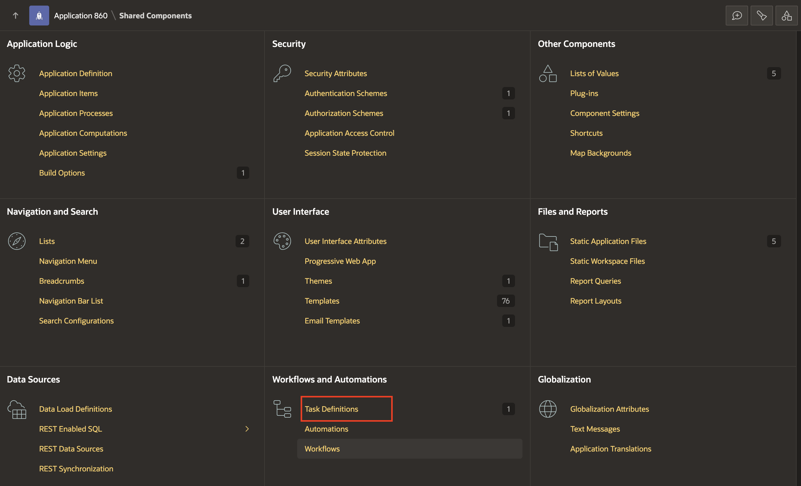
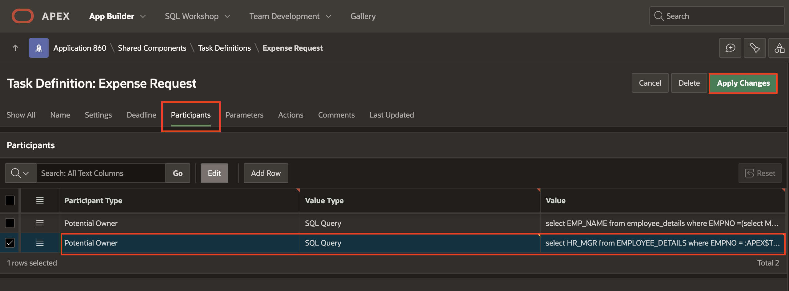
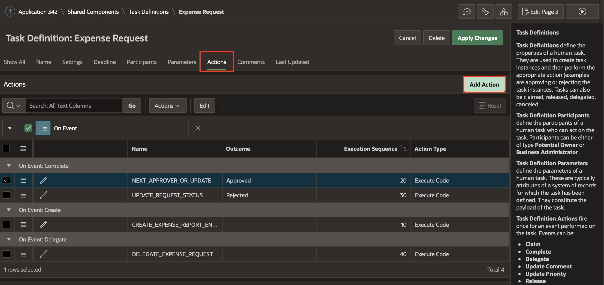
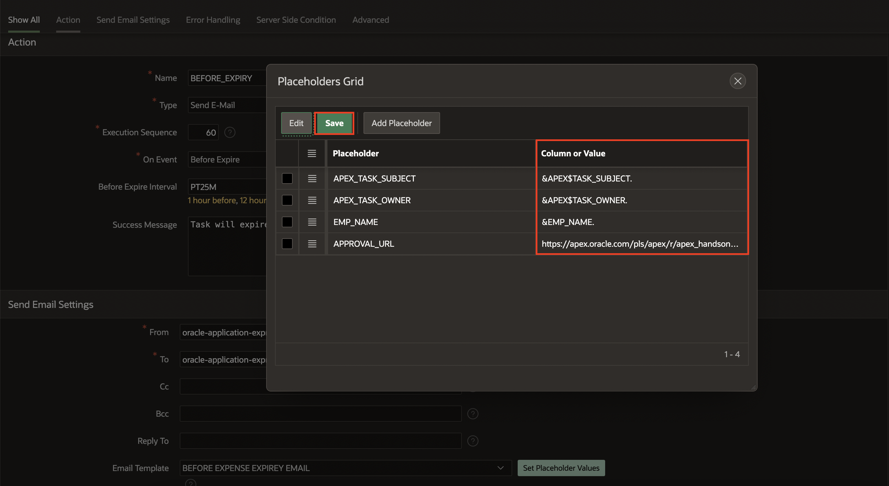
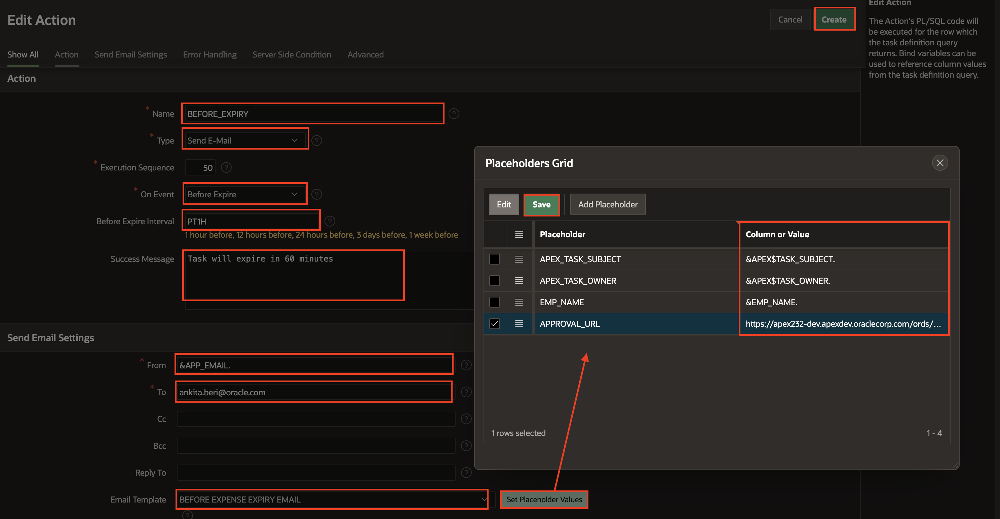

# Delegate Expense Request

## Introduction

In this lab, you add a new column (HR Manager) in the employee details table and insert two new employees (Sophie and Robin) as HR managers. Next, we will update the task definition and add further actions for requesting more information and delegating the request to the potential owner.

Estimated Time: 10 minutes

### Objectives

In this lab, you will:
- Update Table Employee Details
- Update Task Definition
- Add Deadline and Expiration for an Expense Request

## Task 1: Update Table Employee Details

1. Navigate to SQL Workshop and click SQL Commands

2. Copy and Paste the commands below into the Script Editor to update the Employee Details Table and Execute the command one by one.

   Note: The steps to create and populate the table EMPLOYEE\_DETAILS are shared in TASK 2. Ensure that you have that table created and populated before running the commands below.

   Add a new column HR\_MGR (HR Manager) to the existing Employee table EMPLOYEE\_DETAILS and update the existing Employee records as shown below:
    ```
    <copy>
    insert into EMPLOYEE_DETAILS(empno, emp_name) values (50, 'SOPHIE');

    insert into EMPLOYEE_DETAILS(empno, emp_name) values (60, 'ROBIN');

    Alter table "EMPLOYEE_DETAILS" add "HR_MGR" VARCHAR2(10);

    Update EMPLOYEE_DETAILS set HR_MGR = 'SOPHIE' where EMPNO in  (10,20);

    Update EMPLOYEE_DETAILS set HR_MGR = 'ROBIN' where EMPNO in  (30,40);
    </copy>
    ```

    

    NOTE: Don't forget to create 2 Users, SOPHIE and ROBIN, using the  Manage Users And Groups menu option under Workspace Administration as done in TASK 6.

## Task 2: Update Task Definition
We will further extend the Expense Tracker Application to see how tasks could be assigned to multiple potential owners and then explore possible actions(Request Information / Delegate / Release) that these potential owners perform on the task.

1. Navigate to App Builder, Select Expense Tracker application. Click Shared Components→ Workflows and Automations→ Task Definitions and select the Expense Request Task Definition.

    

    

2. Under **Actions** - Edit **NEXT\_APPROVER\_OR\_UPDATE\_STATUS**

    Copy the code below and replace it into the code editor:

    ```
    <copy>
    declare
    l_mgr number;
    l_task_id number;
    l_request_id number;
    l_req_status varchar2(10) :='PENDING';
    begin
       select mgr into l_mgr from employee_details where emp_name=:APP_USER;
    if :APP_USER = :MGR_NAME then --this is the first approver
       -- set the request id to be the id of the task created when the request was submitted
       l_request_id := :APEX$TASK_ID;
    else
       -- this is an intermediate approver, set the request id from the corresponding task parameter value
       l_request_id := :REQ_ID;
    end if;
    if l_mgr is null or :ESTIMATED_COST < 50000 then -- the approval is complete

        update EMP_EXPENSE_REQUEST set status = 'APPROVED', updated_by=updated_by||'->'||:APP_USER
         where req_id = l_request_id and emp_no=:APEX$TASK_PK;
         l_req_status := 'APPROVED';
    else -- the request needs to go through another level of approval
        -- updated the request record with details of the current approver in the chain of approvers
        update EMP_EXPENSE_REQUEST set updated_by = updated_by||'->'||:APEX$TASK_OWNER
         where req_id = l_request_id
           and emp_no=:APEX$TASK_PK;
        -- create a new task assigned to the manager of the current approver
        l_task_id := apex_approval.create_task(
            p_application_id => :APP_ID,
            p_task_def_static_id => 'EXPENSE_REQUEST',
            p_initiator => :EMP_NAME, -- ensure initiator is the original requestor and not the current task owner
            p_parameters => apex_approval.t_task_parameters(
                1 => apex_approval.t_task_parameter(static_id => 'EXPENSE_TYPE', string_value => :EXPENSE_TYPE),
                2 => apex_approval.t_task_parameter(static_id => 'ESTIMATED_COST', string_value => :ESTIMATED_COST),
                3 => apex_approval.t_task_parameter(static_id => 'REQ_ID',      string_value => l_request_id),
                4 => apex_approval.t_task_parameter(static_id => 'STATUS',      string_value => l_req_status)
        ),
        p_detail_pk => :APEX$TASK_PK
    );
    end if;
    end;
    </copy>
    ```
    Click **Apply Changes**

3. **Under Participants** Section - Click Add Row

    - For Participant Type - Select Potential Owner

    - For Value Type - Select SQL Query

    - For Value -  Copy the code below and  paste it into the code editor:

    ```
    <copy>
    select HR_MGR from EMPLOYEE_DETAILS where EMPNO = :APEX$TASK_PK
    </copy>
    ```
    

    

    Click **Apply Changes** to save the updated Participants.

    Note :Adding the new Participant entry implies that for each employee, the approver of the Expense is either the manager he/she reports to or his/her HR Manager. In this example, if Clara was applying for an expense, the task could be approved by either her manager Jane or her HR Manager Sophie.

4. We now essentially have a scenario where there can be more than one potential owner of an expense request task. This will help us to demonstrate the operations like Claim, Release, and Delegate that can be performed on tasks with  >1 potential owner(s).

    Under **Actions** Section: Click **Add Actions**

    - For Name - Enter **DELEGATE\_EXPENSE\_REQUEST**

    - For Type - Select Execute Code

    - On Event - Select Delegate

    - For Success Message - Enter **Request Delegated Successfully**

    - For Code: Copy the code below and paste it into  the code editor:

    ```
    <copy>
    begin
    apex_approval.add_to_history ('Request Delegated by '|| :APEX$TASK_OWNER);
    end;
    </copy>
    ```
    - Click **Create** to add action.

    

    

5. Again click **Add Actions** to request information.

    - For Name - Enter **REQUEST\_MORE\_INFO**

    - For Type - Select Execute Code

    - On Event - Select **Request Information**

    - For Success Message - Enter **Information Requested Successfully**

    - For Code: Copy the code below and paste it into  the code editor:
    ```
    <copy>
    begin
    apex_approval.add_to_history ('Information Requested From '|| :APEX$TASK_OWNER);
    end;
    </copy>
    ```
    - Click **Create** to add action.

  

  

## Task 3: Add Deadline and Expiration for an Expense Request
Add deadline and expiration events in actions for expense requests.

Navigate to App Builder, Select Expense Tracker application. Click Shared Components→ Workflows and Automations→ Task Definitions and select the Expense Request Task Definition.

1. Under **Deadline** Section:

    - For Due on type - Select interval

    - For Due on the interval - Type PT30M

    - For Expiration Policy - Select Expire

    Click **Apply Changes**

    

    

2. Select **Expense Request**

   Under the **Actions** Section - click **Add Actions**

   Specify the following attributes:

    - For Name - Enter **BEFORE\_EXPIRY**

    - For Type - Select Send Email

    - On Event - Select **Before Expire**

    - For Before Expire Interval - Enter **PT25M**

    - For Success Message - Enter **Task will expire in 5 minutes**

   Under **Send Email Settings** Section:

    - For From - Enter the Email address of your wish

    - For To - Enter the Email address of your wish

    - For Email Template - Select **BEFORE EXPENSE EXPIRY EMAIL**

    - For Subject - Enter

    

    

3. Click the **Set Placeholder Values** button beside the email template.

   Add a Column or Value for mentioned Placeholders and Click **Save** to add placeholders.

   | Placeholder|  Column or Value  |
   | --- |  --- |
   | APEX\_TASK\_SUBJECT | &APEX$TASK\_SUBJECT. |
   | APEX\_TASK\_OWNER | &APEX$TASK\_OWNER. |
   | EMP\_NAME | &EMP_NAME. |
   | APPROVAL\_URL | Paste the Login URL of your Expense Tracker Application |

   

4. Click **Create** to save an action.

   

5. To add Expire event, click on **Add Actions** and specify the following attributes:

    - For Name - Enter **TASK_EXPIRED**

    - For Type - Select Execute Code

    - For Execution Sequence - 70

    - On Event - Select **Expire**

    - For Success Message - Enter 'Task Expired Successfully'

    - For Code: Copy the code below and paste it into  the code editor:

    ```
    <copy>
    begin
    apex_approval.add_to_history( 'Task ' || :APEX$TASK_SUBJECT || ' Expired');
    end;
    </copy>
    ```
    - Click **Create** to add action.

  

  Note: In order to expire a task manually. Create a button on a region on any unified task list page and a process under the processing tab with the below PLSQL code:

    ```
    <copy>
    BEGIN
    apex_approval.handle_task_deadlines;
    END;
    </copy>
    ```
   

## **Summary**
You now know how to update table, add potential owners to delegate and request more information while applying for an request.


## Acknowledgments
- **Author** - Ankita Beri, Product Manager
- **Contributor** - Roopesh Thokala, Senior Product Manager
- **Last Updated By/Date** - Ankita Beri, Product Manager, June 2023   
