# Implement Custom Component

## Introduction

**Oracle Digital Assistant** allows you to build integrations with backend services by creating **Custom Components**.

Custom Components are a bridge between **Skills** on Oracle Digital Assistant and the **Services** where information can be fetched.

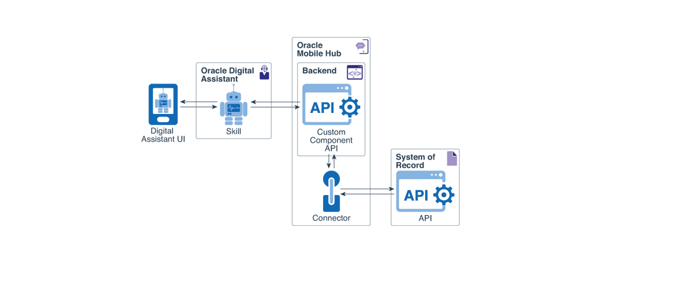

Custom components allow you as well to plug-in custom code logic into a bot conversation.

That is exactly what we are going to build.

**Custom Components** are developed using **Node.js**. They are just a REST **API** that offer an endpoint to **Skills** bots to `GET` and `POST` actions.

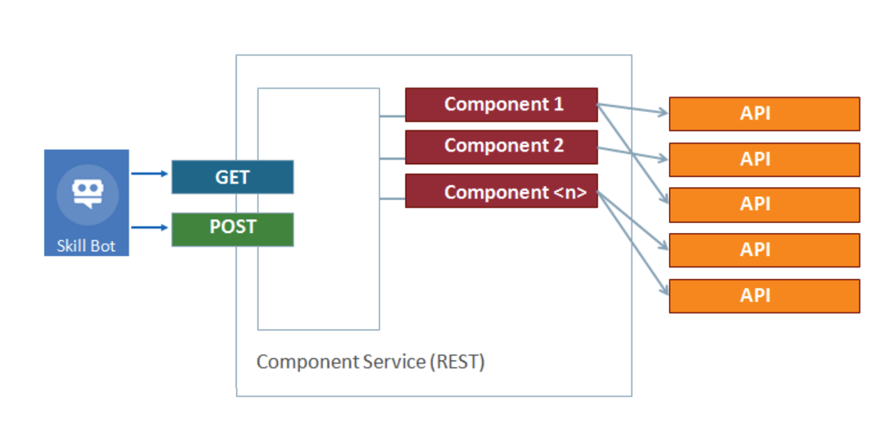

You can package related **Custom Components** together.

Estimated Lab Time: 20 minutes.


## Task 1: Create a Custom Component to integrate with backend services

Oracle provides **Oracle Bots Node.js SDK**, a free utility that makes custom components development very easy.

> We had explained the installation steps in the Pre-requisites section at the very beginning of this workshop.

Ready to create your **Custom Component** scaffolding.

To avoid installing tools on your local computer, we are going to use Cloud Shell. Cloud Shell is a small and free Linux virtual machine with a lot of DevOps tools preinstalled that **Oracle Cloud** offers.

1. Click on the **Cloud Shell** icon on the top-right menu bar from the Oracle Cloud Dashboard.
    
    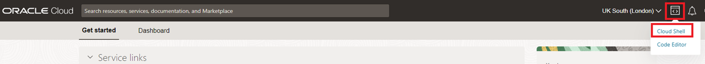

    It will provision this small virtual machine, and you will have access to its terminal from the **Oracle Cloud Shell**.

    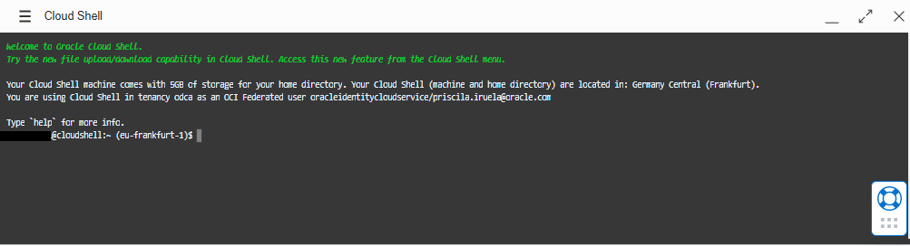

2. **Execute** the following command:

    ```
    <copy>npx @oracle/bots-node-sdk init tasks-cc --component-name tasks</copy>
    ```

    Where `tasks-cc` is the name of the custom component module. And `tasks` is the name of our first custom component implementation.

    > NOTE: If you get the message: `Ok to proceed? (y)`. Type **y** to continue.

3. The **result** should look like this:

    ```bash
    ---------------------------------------------------------------------
    Custom Component package 'tasks-cc' created successfully!
    ---------------------------------------------------------------------

    Usage:

      cd tasks-cc
      npm start    Start a dev server with the component package
    ```
    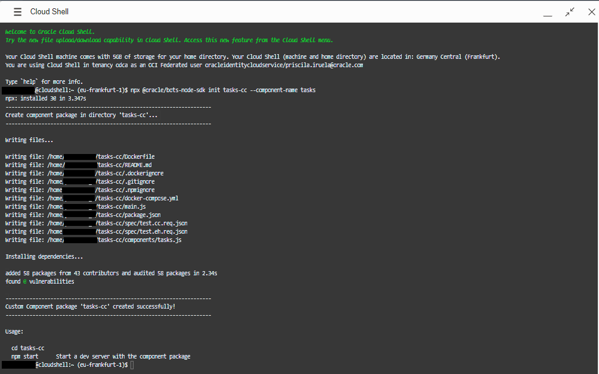

    > NOTE:
    >
    > A new folder `tasks-cc` was created with this hierarchy inside:
    >
    >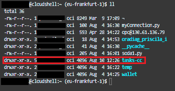
    

4. **Change directory** to `tasks-cc` on the Command Prompt:

    ```
    <copy>cd tasks-cc</copy>
    ```
    > Note you have a `package.json` file and a `components` folder with a  file `tasks.js` inside.
    >
    >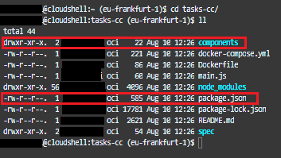

5. Edit the file `package.json` in `tasks-cc` folder. You can use vi or vim to edit files. [Here](http://www.yolinux.com/TUTORIALS/LinuxTutorialAdvanced_vi.html) you have a good link to learn how to use it.
We cannot cover the use of vi but we will share the commands needed to change the files.
    
    ```
    <copy>vi package.json</copy>
    ```
    

6. We have to **change the name** of the package from the generic `my-component-service` to something more personalized like `tasks-cc`. Check line number 2:

    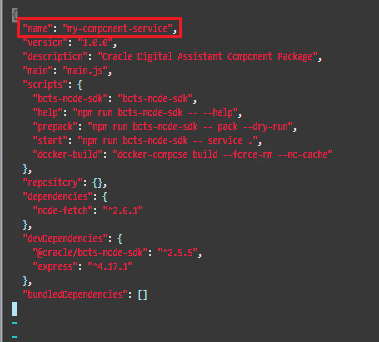
    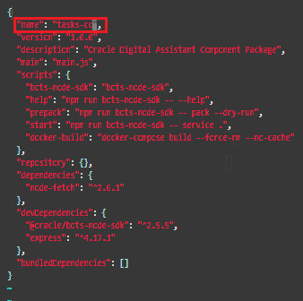
    
    For editing the file type `i` and edit the content. For saving and closing the file type `:x`. Click `esc` every time that you want to execute a command in vi. **Good luck!**
    
    Be sure you have saved the changes, open the file few time to be sure.

    Great, we are now ready to **change the code** of our **custom component implementation**.

7. **Open** the file `tasks.js` with your favorite text editor. You can find this file in the **components folder**.
    
    ```
    <copy>cd components</copy>
    ```
    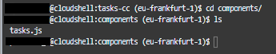

8. **Edit** the file `tasks.js`. **Remove** the whole content and **replace** it with the following source code or download it from <a href="./files/tasks.js" target="\_blank">here</a>.

    ```
    <copy>vi tasks.js</copy>
    ```
    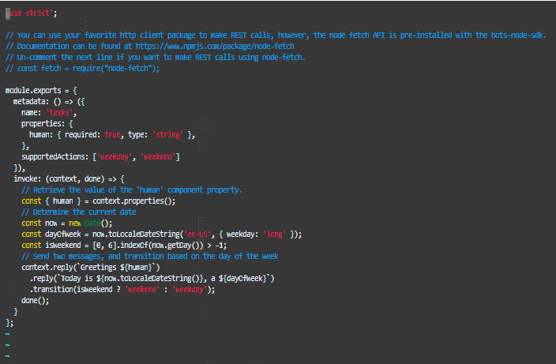

    For editing the file type `i` and edit the content. For saving and closing the file type `:x`. For removing full lines use `dd`. Click `esc` every time that you want to execute a command in vi. **Good luck!**

    **IMPORTANT**: **Remember** to change the `URL_COPIED_FROM_APEX` with the **URL** copied on **APEX** in **Lab 2**.

    ```
    <copy>"use strict";

    const fetch = require("node-fetch");

    const ordsURL = "URL_COPIED_FROM_APEX";

    function getTasks(urlRequest, logger, callback) {
    logger.info(urlRequest);
    fetch(urlRequest)
        .then((res) => {
        if (!res.ok) {
            const errorMessage = `Invalid status ${res.status}`;
            logger.error(errorMessage);
            callback(errorMessage);
            throw new Error(errorMessage);
        }
        return res.json();
        })
        .then((body) => {
        callback(null, body.items);
        })
        .catch((err) => {
        logger.error(err.message);
        callback(err.message);
        });
    }

    module.exports = {
        metadata: () => ({
            name: "com.example.tasks",
            supportedActions: ["success", "failure"],
        }),
        invoke: (conversation, done) => {
            getTasks(ordsURL, conversation.logger(), (err, data) => {
            if (err) {
                conversation.transition("failure");
                done();
                return;
            }
            const tasks = data.map((task) => task.text);
            conversation.reply(tasks.join("\n")).transition("success");
            done();
            });
        },
    };</copy>
    ```

    

    It should look like this:

    ```javascript
    const ordsURL =
        "https://xxx-yyy.adb.region.oraclecloudapps.com/ords/tasks/oda/tasks/";
    ```
    
    The result of the file after applying changes, should look like this:
    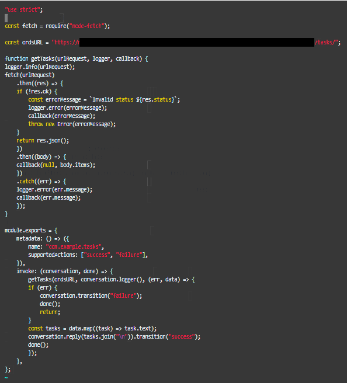

    Don't forget the **save** tasks.js file using `:x`.

## Task 2: Deploy the custom component

**Custom Components** can be deployed in different ways:

- **Local Component Container**: single instance deployment as custom component resides in skill bot
- **Mobile Hub**: multi-channel environment with mobile extras and shared instance deployment
- **Node Container**: shared instance but no need for mobile extras

1. We are going to **install** our custom component **locally** as a **component container**. Very simple, we need to pack our code in a single file that contains everything using **Cloud Shell**.

    **Be sure** you are on task-cc folder. For checking that use the follow command:

    ```
    <copy>pwd</copy>
    ```
    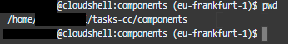

    If you are still on **components** as I am. Just type:

    ```
    <copy>cd ..</copy>
    ``` 

    And check where you are now, using again:
    ```
    <copy>pwd</copy>
    ```
    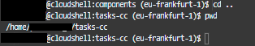

2. Package your **Custom Component** by running on your Command Prompt:

    ```
    <copy>npm pack</copy>
    ```

    The **output** looks like this:

    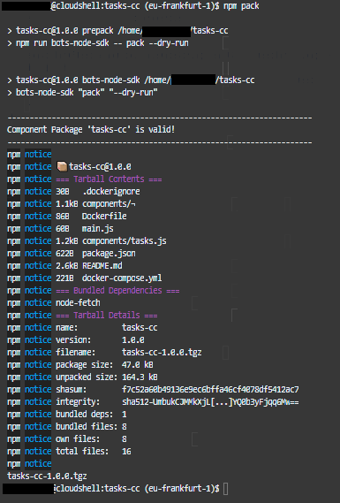

3. There will be a new file in your `tasks-cc` folder called `tasks-cc-1.0.0.tgz`.

    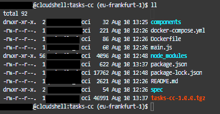

    We need to download the tgz file locally. We will use this file on the final Lab of this workshop.

4. Click the hamburguer menu in cloud shell.

    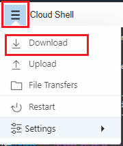

5. Type the **filename** that we want to download,**tasks-cc-1.0.0.tgz**. Click **Download**.
    
    ```
    <copy>tasks-cc/tasks-cc-1.0.0.tgz</copy>
    ```
    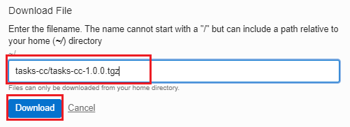

6. Your file will be download in your Downloads folder. Check that the file has been downloaded completly.

    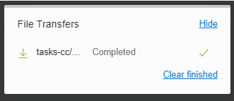

    
*Congratulations! You are ready to go to the next lab!*

## **Acknowledgements**

- **Author** - Victor Martin - Technology Product Strategy Manager, Priscila Iruela - Technology Product Strategy Director
- **Contributors** - Melanie Ashworth-March
- **Last Updated By/Date** - Priscila Iruela, June 2022