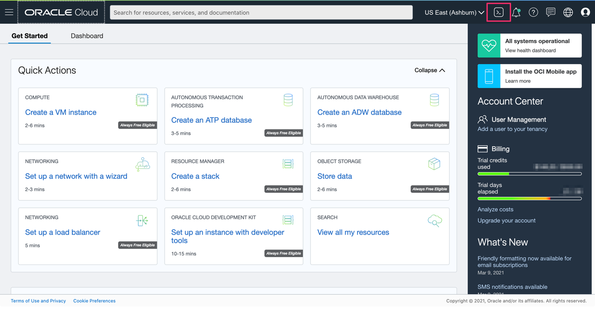
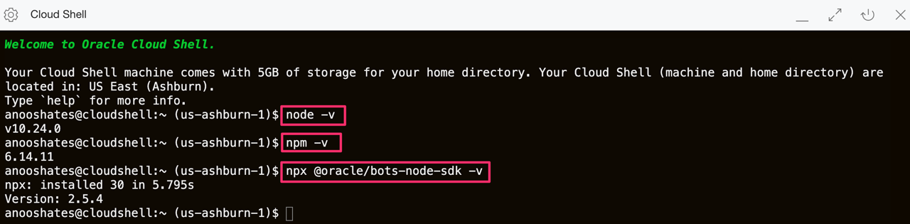
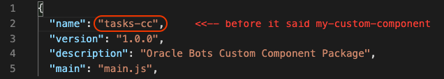
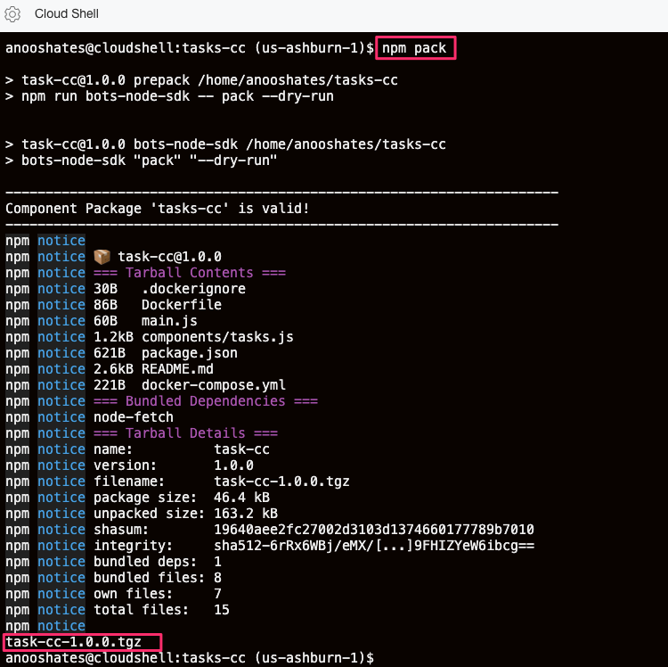
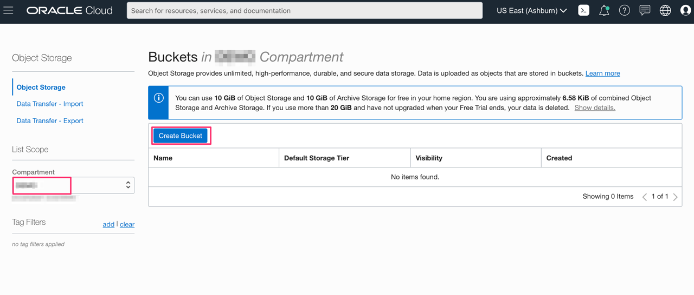
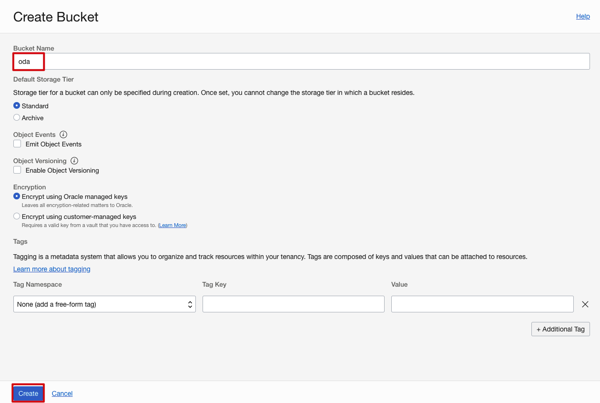
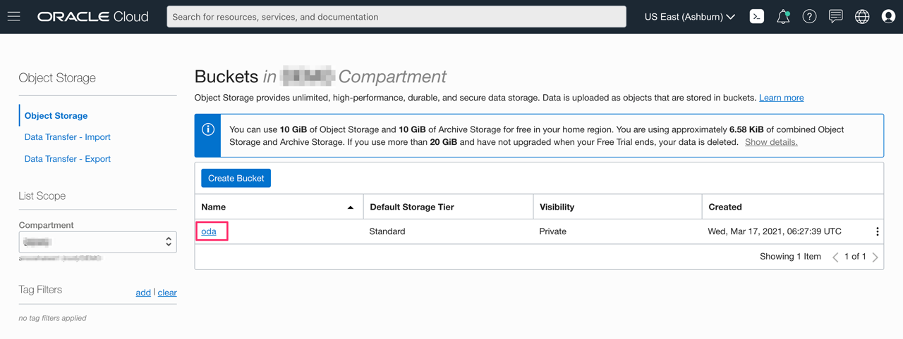
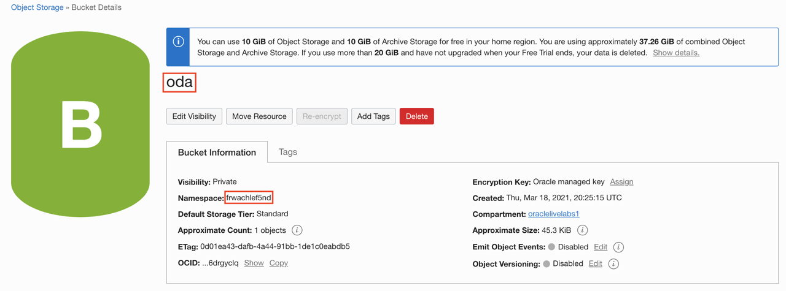
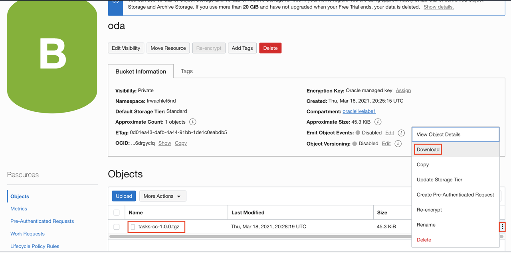

# Implement Custom Component

## Introduction

**Oracle Digital Assistant** allows you to build integrations with backend services by creating **Custom Components**.

Custom Components are a bridge between **Skills** on Oracle Digital Assistant and the **Services** where information can be fetched.


Custom components allow you as well to plug-in custom code logic into a bot conversation.

That is exactly what we are going to build.

**Custom Components** are developed using **Node.js**. They are just a REST **API** that offer an endpoint to **Skills** bots to `GET` and `POST` actions.


You can package related **Custom Components** together.

Estimated Lab Time: 20 minutes

Watch the video below for an overview of the Implement Custom Component lab
[](youtube:O60fHyRYzcg)

### Objectives

In this lab, you will:
- Verify if Node.js is installed on cloud shell
- Create a custom component to integrate with backend services
- Deploy the custom component

### Prerequisites

- This lab assumes you have created the application and enabled the REST API

## Task 1: Verify if Node.js installed

In order to walk through this lab you need to develop the integration with **REST API**. You need [Node.js](https://nodejs.org/en/) for that.

Node.js is an asynchronous event-driven JavaScript runtime. **Node.js** is designed to build scalable network applications.

1. On the Oracle Cloud console, click on the cloud shell icon to open the Oracle cloud shell.

    

2. Run the following commands to verify if Node.js is installed on the Oracle cloud shell virtual machine.

    ```
    <copy>node -v</copy>
    ```

    ```
    <copy>npm -v</copy>
    ```

    ```
    <copy>npx @oracle/bots-node-sdk -v</copy>
    ```

    


## Task 2: Create a Custom Component to integrate with backend services

Oracle provides **Oracle Bots Node.js SDK**, a free utility that makes custom components development very easy.

Ready to create your **Custom Component** scaffolding.

1. Open a **terminal** and type:

    ```
    <copy>npx @oracle/bots-node-sdk init tasks-cc --component-name tasks</copy>
    ```

    Where `tasks-cc` is the name of the custom component module. And `tasks` is the name of our first custom component implementation.

2. The **result** should look like this:

    ```bash
    ---------------------------------------------------------------------
    Custom Component package 'tasks-cc' created successfully!
    ---------------------------------------------------------------------

    Usage:

      cd tasks-cc
      npm start    Start a dev server with the component package
    ```

    Executing that command created a new folder `tasks-cc` with a hierarchy that has a `package.json` file and a `components` folder with a file `tasks.js` inside.

3. **Change directory** to `tasks-cc` on the Command Prompt or Terminal:

    ```
    <copy>cd tasks-cc</copy>
    ```

    This custom component is going to make REST API calls to fetch information from APEX. To do so, we need to install an extra library called [node-fetch](https://www.npmjs.com/package/node-fetch).

4. Install the library with the following command:

    ```
    <copy>npm install node-fetch</copy>
    ```

5. Edit the file `package.json` in `tasks-cc` folder. You can use your favorite text editor.

    ```
    <copy>vi package.json</copy>
    ```

6. We have to **change the name** of the package from the generic `my-custom-component` to something more personalized like `tasks-cc`. Check line number 2:

    

7. **Save** the file with the changes.

    Great, we are now ready to **change the code** of our **custom component implementation**.

8. **Open** the file `tasks.js` with your favorite text editor. You can find this file in the **components folder**.

    ```
    <copy>vi components/tasks.js</copy>
    ```

9. **Edit** the file `tasks.js` and **replace** the whole content with the following code or download it from <a href="./files/tasks.js" target="\_blank">here</a> to download the customer component source code.

    **IMPORTANT**: **Remember** to change the `URL_COPIED_FROM_APEX` in line 5 with the **URL** copied on **APEX** in **Lab 2**.

    ```
    <copy>"use strict";

    const fetch = require("node-fetch");

    const ordsURL = "URL_COPIED_FROM_APEX";

    function getTasks(urlRequest, logger, callback) {
    logger.info(urlRequest);
    fetch(urlRequest)
        .then((res) => {
        if (!res.ok) {
            const errorMessage = `Invalid status ${res.status}`;
            logger.error(errorMessage);
            callback(errorMessage);
            throw new Error(errorMessage);
        }
        return res.json();
        })
        .then((body) => {
        callback(null, body.items);
        })
        .catch((err) => {
        logger.error(err.message);
        callback(err.message);
        });
    }

    module.exports = {
        metadata: () => ({
            name: "com.example.tasks",
            supportedActions: ["success", "failure"],
        }),
        invoke: (conversation, done) => {
            getTasks(ordsURL, conversation.logger(), (err, data) => {
            if (err) {
                conversation.transition("failure");
                done();
                return;
            }
            const tasks = data.map((task) => task.text);
            conversation.reply(tasks.join("\n")).transition("success");
            done();
            });
        },
    };</copy>
    ```

    

    It should look like this:

    ```javascript
    const ordsURL =
        "https://xxx-yyy.adb.region.oraclecloudapps.com/ords/tasks/oda/tasks/";
    ```

10. Don't forget the **save** tasks.js file.

## Task 3: Deploy the custom component

**Custom Components** can be deployed in different ways:

- **Local Component Container**: single instance deployment as custom component resides in skill bot
- **Mobile Hub**: multi-channel environment with mobile extras and shared instance deployment
- **Node Container**: shared instance but no need for mobile extras

1. We are going to **install** our custom component **locally** as a **component container**. Very simple, we need to pack our code in a single file that contains everything:

    Package your **Custom Component** by running on your Command Prompt or Terminal:

    ```
    <copy>npm pack</copy>
    ```

2. The **output** looks like this:

    

    There will be a new file in your `tasks-cc` folder called `tasks-cc-1.0.0.tgz`.

## Task 4: Upload the file to Object Storage

1. Click the **Navigation Menu** in the upper left, navigate to **Storage**, and select **Buckets**.

	

2. Choose right **Compartment** from the compartment drop-down and click on **Create Bucket**.

    

3. Name your bucket - **oda** and click **Create**

    

4. Once the bucket is created, click on the **oda** bucket.

    

5. Make note of your bucket name and namespace.

    

6. In the below command, replace the `namespace` and `bucket-name` with the namespace and the bucket name details copied earlier.

    Run the command in `tasks-cc` folder in Oracle cloud shell to upload the `tasks-cc-1.0.0.tgz` file to your bucket in object storage.

    ```
    <copy>oci os object put -ns namespace -bn bucket-name --file tasks-cc-1.0.0.tgz</copy>
    ```

    

7. Navigate back to your bucket to view the uploaded object - `tasks-cc-1.0.0.tgz`.

    Click on ellipse on the right corner of the object and click **Download** to download the object on to your machine.

    

You may now [proceed to the next lab](#next).

## Acknowledgements

- **Author** - Victor Martin - Principal Cloud Engineer | Priscila Iruela - Database Business Development
- **Contributors** - Melanie Ashworth-March
- **Last Updated By/Date** - Anoosha Pilli, March 2021
