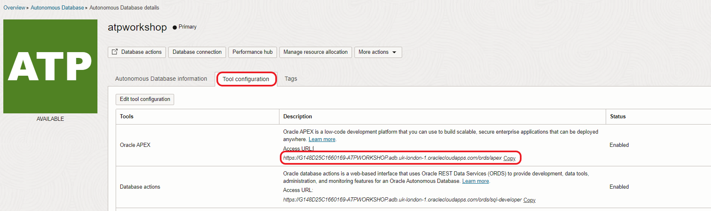

# Create Application and REST API


## Introduction

As part of **Autonomous Database** you have **Oracle Application Express (APEX)** available.

APEX is a low-code development platform that enables you to build scalable, secure enterprise apps, with world-class features, that can be deployed anywhere.

Using APEX, developers can quickly develop and deploy compelling apps that solve real problems and provide immediate value. You won't need to be an expert in a vast array of technologies to deliver sophisticated solutions. Focus on solving the problem and let APEX take care of the rest.

Each Autonomous Database instance includes **Oracle REST Data Services (ORDS)** and **Simple Object Data Access (SODA)** that provides HTTPS interfaces for working with the contents of your Oracle Database in REST enabled schemas.


In this workshop you will create a `tasks` table, REST enabling it, and make the service available for the Custom Component. Normally, you would REST enable database objects in a remote database schema, and then utilize those REST endpoints to define Web Source modules in an application, where APEX is installed, within the local database, as outlined below.


Estimated Lab Time: 15 minutes.

Watch the video below for an overview of the Create Application and REST API lab
[](youtube:3C-MJ6NvjnE)

### Objectives

In this lab, you will:
- Create APEX workspace
- Create a table with Quick SQL
- Insert rows into the table
- REST enabling the database object

### Prerequisites

- This lab assumes you have provisioned your ATP

## Task 1: Create APEX Workspace

1. In this part of the workshop we are creating an APEX workspace. From the Autonomous Database Home page go to **Tools** section and select **Oracle Application Express** area.

    

2. This will open a new browser tab for Application Express Administration. Login as the Admin user, with the **Admin** password you specified at Autonomous Database creation time.

    

3. Create the workshop Workspace on the "Welcome to Oracle Application Express!" page, select **Create Workspace**.

    

    Use the following information to fill out the form:

    - **Database User**:
        ```
        <copy>ATP&#95;ODA</copy>
        ```
    - **Password**: Any password that meets the Oracle Cloud requirements.
    - **Workspace Name**:
        ```
        <copy>ATP&#95;ODA</copy>
        ```

4. Select **Create Workspace**.

    

    You will be returned to the Oracle APEX administration page, and a message will be displayed "**Workspace Created**".

5. Sign in as the **ATP&#95;ODA** user by selecting the icon on the centre of the screen where you can see the name of the user, **ATP&#95;ODA**.

    

6. Fill the following details: **Name of the workspace**, **User name**, **Password** and click **Sign in**.

    - **Name of the workspace**: 
        ```
        <copy>ATP&#95;ODA</copy>
        ```
    - **User Name**:
        ```
        <copy>ATP&#95;ODA</copy>
        ```
    - **Password**: Any password that meets the Oracle Cloud requirements.

    

    Now we are ready to create your APEX application on this workspace.

    You can check that you are correctly signed in with the **ATP&#95;ODA** user in the right top corner.

    

## Task 2: Create a Table with Quick SQL

Quick SQL reduces the time and effort required to create SQL tables, triggers, and index structures.

It is not designed to be a replacement for data modeling. Quick SQL is simply a quick way to develop a script for simple tables and views.

Once the SQL is generated it can be tweaked and expanded upon.

Quick SQL provides a quick way to generate the SQL required to create a relational data model from an indented text document.

Use Cases:

- Quickly create robust data models
- Easily generate random data
- Learn SQL create table, select, insert, index, trigger, PL/SQL package, and view syntax using provided examples

1. Go to Quick SQL.

    

2. Write on the left panel the following table definition:

    ```
    <copy>tasks
        text</copy>
    ```

3. Click **Generate SQL**.

    

4. Click **Save SQL Script**.

    

5. Set the name of the script and confirm **Save Script**.

    - Script name: 
        ```
        <copy>tasks</copy>
        ```

    

6. Click **Review and Run**.

    

7. Click **Run**.

    

8. Click **Run Now**.

    

    Make sure all statements are successfully run and there are no errors.

    

## Task 3: Insert rows in the table

We are going to mock some data to use it later with your Custom Component.

1. Go to the Top Menu on **SQL Workshop**, click **Object Browser**.

    

2. Select **TASKS** table on the left and click the tab **Data**, then click **Insert Row**:

    

3. Leave `Id` empty and fill the field `Text` with a task description you like.

    When you are happy with your new task, click **Create and Create Another** and do the same with another task.

    To follow the same example we have created:

    ```
    <copy>Get concert tickets</copy>
    ```

    

4. Do the same with the **second task entry**.

    To follow the same example we have created:

    ```
    <copy>Buy bread</copy>
    ```

    

5. Finally, click **Create** and check the two rows are as expected:

    

## Task 4: REST Enabling the Database Object

In the main menu, select **SQL Workshop**, click **RESTful Services**.


1. Register your APEX schema with ORDS so we can offer a REST API of our tables, click **Register Schema with ORDS**:

    

2. Set the **Schema Alias** name and click **Save Schema Attributes** to confirm:

    - **Schema Alias**: 
        ```
        <copy>tasks</copy>
        ```

    

3. You will see that the Schema is now enabled.

    

    We need to create a Module with the base path for your API, a Template and a Handler to resolve the request of a specific method (GET, PUT, DELETE, etc).

4. Select **Modules** on the left and click **Create Module**:

    

5. Fill **Module Name** and **Base Path** fields with the following data and click **Create Module**:

    - **Module Name**: 
        ```
        <copy>com.example.oda</copy>
        ```
    - **Base Path**:
        ```
        <copy>/oda/</copy>
        ```

    

6. Confirm the module has been created.

    

7. Scroll down and click **Create Template**.

    

8. Fill **URL Template** and click **Create Template**.

    - **URL Template**:
        ```
        <copy>/tasks/</copy>
        ```
    
    

8. Confirm the Template has been created and click **Create Handler**.

    

9. Make sure the fields for the Handler are as follows:

    - **Method**: `GET`
    - **Source Type**: `Collection Query`
    - **Format**: `JSON`

    

10. On the **Source** area (Not comments area) we are going to run the SQL select to fetch the data form the schema:

    ```
    <copy>select * from tasks</copy>
    ```

    > NOTE: please, don't use "`;`" at the end of the SQL statement.

    

11. Click **Create Handler** to save the changes on the GET handler.

    

12. Confirm the Handler has been created and copy the **Full URL**.

    

## It works

We will use the full URL for testing on the browser to verify the GET Handler works. Go to your favorite browser and paste the URL you copied.

If you use **Google Chrome** you will see the image like that:


If you use **Mozilla Firefox** you will see the image like that:


If you have a **browser extension to visualize JSON** you will see the information like this:


You should see the items with `id` and `text` and other fields and references in JSON format.

How many items do you see? You should have as many tasks as you created before in the table.

You may now [proceed to the next lab](#next).

## Acknowledgements

- **Author** - Victor Martin - Technology Product Strategy Manager, Priscila Iruela - Technology Product Strategy Director
- **Contributors** - Melanie Ashworth-March
- **Last Updated By/Date** - Priscila Iruela, June 2022