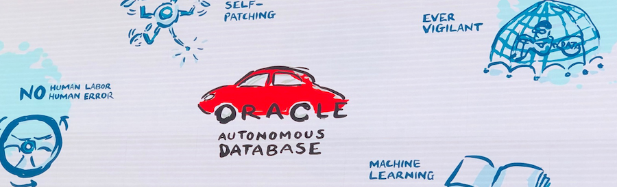
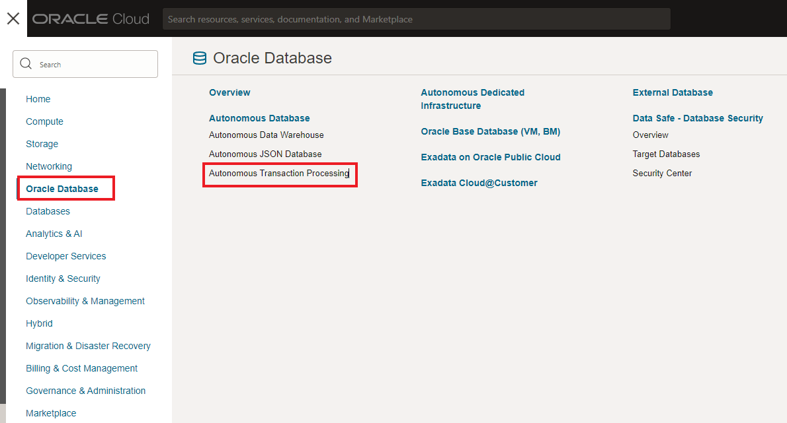
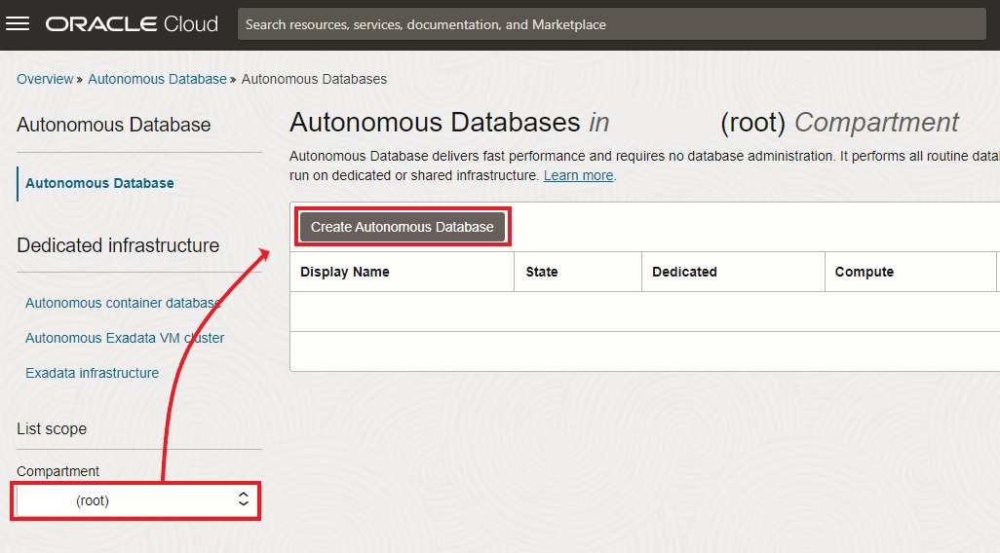
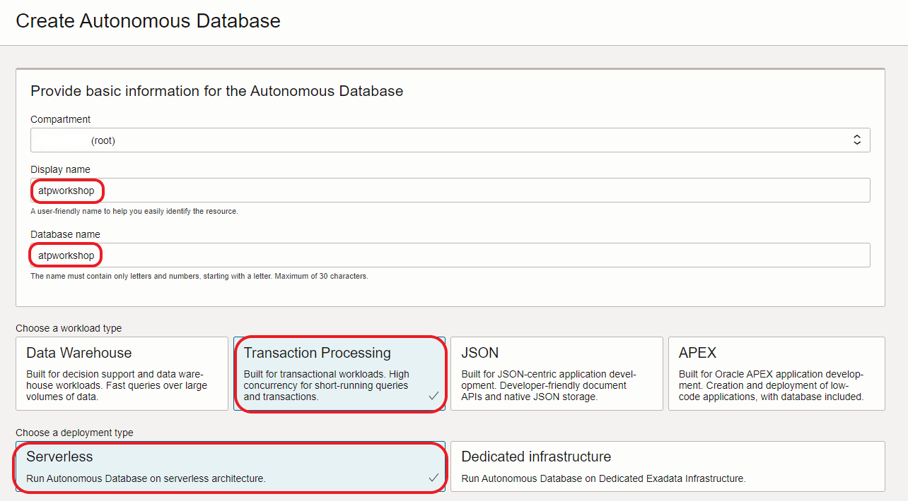
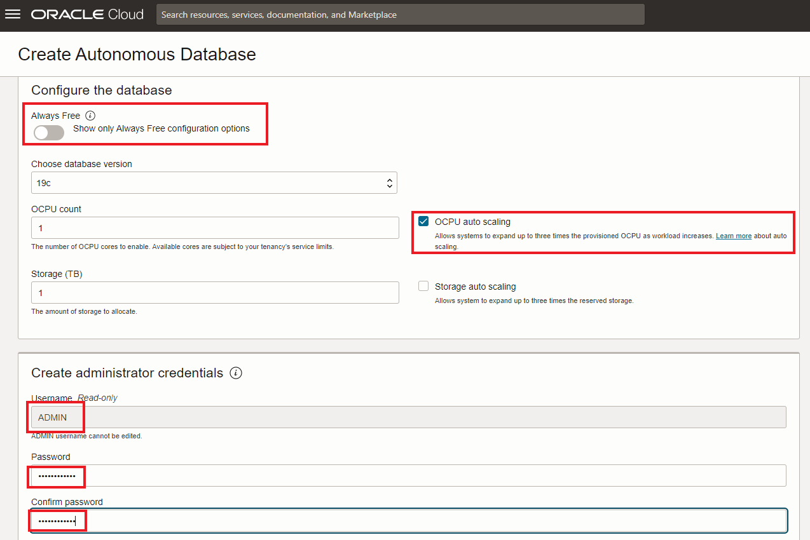
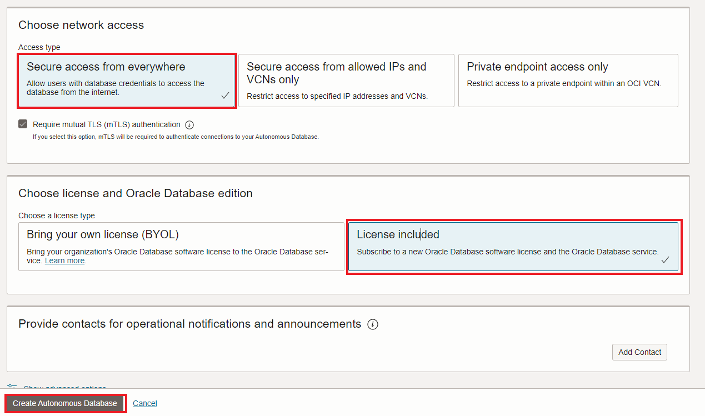
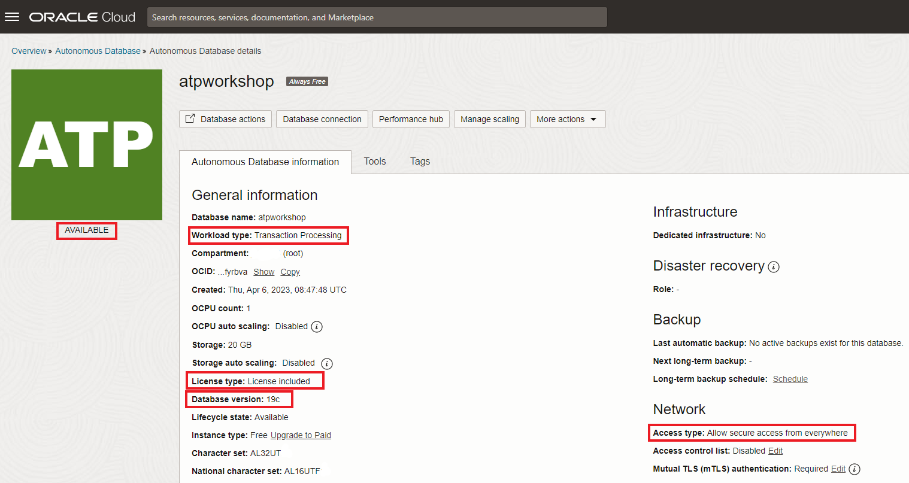

# Create Autonomous Database



## Introduction

This workshop walks you through the steps to get started using the **Oracle Autonomous Transaction Processing Database (ATP)** on **Oracle Cloud Infrastructure (OCI)**. You will provision a new database in just few minutes.

### Self-driving

- Automate database provisioning, tuning, and scaling.

- Provisions highly available databases, configures and tunes for specific workloads, and scales compute resources when needed, all done automatically.

### Self-securing

- Automate data protection and security.

- Protect sensitive and regulated data automatically, patch your database for security vulnerabilities, and prevent unauthorized access—all with Oracle Autonomous Database.

### Self-repairing

- Automate failure detection, failover, and repair.

- Detect and protect from system failures and user errors automatically and provide failover to standby databases with zero data loss.

- Perfect for Developers!

Watch our short video that explains Lab 1 - Create Autonomous Database and Lab 2 - Create APEX workspace and REST API:

[](youtube:S9WPR0N0f2E)

Estimated Lab Time: 15 minutes

Watch the video below for an overview of the Create Autonomous Database lab
[](youtube:tNBDb47sNmc)

### Objectives

In this lab, you will:
- Create an Autonomous Database with the latest features of Oracle Databases

### Prerequisites

- This lab assumes you have logged into your to Oracle Cloud account.

## Task 1: Create a new Autonomous Transaction Processing

1. Go to the **Autonomous Transaction Processing (ATP)** menu:

    

    Check if you are in the **root compartment** that is fine for testing.

    > Compartments are a logical separation of resources to attach roles and permissions. It will make possible to create your team structure in compartments so you know who manage what resources. Not necessary at this stage.

    And click in **Create Autonomous Database** button.

    

    You can leave the compartment as it is. It would say something like _<tenancy_name> (root)_. 

2. Fill Display and Database name details:

    - **Display name**: 
        ```
        <copy>atpworkshop</copy>
        ```
    - **Database name**: 
        ```
        <copy>atpworkshop</copy>
        ```

3. Make sure you select **Transaction Processing** and **Shared Infrastructure**.

    

3. You can select **Always Free** configuration to start enjoying your Free Autonomous Database. You will have visible the **Always Free** logo next to the name of your database:

    

    CPU and Storage are good with default values, the same for the database version.

    **Auto scaling** you can leave it off but it is a nice feature as the ATP database will scale if the workload is increasing and scale down automatically if the workload reduces. Zero downtime during the process. It's cool, isn't it?

4. Under the Create Administrator credentials section, provide the **Administrator Password**. Enter any password you wish to use following the specific requirements imposed by ATP.

    > Reminder: Note your password in a safe location as this cannot be reset.

    

4. Leave **Secure access from everywhere** for the workshop and **License Included**.

5. Click **Create Autonomous Database** button.

    

6. After few seconds you will have your new Autonomous Database up and **running**.

    Look around the details and get familiar with the buttons and tabs on this page.

    

    Remember: You will have visible the **Always Free** logo next to the name of your database:

    

You may now [proceed to the next lab](#next).

## Acknowledgements

- **Author** - Victor Martin - Technology Product Strategy Manager, Priscila Iruela - Technology Product Strategy Director
- **Contributors** - Melanie Ashworth-March
- **Last Updated By/Date** - KPriscila Iruela, June 2022