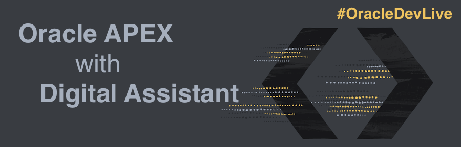

# Introduction

## Introduction to Conversational Approach to Your Applications

This workshop walks you through the steps to use **Autonomous Database** and **Application Express (APEX)** to store information, offer a **REST API** with **Oracle REST Data Services (ORDS)** and enable you to interact with your customers by keeping a conversation with **Digital Assistant**.

Estimated Workshop Time: 90 minutes.

### Objectives

- Store information in a powerful database 
- Provide a 24/7 conversational experience with people using your services
- Explore Oracle Digital Assistant
- Explore modern and quick APEX development 
- Build secure and powerful REST APIs

## Task 1: Requirements

1. An Oracle Trial Account. 
Here's a video to help with signing up:

2. In order to walk through this workshop you need to develop the integration with **REST API**. We will use **Cloud shell** as part of the DevOps tool preinstalled that the **Oracle Cloud** have ready to use. You can learn more about **Oracle Cloud Shell** [here](https://docs.oracle.com/en-us/iaas/Content/API/Concepts/cloudshellintro.htm).

At this point, you are ready to start learning!

## **Acknowledgements**

- **Author** - Victor Martin - Technology Product Strategy Manager, Priscila Iruela - Technology Product Strategy Director
- **Contributors** - Melanie Ashworth-March
- **Last Updated By/Date** - Priscila Iruela, June 2022