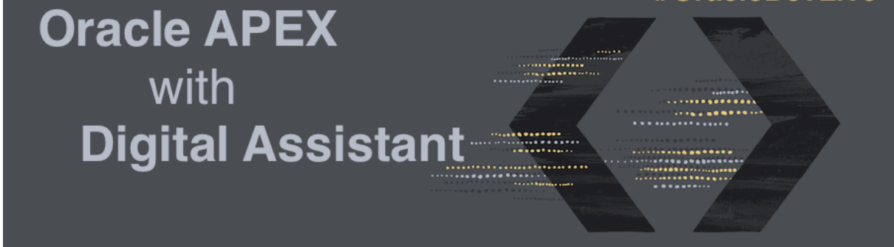

# Introduction

## Introduction to Conversational Approach to Your Applications

This workshop walks you through the steps to use **Autonomous Database** and **Application Express (APEX)** to store information, offer a **REST API** with **Oracle REST Data Services (ORDS)** and enable you to interact with your customers by keeping a conversation with **Digital Assistant**.

Estimated Workshop Time: 90 minutes

### Objectives

- Store information in a powerful database 
- Provide a 24/7 conversational experience with people using your services
- Explore Oracle Digital Assistant
- Explore modern and quick APEX development 
- Build secure and powerful REST APIs

### Prerequisites

- An Oracle Cloud Account - Please view this workshop's LiveLabs landing page to see which environments are supported

*Note: If you have a **Free Trial** account, when your Free Trial expires your account will be converted to an **Always Free** account. You will not be able to conduct Free Tier workshops unless the Always Free environment is available. **[Click here for the Free Tier FAQ page.](https://www.oracle.com/cloud/free/faq.html)***

You may now [proceed to the next lab](#next).

## Acknowledgements

- **Author** - Victor Martin - Principal Cloud Engineer | Priscila Iruela - Database Business Development
- **Contributors** - Melanie Ashworth-March
- **Last Updated By/Date** - Anoosha Pilli, March 2021
