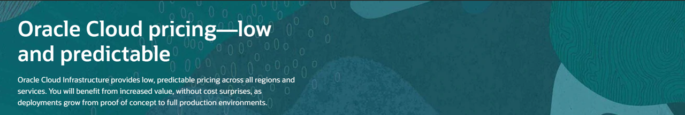
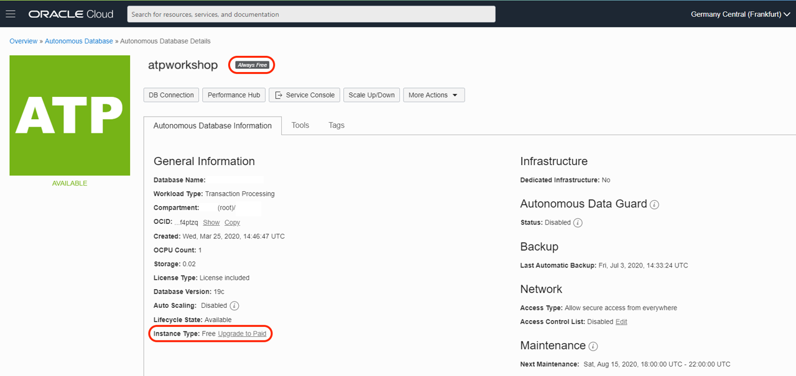
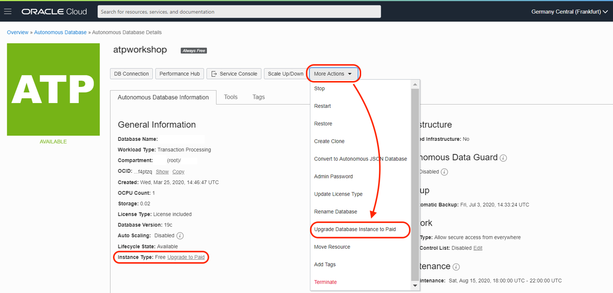
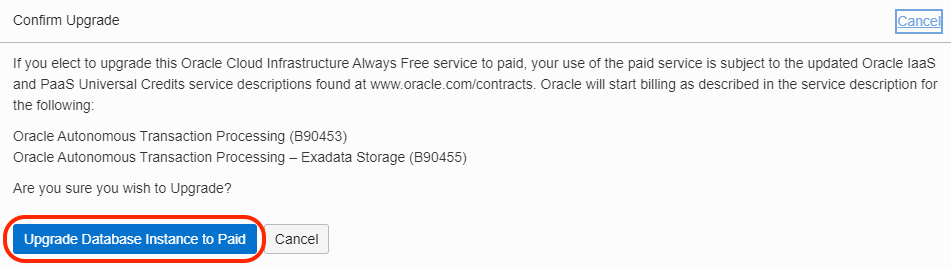
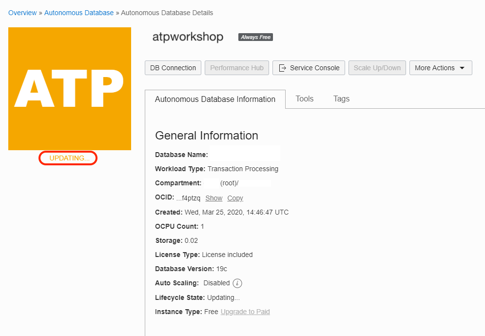
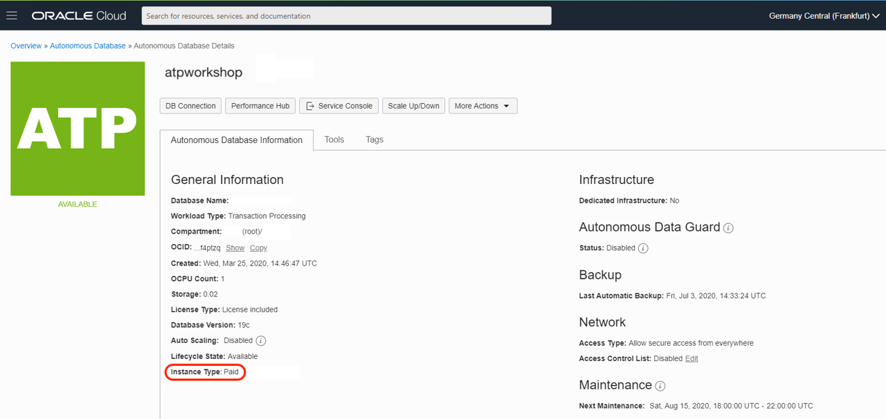
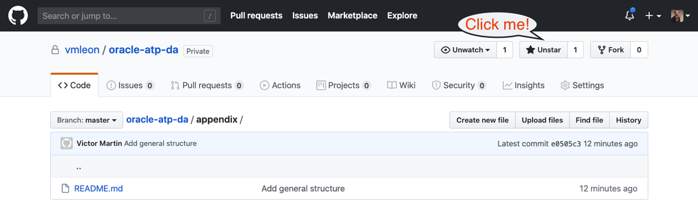

# Next Steps

## Introduction
In this section you can learn how to upgrade instances to a Paid Model.

Estimated Lab Time: 2 minutes.

## Task 1: Upgrade Instances to Paid

I hope you could complete all the workshops on this Oracle APEX and Digital Assistant workshops and you learn the basic concepts from the technologies that we have use: - **Oracle Autonomous Database** - **Oracle Application Express** - **Oracle Digital Assistant**

The technologies that we have covered on this workshop are using **Always Free** and **Free Trial** credits so you don't have to pay for the services that you have use.

If you want to **Upgrade** the Instances that we used, you can follow these simple steps to upgrade to your favorite subscription model.

[Here you can see the differences models that Oracle has available.](https://www.oracle.com/ie/cloud/pricing.html)

We will show you how to Upgrade from **Always Free** instances right now.

Remember that you will see **Always Free** logo next to the name of your database as part of the database details information. You can see **Instance Type** filled out with **Free Upgrade to Paid**.

1. We will upgrade to Paid License in this step. You can either click on the **Instance Type** that I referred before or click on **More Actions** bottom and go to **Upgrade Database Instance to Paid**, both ways bring you to the same step.

    

2. **Confirm Upgrade** window. You can click **Upgrade Database Instance to Paid**.

    

3. After you perform this action, your database will be upgrade to **Paid** subscription. The update will take a few minutes.

    

    You can see that **Instance Type** information has changed from **Free Upgrade to Paid** to **Paid**:

    

You have learned how to Upgrade your Always Free Account to a subscription model!

## Task 2: Learn More?

If you enjoy the workshop, give me a star on Github: [click here](https://github.com/vmleon/oracle-atp-da)!

Please, help us to improve. [Create an issue](https://github.com/vmleon/oracle-atp-da/issues) if you think something is not quite right.

Learn about [Autonomous Database](https://github.com/vmleon/OracleATPGettingStarted) for developers and operators (Workshop)

Learn Kubernetes with [Oracle Kubernetes Engine](https://github.com/vmleon/OKE-first-steps) (Workshop)

Learn about HTTP security with [Oracle Cloud Web Application Firewall](https://github.com/vmleon/Oracle-WAF-Demo) (Workshop)

Check [Oracle Tech Exchange](https://fnimphiu.github.io/OracleTechExchange/) contains a lot of short tutorials about Oracle Digital Assistant

## Acknowledgements

- **Author** - Victor Martin - Technology Product Strategy Manager, Priscila Iruela - Technology Product Strategy Director
- **Contributors** - Melanie Ashworth-March
- **Last Updated By/Date** - Priscila Iruela, June 2022