# Create Digital Assistant Skill

## Introduction

**Digital assistants** consist of one or more **skills**, which are individual **chat bots** that are focused on specific types of tasks.

You will create a **skill** that can be used for interactions with a backend service, using the **Custom Component** you built on previous workshop.

As part of this process, you will:

- **Create** a new skill
- **Import** your Custom Component (the `tgz` file you generated with `npm pack`)
- **Create** two intents: `Greeting` and `ListTasks`

We have to access to **Digital Assistant** section in the **Oracle Cloud Dashboard**.


Go to **Digital Assistant Dashboard** as we did on **Lab 3**. As a reminder check the following screenshot:

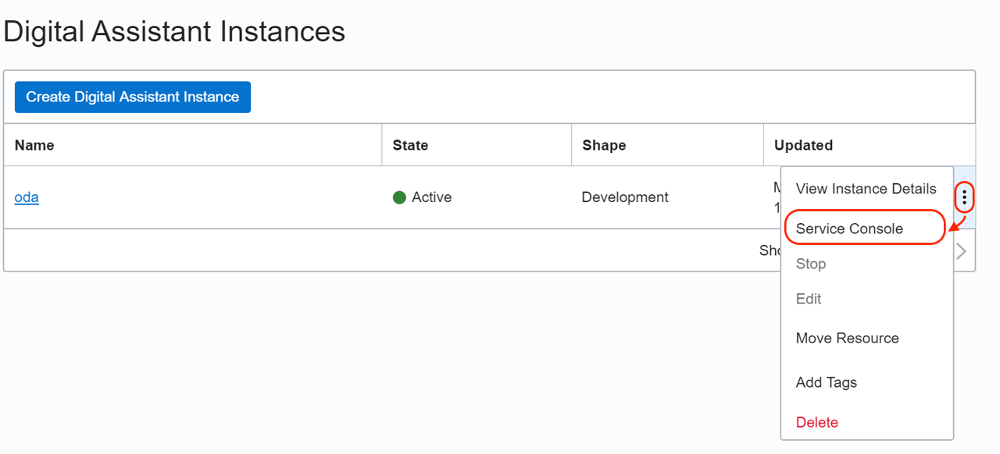

Estimated Lab Time: 20 minutes.

## Task 1: Build your first Skill

In this workshop, we're starting from scratch. So the first thing you'll do is **create** a new skill.

1. **Click** on `+ New Skill` button to start:

    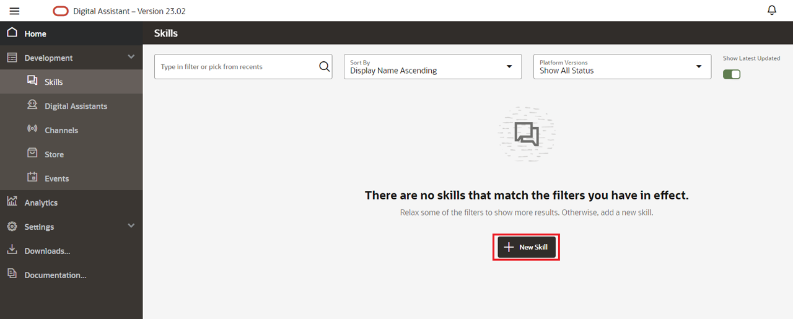

2. **Fill** the information and click **Create** button:

    - **Display Name**: 
    ```
    <copy>my tasks</copy>
    ``` 
    - **Dialog Mode**: Select **YAML**

    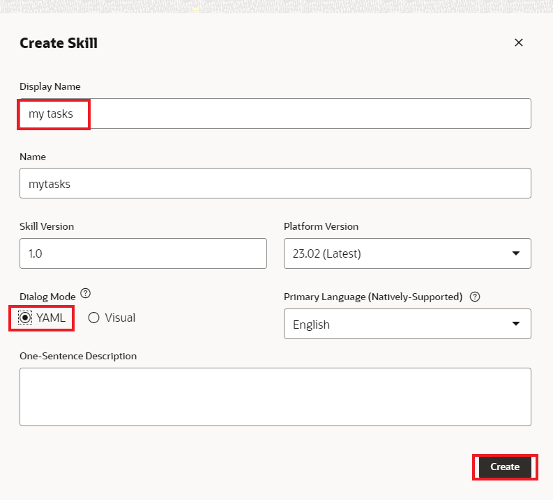

> Note: If you prefer to use a **Visual Dialog Mode**, you can follow this [tutorial content - Create a Dialog Flow with the Oracle Visual Flow Designer](https://docs.oracle.com/en/cloud/paas/digital-assistant/tutorial-visual-flow-designer/). For the workshop purpose we will use **YAML Dialog mode**.

## Task 2: Import the Custom Component

Import Custom Component is very simple.

1. **Go** to the **Components** view 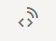 on the left menu. Select `+ Add Service`.

    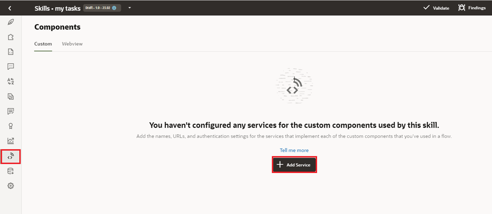

    The web form to **upload** the file will **show up**.
    We will fill out all the information of this web form.

2. Select **Drag and Drop - Select or drop a component package file (a .tgz file created by running bots-node-sdk pack or npm pack) to upload**.

    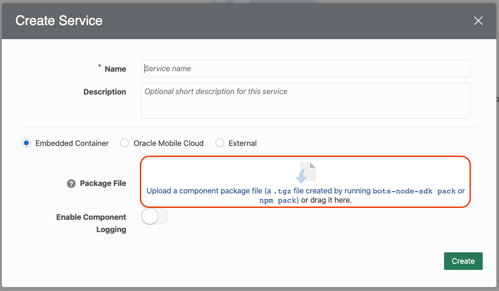

3. **Upload** `tasks-cc-1.0.0.tgz` file that we created before. Remember that the tgz file is on the tasks-cc folder.

    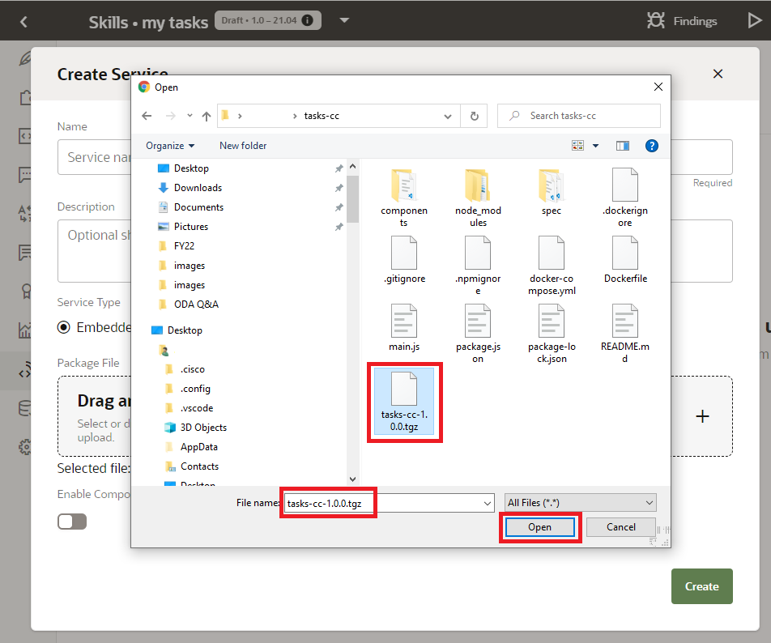

4. **Fill** the rest of the information and remember to `Enable Component Logging` with the toggle button:

    - **Name**: 
        ```
        <copy>tasks</copy>
        ``` 
    - **Description**:
        ```
        <copy>Tasks Custom Component</copy>
        ``` 
    - **Embedded Container**: is selected by default. Leave it like that.
    - **Enable Component Logging**: Enabled

5. Finally **Create** the Service.

    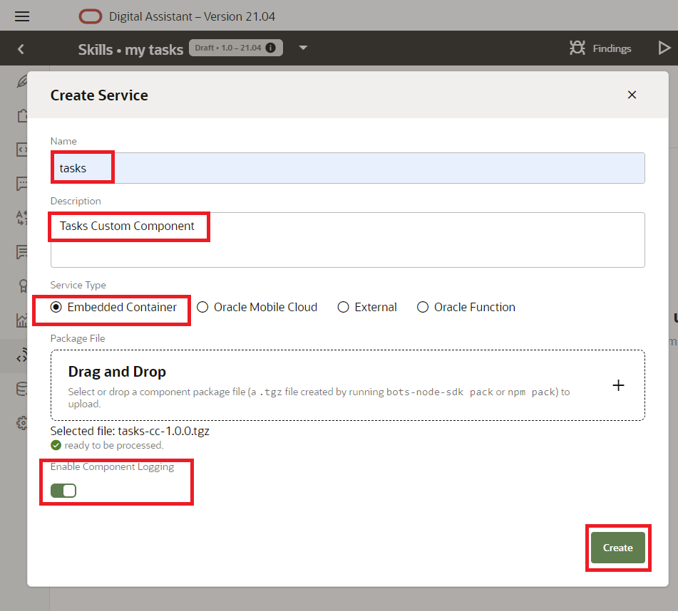

6. **Wait** for the deployment to be ready.

    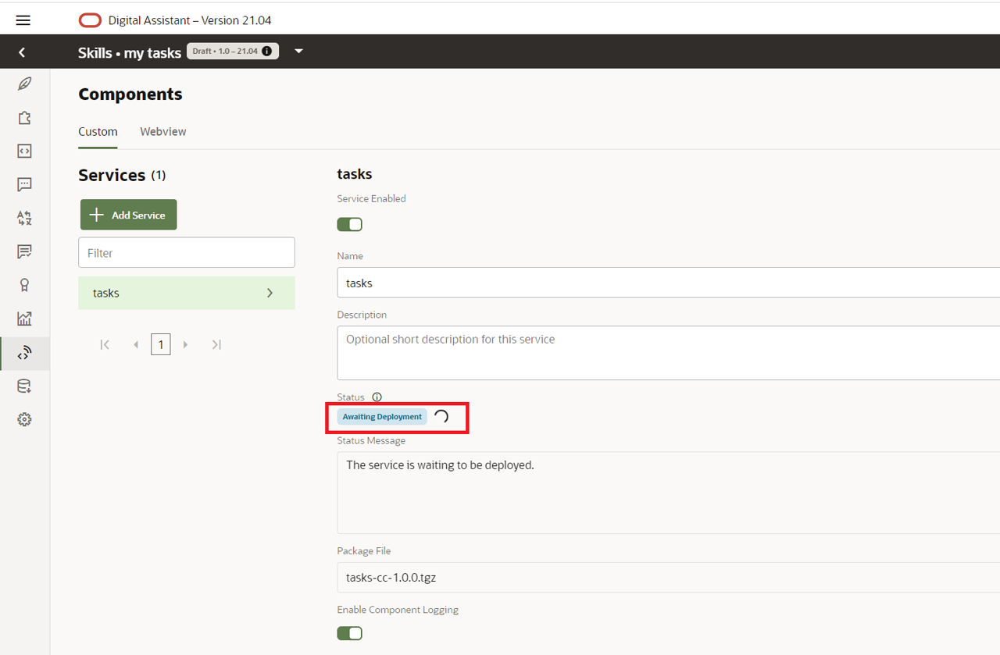

7. **Make sure** the `Status` is `Ready`. You see all the **information** on this page like in this screenshot.

    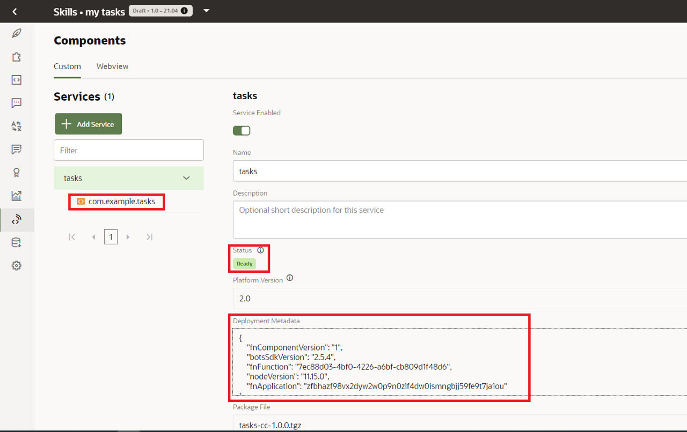


## Task 3: Create intents

Oracle Digital Assistant's underlying **Natural Language Processing (NLP)** engine doesn't inherently know about the business or task that a skill is supposed to assist with. For the skill to understand what it should react to, you need to define intents and examples (utterances) for how a user would request a specific intent.

Let's create a **Greeting Intent**.

1. **Go** to the **Intent** view  on the left menu. Select `+ Intent`.

    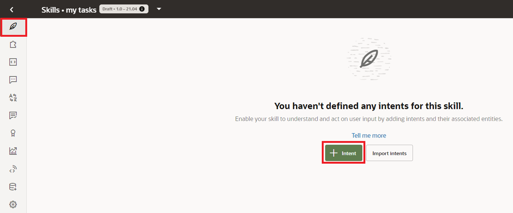

1. We will start working on the **Intent** page. The page by default looks like this screenshot:

    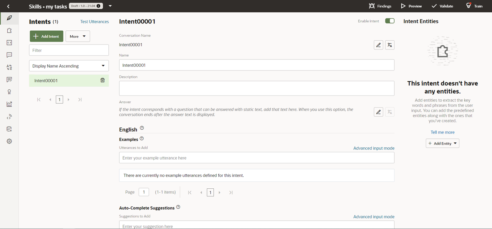

3. **Modify** default values for:

    - **Conversation Name**: 
        ```
        <copy>Greeting</copy>
        ``` 
    - **Name**:
        ```
        <copy>Greeting</copy>
        ``` 
    - **Utterances to Add**: In this field is where you have to type the different Greetings that you want to include as part of the Intent. Type on this field `Hi` and click enter. Wait to be added as part of the intents. Type on the same field `Hello` and wait to be added as before: 
        - **Example 1**: 
        ```
        <copy>Hi</copy>
        ``` 
        - **Example 1**:
        ```
        <copy>Hello</copy>
        ``` 
    The two **Intents** that you added a few seconds ago will be visible in the page. Check the following screenshot to confirm.

    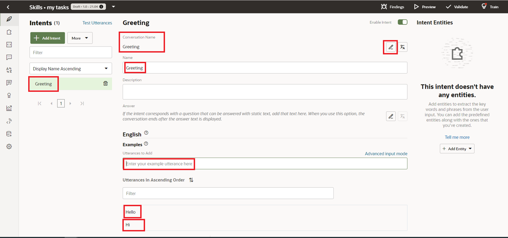

4. **Click** on `+ Add Intent` on the same screen to add more Intents to the conversation.

  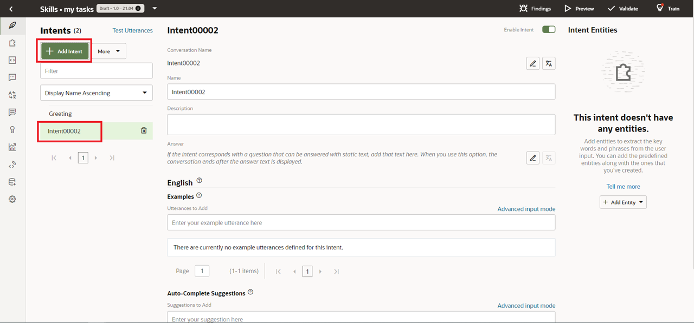

5. **Modify** default values for:

    - **Conversation Name**:
        ```
        <copy>ListTasks</copy>
        ``` 
    - **Name**:
        ```
        <copy>ListTasks</copy>
        ``` 
    - **Utterances to Add**: In this field is where you have to type the different list of tasks that you want to include as part of the Intent. Type on this field `list my tasks` and click enter. Wait to be added as part of the intents. Type on the same field `show me my tasks` and wait to be added as before. And finally type on the same field `my tasks` and wait to be added as before:
        - **Example 1**:
            ```
            <copy>list my tasks</copy>
            ``` 
        - **Example 2**:
            ```
            <copy>show me my tasks</copy>
            ``` 
        - **Example 1**:
            ```
            <copy>my tasks</copy>
            ``` 

    The three **Intents** that you added a few seconds ago will be visible in the page. Check the following screenshot to confirm.

    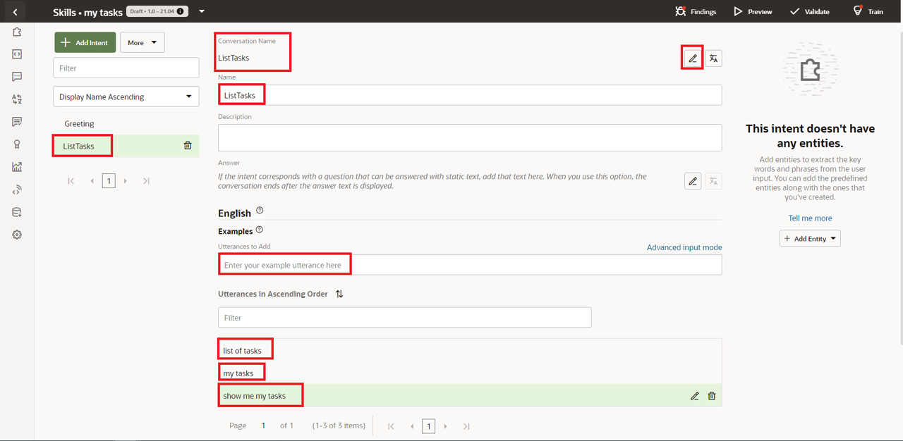

## Task 4: Put everything together

Time to **integrate** your **Custom Component** with the Intent `ListTasks` created before.

1. **Go** to the **Flows** view  on the left menu.

    You will **see** the `YAML` file that define the behavior of your **Skill**.

    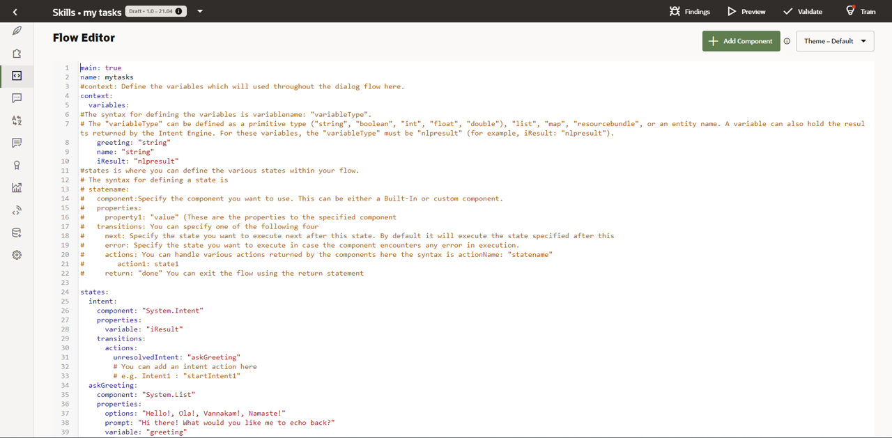

2. **Delete** the full content of the **Flows** section and leave the canvas **empty**.

    

3. **Copy** the `YAML` content from <a href="./files/flow.yml" target="\_blank">here</a> and paste it into the canvas.

    The **Flows** section should look like this one:

    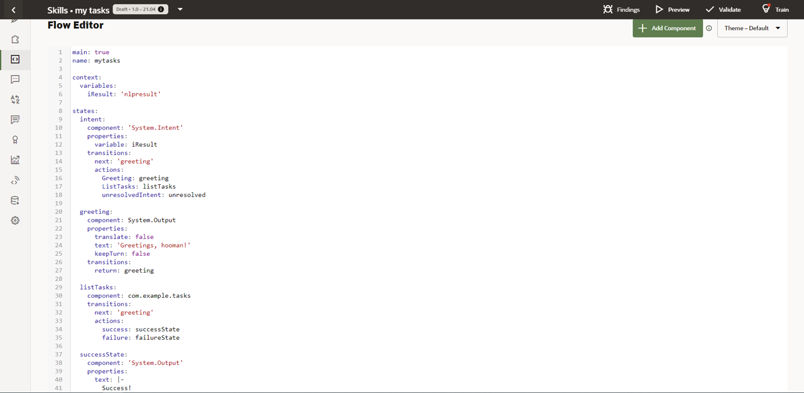

4. **Make sure** the syntax is correct. **Click** on the `Validate` button. You will get a warning message **Found potential problems - We have identified some issues that might cause problems with the my tasks skill. Open the logger window to see more details.** on the top of the page as you can see on the image below. You can explore the warning on **View validation findings** section to learn. We can proceed with next steps.

    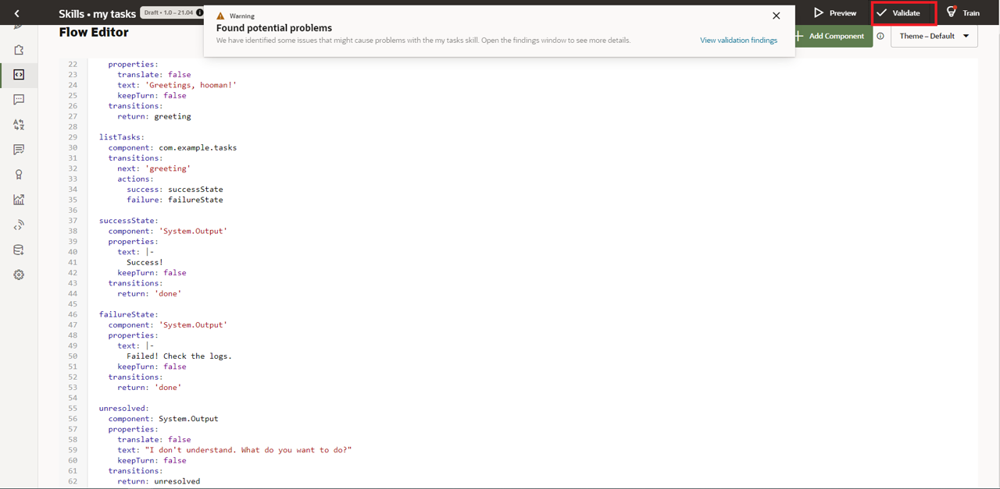

5. Click **Train** button to run the **Machine Learning Algorithm**.

    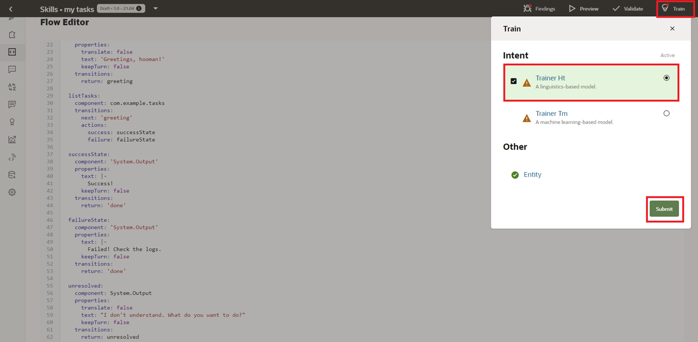

6. **Be sure** that you get the **Trained OK** confirmation on the top of the page as you can see on the image below:

    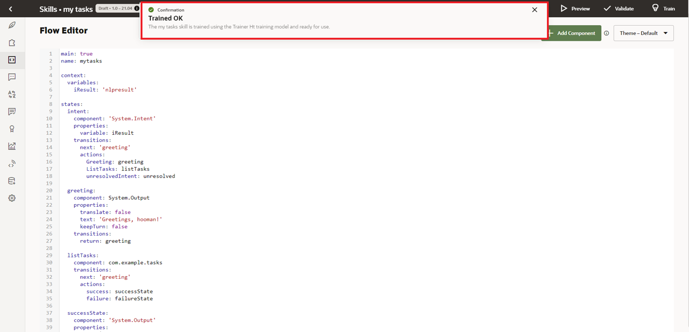

7. **Run** the test of the skill clicking the **Preview** button next to **Validate**.

    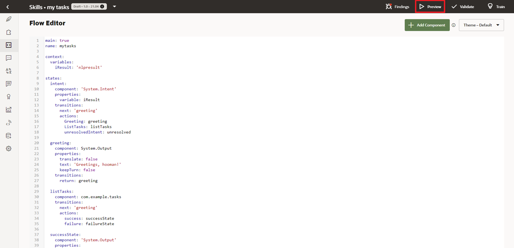

    The way to test the conversation is typing any of the **Intents** that we have created on this Lab5.

    For example: say `Hi` and wait for the bot answer. In this case the answer is `Greetings, hooman!`. Type the next Intent `show me my list` and wait for the bot answer. Now the answer is `Get concert tickets` and `Buy bread`.

    Example of execution:
        - **Step 1 example**:
            ```
            <copy>Hi</copy>
            ``` 
        - **Step 2 example**:
            ```
            <copy>show me my list</copy>
            ``` 

    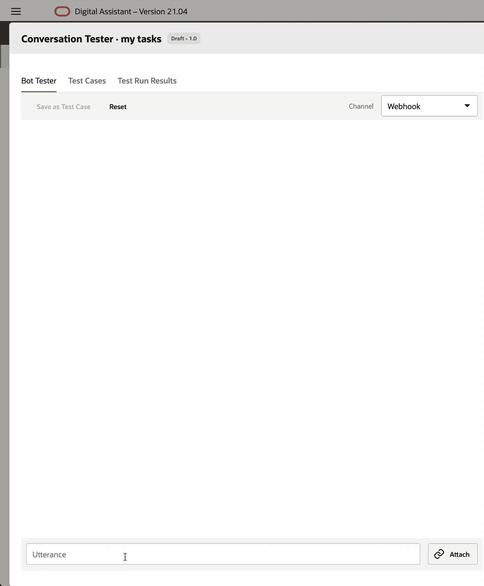

    > NOTE:
    >
    > If you see an **error message** at this point, it means there is a **problem** with the **Custom Component Code**.
    >
    > To get more information about the issue, check the logs.
    >
    > Go to **Components** view  on the left menu and **click** on **Diagnostics** for your **Custom Component**, then on **View Logs**.
    >
    > 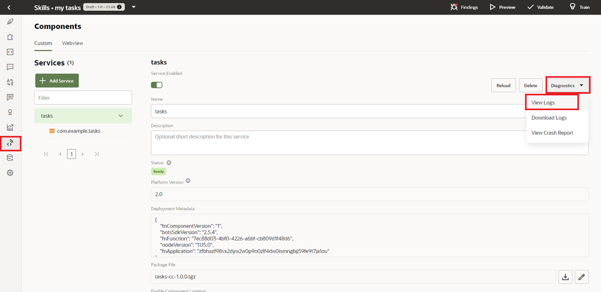
    >
    > The **result** should be something like this:
    > 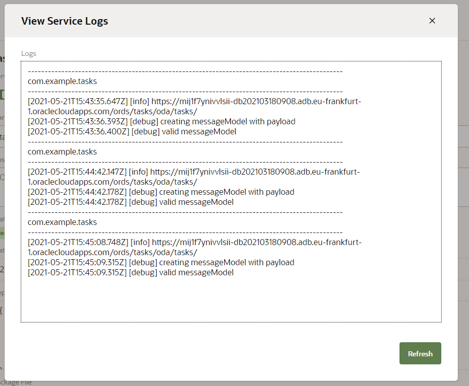

## It works

To see how we **request** against the **database**, we can **add** a new item.

1. **Insert** your third element in the collection of data by going to **APEX** and on the Top Menu on **SQL Workshop**, click **Object Browser** as we did on **Lab 2**:

    

2. Select **TASKS** table on the left of the APEX page and **click** the tab **Data**, then click **Insert Row**:

    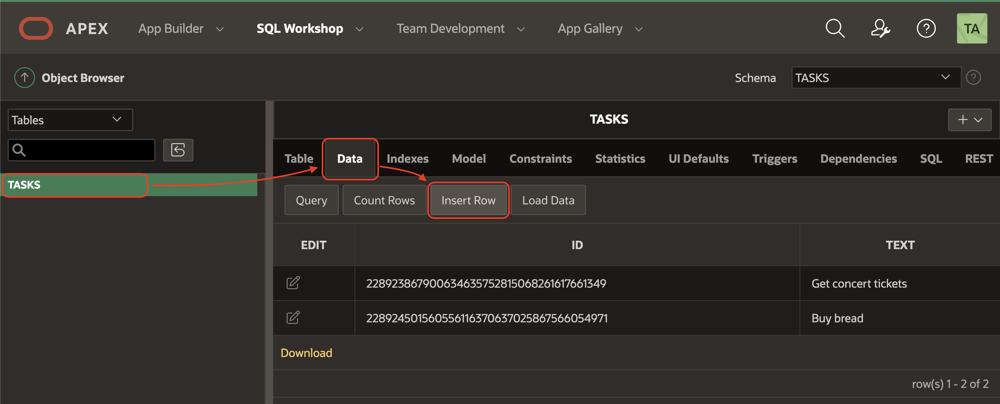

3. **Add** a new **Text** like 
    ```
    <copy>New item!</copy>
    ``` 
    and **click** **Create**:

    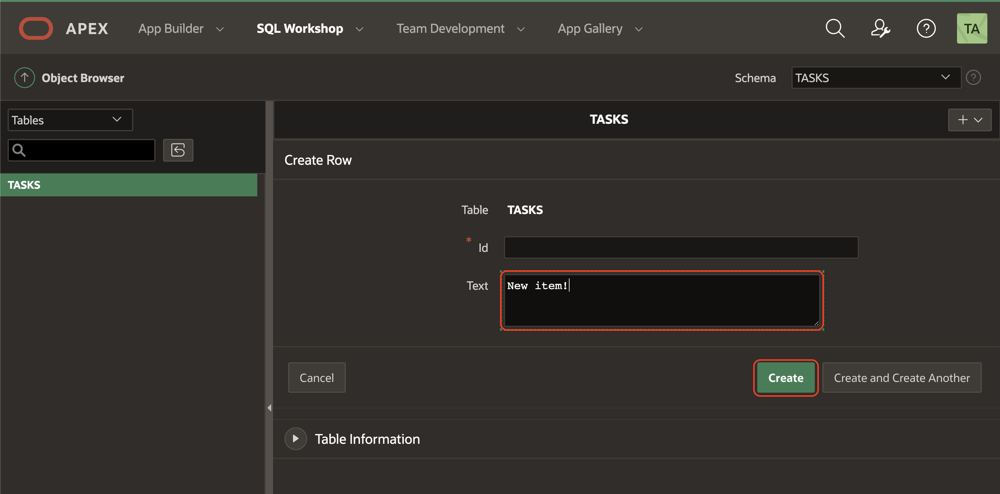

4. **Confirm** the row has been created:

    

5. **Run** the chat again but before **reset** the previous **conversation**.

    For example: reset the conversation by clicking on **Reset** then say `hi` and wait for the bot answer. Type the next Intent `show me my tasks` and wait for the bot answer. Now the answer is `Get concert tickets`, `Buy bread`, and `New Item!`.
    
    Example of execution:
        - **Step 1 example**: 
            ```
            <copy>hi</copy>
            ``` 
        - **Step 2 example**:
             ```
            <copy>show me my tasks</copy>
            ``` 

    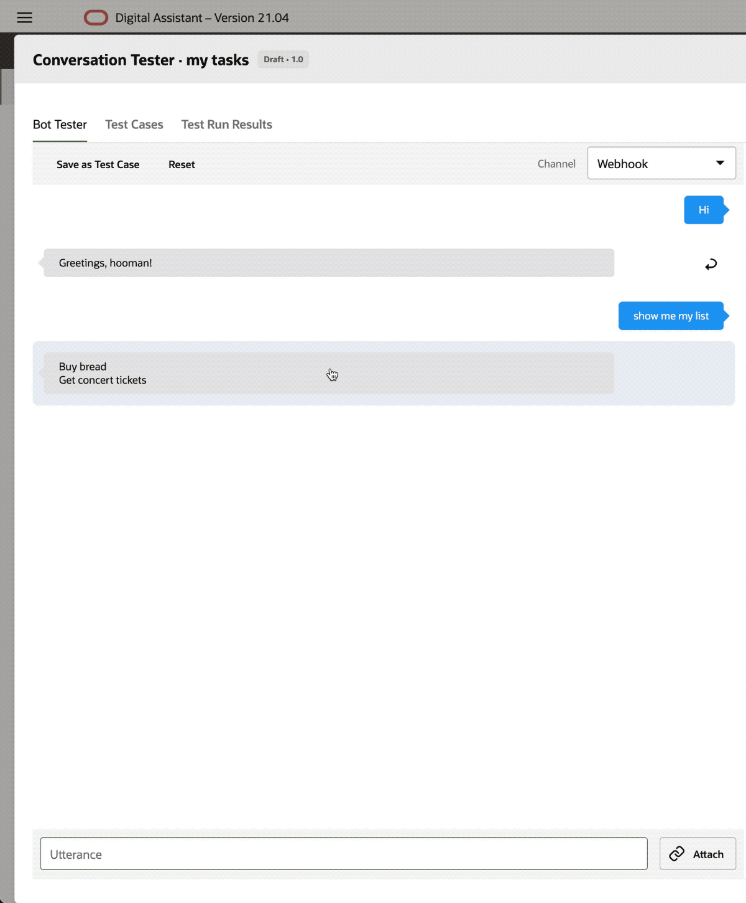

Congratulations! Well done!

Continue to Next Steps for more information!

## **Acknowledgements**

- **Author** - Victor Martin - Technology Product Strategy Manager, Priscila Iruela - Technology Product Strategy Director
- **Contributors** - Melanie Ashworth-March
- **Last Updated By/Date** - Priscila Iruela, June 2022