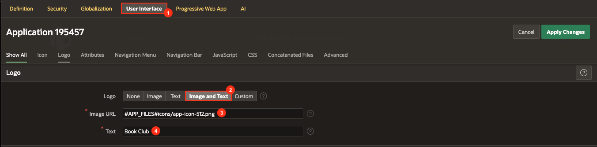
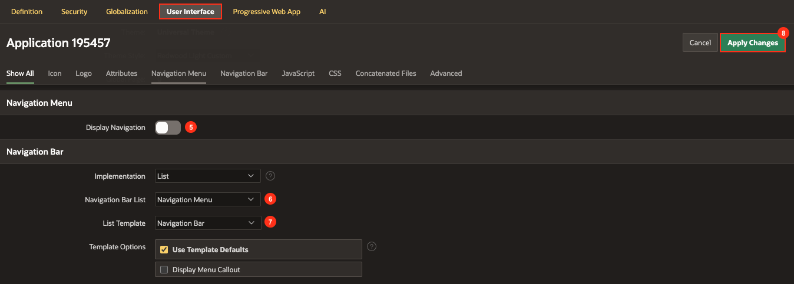
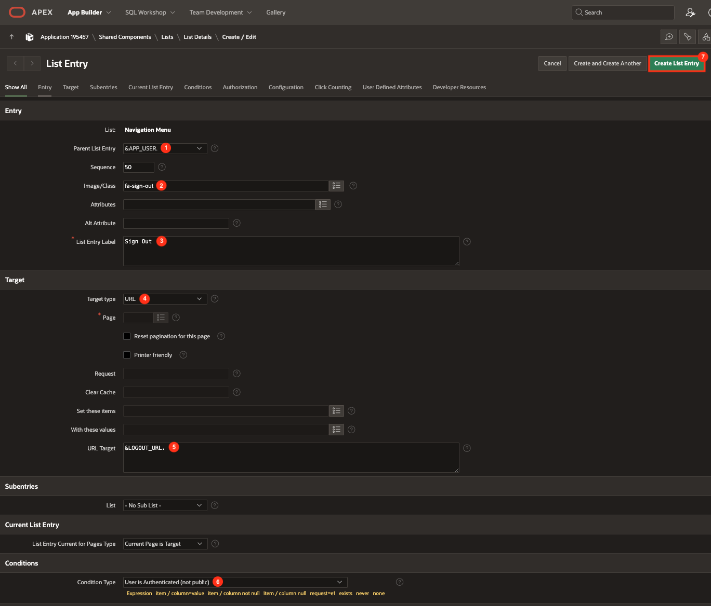
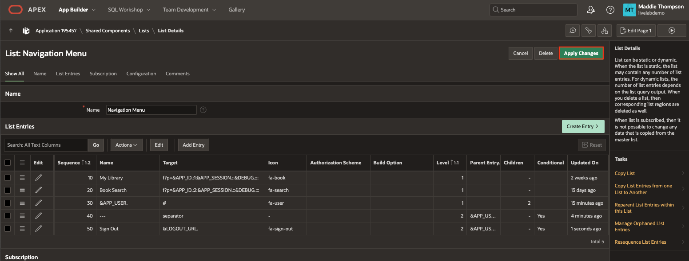
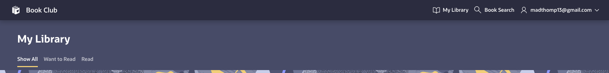

# Update App Navigation (Optional)

## Introduction

This next lab is optional, but it would be nice to have a simplified top navigation since there are only two menu items. It will walk you through updating the app navigation to be a simple top navigation bar instead of the default side drawer menu.

Estimated Lab Time: 5 minutes

### Objectives
In this lab, you will:
- Update the app navigation style.
- Manually add list entries to the top navigation bar.
- Run your application.

### Prerequisites
- An Oracle APEX workspace

## Task 1: Update the Application Definition UI

1. Navigate to the application home page and click **Edit Application Definition**.

    

2. Click the **User Interface** tab and set the following:

    * Logo → Logo: **Image and Text**

    * Logo → Image URL: **#APP_FILES#icons/app-icon-512.png**

    * Logo → Text: **Book Club**

    * Navigation Menu → Display Navigation: **off**

    * Navigation Bar → Navigation Bar List: **Navigation Menu**

    * Navigation Bar → List Template: **Navigation Bar**

    * Click **Apply Changes**

    

    

    *Note: This will remove the top navigation bar containing the user menu and replace it with our Navigation List. We will add the user menu back next.*

## Task 2: Add Entries to the Navigation Bar List
Now we will add the user menu to the top navigation bar so the user is able to log out.

1. Navigate back to the application home page and click **Shared Components**.

    

2. Under Navigation and Search, click **Navigation Bar List**.

    

3. Click on the **Navigation Menu** entry to edit the list.

    

4. Click **Create Entry** button.

    

5. Set the following properties for the new List Entry:

    * Entry → Image/Class: **fa-user**

    * Entry → List Entry Label: **&APP_USER.**

    * Target → Target Type: **URL**

    * Target → URL Target: **#**

    * User Defined Attributes → List Item CSS Classes: **has-username**

    * Click **Create and Create Another**

    

    

6. Set the following properties for the new List Entry:

    * Entry → Parent List Entry: **&APP_USER.**

    * Entry → List Entry Label: **---**

    * Target → Target Type: **URL**

    * Target → URL Target: **separator**

    * Conditions → Condition Type: **User is Authenticated (not public)**

    * Click **Create and Create Another**

    

7. Set the following properties for the new List Entry:

    * Entry → Parent List Entry: **&APP_USER.**

    * Entry → Image/Class: **fa-sign-out**

    * Entry → List Entry Label: **Sign Out**

    * Target → Target Type: **URL**

    * Target → URL Target: **&LOGOUT_URL.**

    * Conditions → Condition Type: **User is Authenticated (not public)**

    * Click **Create List Entry**

    

8. Click **Apply Changes**.

    

9. Run the application to see the updated navigation bar.

    

You now know how to update the navigation style of an application.

## Acknowledgements

- **Author** - Maddie Thompson
- **Last Updated By/Date** - Maddie Thompson, November 2024
