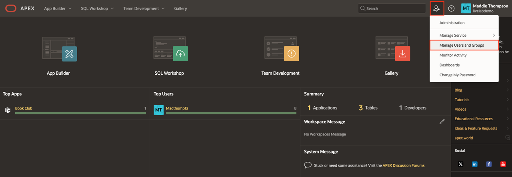
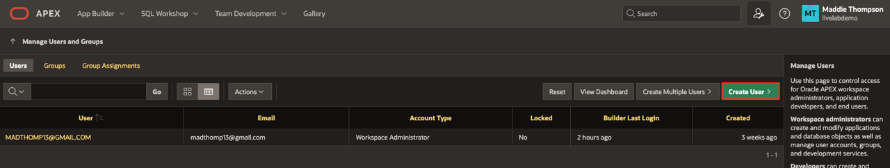
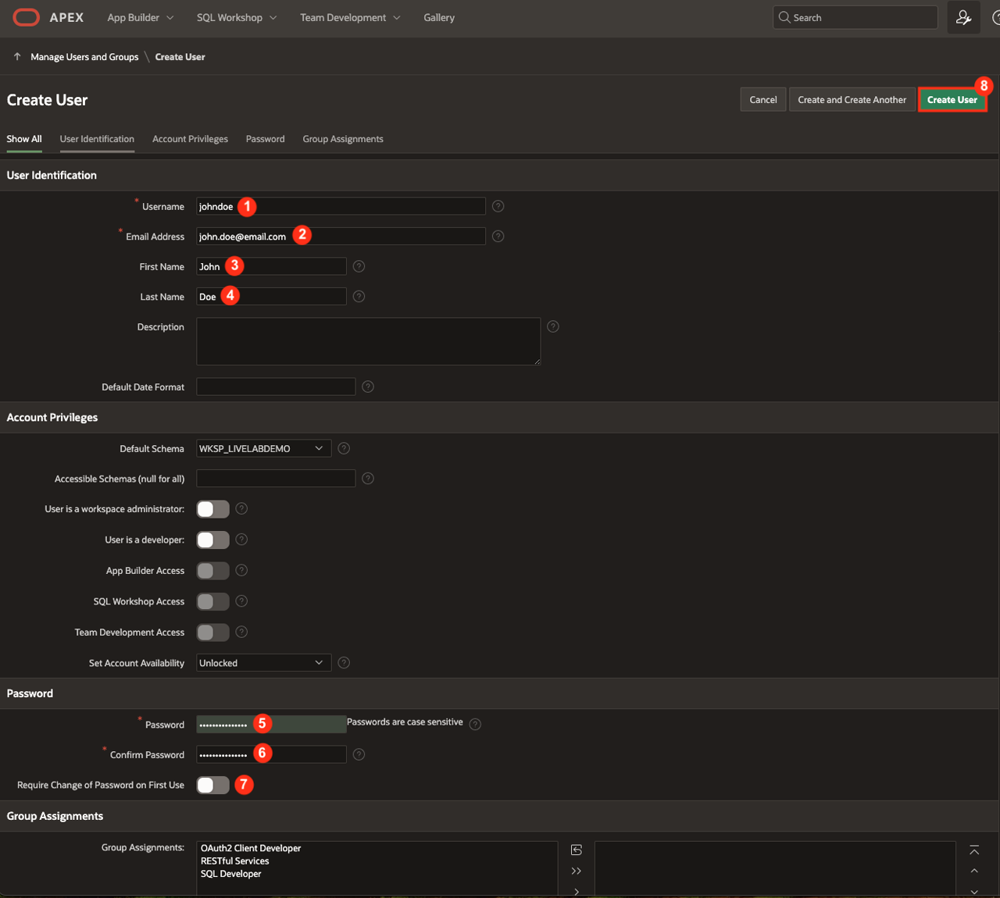
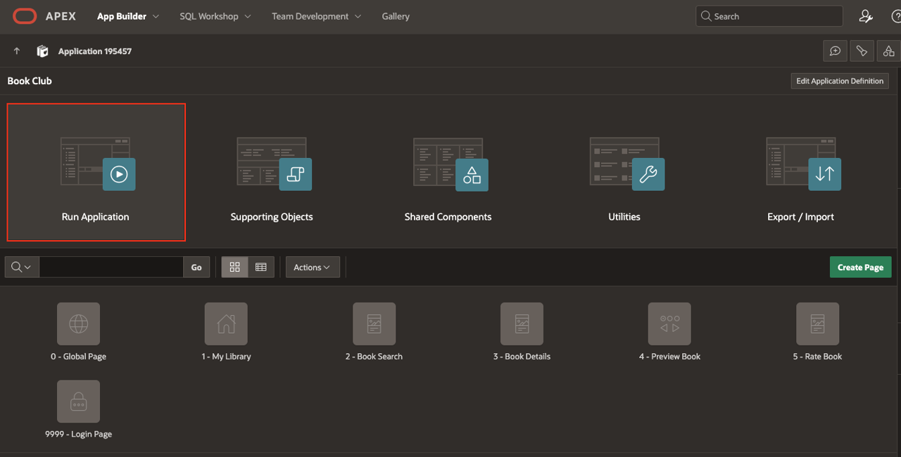
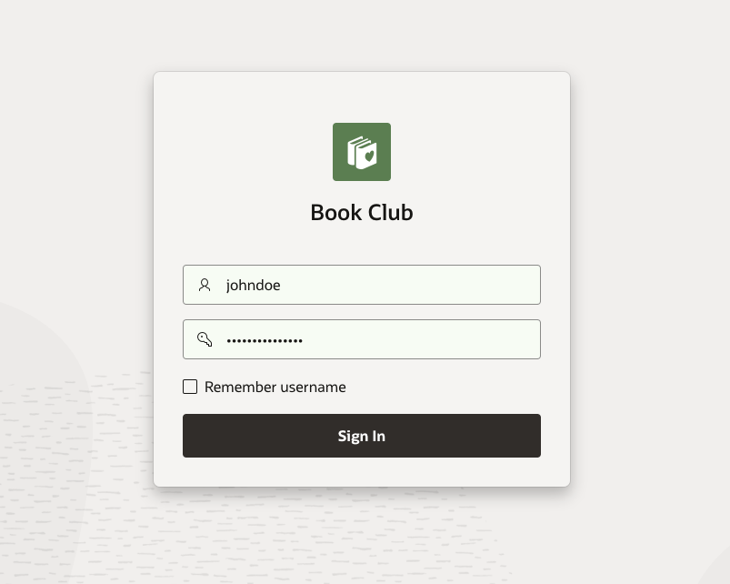
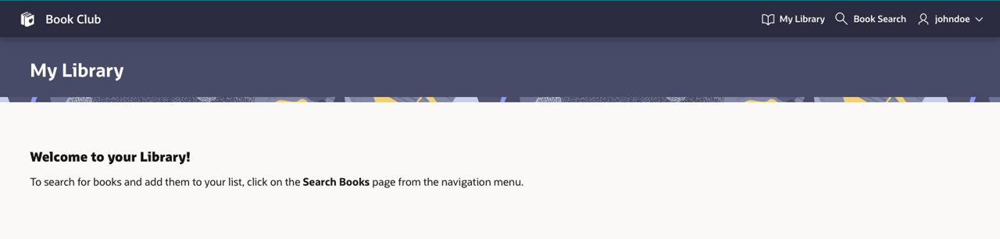
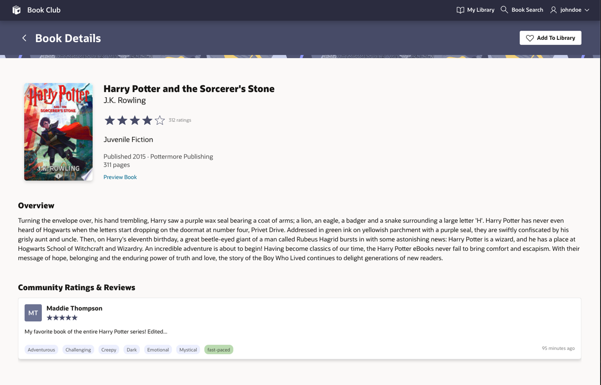
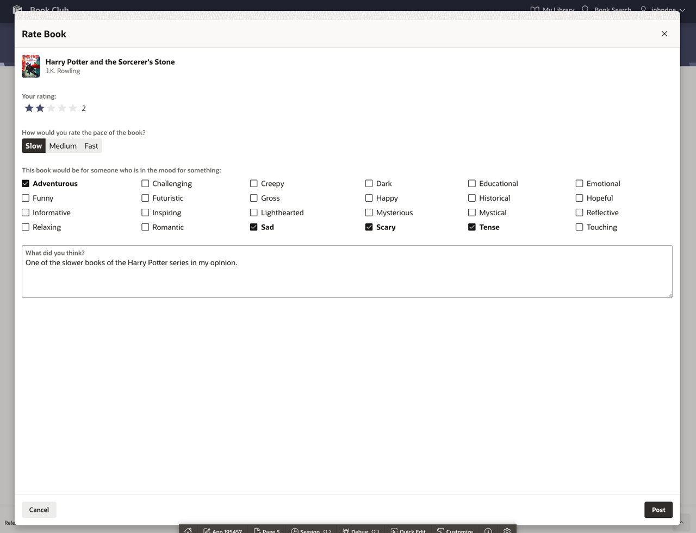
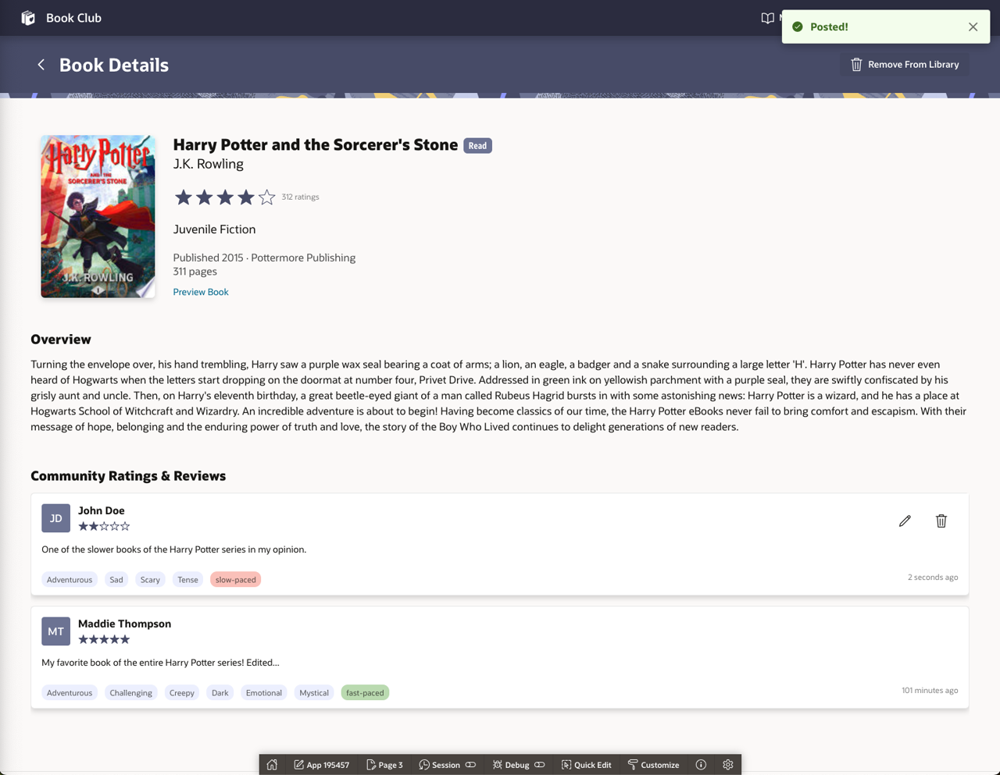

# Create a New App User to Test Functionality (Optional)

## Introduction

This next lab is optional, but it would be nice to test the rate and review functionality with an additional user so you can see posts under the Community Reviews section as well as the My Review section.

Estimated Lab Time: 5 minutes

### Objectives
In this lab, you will:
- Create a new application user.
- Log in to the application as the new user.
- Post a review as the new user.

### Prerequisites
- Completion of workshop through Lab 10

## Task 1: Create a New Application User
Workspace administrators can create new user accounts one at a time or create multiple accounts in a single operation. In this task we are going to create just one additional user.

1. At the top of the Workspace home page, click the Administration icon then select **Manage Users and Groups**.

    

2. Click **Create User**.

    

3. Enter the following details:

    * User Identification → Username: **johndoe**

    * User Identification → Email: **john.doe@email.com**

    * User Identification → First Name: **John**

    * User Identification → Last Name: **Doe**

    * Password → Password: Specify a password.

    * Password → Confirm Password: Enter the password again.

    * Password → Require Change of Password on First Use: **off**

    * Click **Create User**

    

## Task 2: Run the App as the New User
Now we will log in to the application as the newly created user and create a book review post.

1. Navigate to the application home page and click **Run Application**.

    

2. On the sign in page that opens in a new tab in your browser, enter the username and password of the new user you just created.

3. Click **Sign In**.

    

4. Notice the My Library page is empty since this is the first time the new user has logged in to the application.

    

5. Navigate to the **Book Search** page.

    * Search for the book that you previously created a review post for under your account.

    * Click on the book to navigate to the Book Details page.

    * Notice the review card does not contain the edit or delete buttons. This is because it was not posted by the current logged in user.

    

6. Add the book to your library and mark it as read so the **Rate Book** button appears.

7. Click **Rate Book** then fill out the form details and click the **Post** button.

    

    * You should see your new book review post listed first with the edit and delete buttons both enabled.

    

You now know how to create additional application users.

## Acknowledgements

- **Author** - Maddie Thompson
- **Last Updated By/Date** - Maddie Thompson, November 2024
