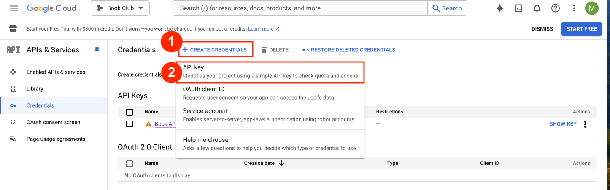
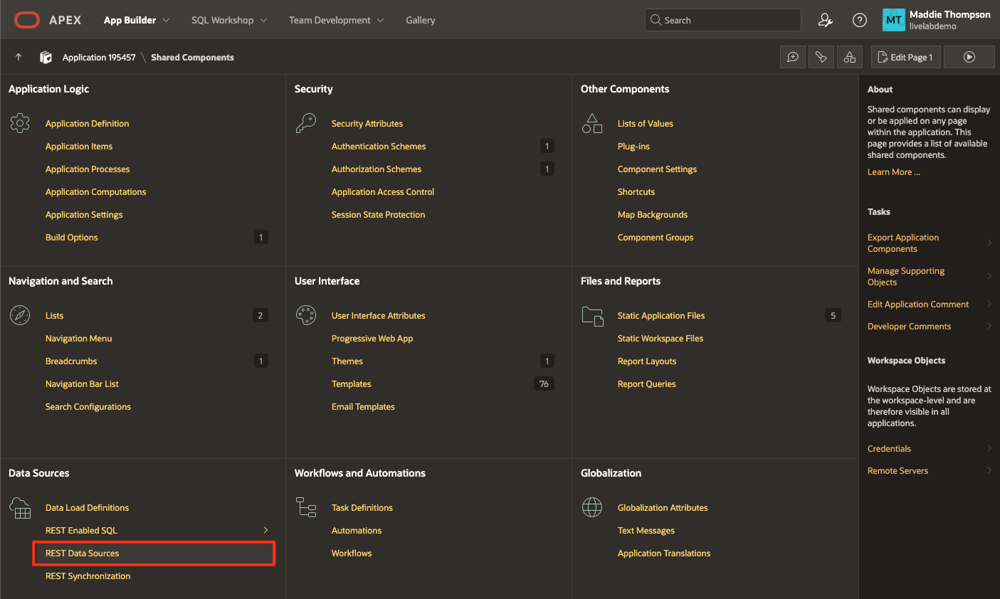
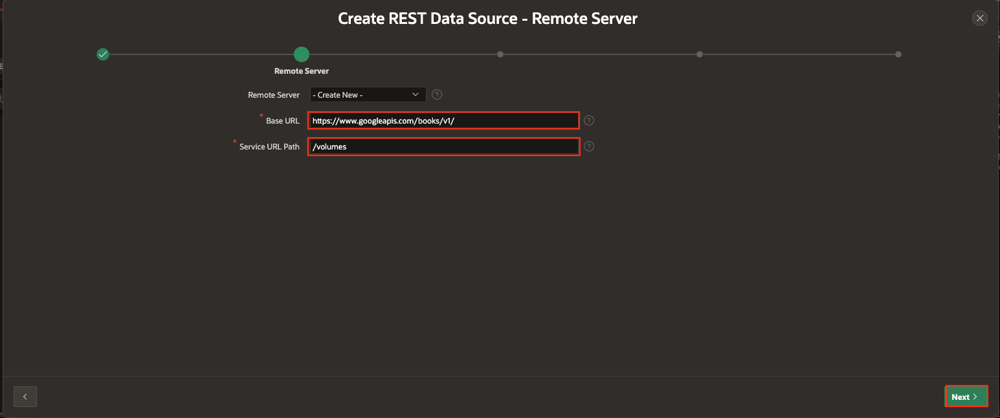
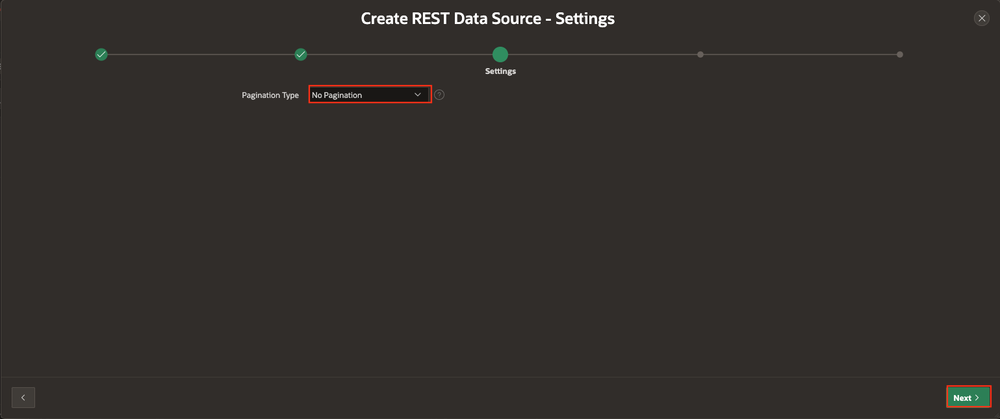
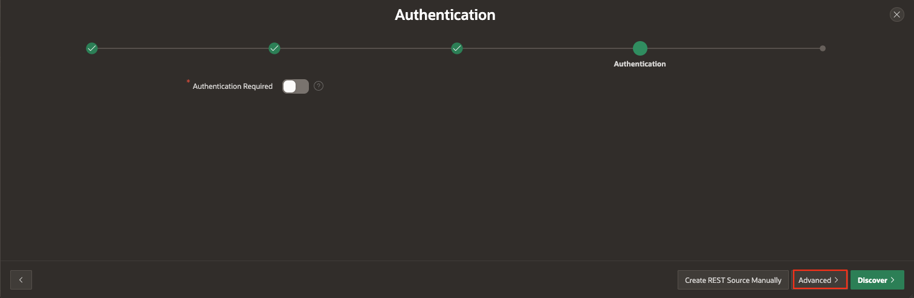
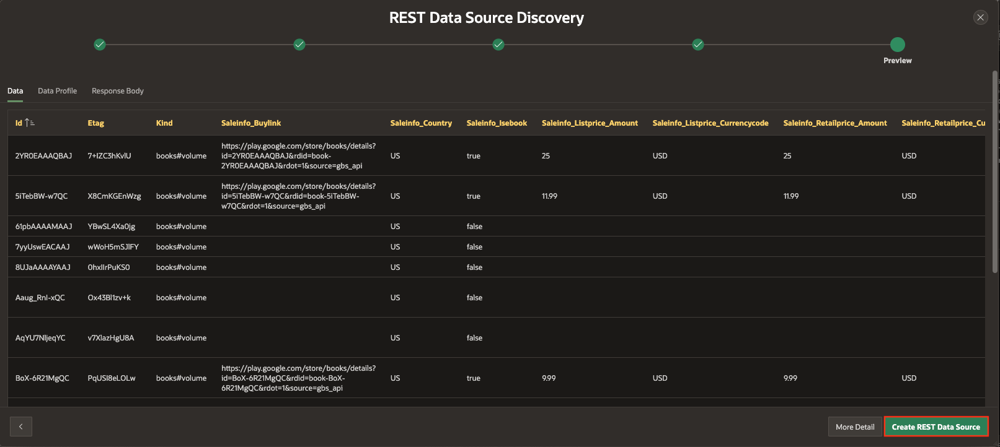

# Create REST Data Source

## Introduction
This lab will walk you through how to create REST Data Source that you will use to get book data from the Google Books API. You will use these REST sources in later labs to build out the book search functionality. Make sure you have access to your API key that you signed up for at the end of the previous lab.

Estimated Lab Time: 10 minutes

### Objectives
In this lab, you will:  
- Sign up for a Google Books API key.
- Create REST data sources using Google Books API.  

### Prerequisites
- Completion of workshop through Lab 1  

## Task 1: Sign up for a Google Books API Key

1. Go to [Google Cloud](https://console.cloud.google.com/apis/credentials) to sign up for a free account.

2. Once registered, follow the [Using the API](https://developers.google.com/books/docs/v1/using#APIKey) instructions on Google Books API site. You will need to create a credential. If you are prompted to create a project for the key first, name the project **Book Club**. Click **Create Credentials** then select **API Key** from the dropdown menu.

    

3. After you have received your API Key, copy it and store it somewhere where you will be able to easily access it.

    

## Task 2: Create REST Data Source

1. Return to the App Builder home by clicking **App Builder** in the APEX navigation bar or the App Builder tile on APEX home page.

    

2. Click on the **Book Club** application.

3. Click **Shared Components** in the middle of your Book Club application home.

    

4. In the Data Sources section at the bottom of the page, click on **REST Data Sources**.

    

5. On the REST Data Sources page, click the **Create** button.

    

    * Select **From scratch**.

    * Click **Next**.

    

6. On the Create REST Data Source Wizard - General page, set the following:

    * Name: **Google Books API** 

    * URL Endpoint: **https://www.googleapis.com/books/v1/volumes**

    * Click **Next**.

    

7. You want to create a new Remote Server. Accept the defaults for Base URL and Service URL Path and click Next.

    

8. Accept the default for Pagination Type (**No Pagination**) and click Next.

    

9. This REST Data Source does not need authentication. Click **Advanced**.

    

10. On the Create REST Data Source Wizard - Parameters page add the following 3 parameters:

    | Parameter Type   | Parameter Name    | Value                             | Is Static |
    | ---------------- | ----------------- | --------------------------------- | --------- |
    | URL Query String | key               | *Insert your unique API key here* | Yes       |
    | URL Query String | q                 | harry potter                      | No        |
    | URL Query String | maxResults        | 40                                | No        |

    

11. Click **Discover**.

12. Click **Create Rest Data Source**.

    

You now know how to create a REST Data Source in Oracle APEX and will be able to get data from the Google Books Database to use for your application. You may now **proceed to the next lab**.

## Learn More

- [REST Data Sources Documentation](https://docs.oracle.com/en/database/oracle/apex/23.2/htmdb/managing-REST-data-sources.html)  

- [REST Data Sources Video](https://www.youtube.com/watch?v=ctCwvD1qavs)  

## Acknowledgements

- **Author** - Maddie Thompson
- **Last Updated By/Date** - Maddie Thompson, November 2024