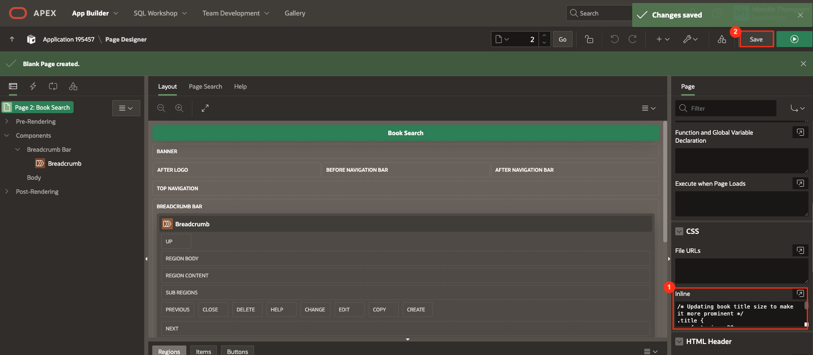
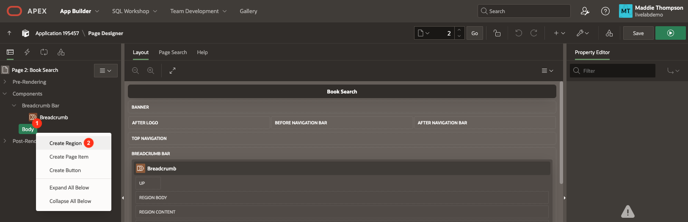
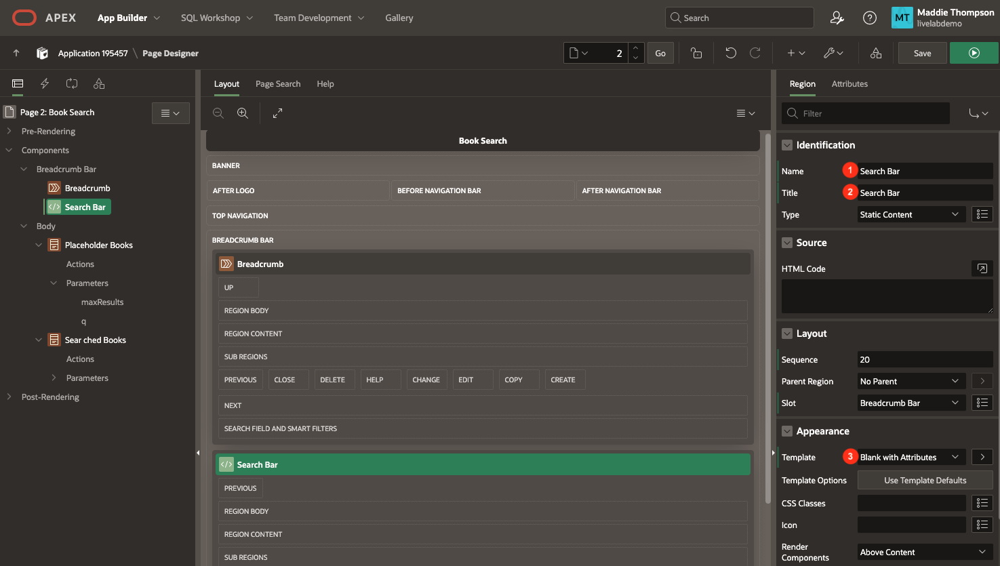
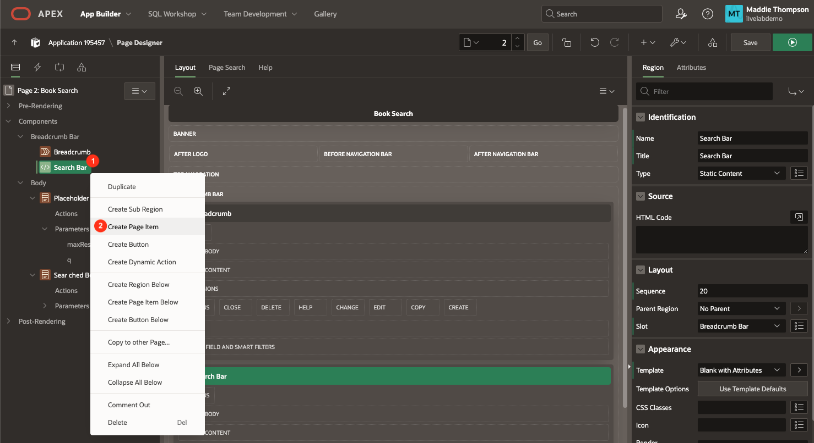
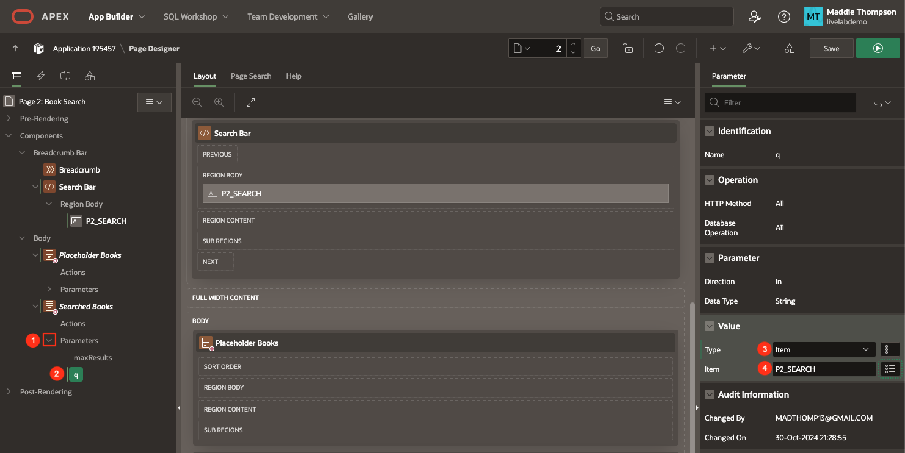
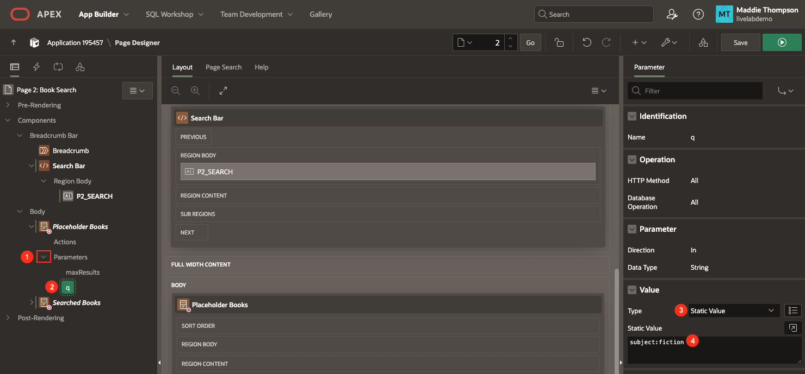
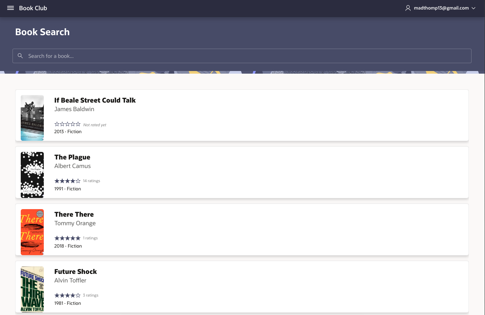

# Create the Book Search Page

## Introduction
You will create and set up the Book Search page so that you can view books and search for a book of your choice. The search functionality must be built out before the library even though the My Library page is the home page of the application. On the Book Search page you will create regions that display the data from the REST source you created in the previous lab, and you will implement a search bar that lets you search for books.

Estimated Lab Time: 20 minutes


### Objectives
In this lab, you will:
- Create a new page.
- Link the Google Books REST data source to the new page.
- Set up search functionality to allow a user to search for a book.

### Prerequisites
- Completion of workshop through Lab 2

## Task 1: Create the Book Search Page
To start, you will create the Book Search page and do a little page setup before adding content to display book data.

1. In the Book Club application home, click the **Create Page** button just underneath Export/Import.

2. In the Create a Page wizard, click **Blank Page**.

    

3. Set the following page attributes:

    * Page Number: **2**

    * Name: **Book Search**

    * Icon: **fa-search**

    * Click **Create Page** to create and go to the new page.

    

4. The Page Designer in APEX is broken up into a few different panes: the rendering pane on the left, the layout pane in the middle, and the properties pane on the right. On your new page, make sure that **Page 2: Book Search** is selected in the rendering pane.

5. In the CSS property group, you will also add some custom CSS to style some of the items on the page.

    * Copy the code below and paste it in the **Inline** property code box:

        ```
        <copy>
        /* Updating book title size to make it more prominent */
        .title {
            font-size: 20px;
            line-height: 1.5;
        }

        .subtitle {
            font-size: 18px;
        }

        .thumbnail {
            margin: 12px 0 12px 12px;
        }

        .published, .categories {
            font-size: 14px;
        }

        .ratings-count {
            font-size: 12px;
            color: gray;
            margin-left: 4px;
        }

        /* if no ratings exist for book, do not display */
        .ratings-count[data-count=""] {
            display: none;
        }

        * align star rating icon with text next to it */
        .fa-star, .fa {
            vertical-align: middle;
        }

        /* Update default width of images */
        .a-CardView-items--row .has-media {
            grid-template-columns: minmax(32px,102px) minmax(0,var(--a-cv-icon-spacer,44px)) 1fr minmax(0,auto);
        }

        /* rating stars */
        .u-hot-text {
            color: var(--rw-dark-body-title-background-color);
        }

        .report-star-rating {
            white-space: nowrap;
        }

        .report-star-rating[data-rating*="0"]::before {
            content: "\f006\f006\f006\f006\f006";
        }

        .report-star-rating[data-rating*="1"]::before {
            content: "\f005\f006\f006\f006\f006";
        }

        .report-star-rating[data-rating*="2"]::before {
            content: "\f005\f005\f006\f006\f006";
        }

        .report-star-rating[data-rating*="3"]::before {
            content: "\f005\f005\f005\f006\f006";
        }

        .report-star-rating[data-rating*="4"]::before {
            content: "\f005\f005\f005\f005\f006";
        }

        .report-star-rating[data-rating="5"]::before {
            content: "\f005\f005\f005\f005\f005";
        }

        .report-star-rating[data-rating=""]::before {
            content: "\f006\f006\f006\f006\f006";
        }

        .report-star-rating[data-rating=""]::after {
            font-size: 12px;
            color: gray;
            font-family: inherit !important;
            font-style: italic;
            content: "Not rated yet";
            vertical-align: middle;
            margin-left: 8px;
        }
        ```

    * The above code styles the book cover images to all be the same size. It also adds some styling for the book rating that you will display on the Card along with the book title, authors, categories and cover image.

6. Click the **Save** button to save your changes.

    

## Task 2: Set up Searched Books
In this step, you will start to add content to your app using the REST data source you set up in Lab 2. First, you will create a region to display placeholder books for when a user has not searched for any books. Then you will create a similar region that displays a list of books based on a search query.

1. In the rendering pane of Page Designer, right click on Content Body and select **Create Region**.

    

2. Set the following properties:

    * Identification → Name: **Placeholder Books**

    * Identification → Title: **Placeholder Books**

    * Identification → Type: **Cards**

    * Source → Location: **REST Source**

    * Source → REST Source: **Google Books API**

    * Local Post Processing → Type: **SQL Query**

    * Local Post Processing → SQL Query:

        ```
        <copy>
        select
            ID,
            ETAG,
            KIND,
            VOLUMEINFO_TITLE,
            REPLACE(REPLACE(REPLACE(VOLUMEINFO_AUTHORS, '["', ''), '"]', ''), '"', ' ') as VOLUMEINFO_AUTHORS_CLEAN,
            VOLUMEINFO_INFOLINK,
            VOLUMEINFO_LANGUAGE,
            VOLUMEINFO_SUBTITLE,
            VOLUMEINFO_PAGECOUNT,
            VOLUMEINFO_PRINTTYPE,
            VOLUMEINFO_PUBLISHER,
            REPLACE(REPLACE(VOLUMEINFO_CATEGORIES, '["', ''), '"]', '') as VOLUMEINFO_CATEGORIES_CLEAN,
            VOLUMEINFO_IMAGELINKS_THUMBNAIL,
            VOLUMEINFO_IMAGELINKS_SMALLTHUMBNAIL,
            VOLUMEINFO_DESCRIPTION,
            VOLUMEINFO_PREVIEWLINK,
            VOLUMEINFO_RATINGSCOUNT,
            VOLUMEINFO_AVERAGERATING,
            SUBSTR(VOLUMEINFO_PUBLISHEDDATE, 1, 4) AS PUBLISHED_YEAR,
            VOLUMEINFO_CONTENTVERSION,
            VOLUMEINFO_MATURITYRATING,
            VOLUMEINFO_INDUSTRYIDENTIFIERS
        from #APEX$SOURCE_DATA#
        where VOLUMEINFO_AVERAGERATING is not null
        order by VOLUMEINFO_AVERAGERATING desc
        ```

        - This will format the array columns (Authors, Categories) by removing the square brackets. It also formats the Published Date column to display only the year.

    

3. Select the **Placeholder Books** region in the left rendering pane. Click the **Attributes** tab at the top of the properties pane on the right of Page Designer. This is where you can select what data will display on each book card.

    * Appearance → Layout: **Horizontal (Row)**

    * Card → Primary Key Column 1: **ID**

    * Title → Column: **VOLUMEINFO\_TITLE**

    * Title → CSS Classes: **title**

    * Subtitle → Column: **VOLUMEINFO\_AUTHORS\_CLEAN**

    * Subtitle → CSS Classes: **subtitle**

    * Body → Advanced Formatting: **on**

        - In your Cards region, you will show the average book rating as star icons. Including multiple columns or custom text is not built-in to an attribute, but you can use Advanced Formatting to replace it with an HTML expression.

    * Body → HTML Expression:

        ```
        <copy>
        &lt;div style="margin-top: -8px;">
            &lt;span class="fa u-hot-text report-star-rating" data-rating="&VOLUMEINFO_AVERAGERATING." title="&VOLUMEINFO_AVERAGERATING." aria-hidden-"true">&lt;/span>&lt;span class="u-VisuallyHidden">&VOLUMEINFO_AVERAGERATING.&lt;/span>&lt;span class="ratings-count" data-count="&VOLUMEINFO_RATINGSCOUNT."> &VOLUMEINFO_RATINGSCOUNT. ratings&lt;/span>&lt;/span>
            &lt;br>
            &lt;span title="Published" class="published"> &PUBLISHED_YEAR.   &lt;/span>&middot;
            &lt;span title="Categories" class="categories">  &VOLUMEINFO_CATEGORIES_CLEAN.   &lt;/span>
            &lt;br>
        &lt;/div>
        ```
        *Note: In the HTML Expression, the &NAME. syntax is used to create a substitution string for the column values for each book. To learn more, check out the Resources section at the end of this lab.*

        

    * Media → Source: **Image URL**

    * Media → URL: **&VOLUMEINFO\_IMAGELINKS\_THUMBNAIL.**

    * Media → Position: **First**

    * Media → Appearance: **Square**

    * Media → Sizing: **Cover**

    * Media → CSS Classes: **thumbnail**

        

4. You also need to create a Cards region to display the searched books. It will be almost exactly like the Placeholder Books region, with a few minor changes.

5. Right-click on the Placeholder Books region in the rendering pane and select **Duplicate** to create a copy of the region.

6. Set the following properties:

    * Identification → Name: **Searched Books**

    * Identification → Title: **Searched Books**

7. You also need to set the pagination attributes for the Searched Books region, because you are getting all the search results at one time. Within Searched Books, set the following Pagination properties in Searched Books region Attributes tab:

    * Type: **Page**

    * Show Total Count: **on**

    * Cards per page: **15**

    

8. Click the **Save** button to save your changes.

## Task 3: Add the Search Bar
The final region that needs to be added to the Book Search page is the search bar, which will allow a user to search for books. Additionally, both the Placeholder and Searched book regions are currently displaying at the same time on the Book Search page. You want to only show one at a time based on the condition that the Searched Books region displays only if the search bar page item has a value. If the search bar has no value, the page will only display the Placeholder Books region.

1. Right click on Breadcrumb Bar position in the rendering pane and select **Create Region**.

    * Identification → Title: **Search Bar**

    * Appearance → Template: **Blank with Attributes**

    

2. Right click on the new Search Bar region and select **Create Page Item**.

    

    * Identification → Name: **P2\_SEARCH**

    * Appearance → Template: **Hidden**

    * Appearance → open the Template Options dialog:

        - Select **Stretch Form Item**

        - Size: **X Large**

        - Bottom Margin: **Medium**

        - Left Margin: **Large**

        - Right Margin: **Large**

        - Click **Ok**.

    * Appearance → Icon: **fa-search**

    * Appearance → Value Placeholder: **Search for a book...**

    

3. Click on the **Placeholder Books** region.

    * Scroll down to Server-Side Condition in the properties pane.

        - Type: **Item is NULL**

        - Item: **P2\_SEARCH**

    * Now you are displaying the Placeholder Books region based on a condition. If the P2\_SEARCH item is NULL, then the region will display. You will create an opposite condition for the Searched Books region.

    

4. Click on the **Searched Books** region.

    * Scroll down to Server-Side Condition.

        - Type: **Item is NOT NULL**

        - Item: **P2\_SEARCH**

    * Now, you are only displaying Searched Books if the P2\_SEARCH item is NOT NULL (has a value).

5. In order to actually search for a book, you have to edit the query parameter that is submitted with a call to the Google Books API. A search query is required, otherwise you will not get any results back. When you look at the two Cards regions in the rendering pane, you can see that underneath Searched Books there is a **Parameters** section.

6. Expand the section and you will see **q** listed as a parameter. This is what you will link to the P2_SEARCH page item in order to control the search.

7. Click on the **q** parameter. You will see that its Type is REST Source Default, which is using the default value from the used in the URL to set up the REST source. Change the values to the following:

    * Value → Type: **Item**

    * Value → Item: **P2\_SEARCH**

    

8. Now do the same thing for the Placeholder Books region. In the left rendering pane under the **Placeholder Books** region, expand the **Parameters** section and click on the **q** parameter.

9. At the bottom of the properties pane on the right of Page Designer, set the following for the **q** parameter:

    * Value → Type: **Static Value**

    * Value → Static Value: **subject:fiction**

        - The Google Books API requires a parameter, which can be either a search term or one of the other predefined parameters such as ISBN or subject. Here we are going to display books of a certain genre.

    

10. Click the **Save and Run** button at the top right of the Page Designer.

11. You should only see the search bar and the list of placeholder (fiction) books.

    

12. Type "harry potter" in the search bar and hit Enter (Return on Mac).

    * You should get results for books with the search term "harry potter" in the title.

    

13. Delete "harry potter" from the search bar and press Enter (Return on Mac). The placeholder books should reappear.

14. In the Development Bar at the bottom of the page, click **Page 2** to return to editing Page 2 in Page Designer.

	

You now know how to create a page in your APEX application and add components to define content in Page Designer. You may now **proceed to the next lab**.

## Learn More

- [Page Designer Documentation](https://docs.oracle.com/en/database/oracle/apex/23.2/htmdb/about-page-designer.html)

- [Cards Documentation](https://docs.oracle.com/en/database/oracle/apex/23.2/htmdb/managing-cards.html)

- [Cards in Universal Theme](https://apex.oracle.com/pls/apex/r/apex_pm/ut/card-regions)

- [Variables in APEX](https://www.talkapex.com/2011/01/variables-in-apex/)

## Acknowledgements

- **Author** - Maddie Thompson
- **Last Updated By/Date** - Maddie Thompson, November 2024