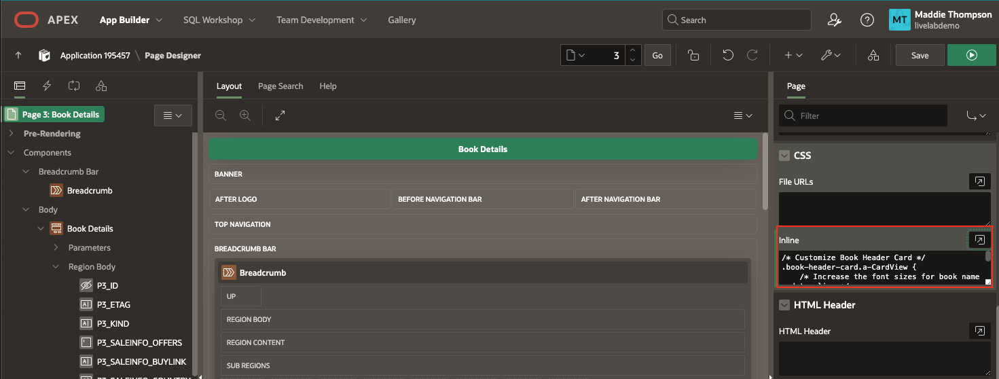
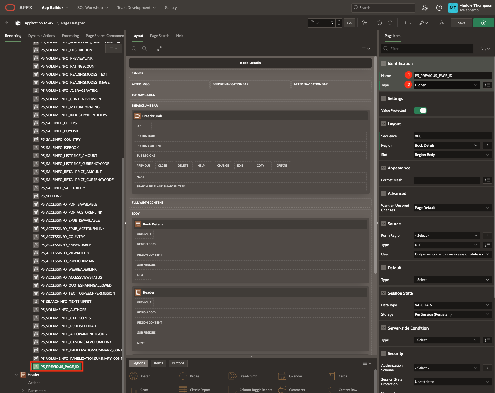
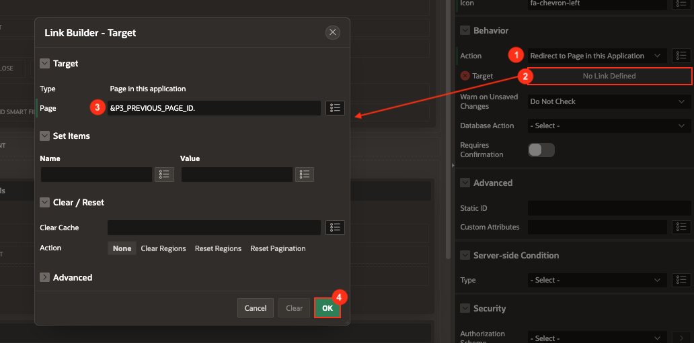

# Create the Book Details Page

## Introduction
In this lab, you will set up a new page that displays the details of a single book. When you click on a specific book from the Book Search page and, eventually, the My Library page, the details for that book will be retrieved from the Google Books API and shown in the Book Details page. 

Estimated Lab Time: 20 minutes


### Objectives
In this lab, you will:  
- Create a new page, Book Details.  
- Use the Google Books REST source to display data on the Book Details page.  
- Connect the Book Details page to the Book Search page.
- Add button to the Book Details page to navigate back to the previous page.

### Prerequisites
- Completion of workshop through Lab 3

## Task 1: Create the Book Details Page
You will start by creating a new page, Book Details, which contains a Form. While this form will not display in the final Book Details page, it will hold the Book Details data needed to display content in other regions on the page.

1. In the toolbar at the top of the Page Designer, click the **Create** button (3 buttons left of the Save button) and select **Page**. 

    * Click **Form**.

    

    * Page Number: **3**
    
    * Name: **Book Details**

    * Data Source: **REST Data Source**

    * REST Data Source: **Google Books API**

    * Use Navigation: **off**

    * Click **Next**.

    

    * Select **ID (Varchar2)** as the Primary Key Column 1 value.

    * Click **Create Page**.

    

    * You should now be on page 3, the **Book Details** page.

2. Make sure **Page 3: Book Details** is selected in the rendering pane on the left.

3. In the **CSS** property group, paste the code below and into the **Inline** CSS code editor:

    ```
    <copy>
    /* Customize Book Header Card */
    .book-header-card.a-CardView {
        /* Increase the font sizes for book name and tag line */
        --a-cv-title-font-size: 24px;
        --a-cv-subtitle-font-size: 16px;

        /* Add additional spacing around the header content */
        --ut-cv-subtitle-margin: 16px 0 0 0;
        display: flex;
        padding: 0;
        background: none;
        border: none;
        box-shadow: none;
    }

    /* position badge next to Book Title */
    .a-CardView-badge {
        margin-inline-start: var(--a-cv-header-item-spacing-x, 8px);
        position: absolute;
        top: 20px;
    }

    .a-CardView-header {
        align-items:flex-start;
    }

    /* make Book Cover image larger */
    .thumbnail {
        border-radius: var(--a-cv-border-radius);
        box-shadow: var(--a-cv-state-shadow, var(--a-cv-type-shadow, var(--a-cv-shadow, none)));
        margin-right: 16px;
        height: 250px;
        width: 175px;
    }

    .subtitle {
        font-size: 20px;
        line-height: 1.5;
    }

    .fa-star, .fa {
        vertical-align: middle;
    }

    .categories {
        font-size: 18px;
    }

    .ratings-count {
        font-size: 12px;
        color: gray;
        margin-left: 4px;
    }

    .ratings-count[data-count=""] {
    display: none;
    }

    .published, .pages {
        color: #4e4e4e;
    }

    .preview-link {
        font-size: 14px;
        padding-top: 12px;
    }

    /* rating stars */

    .u-hot-text {
        color: var(--rw-dark-body-title-background-color);
    }

    .report-star-rating {
    white-space: nowrap;
    }

    .report-star-rating[data-rating*="0"]::before {
    content: "\f006\f006\f006\f006\f006";
    }

    .report-star-rating[data-rating*="1"]::before {
    content: "\f005\f006\f006\f006\f006";
    }

    .report-star-rating[data-rating*="2"]::before {
    content: "\f005\f005\f006\f006\f006";
    }

    .report-star-rating[data-rating*="3"]::before {
    content: "\f005\f005\f005\f006\f006";
    }

    .report-star-rating[data-rating*="4"]::before {
    content: "\f005\f005\f005\f005\f006";
    }

    .report-star-rating[data-rating="5"]::before {
    content: "\f005\f005\f005\f005\f005";
    }

    .report-star-rating[data-rating=""]::before {
    content: "\f006\f006\f006\f006\f006";
    }

    .report-star-rating[data-rating=""]::after {
    font-size: 12px;
    color: gray;
    font-family: inherit !important;
    font-style: italic;
    content: "Not rated yet";
    vertical-align: middle;
    margin-left: 8px;
    }
    ```

    * The CSS above will style the page header you are going to create. While the original layout and format of the Cards region type can get you pretty far, a little CSS goes a long way in rounding out the entire look of a component or page.

    


## Task 2: Create the Header and Overview
You can use the value stored in the P3\_ID page item in the Book Details form to specify which book to get the details for. Then you can utilize a few columns from the Google Books REST source to create a nice header that includes the book cover, title, authors, categories, rating, number of ratings, number of pages, publisher and published year. In addition to the header, you will add a region to display the overview of the book formatted in a way that is easy to read.

1. You will first need to hide all the Book page items so that you can still access the values stored in them but create your own content for the page. To do this, you can set the Type of a column to Hidden, which will not display an item on the frontend.

    * To select all items, click on the first item under the Book Details region, P3\_ID, and then hold shift and click on the last item, P3\_VOLUMEINFO\_PANELIZATIONSUMMARY\_CONTAINSIMAGEBUBBLES.

    * In the Page Items editing pane, set Type: **Hidden**

    

2. Since we aren't entering details into the form, we don't need the Cancel button that was added by default. Under Close, right click on **CANCEL** button and click **Delete**.

    * We'll add a button to navigate back to the previous page later.

    

3. To start creating the header for the Book Details page, right click on Content Body and select **Create Region**.

    * Set the following:

        - Title: **Header**

        - Type: **Cards**

        - Source → Location: **REST Source**

        - Source → REST Source: **Google Books API**

        - Local Post Processing → Type: **SQL Query**

        - Local Post Processing → replace the existing SQL query with the following:

            ```
            <copy>
            select ID,
                ETAG,
                KIND,
                VOLUMEINFO_TITLE,
                REPLACE(REPLACE(REPLACE(VOLUMEINFO_AUTHORS, '["', ''), '"]', ''), '"', ' ') as VOLUMEINFO_AUTHORS_CLEAN,
                VOLUMEINFO_INFOLINK,
                VOLUMEINFO_LANGUAGE,
                VOLUMEINFO_SUBTITLE,
                VOLUMEINFO_PAGECOUNT,
                VOLUMEINFO_PRINTTYPE,
                VOLUMEINFO_PUBLISHER,
                REPLACE(REPLACE(VOLUMEINFO_CATEGORIES, '["', ''), '"]', '') as VOLUMEINFO_CATEGORIES_CLEAN,
                VOLUMEINFO_IMAGELINKS_THUMBNAIL,
                VOLUMEINFO_IMAGELINKS_SMALLTHUMBNAIL,
                VOLUMEINFO_DESCRIPTION,
                VOLUMEINFO_PREVIEWLINK,
                VOLUMEINFO_RATINGSCOUNT,
                VOLUMEINFO_READINGMODES_TEXT,
                VOLUMEINFO_READINGMODES_IMAGE,
                VOLUMEINFO_AVERAGERATING,
                SUBSTR(VOLUMEINFO_PUBLISHEDDATE, 1, 4) AS PUBLISHED_YEAR,
                VOLUMEINFO_CONTENTVERSION,
                VOLUMEINFO_MATURITYRATING,
                VOLUMEINFO_INDUSTRYIDENTIFIERS
            from #APEX$SOURCE_DATA#
            where ID = :P3_ID
            ```

        - The above query is a simplified version of the original query because you only need a few columns for the header. It also converts PUBLISHEDDATE into year format and removes the punctuation from the array columns (AUHORS, CATEGORIES).

        - Appearance → Template: **Blank with Attributes**

        

4. Click on the **Attributes** tab at the top of the Header region Property Editor.

    * Set the following:

        - Appearance → Layout: **Horizontal (Row)**

        - Card → CSS Classes: **book-header-card**

        - Card → Primary Key Column 1: **ID**

        - Title → Advanced Formatting: **on**

        - Title → HTML Expression:

            ```
            <copy>
            &lt;span class="a-CardView-title">&VOLUMEINFO_TITLE.&lt;/span>
            &lt;span class="a-CardView-badge &BADGE_COLOR.">&BADGE_LABEL.&lt;/span>
            &lt;br>
            &lt;span class="subtitle"> &VOLUMEINFO_AUTHORS_CLEAN. &lt;/span>
            &lt;br>&lt;br>
            &lt;span class="fa fa-lg u-hot-text report-star-rating" data-rating="&VOLUMEINFO_AVERAGERATING." title="&VOLUMEINFO_AVERAGERATING." aria-hidden-"true">&lt;/span><span class="u-VisuallyHidden">&VOLUMEINFO_AVERAGERATING.&lt;/span>&lt;span class="ratings-count" data-count="&VOLUMEINFO_RATINGSCOUNT."> &VOLUMEINFO_RATINGSCOUNT. ratings&lt;/span>&lt;/span>
            &lt;br>&lt;br>
            &lt;span class="categories">&VOLUMEINFO_CATEGORIES_CLEAN.&lt;/span> 
            &lt;br>&lt;br>
            &lt;span class="published">Published &PUBLISHED_YEAR.  &middot;  &VOLUMEINFO_PUBLISHER.&lt;/span>
            &lt;br>
            &lt;span class="pages">&VOLUMEINFO_PAGECOUNT. pages&lt;/span>
            &lt;br>
            &lt;div class="preview-link">&lt;a href="&VOLUMEINFO_PREVIEWLINK." target="_blank">Preview Book&lt;/a>&lt;/div>
            ```

        - Subtitle → Advanced Formatting: **on**

        - Subtitle → HTML Expression:

            ```
            <copy>
            &lt;div class="preview-link">Preview Book&lt;/div>
            ```
            
            *Note: We are only putting the Preview Book link in the Subtitle section because later we will create a card action type of Subtitle that will open a modal containing the book preview when the subtitle content is clicked.*

        - Icon and Badge → Icon Source: **Image URL**

        - Icon and Badge → Image URL: **&VOLUMEINFO\_IMAGELINKS\_THUMBNAIL.**

        - Icon and Badge → Icon CSS Classes: **thumbnail**

        


5. In order to get the details for a specific book selected from the Search page, you have to update the **q** parameter that is part of the call to the Google Books API. When you look at the Details and Header regions in the rendering pane, you can see that under each is a Parameters section, just like there was for Placeholder and Searched Books on the Book Search page.

6. Expand the **Parameters** section under the **Book Details** region.

7. Click on the **q** parameter.

    * Change the Type from REST Source Default to **Item**.

    * In the Item field, enter **P3\_ID**.

    

8. Follow steps 6 and 7 to update the q parameter for the **Header** region.

9. Finally, you will add a region to display the book Overview to go along with the nice header containing the book details.

10. In the rendering pane on the left, right click on Content Body and select **Create Region**.

11. Set the following properties:

    * Identification → Title: **Overview**

    * Source → HTML Code: **&P3\_VOLUMEINFO\_DESCRIPTION.**

    * Appearance → Template: **Content Block**

    * Appearance → Template Options:

        - Region Title: **Small**

        - Top Margin: **Medium**

        - Click **Ok**.

        

12. Click **Save**.


## Task 3: Connect the Details Page to the Search Page
To be able to view the details of any book you click on on the Book Search page, you can link the Details page to the Search page. However, in order to get the details for the specific book you clicked on, you have to pass some data from the Search page to the Details page.

1. Navigate to page **2: Book Search** by clicking the down arrow in the page navigation on the Page Designer toolbar.

2. On the Book Search page, you can see in the rendering pane that both Placeholder Books and Searched Books have an **Actions** section underneath them.

3. Right click on **Actions** underneath Placeholder Movies and select **Create Action**.

    

    * Identification → Type: **Full Card**

    * The Link section is where you can connect page 3 to page 2 by redirecting the user to a new page.

    * Click on **No Link Defined** next to Target to open the Link Builder dialog.

        - Page: **3**

        - You also need to set the value of the ID item on page 3 (P3\_ID) so that the Book Details page has the ID of the book that was clicked on.

        - Set Items:

            - Name: **P3\_ID**  |  Value: **&ID.**

            - Name: **P3\_PREVIOUS\_PAGE\_ID**  |  Value: **2**

        	*Note: You can also use the buttons next to the name and value fields to browse items that you can pass values to. Notice that the options for Name all come from the Book Details page (P3), because that is the item you want to set. The options for Value are the columns from the Book Search data source because this is the what you are getting from page 2 and passing to page 3.*

            *Note: P3_PREVIOUS_PAGE_ID doesn't appear when browsing items because we haven't created it yet so you'll need to type it in manually. We will create that page item in the next task.*

        - Click **Ok**.

        

4. Follow step 3 for the **Searched Books** region to create a Full Card action that redirects to page 3.

5. Click **Save**.

6. Refresh the page where your application is running.

7. Test the Book Details page by opening the Book Search page then clicking on a book of choice to see the details.

    

## Task 4: Create Preview Book Page
You will create another new page, Preview Book, which contains a Form. While this form will not display in the final Book Preview page, it will hold the Book Details data needed to display content in other regions on the page. On this page we will be using the Google Book Embedded Viewer API to embed the book preview content directly into our application with JavaScript.

1. In the toolbar at the top of the Page Designer, click the **Create** button (3 buttons left of the Save button) and select **Page**. 

    * Click **Form**.

    

    * Page Number: **4**
    
    * Name: **Preview Book**

    * Page Mode: **Modal Dialog**

    * Data Source: **REST Data Source**

    * REST Data Source: **Google Books API**

    * Click **Next**.

    

    * Select **ID (Varchar2)** as the Primary Key Column 1 value.

    * Click **Create Page**.

    

    * You should now be on page 4, the **Preview Book** page.

2. Make sure **Page 4: Preview Book** is selected in the rendering pane on the left.

3. In the **CSS** property group, paste the code below and into the **Inline** CSS code editor:

    ```
    <copy>
    /* set size of embedded viewer container */
    #viewerCanvas {
        width: auto;
        height: 500px;
    }
    ```
    

4. Like we did previously for the Book Details page, you will first need to hide all the Book page items so that you can still access the values stored in them but create your own content for the page. To do this, you can set the Type of a column to Hidden, which will not display an item on the frontend.

    * To select all items, click on the first item under the Preview Book region, P4\_ID, and then hold shift and click on the last item, P4\_VOLUMEINFO\_PANELIZATIONSUMMARY\_CONTAINSIMAGEBUBBLES.

    * In the Page Items editing pane, set Type: **Hidden**

    

5. Since we aren't entering details into the form, we don't need the Cancel button that was added by default. Under Close, right click on **Buttons** region under Dialog Footer in the rendering pane and click **Delete**.

    

6. In order to get the preview for a specific book selected from the Details page, you have to update the **q** parameter that is part of the call to the Google Books API. When you look at the Preview Book region in the rendering pane, you can see that under it is a Parameters section, just like there was for the Details and Header regions on the Book Details page.

7. Expand the **Parameters** section under the **Preview Book** region.

8. Click on the **q** parameter.

    * Change the Type from REST Source Default to **Item**.

    * In the Item field, enter **P4\_ID**.

    


9. We will also need to define a primary key for this form region.

10. Expand the **Region Body** section under the **Preview Book** region.

11. Click on the **P4\_ID** page item.

    * Source → Primary Key: **on**

    

12. Now we will add a region to display the viewer from the Google Books Embedded Viewer API.

13. To start creating the header for the Book Details page, right click on Content Body and select **Create Region**.

    * Set the following:

        - Name: **Embedded Viewer**

        - Source → HTML Code:

            ```
            <copy>
            <html>
            <head>
                <meta http-equiv="content-type" content="text/html; charset=utf-8"/>
                <title>Google Books Embedded Viewer API Example</title>
                <script type="text/javascript" src="https://www.google.com/books/jsapi.js"></script>
                <script type="text/javascript">
                google.books.load();

                function initialize() {
                    var viewer = new google.books.DefaultViewer(document.getElementById('viewerCanvas'));
                    viewer.load($v( "P4_ID" ));
                }

                google.books.setOnLoadCallback(initialize);
                </script>
            </head>
            <body>
                <div id="viewerCanvas"></div>
            </body>
            </html>
            ```
            

14. Click **Save**.

## Task 5: Connect the Preview Page to the Details Page
To be able to view the preview of a book you click on from the Book Details page, you need to link the Preview page to the Details page. However, in order to get the preview for the specific book you clicked on, you have to pass some data from the Details page to the Preview page.

1. Navigate to page **3: Book Details** by clicking the down arrow in the page navigation on the Page Designer toolbar.

2. On the Book Details page, you can see in the rendering pane that the Header region has an **Actions** section underneath it.

3. Right click on **Actions** underneath Header and select **Create Action**.

    

    * Identification → Type: **Subtitle**

    * The Link section is where you can connect page 4 to page 3 by redirecting the user to a new page.

    * Click on **No Link Defined** next to Target to open the Link Builder dialog.

        - Page: **4**

        - You also need to set the value of the ID item on page 4 (P4\_ID) so that the Preview Book page has the ID of the book that was clicked on.

        - Set Items:

            - Name: **P4\_ID**  |  Value: **&ID.**

        - Click **Ok**.

        

4. Click **Save**.


## Task 6: Implement Back Button Navigation
Now that we've connected the Book Details page to the Book Search page, we will need a way to navigate back to the previous page. Since Book Details is a common page (can be navigated from both the Book Search page and the My Library page), we will need to create a page item to hold the previous page value so the Back button knows where to redirect the user.

1. Navigate to page **3: Book Details** by clicking the down arrow in the page navigation on the Page Designer toolbar.

2. Right click on the **Book Details** region in the rendering pane and select **Create Page Item**.

    

3. Set the following properties:

    * Identification → Name: **P3\_PREVIOUS\_PAGE\_ID**

    * Identification → Type: **Hidden**

    

4. Right click on the **Breadcrumb** region in the rendering pane and select **Create Button**.

    

5. Set the following properties:

    * Identification → Button Name: **BACK**

    * Identification → Label: **Back**

    * Layout → Slot: **Up**

    * Appearance → Button Template: **Icon**

    * Appearance → Template Options:

        - Style: **Remove UI Decoration**

        - Click **Ok**.
    
    * Appearance → Icon: **fa-chevron-left**

    

6. Set the following properties for the button behavior:

    * Behavior → Action: **Redirect to Page in this Application**

    * Click on the Link → Target field to open the link builder.

        - Page: **&P3\_PREVIOUS\_PAGE\_ID.**

        - Click **Ok**.

    

You have now set up the Book Details page and set it up to open for any card that is selected from the Book Search page. You may now **proceed to the next lab**.

## Acknowledgements

- **Author** - Maddie Thompson, Sakthi Gopinath
- **Last Updated By/Date** - Maddie Thompson, November 2024