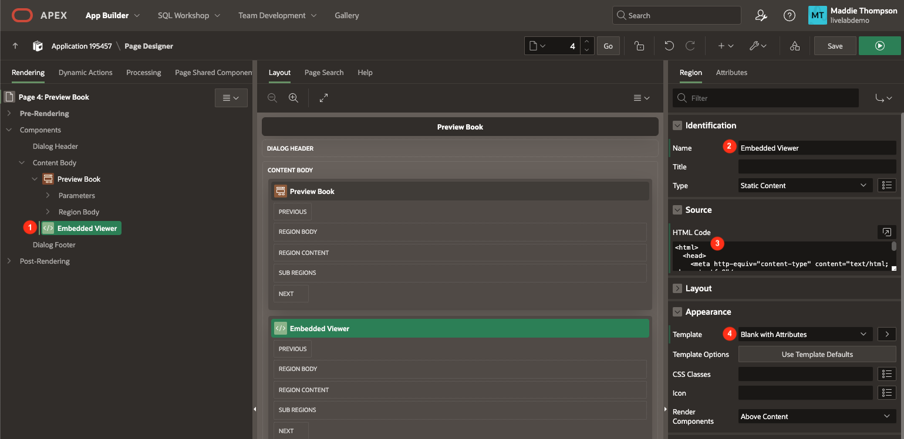

# Create the Preview Book Page

## Introduction
In this lab, you will set up a new page that displays the preview of a book using the Google Books Embedded Viewer API. This API allows you to embed the book content directly into your application.

Estimated Lab Time: 10 minutes

### Objectives
In this lab, you will:
- Create a new page, Preview Book.
- Use the Google Books Embedded Viewer API to display the preview of a book.
- Connect the Preview Book page to the Book Details page.

### Prerequisites
- Completion of workshop through Lab 4

## Task 1: Create the Preview Book Page
You will create a new page, Preview Book, which contains a Form. While this form will not display in the final Preview Book page, it will hold the book details data needed to display content in other regions on the page. On this page we will be using the Google Book Embedded Viewer API to embed the book preview content directly into our application with JavaScript.

1. In the toolbar at the top of the Page Designer, click the **Create** button (3 buttons left of the Save button) and select **Page**.

    * Click **Form**.

    

    * Page Number: **4**

    * Name: **Preview Book**

    * Page Mode: **Modal Dialog**

    * Data Source: **REST Data Source**

    * REST Data Source: **Google Books API**

    * Click **Next**.

    

    * Select **ID (Varchar2)** as the Primary Key Column 1 value.

    * Click **Create Page**.

    

    * You should now be on page 4, the **Preview Book** page.

2. Make sure **Page 4: Preview Book** is selected in the rendering pane on the left.

3. In the **CSS** property group, paste the code below and into the **Inline** CSS code editor:

    ```
    <copy>
    /* set size of embedded viewer container */
    #viewerCanvas {
        width: auto;
        height: 500px;
    }
    ```

    

4. Like you did previously for the Book Details page, you will first need to hide all the book page items so that you can still access the values stored in them but create your own content for the page. To do this, you can set the Type of a column to Hidden, which will not display an item on the frontend.

    * To select all items, click on the first item under the Preview Book region, **P4\_ID**, and then hold shift and click on the last item, **P4\_VOLUMEINFO\_PANELIZATIONSUMMARY\_CONTAINSIMAGEBUBBLES**.

    * In the Page Items editing pane, set Type: **Hidden**

    

5. Since the user isn't entering details into the form, you don't need the Cancel button that was added by default. Under Close, right click on **Buttons** region under Dialog Footer in the rendering pane and click **Delete**.

    

6. In order to get the preview for a specific book selected from the Details page, you have to update the **q** parameter that is part of the call to the Google Books API. When you look at the Preview Book region in the rendering pane, you can see that under it is a Parameters section, just like there was for the Details and Header regions on the Book Details page.

7. Expand the **Parameters** section under the **Preview Book** region.

8. Click on the **q** parameter.

    * Change the Type from REST Source Default to **Item**.

    * In the Item field, enter **P4\_ID**.

    

9. We will also need to define a primary key for this form region.

10. Expand the **Region Body** section under the **Preview Book** region.

11. Click on the **P4\_ID** page item.

    * Source → Primary Key: **on**

    

## Task 2: Set up Embedded Viewer Region
In this step, you will add a region to display the viewer from the Google Books Embedded Viewer API.

1. Right-click on Content Body and select **Create Region**.

    * Set the following:

        - Name: **Embedded Viewer**

        - Source → HTML Code:

            ```
            <copy>
            &lt;html>
            &lt;head>
                &lt;meta http-equiv="content-type" content="text/html; charset=utf-8"/>
                &lt;title>Google Books Embedded Viewer API Example&lt;/title>
                &lt;script type="text/javascript" src="https://www.google.com/books/jsapi.js">&lt;/script>
                &lt;script type="text/javascript">
                google.books.load();
                function initialize() {
                    var viewer = new google.books.DefaultViewer(document.getElementById('viewerCanvas'));
                    viewer.load($v( "P4_ID" ));
                }
                google.books.setOnLoadCallback(initialize);
                &lt;/script>
            &lt;/head>
            &lt;body>
                &lt;div id="viewerCanvas"></div>
            &lt;/body>
            &lt;/html>
            ```

            

2. Click **Save**.

## Task 3: Connect the Preview Page to the Details Page
To be able to view the preview of a book you click on from the Book Details page, you need to link the Preview page to the Details page. However, in order to get the preview for the specific book you clicked on, you have to pass some data from the Details page to the Preview page.

1. Navigate to page **3: Book Details** by clicking the down arrow in the page navigation on the Page Designer toolbar.

2. On the Book Details page, you can see in the rendering pane that the Header region has an **Actions** section underneath it.

3. Right-click on **Actions** underneath Header and select **Create Action**.

    

    * Identification → Type: **Subtitle**

    * The Link section is where you can connect page 4 to page 3 by redirecting the user to a new page.

    * Click on **No Link Defined** next to Target to open the Link Builder dialog.

        - Page: **4**

        - You also need to set the value of the ID item on page 4 (P4\_ID) so that the Preview Book page has the ID of the book that was clicked on.

        - Set Items:

            - Name: **P4\_ID**  |  Value: **&ID.**

        - Click **Ok**.

        

4. Click **Save**.

5. Refresh the page where your application is running.

6. Test the Preview Book page by clicking on a book card then clicking the **Preview Book** link on the Book Details page.

    


You now know how to create a modal dialog page in your APEX application and add components to define content in Page Designer. You may now **proceed to the next lab**.

## Acknowledgements

- **Author** - Maddie Thompson
- **Last Updated By/Date** - Maddie Thompson, November 2024