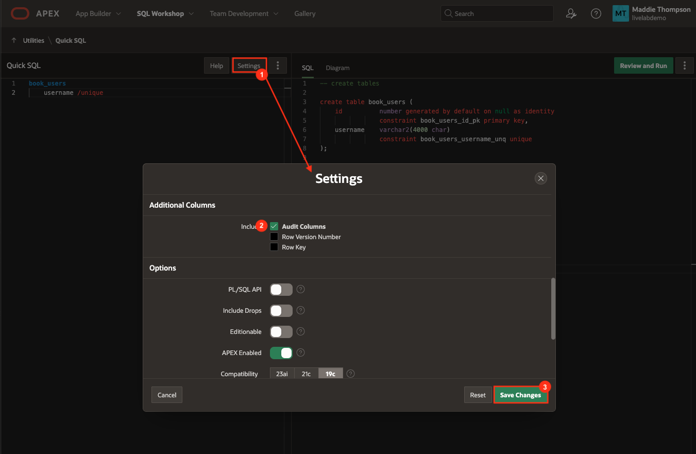
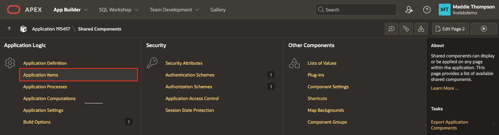
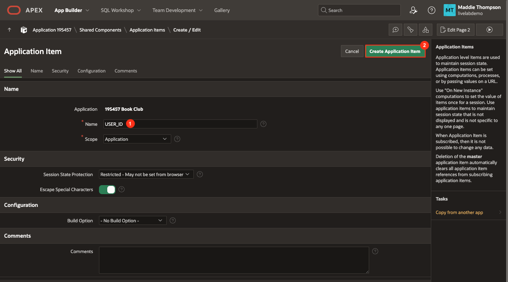
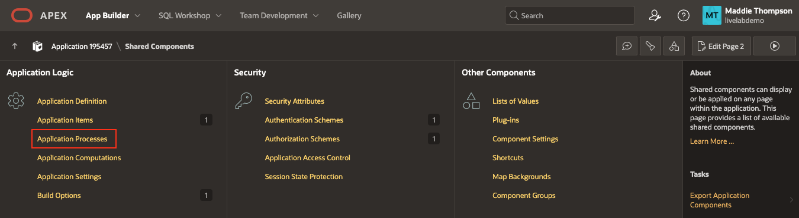
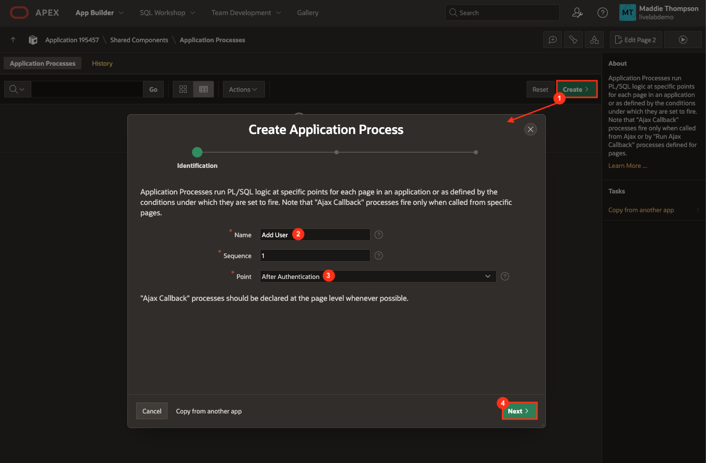
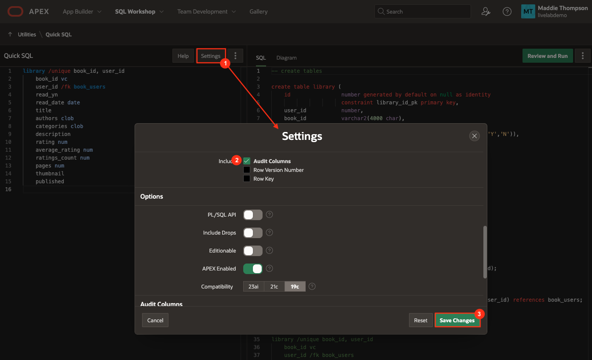
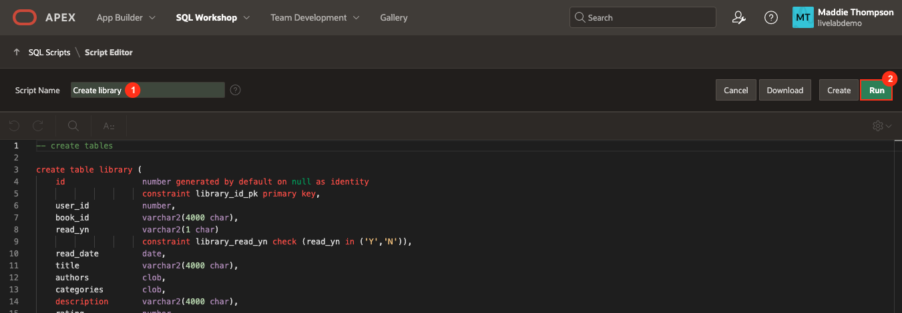

# Create Users and Library Tables

## Introduction
Up to this point, most of the work has revolved around implementing the REST data source and creating pages to use that data on. In this lab, you will create local tables to store user and book data. You will also add an application item and process, which will capture and store a user email and ID when a user logs into the app. This is what allows multiple users to have their own library.

Estimated Lab Time: 10 minutes

### Objectives
In this lab, you will:  
- Set up the book_users and library tables using Quick SQL.  
- Create an application process and item for storing user information.

### Prerequisites
- Completion of workshop through Lab 5

## Task 1: Create the Book Users Table
The first table you need to create is the book\_users table. It is very simple, but it needs to be created before the library table so that you can access the user ID. The library table has a foreign key, user\_id, that will link it to the book\_users table and allow different users to have their own unique lists.

1. In the Page Designer tab in your browser, click the down arrow next to SQL Workshop in the APEX navigation bar, hover over Utilities, and select **Quick SQL**. 

    

2. Copy the code below and paste into the first line of the code editor:

    ```
    <copy>
    book_users
        username /unique
    ```

    

3. Click **Settings** on the top right of the Quick SQL toolbar. 

    * Scroll down to Additional Columns and check **Audit columns**.

    * This will automatically add the Created, Created\_By, Updated, and Updated\_By columns to the table.

    * Click **Save Changes**.

    

4. Click the **Review and Run** button. 

    

5. Enter **Create book users** as the name for the script and select **Run**.

    

6. Click **Run Now**. You should see a success page with 2 statements successfully processed.

    

7. Now you will add an Application Item and Application Process, which will capture a user's email when they log in and assign them an ID so that you can keep track of their unique library.

## Task 2: Create the Application Item and Process
To store data within the book\_users database, you will use an application process. The process checks a user's email when they log in and if they are a new user, it adds them to a local table, assigning them an ID. The ID of the current user is also stored in an application item, which will be used when a user adds, removes, or updates books in their library.

1. Click on **App Builder** in the top APEX toolbar.

2. Click on your **Book Club** app.

3. Click on **Shared Components**.

4. In the Application Logic section of the page, click **Application Items**.

    

5. Click **Create**.

    * Set Name: **USER_ID**

    * Click **Create Application Item**.

    

6. Go back to Shared Components and click on **Application Processes**.

    

7. Click **Create**.

    * Name: **Add User**

    * Point: **After Authentication**

    * Click **Next**.

    

    * Copy and paste the following code into the Code editor box in the Source section:

    ```
    <copy>
    -- create book user ID
    -- query book_users table to check for existing user
    -- if yes, return PK as user_id
    -- if no, add new user to book_users
    declare
        l_user_id number;
    begin
        select id into l_user_id from book_users where username = :APP_USER;

        :USER_ID := l_user_id;

        exception
            when no_data_found then
            insert into book_users 
                    (username)
                values 
                    (:APP_USER)
                returning 
                    id into :USER_ID;
    end;
    ```

    * Click **Next**.

    

    * Click **Create Process**.

8. You have now set up an application item that keeps track of the current user's ID and added a process to store a user in the book\_users table.

9. To initialize the user id for your book club app, you will need to sign out of your app in the tab in your browser where your app is running and sign back in.

10. On the My Library page of your app, click the button at the top right of the screen where your username is displayed and click Sign Out.

    

11. Now, sign back in and your new application process will run and store your user ID in the book\_users table and the USER\_ID application item.

    

12. Next, you'll set up a new table using Quick SQL to store all of a user's books that they add to their library.

## Task 3: Create the Library Table
You will need a table to store some basic book information in addition to the user information. This data is what will be the source for the My Library page.

1. In the toolbar at the top of your APEX workspace, click the down arrow next to SQL Workshop, hover over Utilities, and select **Quick SQL**.

2. Copy the code below and replace the existing code by pasting it into the Quick SQL pane:

    ```
    <copy>
    library /unique book_id, user_id
        book_id vc
        user_id /fk book_users
        read_yn
        read_date date
        title
        authors clob
        categories clob
        description
        rating num
        average_rating num
        ratings_count num
        pages num
        thumbnail
        published
    ```

	* Note the /unique directive in the last line of the Quick SQL code. In the book\_users table, you created a unique key by using the /unique directive for the username column. This prevents the same user from getting put into the table more than once by making sure the username is always unique. In the library table, the unique key actually comes from two different columns: book\_id and user\_id. A single user cannot add the same book to the library table more than once. Unique keys are extremely helpful when it comes to maintaining the integrity of the data in your local tables.

3. Just like you did for the book\_users table, click Settings and select **Audit columns**. 

4. Click **Save Changes**.

    

5. Click **Review and Run**.

6. Enter **Create library** as the name for the script and select **Run**.

    

7. Click **Run Now**. You should see 5 statements executed successfully.

    

8. The library table has now been created. When a user clicks the Add to Library button on the Book Details page, the SQL action will capture the book and user data and store it in this table so that you can access it later to build out our Library on the front end.

You now know how to use Quick SQL to define new tables, and create application items and processes to store information and at specific points in your app. Next you will set up your Back, Add, Remove, and Mark Read buttons. You may now **proceed to the next lab**.

## Learn More

- [Tour of SQL Workshop](https://www.youtube.com/watch?v=bdglHoq-Hbs)  

- [Quick SQL Documentation](https://docs.oracle.com/en/database/oracle/apex/23.2/aeutl/using-quick-sql.html)

## Acknowledgements

- **Author** - Maddie Thompson
- **Last Updated By/Date** - Maddie Thompson, November 2024