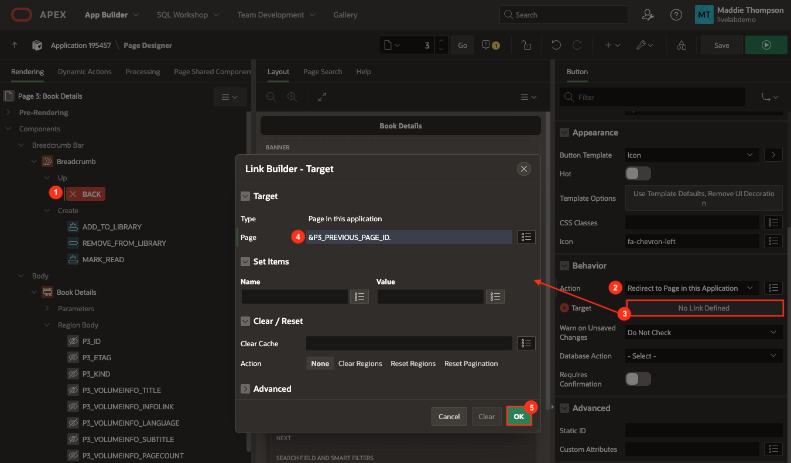
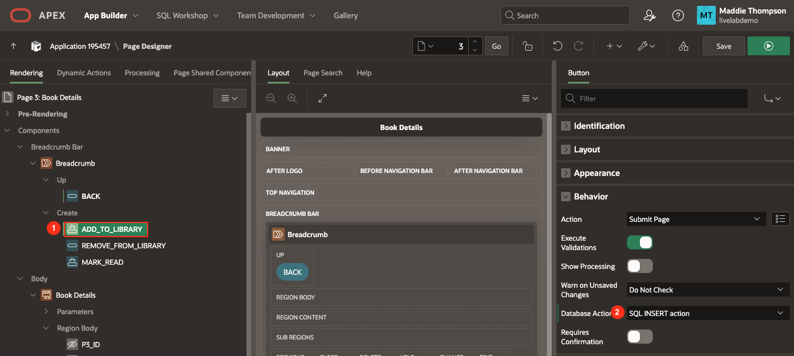
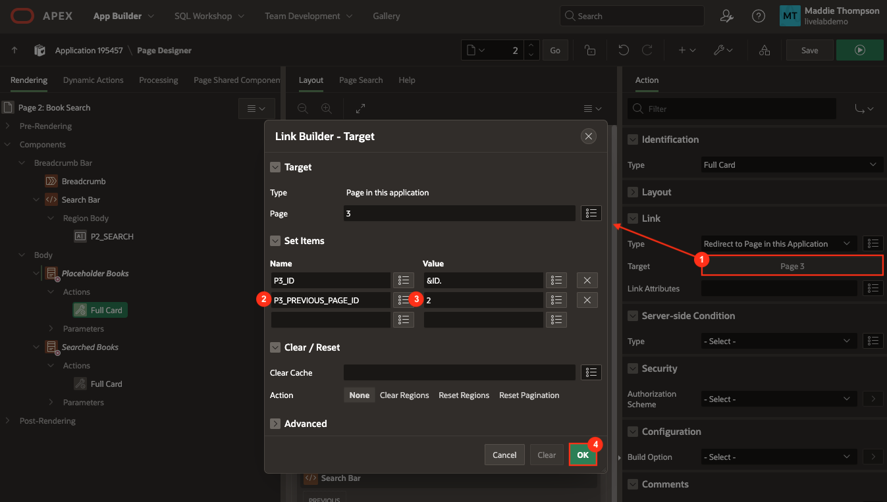
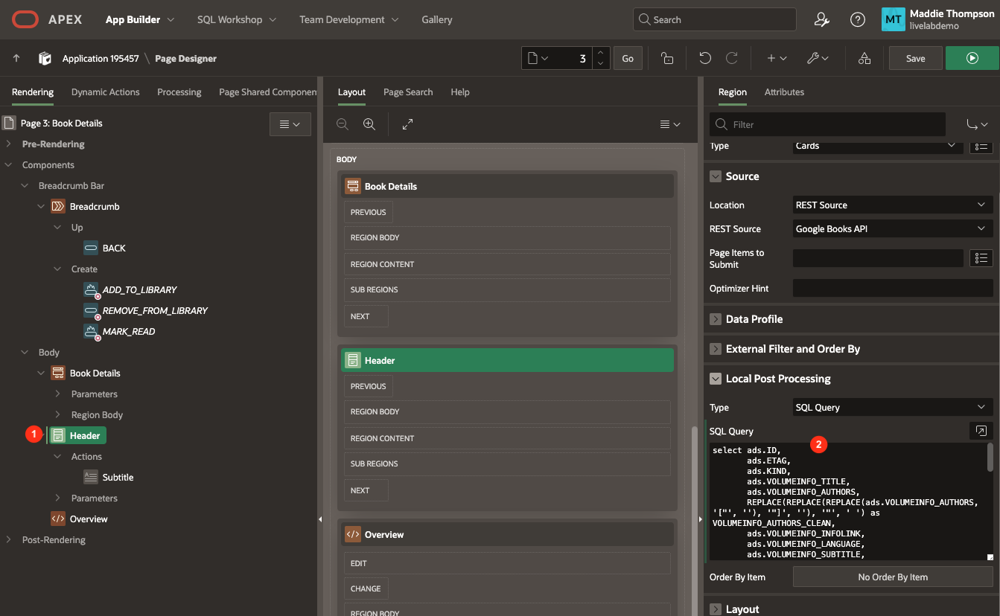
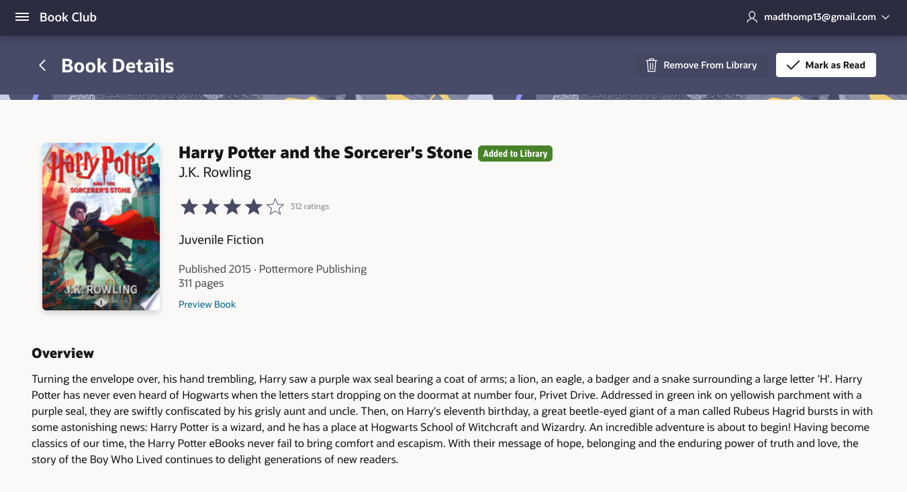
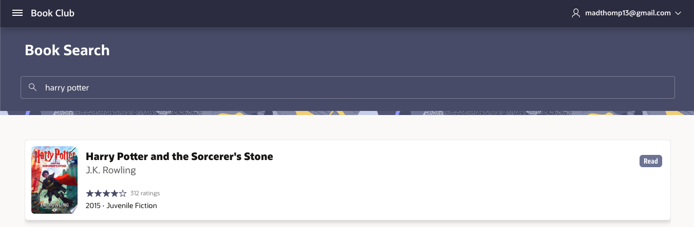

# Implement Book Details Buttons and Badges

## Introduction
In the previous lab, you did the backend work to set up tables and application items. In this lab, you will be creating Add, Remove, Read, and Back buttons that will control the flow between the Book Search and Book Details page, as well as the data stored in the library table. You will also add a badge to the Cards on the Book Search and Book Details pages to have a visual cue for books that a user has already marked as added or read.

Estimated Lab Time: 20 minutes

### Objectives
In this lab, you will:  
- Implement an Add button that inserts a book into the library table.  
- Implement a Remove button that deletes a book from the library table.  
- Implement a Read button that marks a movie as read in your library.  
- Implement a Back button that takes you back to the previous page.  
- Use badges on the Book Search and Book Details pages to display what books have been marked as added or read.

### Prerequisites
- Completion of workshop through Lab 6

## Task 1: Create the Book Details Buttons

1. Click on **App Builder** in the APEX navigation bar.

2. Click on your **Book Club** app.

3. Click on the **Book Details** page.

4. Right-click on the **Breadcrumb** region in the rendering pane and select **Create Button**.

    

5. Set the following properties:

    * Identification → Button Name: **BACK**

    * Identification → Label: **Back**

    * Layout → Slot: **Up**

    * Appearance → Button Template: **Icon**

    * Appearance → Template Options:

        - Style: **Remove UI Decoration**

        - Click **Ok**.

    * Appearance → Icon: **fa-chevron-left**

    

6. Right-click the Breadcrumb region and select **Create Button**.

    * Identification → Button Name: **ADD\_TO\_LIBRARY**

    * Layout → Position: **Create**

    * Appearance → Button Template: **Text with Icon**

    * Appearance → Hot: **on**

    * Appearance → Icon: **fa-heart-o**

    

7. Right-click the Breadcrumb region and select **Create Button**.

    * Identification → Button Name: **REMOVE\_FROM\_LIBRARY**

    * Layout → Position: **Create**

    * Appearance → Button Template: **Text with Icon**

    * Appearance → Icon: **fa-trash-o**

    

8. Right-click the Breadcrumb region and select **Create Button**.

    * Identification → Button Name: **MARK\_READ**

    * Identification → Label: **Mark as Read**

    * Layout → Position: **Create**

    * Appearance → Button Template: **Text with Icon**

    * Appearance → Hot: **on**

    * Appearance → Icon: **fa-check**

    

9. Click **Save**.

## Task 2: Implement Button Actions
Now that you have the four buttons, it's time to connect actions to them. You first will connect each button to a database action. Then, you will implement those actions using a page process for each button.

1. In the rendering pane, click on the **BACK** button and scroll down to the Behavior section.

    * Action: **Redirect to Page in this Application**

    * Click the button next to Target to open the Link Builder → Target dialog.

        - Page: **&P3\_PREVIOUS\_PAGE\_ID.**

        - Click **Ok**.

        

2. Click on **ADD\_TO\_LIBRARY**.

    * Scroll down to Behavior and set Database Action to **SQL INSERT action**.

    

3. Click on **REMOVE\_FROM\_LIBRARY**.

    * Set Database Action to **SQL DELETE action**.

4. Click on **MARK\_READ**.

    * Set Database Action to **SQL UPDATE action**.

5. At the top of the rendering pane, click the **Processing** tab (the two looping arrows).

    

6. Right-click on Processing and select **Create Process**.

    

    * Identification → Name: **Add book**

    * Identification → Type: **Execute Code**

    * Copy the following code and paste it into the PL/SQL code box in the Source property group:

		```
	    <copy>
	    insert into library
            (
                book_id,
                user_id,
                read_yn,
                title,
                authors,
                categories,
                thumbnail,
                published,
                pages,
                rating,
                average_rating,
                ratings_count,
                description
            )
        values
            (
                :P3_ID,
                :USER_ID,
                'N',
                :P3_VOLUMEINFO_TITLE,
                :P3_VOLUMEINFO_AUTHORS,
                :P3_VOLUMEINFO_CATEGORIES,
                :P3_VOLUMEINFO_IMAGELINKS_THUMBNAIL,
                :P3_VOLUMEINFO_PUBLISHEDDATE,
                :P3_VOLUMEINFO_PAGECOUNT,
                '',
                :P3_VOLUMEINFO_AVERAGERATING,
                :P3_VOLUMEINFO_RATINGSCOUNT,
                :P3_VOLUMEINFO_DESCRIPTION
            );
	    ```

    * Server-side Condition → When Button Pressed: **ADD\_TO\_LIBRARY**

    

7. Right-click on Processing and select **Create Process**.

    * Identification → Name: **Remove book**

    * Copy the following code and paste it into the PL/SQL code box in the Source property group:

		```
	    <copy>
	    delete from library
            where book_id = :P3_ID
            and user_id = :USER_ID;
	    ```

    * Server-side Condition → When Button Pressed: **REMOVE\_FROM\_LIBRARY**

8. Right-click on Processing and select **Create Process**.

    * Identification → Name: **Update book**

    * Copy the following code and paste it into the PL/SQL code box in the Source property group:

		```
	    <copy>
	    update library
            set read_yn = 'Y',
                read_date = SYSDATE
            where book_id = :P3_ID
            and user_id = :USER_ID;
	    ```

    * Server-side Condition → When Button Pressed: **MARK\_READ**

9. Currently under After Processing > Branches there is a default branch **Go To Page 1** that will redirect back to page 1 after processing has completed. 

    * We want to stay on the same page after clicking a button, so right click on the **Go To Page 1** branch and click **Delete**.

    

10. Click **Save**.

## Task 3: Add Server-Side Conditions to Buttons
At this point, all of the buttons on the Book Details page display at all times, regardless of whether or not you've already added a book to your library or marked something as read. You should really only show the Remove or Read buttons if a book exists in the library table, meaning the user has added it. Similarly, you should only display the Added button if a user has not yet added a book to the the library table.

To accomplish this, you are going to use Server-Side Conditions, like you did for the Placeholder Books and Searched Books regions on page 2.

1. Click on the **ADD\_TO\_LIBRARY** button.

2. In the **Server-side Condition** property group, set the following properties:

    * Type: **No Rows returned**

    * SQL Query:

	    ```
	    <copy>
	    select null
            from library
         where book_id = :P3_ID
            and user_id = :USER_ID
	    ```

        

3. Click on the **REMOVE\_FROM\_LIBRARY** button.

4. Set the following Server-side Condition properties:

    * Type: **Rows returned**

    * SQL Query:

	    ```
	    <copy>
	    select null
            from library
         where book_id = :P3_ID
            and user_id = :USER_ID
	    ```

        

5. Click on the **MARK\_READ** button.

6. Set the following Server-side Condition properties:

    * Type: **Rows returned**

    * SQL Query:

	    ```
	    <copy>
	    select null
            from library
         where book_id =:P3_ID
            and user_id = :USER_ID
            and read_yn = 'N'
	    ```

        

7. Click **Save**.

8. Before you test the buttons, you will add badges to the Book Search and Detail pages and update the Cards region actions to give P3\_PREVIOUS\_PAGE_ID a value.

## Task 4: Add Badges to Book Search & Detail Cards
Before you test the buttons you just implemented, you will add badges to the Book Search and Detail pages so that you have a visual cue of what has been added and marked as read. You also need to update the Full Card action for both the Placeholder Books and Searched Books regions to give the P3\_PREVIOUS\_PAGE\_ID page item a value so that the Back button on the Book Details page will go back to the correct page.

1. Navigate to **Page 2: Book Search** in your Book Club application and click on the **Placeholder Books** region.

    * Scroll down to the **Local Post Processing** property group and replace the existing SQL Query with the query below:

        ```
        <copy>
        select ads.ID,
            ads.ETAG,
            ads.KIND,
            ads.VOLUMEINFO_TITLE,
            ads.VOLUMEINFO_AUTHORS,
            REPLACE(REPLACE(REPLACE(ads.VOLUMEINFO_AUTHORS, '["', ''), '"]', ''), '"', ' ') as VOLUMEINFO_AUTHORS_CLEAN,
            ads.VOLUMEINFO_INFOLINK,
            ads.VOLUMEINFO_LANGUAGE,
            ads.VOLUMEINFO_SUBTITLE,
            ads.VOLUMEINFO_PAGECOUNT,
            ads.VOLUMEINFO_PRINTTYPE,
            ads.VOLUMEINFO_PUBLISHER,
            ads.VOLUMEINFO_CATEGORIES,
            REPLACE(REPLACE(ads.VOLUMEINFO_CATEGORIES, '["', ''), '"]', '') as VOLUMEINFO_CATEGORIES_CLEAN,
            ads.VOLUMEINFO_IMAGELINKS_THUMBNAIL,
            ads.VOLUMEINFO_IMAGELINKS_SMALLTHUMBNAIL,
            ads.VOLUMEINFO_DESCRIPTION,
            ads.VOLUMEINFO_PREVIEWLINK,
            ads.VOLUMEINFO_RATINGSCOUNT,
            ads.VOLUMEINFO_AVERAGERATING,
            SUBSTR(ads.VOLUMEINFO_PUBLISHEDDATE, 1, 4) AS PUBLISHED_YEAR,
            ads.VOLUMEINFO_CONTENTVERSION,
            ads.VOLUMEINFO_MATURITYRATING,
            ads.VOLUMEINFO_INDUSTRYIDENTIFIERS,
            case when l.read_yn = 'Y' then 'Read'
                    when l.read_yn = 'N' then 'Want to Read'
            end as badge_label,
            case when l.read_yn = 'N' then 'u-success'
                    when l.read_yn = 'Y' then 'u-color-13'
            end as badge_color
        from #APEX$SOURCE_DATA# ads
        LEFT OUTER JOIN
            -- doing inline select to limit rows to the current user
            (select * from library where user_id = :USER_ID) l
            ON l.book_id = ads.ID
        ```

        - The above code extends the books data that gets returned from the REST data source by joining the REST data source with the library table to add two columns: BADGE\_LABEL and BADGE\_COLOR. For the BADGE\_LABEL column, each book in the Placeholder Books list has the value 'Read' (books in the LIBRARY table that are marked as Read), 'Want to Read' (books in the LIBRARY table that are not marked as Read), or NULL (books that are not in the LIBRARY table). Similarly, the BADGE\_COLOR list contains values 'u-success' or NULL, based on whether or not a book is in the LIBRARY table and not marked as Read.

        

    * Click on the **Attributes** tab.

    * Icon and Badge → Badge Column: **BADGE\_LABEL**

    * Icon and Badge → Badge CSS Classes: **&BADGE\_COLOR.**

    

2. To pass in the value for P3\_PREVIOUS\_PAGE\_ID, click on the **Full Card** action under the Placeholder Books region.

    * In the Link properties group, click on **Target**. 

    * Under Set Items, add an item: 

        - Name: **P3\_PREVIOUS\_PAGE\_ID**

        - Value: **2**

        - Click **Ok**.

    

3. Now that you have set up badges on the Placeholder Books region, return to the beginning of step 1 of this task and follow the same steps for Searched Books.

4. Now we will similarly add badges to the Book header card on the Book Details page.

5. Navigate to **Page 3: Book Details** in your Book Club application and click on the **Header** region.

6. Scroll down to the **Local Post Processing** property group and replace the existing SQL Query with the query below:

        ```
        <copy>
        select ads.ID,
            ads.ETAG,
            ads.KIND,
            ads.VOLUMEINFO_TITLE,
            ads.VOLUMEINFO_AUTHORS,
            REPLACE(REPLACE(REPLACE(ads.VOLUMEINFO_AUTHORS, '["', ''), '"]', ''), '"', ' ') as VOLUMEINFO_AUTHORS_CLEAN,
            ads.VOLUMEINFO_INFOLINK,
            ads.VOLUMEINFO_LANGUAGE,
            ads.VOLUMEINFO_SUBTITLE,
            ads.VOLUMEINFO_PAGECOUNT,
            ads.VOLUMEINFO_PRINTTYPE,
            ads.VOLUMEINFO_PUBLISHER,
            ads.VOLUMEINFO_CATEGORIES,
            REPLACE(REPLACE(ads.VOLUMEINFO_CATEGORIES, '["', ''), '"]', '') as VOLUMEINFO_CATEGORIES_CLEAN,
            ads.VOLUMEINFO_IMAGELINKS_THUMBNAIL,
            ads.VOLUMEINFO_IMAGELINKS_SMALLTHUMBNAIL,
            ads.VOLUMEINFO_DESCRIPTION,
            ads.VOLUMEINFO_PREVIEWLINK,
            ads.VOLUMEINFO_RATINGSCOUNT,
            ads.VOLUMEINFO_AVERAGERATING,
            SUBSTR(ads.VOLUMEINFO_PUBLISHEDDATE, 1, 4) AS PUBLISHED_YEAR,
            ads.VOLUMEINFO_CONTENTVERSION,
            ads.VOLUMEINFO_MATURITYRATING,
            ads.VOLUMEINFO_INDUSTRYIDENTIFIERS,
            ads.SALEINFO_BUYLINK,
            case when l.read_yn = 'Y' then 'Read'
                    when l.read_yn = 'N' then 'Added to Library'
            end as badge_label,
            case when l.read_yn = 'N' then 'u-success'
                    when l.read_yn = 'Y' then 'u-color-13'
            end as badge_color
        from #APEX$SOURCE_DATA# ads
        LEFT OUTER JOIN
            -- doing inline select to limit rows to the current user
            (select * from library where user_id = :USER_ID) l
            ON l.book_id = ads.ID
            where ads.ID = :P3_ID
        ```

    - We already referenced the BADGE\_LABEL and BADGE\_COLOR columns in the HTML Expression for the Title slot, so nothing more needs to be done here.

    

7. Save your changes and refresh the tab where your app is running. Now you can play around with the Book Search and Book Details page and test out adding, removing, and marking items as read.

    * From the Book Search page, select a book and you will see the Back and Add to Library buttons.

    

    * Click the **Add to Library** button and you will see the Added label on the book you added. You should also see the the Back, Remove From Library, and Mark as Read buttons.

    

    * Click the **Mark as Read** button and you will see the Read label on the book you just marked as read.

    

    * Click the **Back** button and you will see the Read label still on the book you just marked as read on the Book Search page.

    
    
You now know how to use SQL commands in Page Designer regions and processes to get, store, update, and delete data from your tables. You may now **proceed to the next lab**.

## Learn More

- [Buttons Documentation](https://docs.oracle.com/en/database/oracle/apex/23.2/htmdb/creating-buttons.html) 

- [Understanding Page Processes](https://docs.oracle.com/en/database/oracle/apex/23.2/htmdb/understanding-page-processes.html)  

- [Controlling Navigation Using Branches](https://docs.oracle.com/en/database/oracle/apex/23.2/htmdb/controlling-navigation-using-branches.html)  

## Acknowledgements

- **Author** - Maddie Thompson
- **Last Updated By/Date** - Maddie Thompson, November 2024