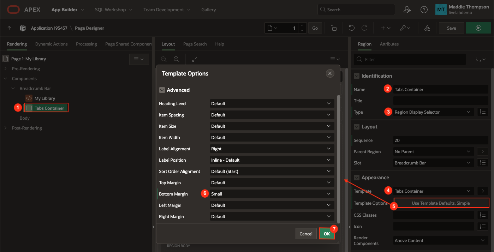
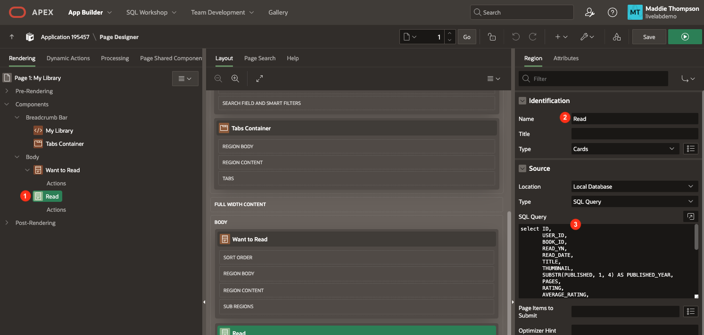
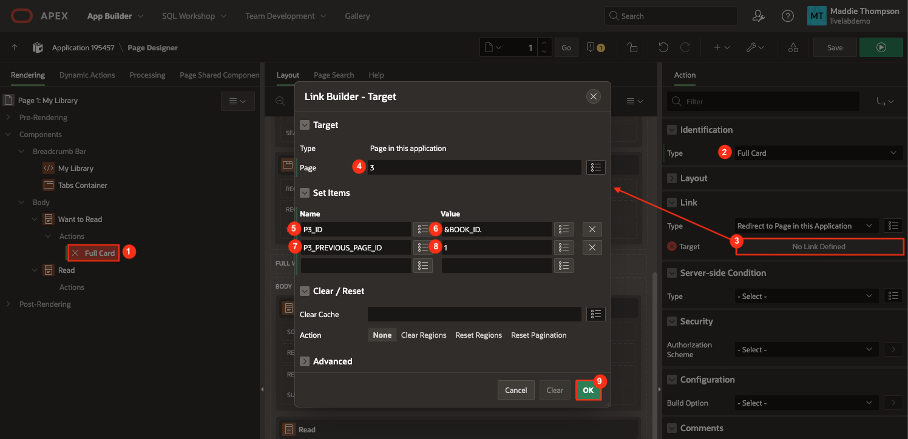
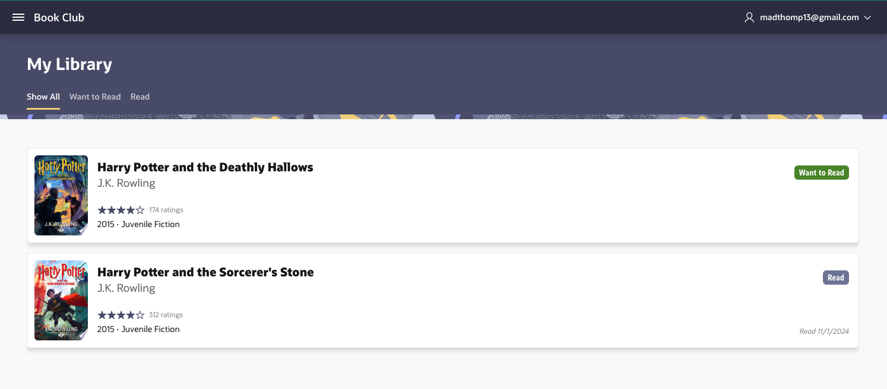
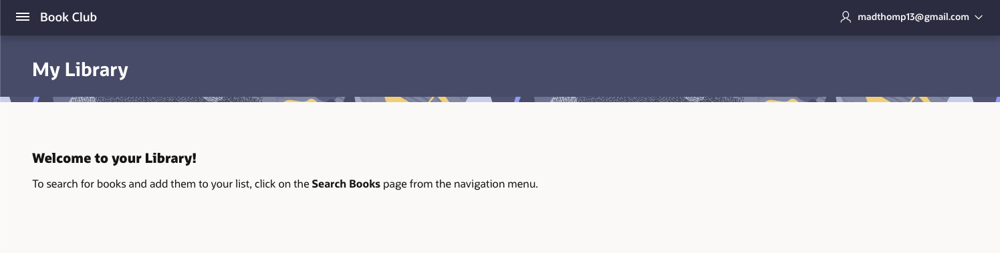

# Implement the Library Page

## Introduction
Now that you have implemented functionality to find books and add them to a table, you will set up the My Library page to display each book in the library table, which is the final piece of base functionality you will need to complete this app.

Estimated Lab Time: 20 minutes

### Objectives
In this lab, you will:  
- Create tabs to display the categories of Library books (read, want to read).
- Create cards to display Library books.  
- Connect the Book Details page to Library page. 
- Create a Get Started region.

### Prerequisites
- Completion of workshop through Lab 7

## Task 1: Create a Tabs Region
Adding tabs will allow a user to filter through books in their library to make it easier to explore books they want to read and books they've already read.

1. In the Page Designer tab in your browser, navigate to **Page 1: My Library**.

2. In the rendering pane under Breadcrumb Bar, click on the **Book Club** region and set the following:

    * Identification → Name: **My Library**

    * Appearance → open the Template Options dialog:

        - Display Icon: **No**

        - Click **Ok**.

        

3. Right-click on the Breadcrumb Bar position in the rendering tree and select **Create Region**.

4. Set the following properties for the new region:

    * Identification → Name: **Tabs Container**

    * Identification → Type: **Region Display Selector**

    * Appearance → Template: **Tabs Container**

    * Appearance → open the Template Options dialog:

        - Bottom Margin: **Small**

        - Click **Ok**.

        


## Task 2: Create the Library Cards
Now you will start to build out the page by first adding a Cards region so that users can view their personal list of books. It will be similar to the Cards regions on the Book Search page, but the source will not be a REST data source. The books will be organized into two regions: Want to Read and Read. The tabs you created in the last task will allow users to easily switch between the views.

1. In the rendering pane, click on **Page 1: My Library**.

2. Scroll down to the CSS property group.

3. Copy the code below and paste it within the Inline code editor:

    ```
    <copy>
    .title {
        font-size: 20px;
        line-height: 1.5;
    }

    .subtitle {
        font-size: 18px;
    }

    .thumbnail {
        margin: 12px 0 12px 12px;
    }

    .published, .categories {
        font-size: 14px;
    }

    .read-date {
        font-size: 12px;
        font-style: italic;
        color: gray;
        position: absolute;
        bottom: 16px;
        right: 16px;
    }

    /* decrease space between page title and tab bar */
    .t-HeroRegion {
        padding-bottom: 1rem;
    }

    /* Update default width of images */
    .a-CardView-items--row .has-media {
        grid-template-columns: minmax(32px,102px) minmax(0,var(--a-cv-icon-spacer,44px)) 1fr minmax(0,auto);
    }

    .ratings-count {
        font-size: 12px;
        color: gray;
        margin-left: 4px;
    }

    .ratings-count[data-count=""] {
    display: none;
    }

    .fa-star, .fa {
        vertical-align: middle;
    }

    /* rating stars */

    .u-hot-text {
        color: var(--rw-dark-body-title-background-color);
    }

    .report-star-rating {
    white-space: nowrap;
    }

    .report-star-rating[data-rating*="0"]::before {
    content: "\f006\f006\f006\f006\f006";
    }

    .report-star-rating[data-rating*="1"]::before {
    content: "\f005\f006\f006\f006\f006";
    }

    .report-star-rating[data-rating*="2"]::before {
    content: "\f005\f005\f006\f006\f006";
    }

    .report-star-rating[data-rating*="3"]::before {
    content: "\f005\f005\f005\f006\f006";
    }

    .report-star-rating[data-rating*="4"]::before {
    content: "\f005\f005\f005\f005\f006";
    }

    .report-star-rating[data-rating="5"]::before {
    content: "\f005\f005\f005\f005\f005";
    }

    .report-star-rating[data-rating=""]::before {
    content: "\f006\f006\f006\f006\f006";
    }

    .report-star-rating[data-rating=""]::after {
    font-size: 12px;
    color: gray;
    font-family: inherit !important;
    font-style: italic;
    content: "Not rated yet";
    vertical-align: middle;
    margin-left: 8px;
    }
    ```

    

4. Right-click on the Body position in the rendering tree and select **Create Region**.

5. Set the following properties for the new region:

    * Name: **Want to Read**

    * Type: **Cards**

    * Source → Type: **SQL Query**

    * Copy the code below and paste it into the SQL Query code box:

        ```
        <copy>
        select ID,
            USER_ID,
            BOOK_ID,
            READ_YN,
            TITLE,
            THUMBNAIL,
            SUBSTR(PUBLISHED, 1, 4) AS PUBLISHED_YEAR,
            PAGES,
            RATING,
            AVERAGE_RATING,
            CREATED,
            CREATED_BY,
            UPDATED,
            UPDATED_BY,
            DESCRIPTION,
            RATINGS_COUNT,
            REPLACE(REPLACE(REPLACE(AUTHORS, '["', ''), '"]', ''), '"', ' ') as AUTHORS_CLEAN,
            REPLACE(REPLACE(REPLACE(CATEGORIES, '["', ''), '"]', ''), '"', ' ') as CATEGORIES_CLEAN,
            case when read_yn = 'Y' then 'Read'
                    when read_yn = 'N' then 'Want to Read'
            end as badge_label,
            case when read_yn = 'N' then 'u-success'
                    when read_yn = 'Y' then 'u-color-13'
            end as badge_color
        from LIBRARY
        where read_yn = 'N' and user_id = :USER_ID
        order by TITLE asc
        ```

    * Advanced → Region Display Selector: **on**

    

6. Go to the Attributes tab of your new Want to Read region to customize your Library cards.

    * Appearance → Layout: **Horizontal (Row)**

    * Card → Primary Key Column 1: **ID**

    * Title → Column: **TITLE**

    * Title → CSS Classes: **title**

    * Subtitle → Column: **AUTHORS\_CLEAN**

    * Subtitle → CSS Classes: **subtitle**

    

    * Body → Advanced Formatting: **on**

    * Body → HTML Expression:

        ```
        <copy>
        &lt;div style="margin-top: -8px;">
            &lt;span class="fa u-hot-text report-star-rating" data-rating="&AVERAGE_RATING." title="&AVERAGE_RATING." aria-hidden-"true">&lt;/span>&lt;span class="u-VisuallyHidden">&AVERAGE_RATING.&lt;/span>&lt;span class="ratings-count" data-count="&RATINGS_COUNT."> &RATINGS_COUNT. ratings&lt;/span>&lt;/span>
            &lt;br>
            &lt;span title="Published" class="published"> &PUBLISHED_YEAR.   &lt;/span>&middot;
            &lt;span title="Categories" class="categories">  &CATEGORIES_CLEAN.   &lt;/span>
        &lt;/div>
        ```

    * Icon and Badge → Badge Column: **BADGE\_LABEL**

    * Icon and Badge → Badge CSS Classes: **&BADGE\_COLOR.**

    * Media → Source: **Image URL**

    * Media → URL: **&THUMBNAIL.**

    * Media → Position: **First**

    * Media → Sizing: **Cover**

    * Media → CSS Classes: **thumbnail**

    

7. You also need to create a Cards region to display the books marked as read. It will be almost exactly like the Want to Read books region, with a few minor changes.

8. Right-click on the **Want to Read** region in the rendering pane and select **Duplicate** to create a copy of the region.

9. Set the following properties:

    * Identification → Name: **Read**

    * Source → SQL Query:

        ```
        <copy>
        select ID,
            USER_ID,
            BOOK_ID,
            READ_YN,
            TITLE,
            THUMBNAIL,
            SUBSTR(PUBLISHED, 1, 4) AS PUBLISHED_YEAR,
            PAGES,
            RATING,
            AVERAGE_RATING,
            CREATED,
            CREATED_BY,
            UPDATED,
            UPDATED_BY,
            DESCRIPTION,
            RATINGS_COUNT,
            REPLACE(REPLACE(REPLACE(AUTHORS, '["', ''), '"]', ''), '"', ' ') as AUTHORS_CLEAN,
            REPLACE(REPLACE(REPLACE(CATEGORIES, '["', ''), '"]', ''), '"', ' ') as CATEGORIES_CLEAN,
            case when read_yn = 'Y' then 'Read'
                    when read_yn = 'N' then 'Want to Read'
            end as badge_label,
            case when read_yn = 'N' then 'u-success'
                    when read_yn = 'Y' then 'u-color-13'
            end as badge_color
        from LIBRARY
        where read_yn = 'Y' and user_id = :USER_ID
        order by TITLE asc
        ```

        

10. Go to the Attributes tab of your new Read region so we can add another attribute, Read Date, to the cards:

    * Body → HTML Expression:

        ```
        <copy>
        &lt;div style="margin-top: -8px;">
            &lt;span class="fa u-hot-text report-star-rating" data-rating="&AVERAGE_RATING." title="&AVERAGE_RATING." aria-hidden-"true">&lt;/span>&lt;span class="u-VisuallyHidden">&AVERAGE_RATING.&lt;/span>&lt;span class="ratings-count" data-count="&RATINGS_COUNT."> &RATINGS_COUNT. ratings&lt;/span>&lt;/span>
            &lt;br>
            &lt;span title="Published" class="published"> &PUBLISHED_YEAR.   &lt;/span>&middot;
            &lt;span title="Categories" class="categories">  &CATEGORIES_CLEAN.   &lt;/span>
            &lt;span title="Read Date" class="read-date"> Read &READ_DATE.&lt;/span>
        &lt;/div>
        ```

        

11. Click the **Save** button to save your changes.

## Task 3: Connect the Library to the Book Details Page
In this step, you are going to connect the My Library page to the Book Details page to allow a user to view details for any book in their library, as well as remove a book from their library or mark a book as "Read."

1. In the rendering pane, right-click on the **Actions** section underneath the **Want to Read** region and select **Create Action**.

2. Set the following properties:

    * Identification → Type: **Full Card**

    * Click on the Link → Target field to open the link builder.

        - Page: **3**

        - Set Items:

            + Name: **P3\_ID** | Value: **&BOOK\_ID.**

            + Name: **P3\_PREVIOUS\_PAGE\_ID** | Value: **1**

        - Click **Ok**.

        

3. Repeat steps 1 and 2 for the **Read** region.

    

4. Save and run the page.

    

5. On the tab where the app is running, click on a book in your library. The Book Details page should appear with information about that specific book. Note that you are able to remove a book or mark it as read, but you cannot add the book because it is already in your library. When clicked, the back button should take you back to the Library page.

    *Note: If you have not added any books to your library, the page will say "No data found." Make sure to add books to your library so that you can view them on the Library page!*

## Task 4: Create a Get Started Region
When a user logs into the Book Club app for the first time, they will not have any books and the My Library page will be blank. It would be helpful if there were a welcome message to assist users in getting started if there are no books on the page.

1. In the rendering pane, right click on Body and select **Create Region**.

    * Identification → Name: **Get Started**

    * Source → HTML Code:

        ```
        <copy>
        &lt;h3>&lt;strong>Welcome to your Library!&lt;/strong>&lt;/h3>
        To search for books and add them to your list, click on &lt;strong>Book Search&lt;/strong> from the navigation menu.
        ```

    * Appearance → Template: **Content Block**

    * Appearance → open the Template Options dialog:

        - Header: **Hidden but accessible**

        - Click **Ok**.

        

2. You also will need to add Server-side Conditions for the Get Started region and all other items within the Content Body page position, because you want to only show the Get Started region when a user has no books in their library. You only want to display the book list and tab regions when a user has books in their library.

3. In the Get Started region, scroll down to **Server-side Condition**.

    * Type: **No Rows returned**

    * SQL Query:

        ```
        <copy>
        select null 
          from library 
         where user_id = :USER_ID
        ```

        

4. You will use the same SQL Query in the Server-side Conditions for the Want to Read and Read regions, but you will use the opposite type, Rows returned.

5. Click on the **Want to Read** region.

6. In Server-side Condition:

    * Type: **Rows returned**

    * SQL Query:

        ```
        <copy>
        select null 
          from library 
         where user_id = :USER_ID
          and read_yn = 'N'
        ```

        

7. Now you'll do the same for the Read region. Click on the **Read** region.

8. In Server-side Condition:

    * Type: **Rows returned**

    * SQL Query:

        ```
        <copy>
        select null 
          from library 
         where user_id = :USER_ID
          and read_yn = 'Y'
        ```

9. Save and run the page. You can test out your Get Started region by removing all the books from your library.

    


You now know how to define page content using tables and organize page content using tabs. You may now **proceed to the next lab**.

## Acknowledgements

- **Author** - Maddie Thompson
- **Last Updated By/Date** - Maddie Thompson, November 2024