# Create a Data Model using Generative AI

## Introduction

In this lab, you will learn how to create a custom data model using Generative AI in Oracle APEX. You will leverage the configured OpenAI service to generate a CRM data model that includes Accounts, Leads, Contacts, Opportunities, and Activities.

Instead of writing SQL manually, you will use natural language prompts to generate database objects, refine them, and add sample data using the APEX Assistant.

Estimated Time: 10 minutes

### Objectives

In this lab, you will:

- Create a custom CRM data model using Generative AI in Oracle APEX.

### Before You Start

- Access to the Open AI Generative AI Services.

- An APEX Workspace

## Task 1: Create CRM Data Model using AI

To create a data model with AI, ensure that you have configured Generative AI Service and enabled **Used by App Builder** (Refer to the previous Task). If a Generative AI Service is not configured, the **Create Data Model Using AI** option will not be visible.

In this task, you will learn how to leverage Oracle APEX's Generative AI Service to build a CRM Data Model without writing SQL manually. By providing simple prompts, you will generate database objects, refine them, and add sample records automatically.

1. Login to your Application. On the Workspace home page, click **SQL Workshop**.

    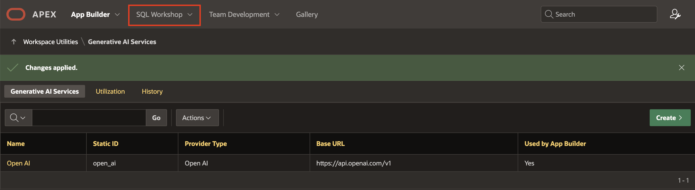

2. Click **Utilities**.

    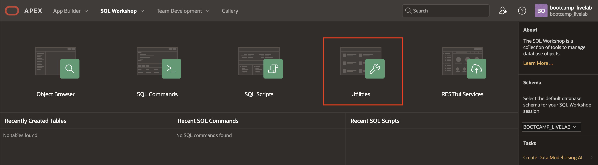

3. Click **Create Data Model Using AI**.

    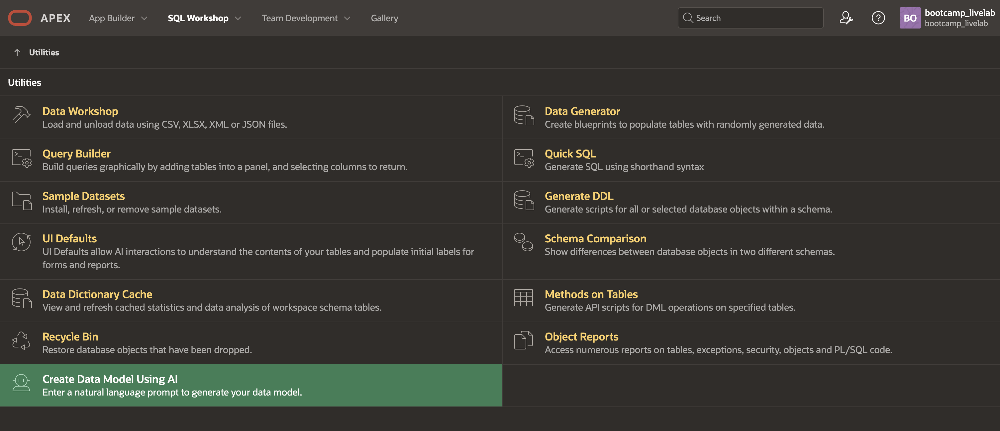

    >**Note:** You can also access **Create Data Model Using AI** directly from the **Tasks** list on the SQL Workshop home page.

4. When using Generative AI features within the APEX development environment *for the first time*, you will be asked to provide consent. In the **APEX Assistant** Wizard, if you see a Dialog regarding **consent**, click **Accept**.

    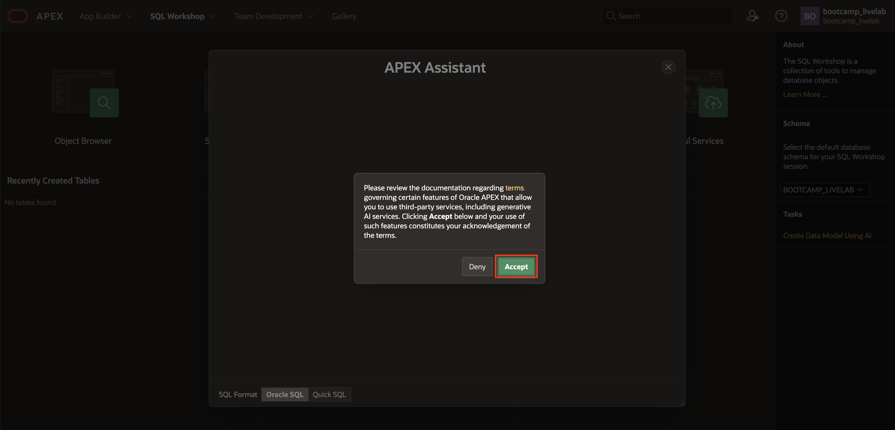

5. You will use the **APEX Assistant** Wizard to create a *Customer Replationship Management (CRM)* Data Model using AI.

6. To create a CRM Data Model, enter the prompts mentioned below and press Enter. Make sure that you choose **Oracle SQL** for **SQL Format**.

    **Prompt 1:**
    ```
    <copy>
    Create a data model for a CRM enterprise application. Include tables for Accounts, Contacts, Leads, Opportunities and Activities.
    </copy>
    ```

    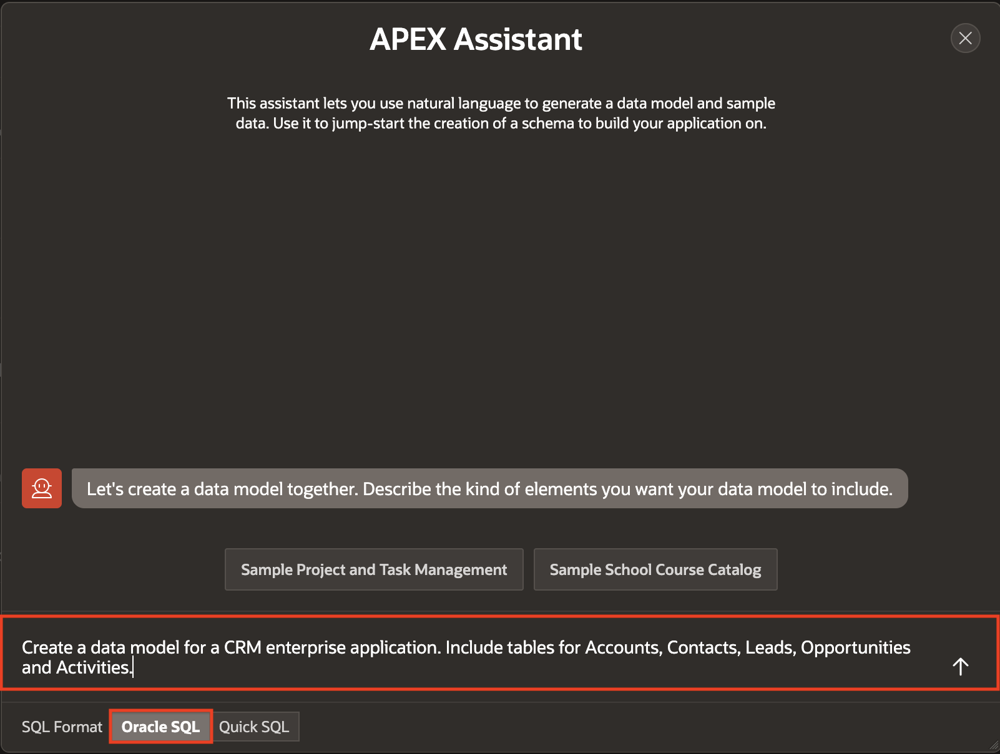

7. Enter another prompt to update the prefix for all database objects.

    **Prompt 2:**
    ```
    <copy>
    Make sure all objects have CRM as prefix.
    </copy>
    ```

    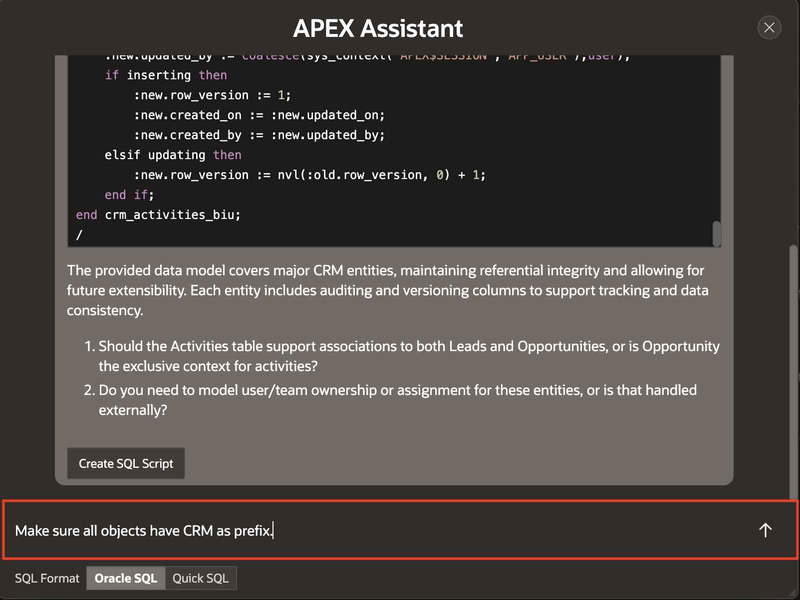

8. At this point, we are satisfied with the generated SQL script. Click **Create SQL Script**.

    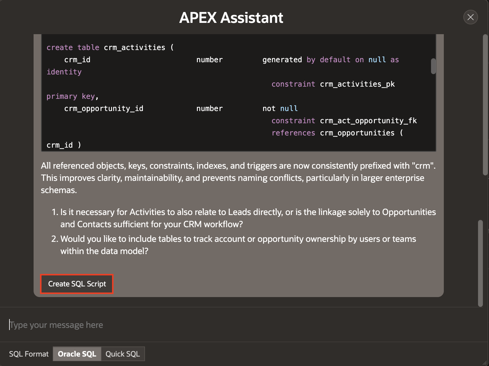

9. Next, we'd like to add sample data into the tables. To do this, we leverage the APEX Assistant in the Code Editor. Click **APEX Assistant**.

    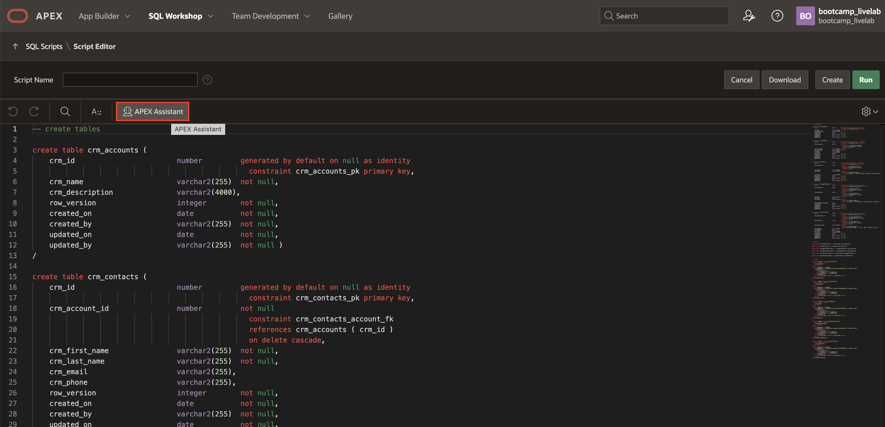

10. Select your SQL code and click **Use Selection** from the APEX Assistant box.

    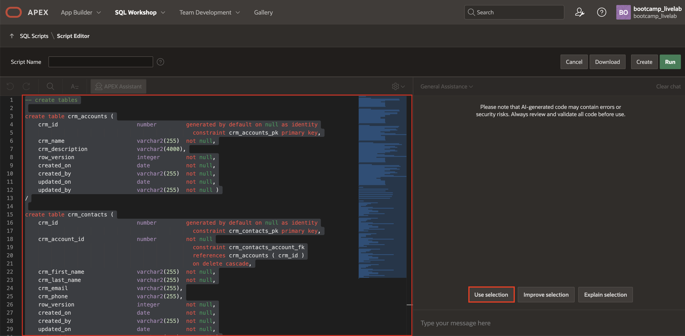

11. In APEX Assistant box, enter the prompt to generate sample data for that tables and press Enter or click the Send icon.

    **Prompt 1:**
    ```
    <copy>
    Generate sample data for the CRM data model
    </copy>
    ```

    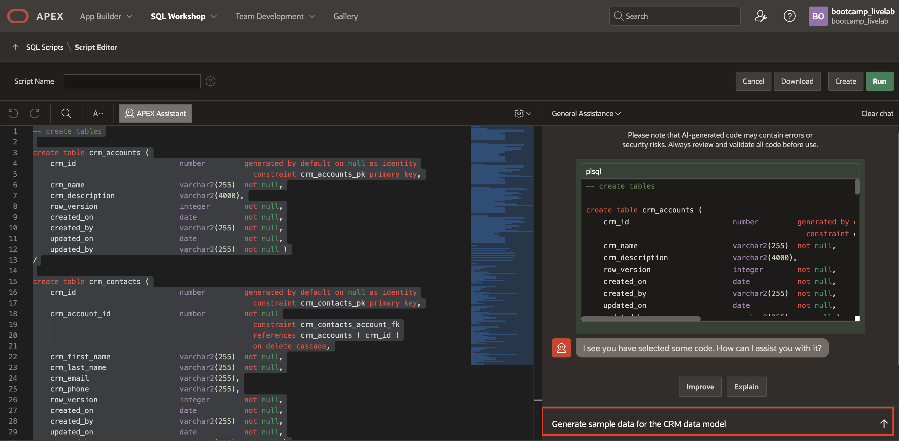

12. **Copy** the generated insert queries from the APEX Assistant box.

    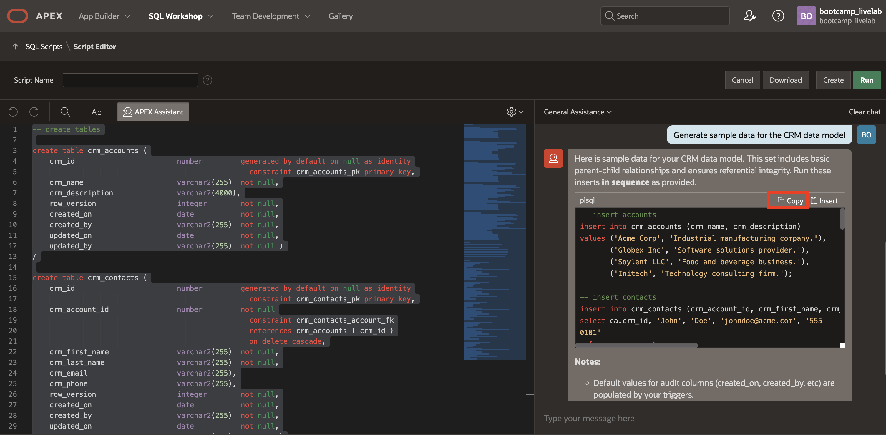

13. Paste the copied queries into the left-hand side code editor towards the end.

    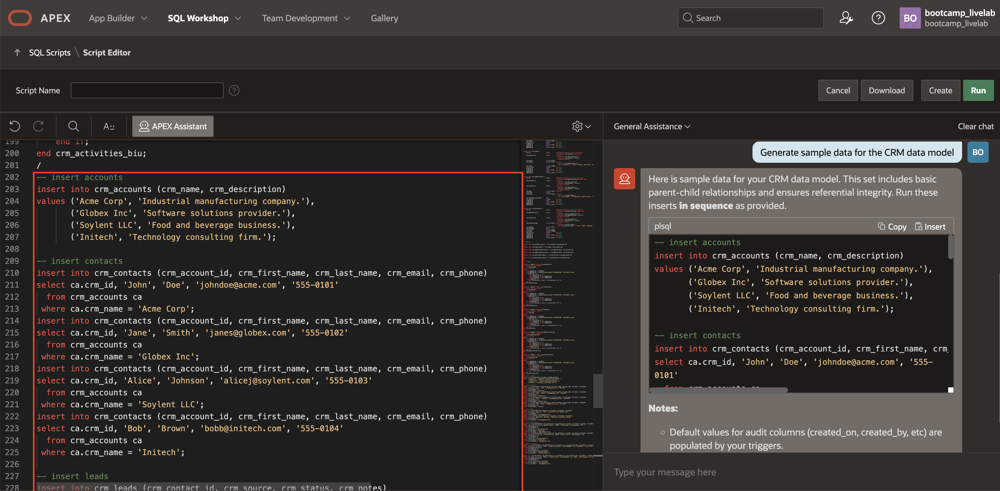

14. Before clicking on **Run** button. Let's replace the code from the **Script Editor** with the modified database objects code in [crm-data.sql](files/crm-data.sql)

    > Note: We are replacing the code to ensure the lab can be completed as intended. The replacement is only for consistency with the lab steps and expected results.


15. For Script Name, enter **CRM Data Model**. And then, click **Run** in the Script Editor.

    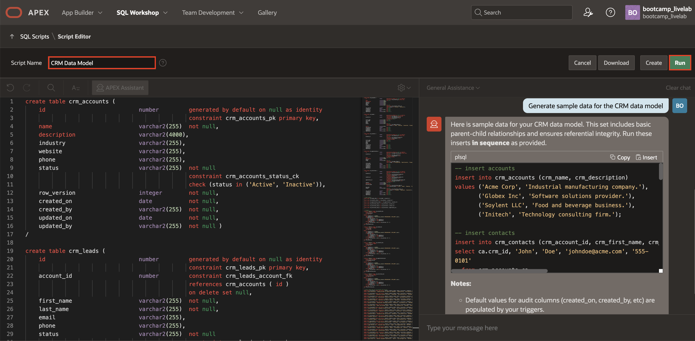

17. Click **Run Now** to submit the script for execution.

    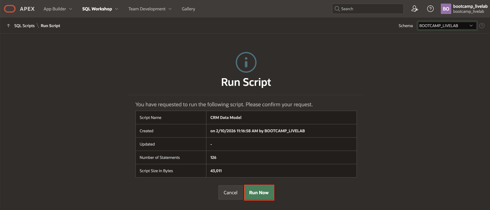

18. The Manage Script Results page appears listing script results.

    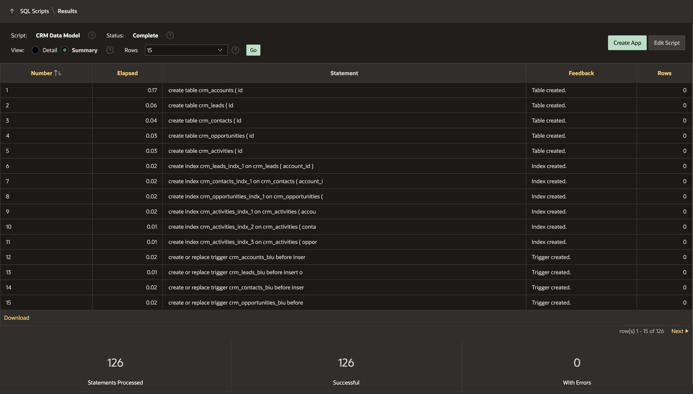

    *Note: Do NOT click **Create App** yet, as you will creating an app in the upcoming lab using Generative AI.*

## Task 2: Review Database Objects

Now, let's review the database objects created using AI.

1. From the top navigation bar, click **SQL Workshop**.

    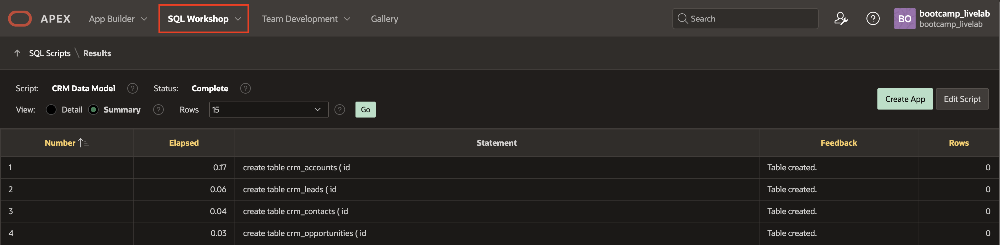

2. Click **Object Browser**.

    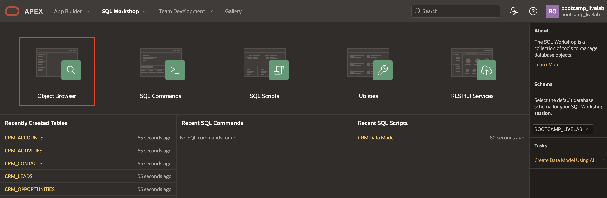

3. Expand **Tables** in the Object Pane to view different tables. Select a table to view table details such as Data, Constraints, and so forth in the Details View pane on the right.

    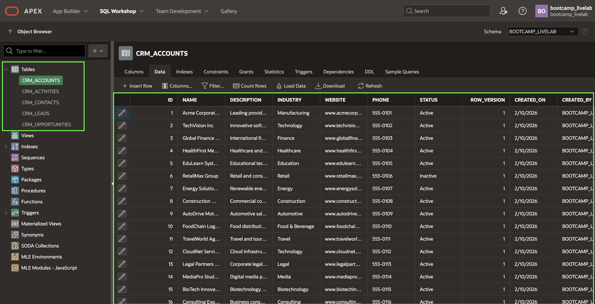

## Summary

In this lab, you used Generative AI to create a complete CRM data model, including tables, constraints, indexes, triggers, and sample data.

You experienced how Oracle APEX enables AI-assisted development to significantly reduce manual SQL effort while maintaining enterprise-grade structure and standards.

You may now proceed to the next lab.

## Acknowledgments

- **Author** - Ankita Beri, Senior Product Manager
- **Last Updated By/Date** - Ankita Beri, Senior Product Manager, February 2026
