# Create an Event Chat Assistant

## Introduction

In this lab, you will learn how to enhance an Oracle APEX application by creating an Event Chat Assistant. Using the Show AI Assistant dynamic action, you will build a chatbot that can respond to user queries about event details. You will first configure the chatbot without a RAG (Retrieval-Augmented Generation) source to see how it works with generic responses, and then enhance it by creating an AI Configuration and RAG source so the chatbot fetches information directly from your event data. This approach demonstrates how to combine low-code development with AI-driven capabilities to deliver smarter, data-aware user experiences.

Estimated Time: 5 minutes

### Objectives

By the end of this lab, you will be able to:

- Create an Event Assistant button in your APEX application.

- Configure a Show AI Assistant dynamic action without using a RAG source.

- Create an AI Configuration and define a RAG Source to query event data.

- Connect the AI Configuration to the Show AI Assistant dynamic action so the chatbot fetches results exclusively from your event data source.

## Task 1 : Add Email Validation in the Leads Form Page

1. Navigate to developer toolbar, **Quick Edit** on **Email** Field.

    

2. Right-click **P6_EMAIL** and select **Create Validation**.

    

3. In the right pane, enter/select the following:

    - Identification > Name: **Validate Email Format**

    - Under Validation:

        - Type: **Item matched Regular Expression**

        - Item: **P6_EMAIL**

        - Regular Expression: **^[A-Za-z0-9._%+-]+@[A-Za-z0-9.-]+\.[A-Za-z]{2,}$**

    - Error > Error Message : **Please enter a valid Email Address**

    

4. Click **Save**.

    

5. In the run time evironment, refresh the leads form page. Make some changes to the email address and click **Apply Changes**. You will notice the validation notification.

    

## Task 2 : Add a Dynamic Action to refresh the content Row Region

1. Close the leads form page. **Quick Edit** on the Content Row region.

    

2. Right-click leads region and select **Create Dynamic Action**.

    

3. In the right pane, update Identification > Name to **Refesh Content Row** and check the defaults:

    - Under When:

        - Event: Event Dialog Closed

        - Selection Type: Region

        - Region: Leads

    

4. True Action > Refresh > Region > Leads
Task 3: Create a Chatbot for CRM

Go to the Dashboard Page (Home Page)
Quick Edit on the breadcrumb
Right Click > Create Button
Button:
Name : CRM_AI_ASSISTANT
Label CRM AI Assistant
Layout > Slot > Next
Button Template : Text with Icon
Hot > On
Icon : fa-chatbot
Right Click on the button > Create Dynamic Action
Dynamic Action:
Name : Open AI Chatbot
True Action:
Show AI Assistant
Service : Select Open AI (Created in Lab 1)
Run the application > Click CRM AI Assistant button to open the chatbot > Prompt : Show me all new leads.
Task 4: RAG Powered Chatbot

Go to shared Components > AI Configurations
Create an AI COnfiguration
Name: CRM AI Configuration
Service : Open AI
System Prompt: 
You are a CRM domain assistant.

Answer only questions related to Customer Relationship Management (CRM), including leads, opportunities, accounts, contacts, sales pipeline, customer interactions, support cases, and CRM workflows.

Use only the data provided in the conversation or context. Do not use outside knowledge. If the answer is not available in the provided data, say:
"The provided data does not contain this information."

Do not guess, assume, or generalize. Keep answers precise, factual, and based strictly on the input.


Welcome Message : Hi, How may I help you?
Create AI Configuration
Create RAG Source
Name : Leads Details
Description: Provides details about leads
SQL Query: APEX AI Assistant >  Get all details about leads like account name, Channel, status etc


select l.first_name,
       l.last_name,
       l.email,
       l.phone,
       l.source,
       l.status,
       l.created_on,
       l.created_by,
       l.updated_on,
       l.updated_by,
       l.row_version,
       l.account_id,
       a.name     as account_name
  from crm_leads          l
  left join crm_accounts  a
    on l.account_id = a.id
Server Side Condition: Last user prompt contains : Leads
Create another RAG Source
Name : Opportunity Details
Description: Provides details about Opportunities
SQL Query: APEX AI Assistant > Get all details about opportunities like Account Name, Opportunity Name, Description, Amount, Stage, Close Date.


select ca.name        as account_name,
       co.name        as opportunity_name,
       co.description,
       co.amount,
       co.stage,
       co.close_date
  from crm_opportunities    co
  join crm_accounts        ca
    on co.account_id = ca.id
Server-side condition > Last User Prompt Contains, Expression: opportunities
Go to Dashboard page > CRM_AI_ASSISTANT > Dynamic action > and select CRM AI Configuration for the Configuration attrubute
Run the app > Open the CRM AI Assistant. Test with below prompts
Show me all new leads
Which opportunities are worth more than $500,000?
Show me all opportunities with close dates in the past that aren't closed.


## Task 1: Set Up Event Chat Assistant without RAG Source

1. Close the dialog box. From the runtime developer toolbar, navigate to **Page 3**.

    >Note: Page number may vary depending on your application.

    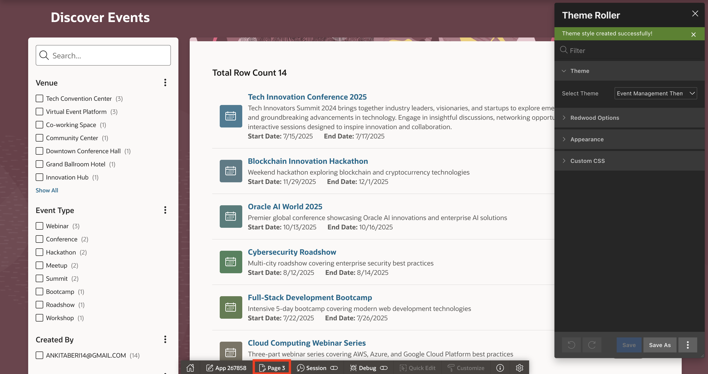

2. In the left pane, right-click **Breadcrumb** and click **Create Button**.

    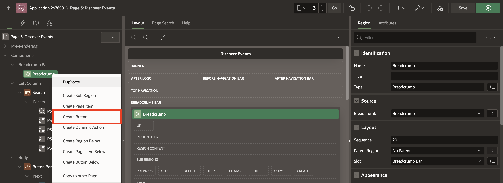

3. In the Property Editor, enter/select the following:

    - Under Identification:

        - Button Name: **EVENT_ASSISTANT**

        - Label: **Event Assistant**

    - Layout > Slot: **Next**

    - Under Appearance:

        - Button Template: **Text with Icon**

        - Hot: Toggle **On**

        - Icon: **fa-chatbot**

    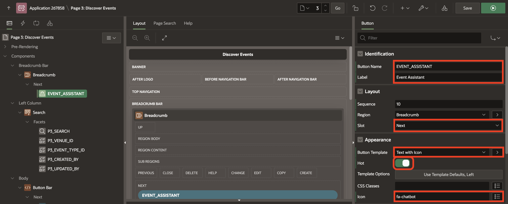

4. In the left pane, right-click **EVENT_ASSISTANT** button and click **Create Dynamic Action**.

    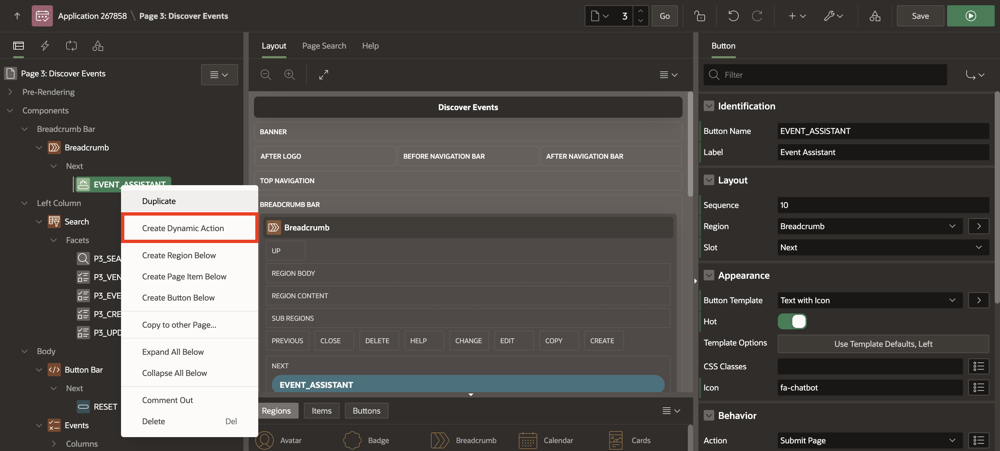

5. In the Property Editor, enter the following:

    - Identification > Name : **Event Assistant**

    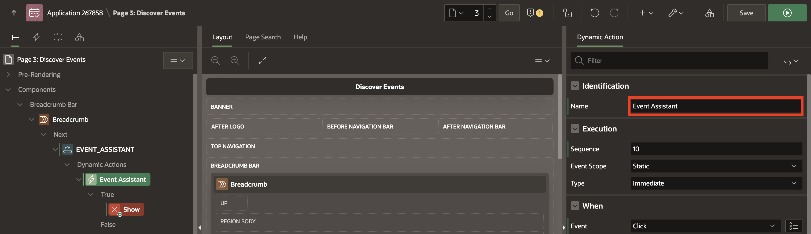

6. Under **True** Action, click **Show**. In the Property Editor, enter/select the following:

    - Identification > Action: **Show AI Assistant**

    - Generative AI > Service: Select **YOUR\_GEN\_AI\_SERVICE**

    - Welcome Message: **Hi! How can I help you today?**

    - Appearance > Title: **Event Assistant**

7. Click **Save and Run**.

    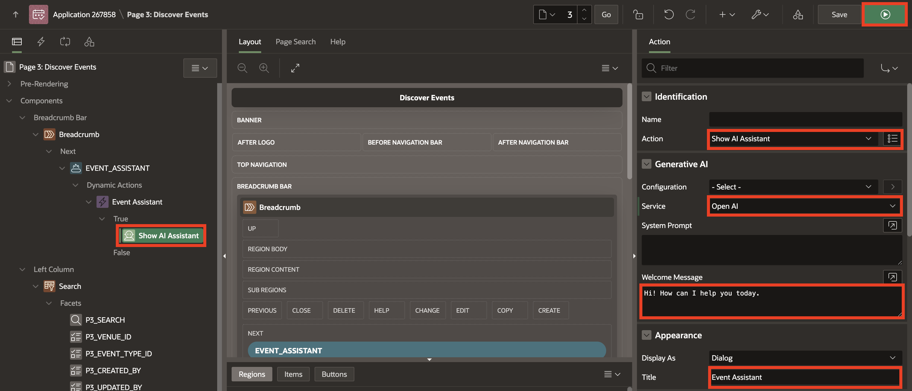

8. In the app, click the **Event Assistant** button and enter the prompt as **List AI Events**.

   The chat assistant currently returns results from a web search, not from our database. To fix this, we will create an AI configuration with a RAG (Retrieval-Augmented Generation) source so that the Event Assistant fetches details only from the specified data source.

    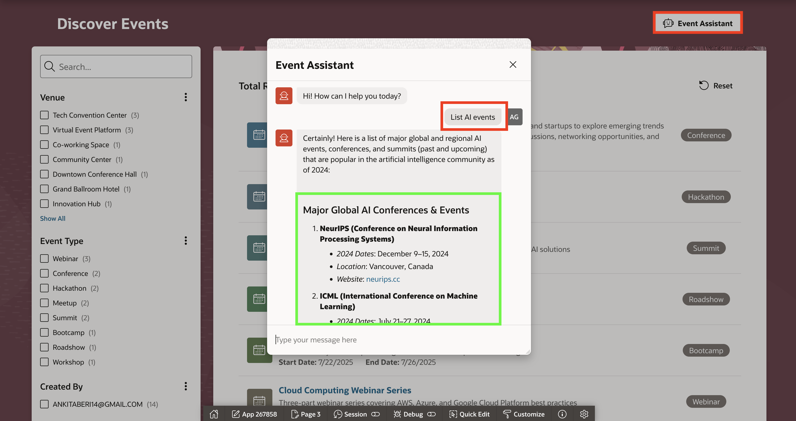

## Task 2: Create AI Configuration and RAG Source

1. Navigate to **Shared Components**.

    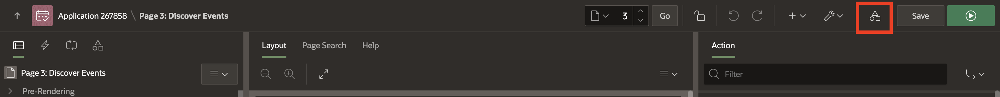

2. Under Generative AI, click **AI Configurations**.

    

3. In the Generative AI Configurations page, click **Create**.

    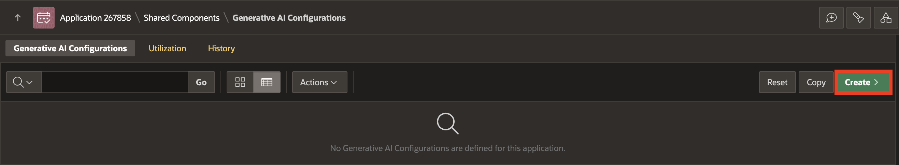

4. In the Generative AI Configuration page, enter the following:

    - Identification > Name : **Event AI Configuration**

    - Under Generative AI:

        - Service: Select the AI service which you habe configured in Lab 1.

        - System Prompt:

            ```
            <copy>

            You are an event assistant. Help answer questions using the data provided about the events.

            Use the data provided about the events as context.

            ```
            </copy>

        - Welcome Message: **Hi! I’m your Event Assistant. How can I help you today?**

    - Under Server-side Condition:

        - Type: Function Body

        - Expression:

            ```
            <copy>
            return :APP_PAGE_ID = 3;
            </copy>
            ```
        >Note: Page number may vary depending on your application.

5. Click **Create**.

    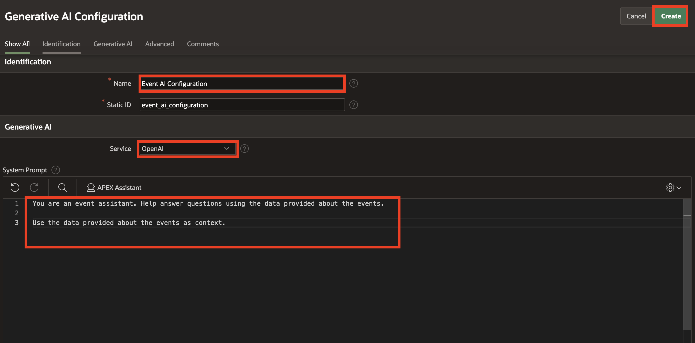

    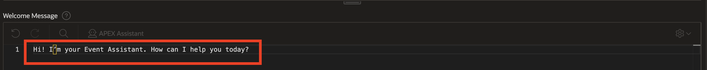

    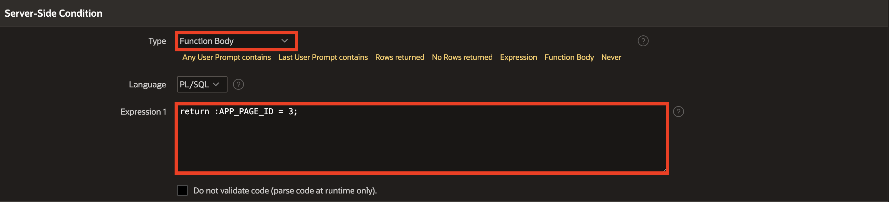

6. Click **Event AI Configuration**. Under RAG Sources, click **Create RAG Source**.

    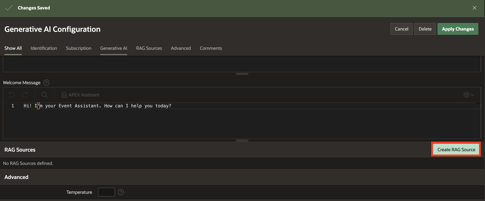

7. In the RAG Source page, enter/select the following:

    - Identification > Name: **Event Assistant**

    - Description: **Event assistant to query about event details**

    - Source > SQL Query: Click **APEX Assistant**

8. In the APEX Assistant box, enter the following prompt and press enter:

    Prompt 1:
    ```
    <copy>
    Fetch event id, start date, venue, name and event type
    </copy>
    ```

    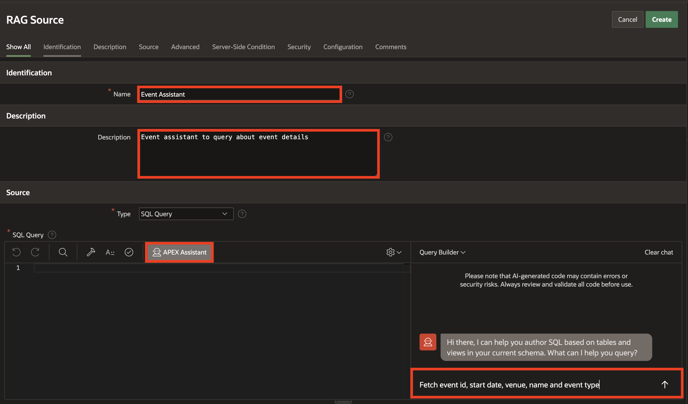

9. Click **Insert**.

    

10. Click **Create**.

    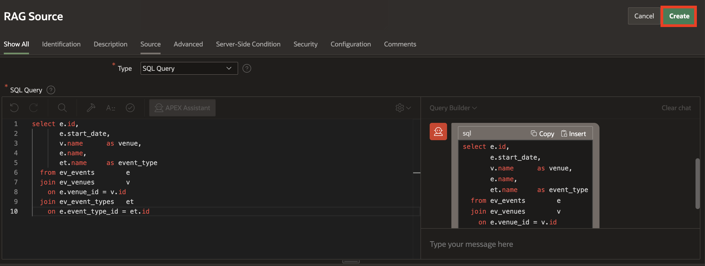

## Task 3: Enable Event Chat Assistant with RAG Source

1. From the top-right corner, click **Edit Page 3**.

    >Note: Page number may vary depending on your application.

    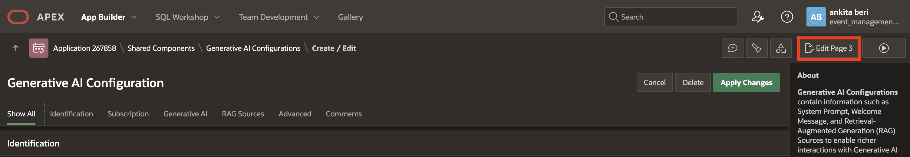

2. In the Dynamic Action tab, select True Action **Show AI Assistant** and update the following:

    - Generative AI > Configuration: **Event AI Configuration**

    - Under Quick Actions:

        - Message 1: **List all AI events**

        - Message 2: **List any Oracle APEX events**

    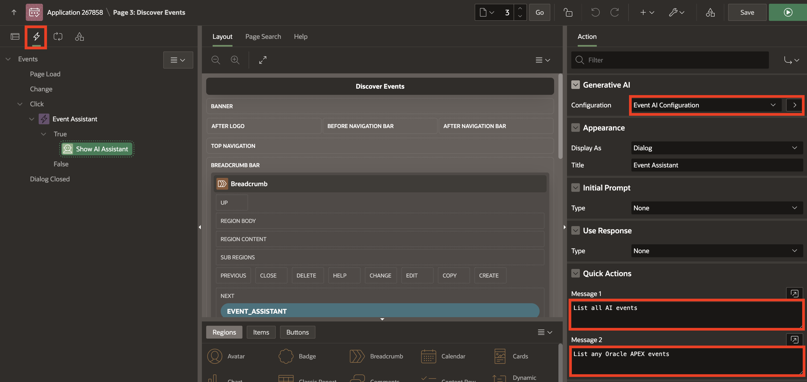

3. Click **Save and Run**.

4. In the app, click the **Event Assistant** button and click **List all AI Events**. The chat assistant will now return results using a RAG (Retrieval-Augmented Generation) source, ensuring that details are fetched only from the specified data source.

    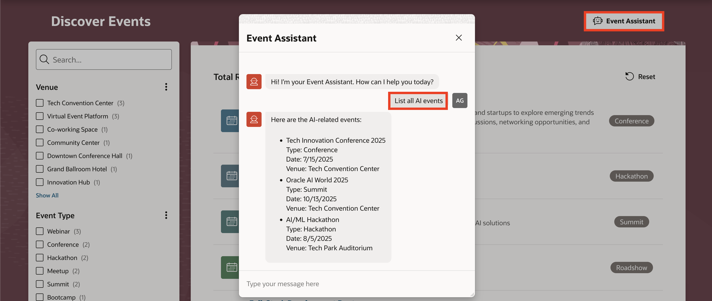

## Summary

In this lab, you created an Event Chat Assistant by adding a button, configuring AI settings, and setting up a dynamic action, allowing users to interactively ask questions about event details.

## Acknowledgments

- **Author** - Ankita Beri, Senior Product Manager
- **Last Updated By/Date** - Ankita Beri, Senior Product Manager, November 2025
