# Create an AI Chatbot

## Introduction

In this lab, you will enhance your Oracle APEX CRM application by implementing both user experience improvements and AI-driven capabilities.

You will begin by strengthening the application with email validation to ensure data quality and by creating dynamic actions to automatically refresh regions and improve interactivity.

Next, you will build a CRM **Chat Assistant** using a dynamic action. You will first configure the chatbot without a RAG (Retrieval-Augmented Generation) source to understand how it generates generic responses. Then, you will enhance it by creating an AI Configuration and defining RAG sources, enabling the chatbot to retrieve information directly from your CRM tables.

Estimated Time: 20 minutes

### Objectives

By the end of this lab, you will be able to:

- Implement email validation to enforce proper data entry in the Leads form.

- Create dynamic actions to automatically refresh regions and improve user experience.

- Create an CRM AI Assistant button in your APEX application.

- Configure a Show AI Assistant dynamic action without using a RAG source.

- Create an AI Configuration and define a RAG Source to query CRM data.

- Connect the AI Configuration to the Show AI Assistant dynamic action so the chatbot fetches results exclusively from your CRM data source.

### Downloads

Stuck or Missed out on completing the previous labs? Don't worry! You can download the following application:

**[Click here](https://c4u04.objectstorage.us-ashburn-1.oci.customer-oci.com/p/EcTjWk2IuZPZeNnD_fYMcgUhdNDIDA6rt9gaFj_WZMiL7VvxPBNMY60837hu5hga/n/c4u04/b/livelabsfiles/o/labfiles%2FBuild-Enterprise-AI-Apps-Faster-Part%201.sql)** to download the completed application till Lab 3. Follow the [Appendix lab](?lab=8-appendix) for steps to import and install the downloaded app.


## Task 1: Add Email Validation in the Leads Form Page

Data validation is essential to ensure high-quality CRM records. In this task, you will add a regular expression validation to the Email field in the Leads form page.

1. Navigate to developer toolbar, **Quick Edit** on **Email** Field.

    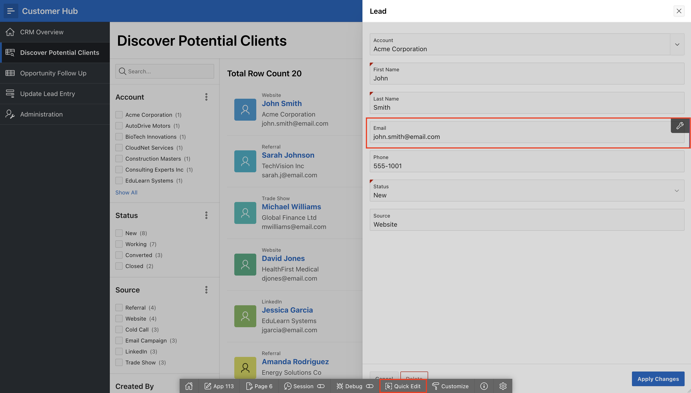

2. Right-click **P6_EMAIL** and select **Create Validation**.

    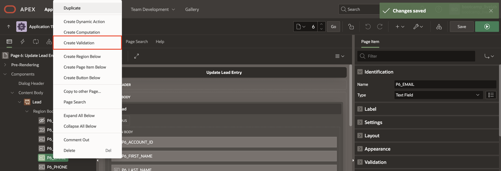

3. In the right pane, enter/select the following:

    - Identification > Name: **Validate Email Format**

    - Under Validation:

        - Type: **Item matched Regular Expression**

        - Item: **P6_EMAIL**

        - Regular Expression: **^[A-Za-z0-9._%+-]+@[A-Za-z0-9.-]+\.[A-Za-z]{2,}$**

    - Error > Error Message : **Please enter a valid Email Address**

    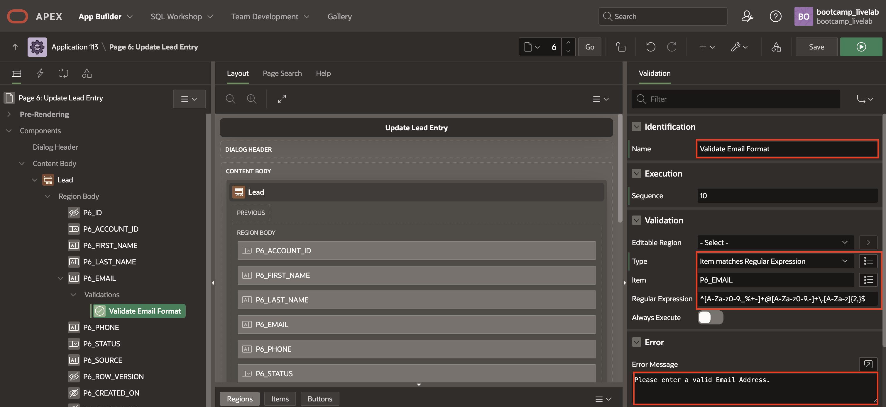

4. Click **Save**.

    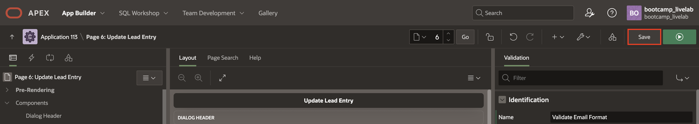

5. In the run time evironment, refresh the leads form page. Make some changes to the email address and click **Apply Changes**. You will notice the validation notification.

    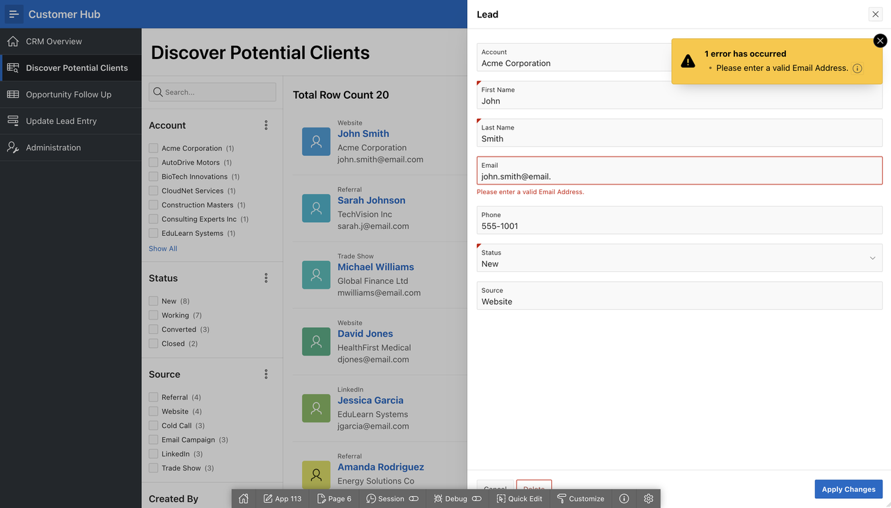

## Task 2: Add a Dynamic Action to refresh the content Row Region

When a Lead record is edited in a dialog, the Leads Content Row region should automatically refresh to reflect updated data. In this task, you will create a Dynamic Action to refresh the region when the dialog closes.

1. Close the leads form page. **Quick Edit** on the Content Row region.

    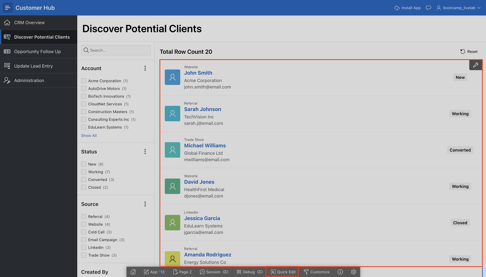

2. Right-click leads region and select **Create Dynamic Action**.

    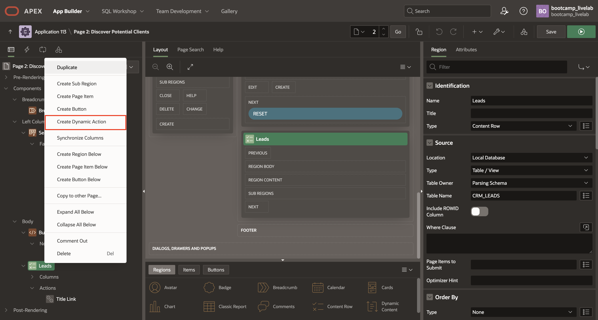

3. In the right pane, update Identification > Name to **Refesh Content Row** and check the defaults:

    - Under When:

        - Event: **Dialog Closed**

        - Selection Type: **Region**

        - Region: **Leads**

    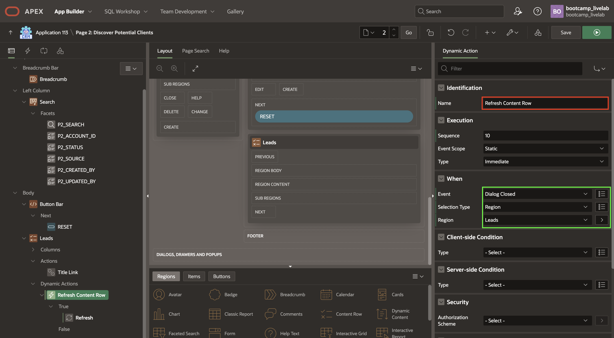

4. Navigate to True Action and in the right pane, check the defaults:

    - Identification > Action: **Refresh**

    - Under Affected Elements:

        - Selection Type: **Region**

        - Region: **Leads**

    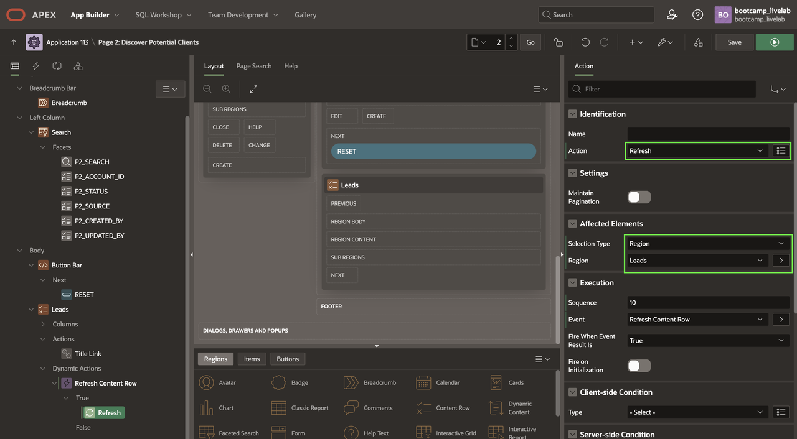

5. Click **Save**.

    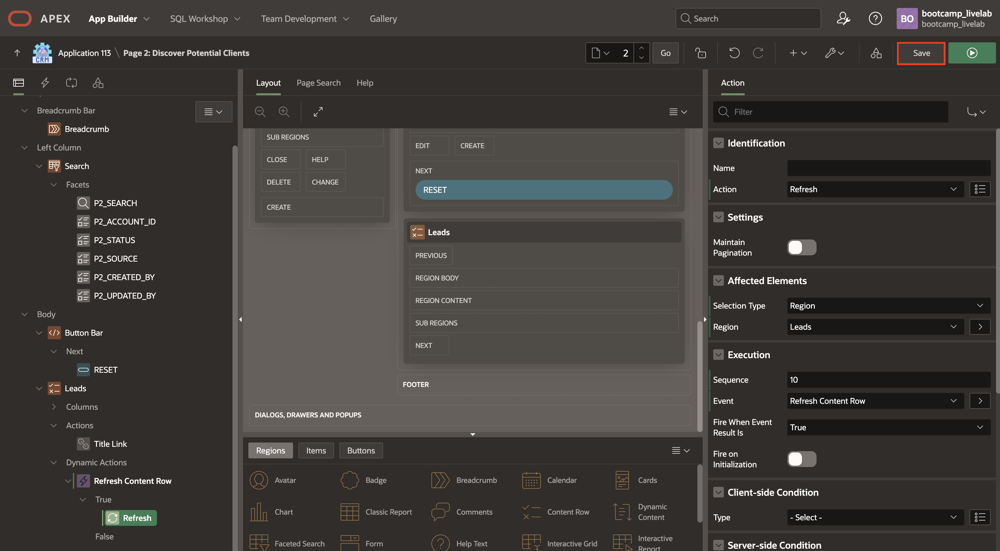

## Task 3: Create a Chatbot for CRM

In this task, you will create a CRM AI Assistant button on the Dashboard page and configure the *Show AI Assistant* dynamic action without using a RAG source. This demonstrates how the AI chat assistant provides generic AI responses.

1. In the runtime environment, go to the Dashboard Page (Home Page) and **Quick Edit** on the **breadcrumb**.

    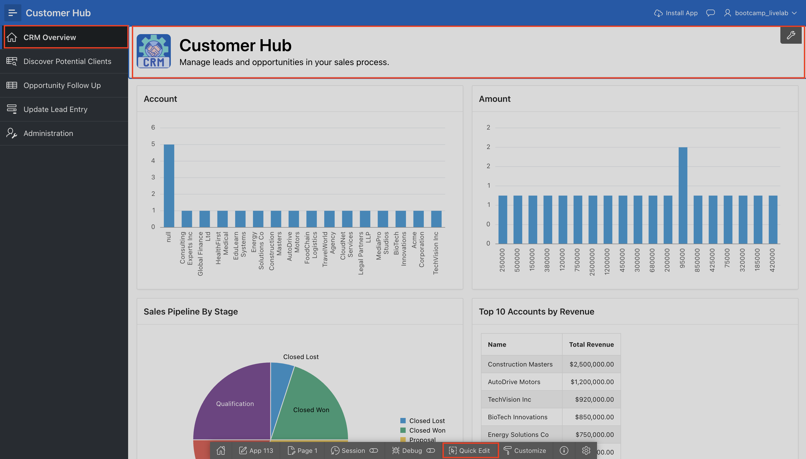

2. In the left pane, right-click **Breadcrumb** and click **Create Button**.

    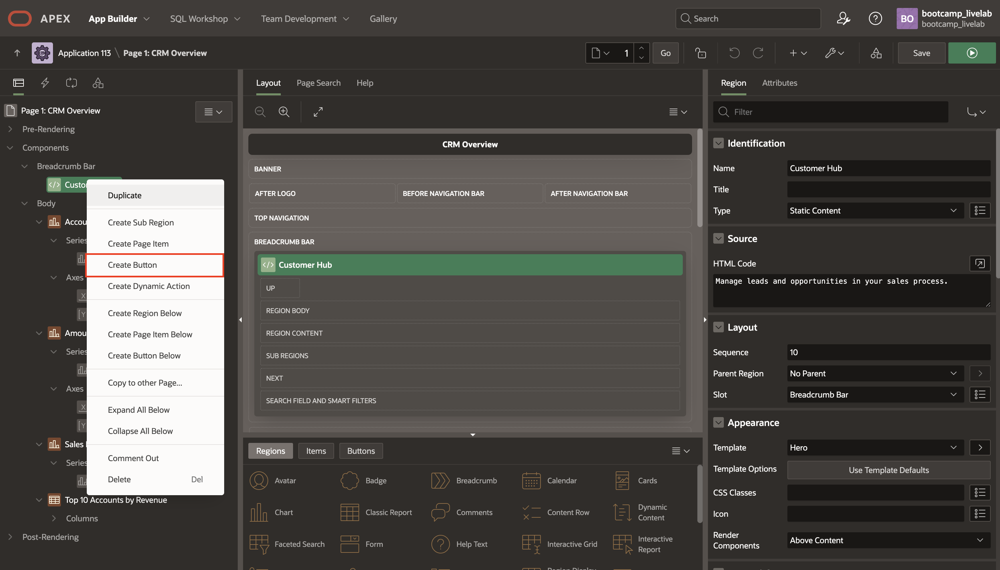

3. In the right pane, enter/select the following:

    - Under Identification:

        - Button Name: **CRM\_AI\_ASSISTANT**

        - Label: **CRM AI Assistant**

    - Layout > Slot: **Next**

    - Under Appearance:

        - Button Template: **Text with Icon**

        - Hot: Toggle **On**

        - Icon: **fa-chatbot**

    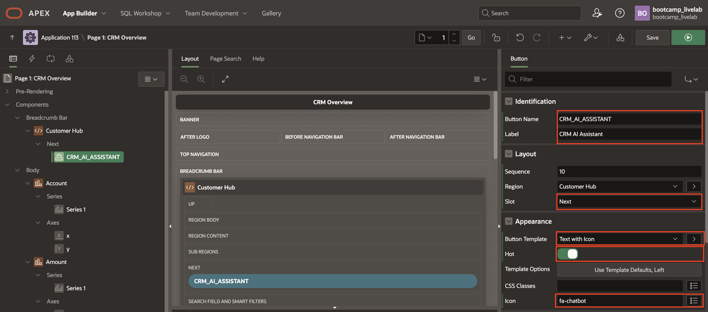

4. In the left pane, right-click **CRM\_AI\_ASSISTANT** button and click **Create Dynamic Action**.

    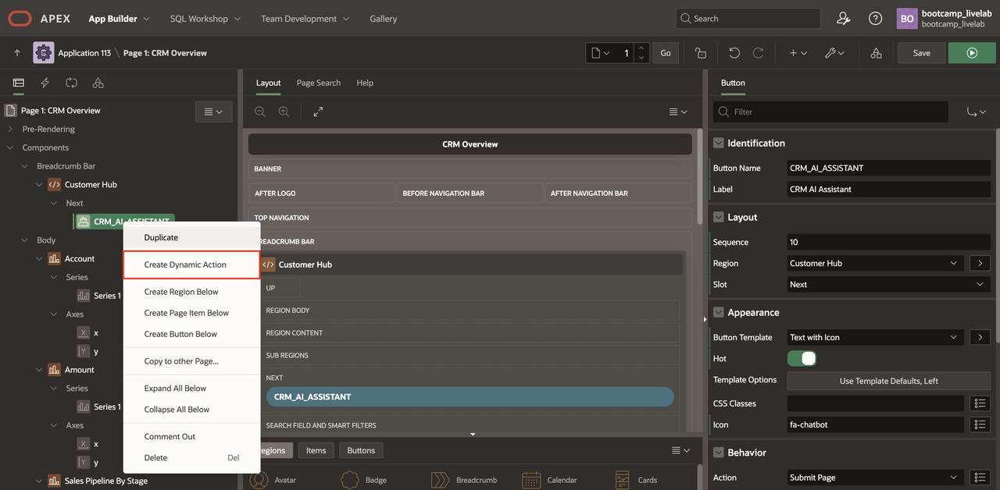

5. In the right pane, enter the following:

    - Identification > Name : **Open AI Chatbot**

    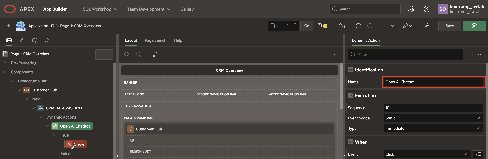

6. Under **True** Action, click **Show**. In the right pane, enter/select the following:

    - Identification > Action: **Show AI Assistant**

    - Generative AI > Service: Select **Open AI** (Created in Lab 1)

    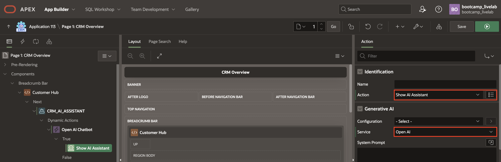

7. Click **Save and Run**.

    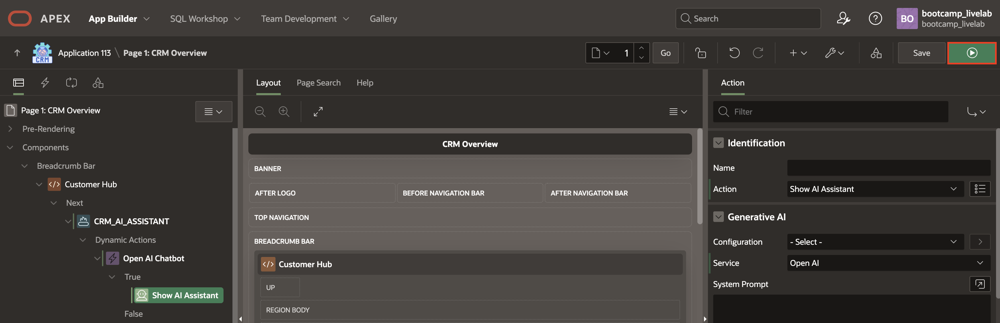

8. In the app, click the **CRM AI Assistant** button and enter the prompt as **Show me all new leads.**

    The chat assistant currently doesn't returns results from our database. To fix this, we will create an AI configuration with a RAG (Retrieval-Augmented Generation) source so that the Event Assistant fetches details only from the specified data source.

    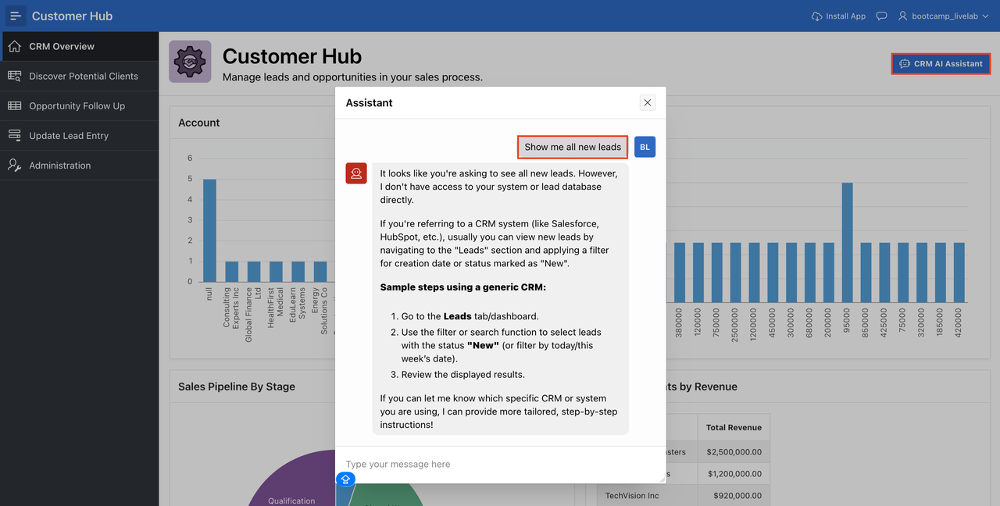

## Task 4: RAG Powered Chatbot

In this task, you will create an AI Configuration and define RAG Sources. This enables the chatbot to retrieve information directly from your CRM tables using APEX Assistant.

1. Navigate back to Page designer. Go to **Shared Components**.

    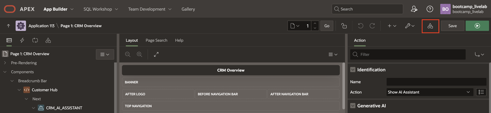

2. Under Generative AI, click **AI Configurations**.

    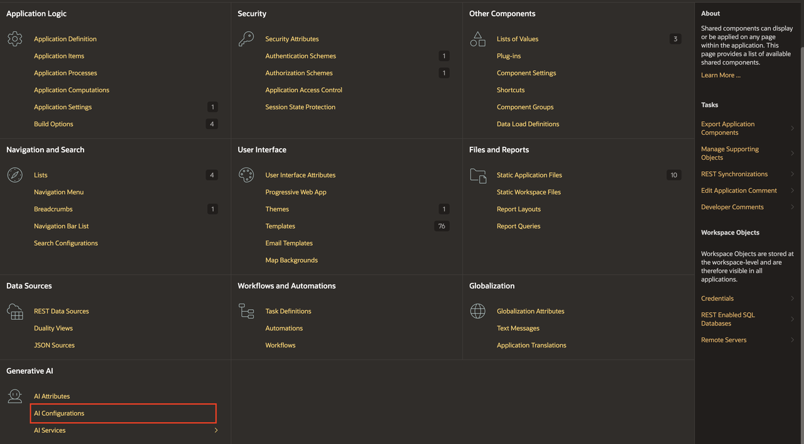

3. In the Generative AI Configurations page, click **Create**.

    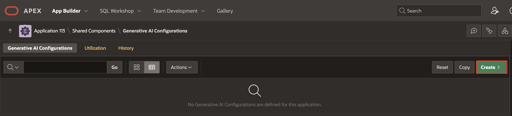

4. In the Generative AI Configuration page, enter the following:

    - Identification > Name : **CRM AI Configuration**

    - Under Generative AI:

        - Service: **Open AI** (Select the AI service which you have configured in Lab 1.)

        - System Prompt:

            ```
            <copy>

            You are a CRM domain assistant.

            Answer only questions related to Customer Relationship Management (CRM), including leads, opportunities, accounts, contacts, sales pipeline, customer interactions, support cases, and CRM workflows.

            Use only the data provided in the conversation or context. Do not use outside knowledge. If the answer is not available in the provided data, say:
            "The provided data does not contain this information."
            Do not guess, assume, or generalize. Keep answers precise, factual, and based strictly on the input.

            ```
            </copy>

        - Welcome Message: **Hi, How may I help you?**

5. From right-hand side task list, enable **Return To Page**.

6. Click **Create**.

    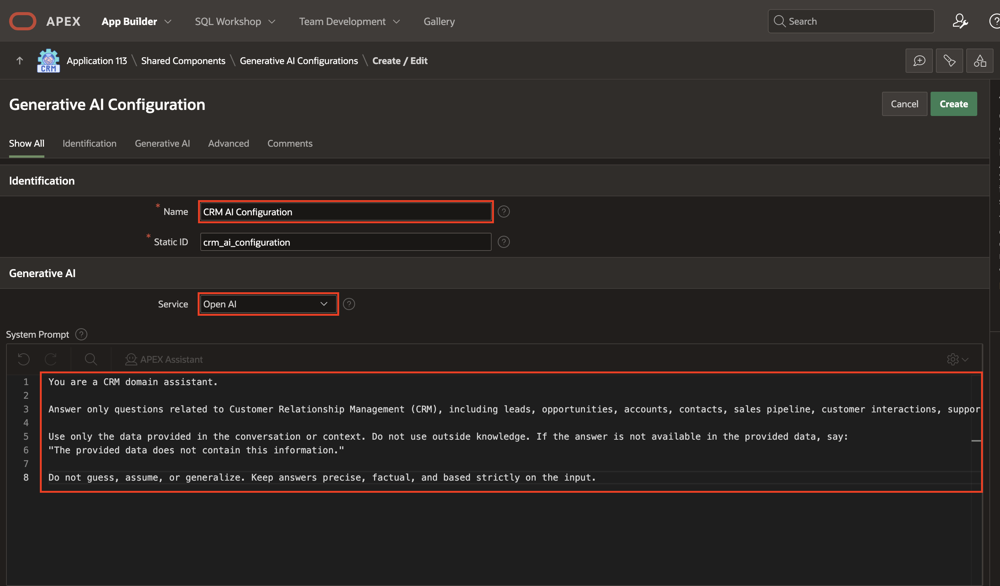

    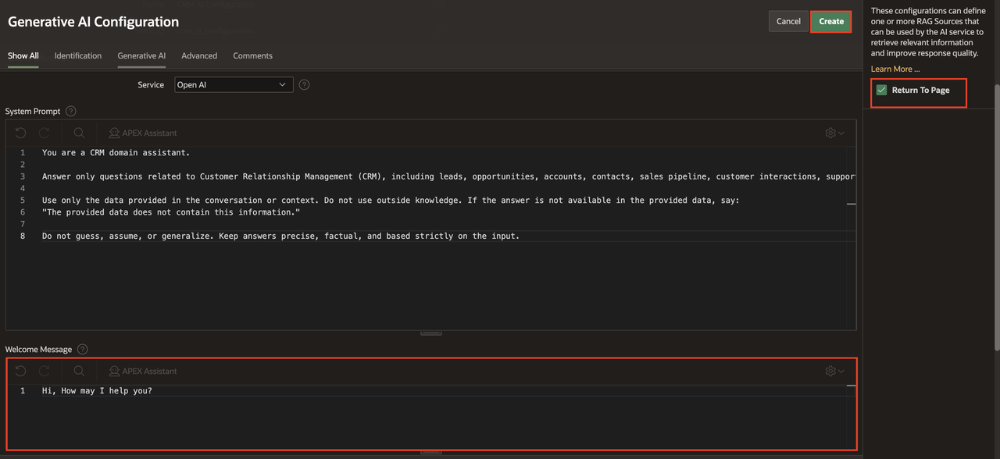

7. Under RAG Sources, click **Create RAG Source**.

    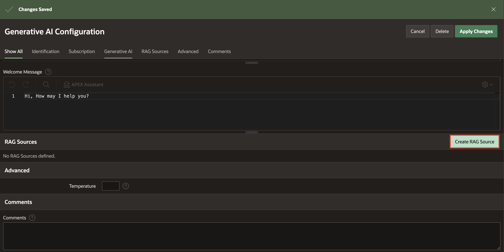

8. In the RAG Source page, enter/select the following:

    - Identification > Name: **Leads Details**

    - Description: **Provides details about leads**

    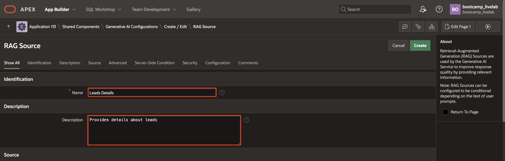

9. Under Source > SQL Query: Click **APEX Assistant**


10. In the APEX Assistant box, enter the following prompt and press enter:

    **Prompt 1:**
    ```
    <copy>
    Get all details about leads like account name, Channel, status etc
    </copy>
    ```

    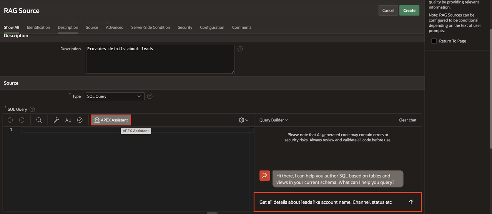

11. Click **Insert**.

    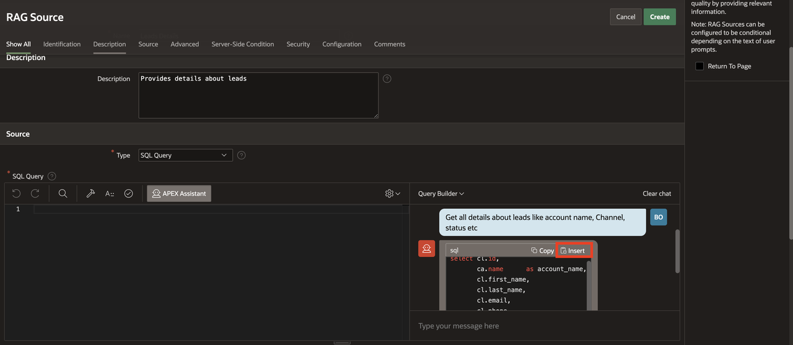

12. Under Server-Side condition, enter/select the following:

    - Type: **Last User Prompt contains**

    - Expression 1: **Leads**

13. Click **Create**.

    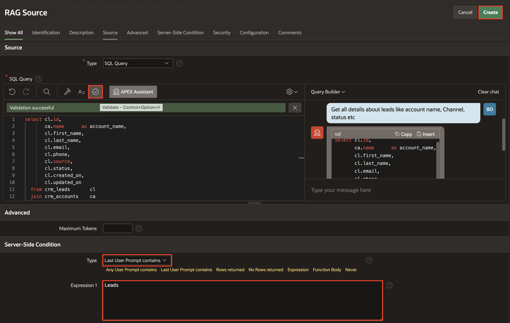

14. Click **Create RAG Source** again.

    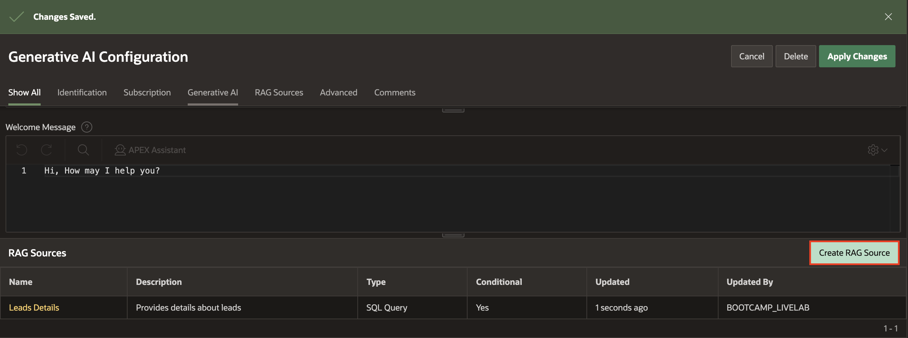

15. In the RAG Source page, enter/select the following:

    - Identification > Name: **Opportunity Details**

    - Description: **Provides details about leads**

    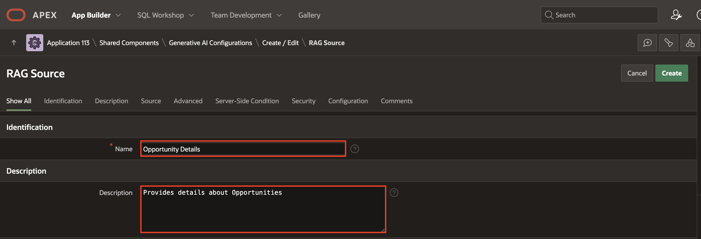

16. Under Source > SQL Query: Click **APEX Assistant**

17. In the APEX Assistant box, enter the following prompt and press enter:

    Prompt 1:
    ```
    <copy>
    Get all details about opportunities like Account Name, Opportunity Name, Description, Amount, Stage, Close Date.
    </copy>
    ```

    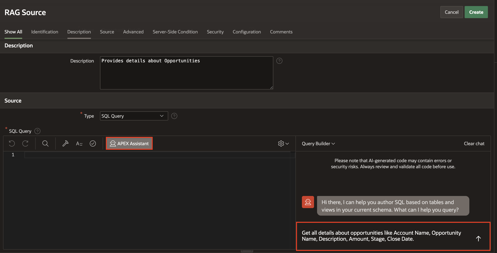

18. Click **Insert**.

    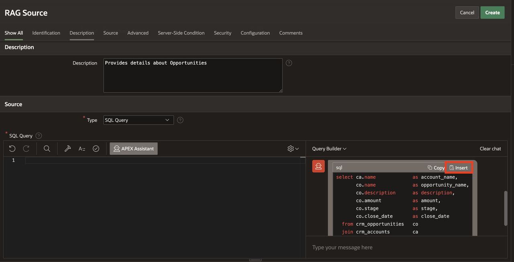

19. Under Server-Side condition, enter/select the following:

    - Type: **Last User Prompt contains**

    - Expression 1: **Opportunities**

20. Click **Create**.

     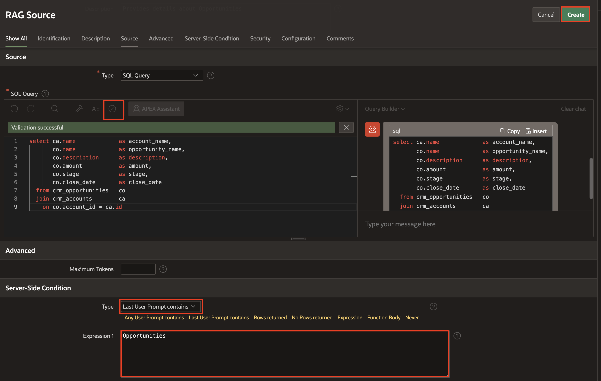

## Task 5: Enable Chat Assistant with RAG Source

In this final task, you will connect the CRM AI Configuration (with RAG sources) to the Show AI Assistant dynamic action so that the chatbot retrieves data directly from your CRM tables.

1. From the top-right corner, click **Edit Page 1**.

    >Note: Page number may vary depending on your application.

    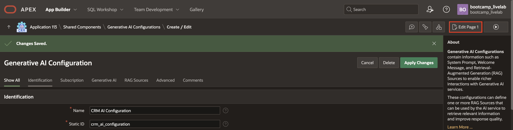

2. Under **CRM\_AI\_ASSISTANT** button, select True Action **Show AI Assistant** and update the following:

    - Generative AI > Configuration: **CRM AI Configuration**

    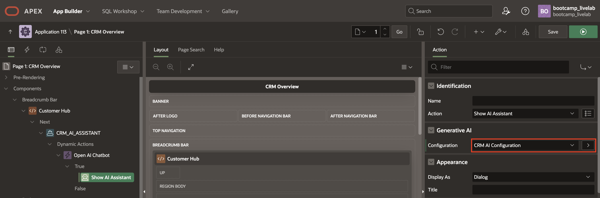

3. Click **Save and Run**.

    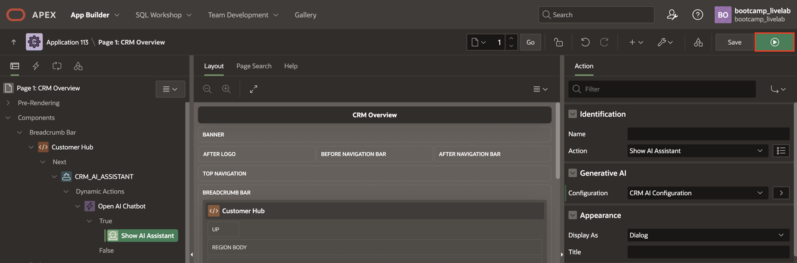

4. In the app, click the **CRM AI Assistant** button and enter the following prompts:

    **Prompt 1:**
    ```
    <copy>
    Show me all new leads
    </copy>
    ```

    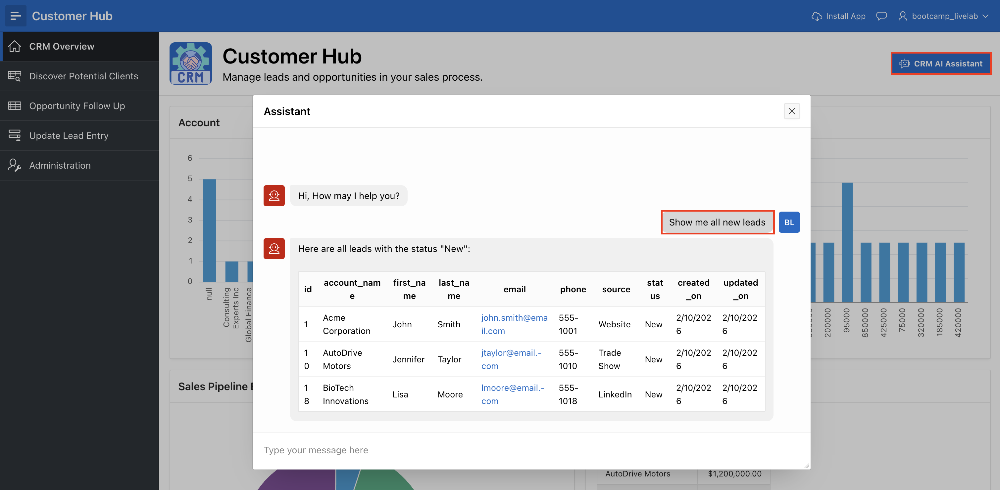

    **Prompt 2:**
    ```
    <copy>
    Which opportunities are worth more than $500,000?
    </copy>
    ```

    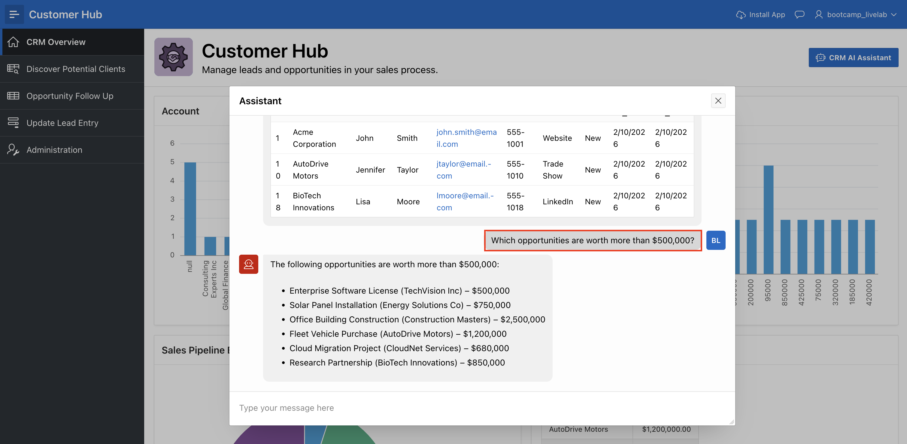

    **Prompt 3:**
    ```
    <copy>
    Show me all opportunities with close dates in the past that aren't closed.
    </copy>
    ```

    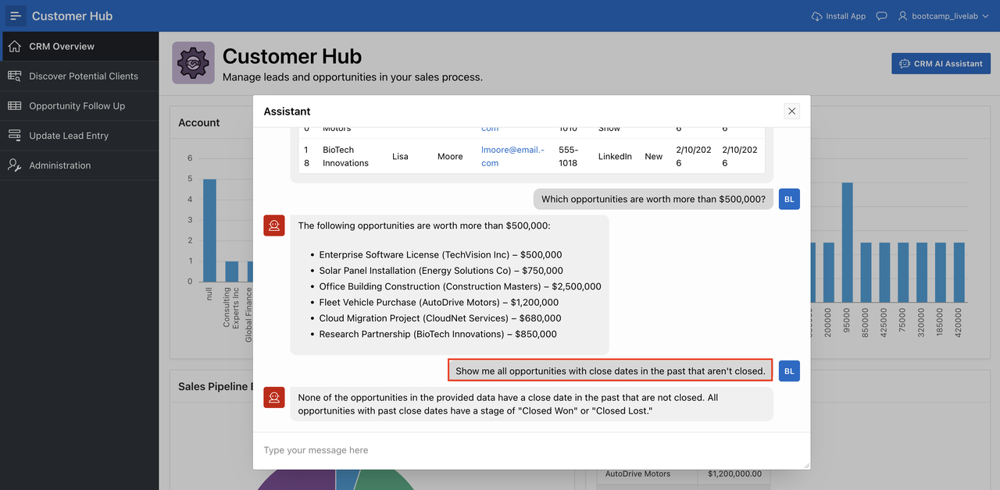

    The chat assistant will now return results using a RAG (Retrieval-Augmented Generation) source, ensuring that details are fetched only from the specified data source.

## Summary

In this lab, you:

- Added validation to improve CRM data quality.

- Created dynamic actions to enhance UI responsiveness.

- Built a CRM AI Assistant using Show AI Assistant.

- Created an AI Configuration with a structured system prompt.

- Defined RAG sources using APEX Assistant.

- Enabled secure, data-driven conversational responses.

You have now successfully implemented a RAG-powered CRM Chat Assistant inside Oracle APEX, demonstrating how Generative AI can be securely integrated with enterprise data using low-code development.

## Acknowledgements

- **Author** - Ankita Beri, Senior Product Manager
- **Last Updated By/Date** - Ankita Beri, Senior Product Manager, February 2026
