# Working with External Data Sources

## Introduction

In this lab, you will learn how to integrate an external REST service into your Oracle APEX application using REST Data Sources.

You will create a REST Data Source using Oracle REST Data Services (ORDS), enable synchronization with a local database table, and configure your application to consume the REST data source instead of directly querying the table.

This lab demonstrates how Oracle APEX enables seamless integration with external APIs while maintaining performance and data consistency through scheduled synchronization.

Estimated Time: 10 minutes

### Objectives

- Create a REST Data Source using Oracle REST Data Services (ORDS).

- Enable synchronization between a REST Data Source and a local table.

- Configure scheduled synchronization.

- Use a REST Data Source as the source of a report region.

## Task 1 : Create REST Data Sources

In this task, you will create a REST Data Source using an Oracle REST Data Services (ORDS) endpoint. You will then configure synchronization to merge data into the existing CRM_LEADS table and schedule automatic updates.

1. Return to the Page designer and navigate to **Shared Components**.

    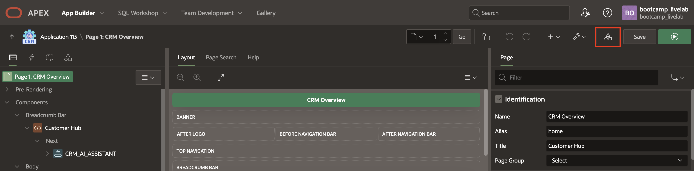

2. Under **Data Sources**, select **REST Data Sources**.

    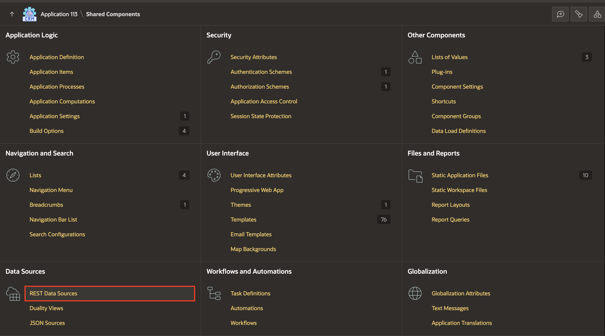

3. On the REST Data Sources page, click **Create**.

    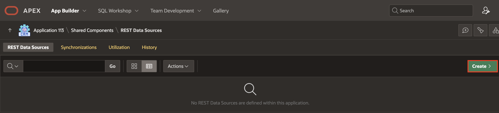

4. On Create REST Data Source - Method page, select From a REST Source Catalog and click **Next**.

    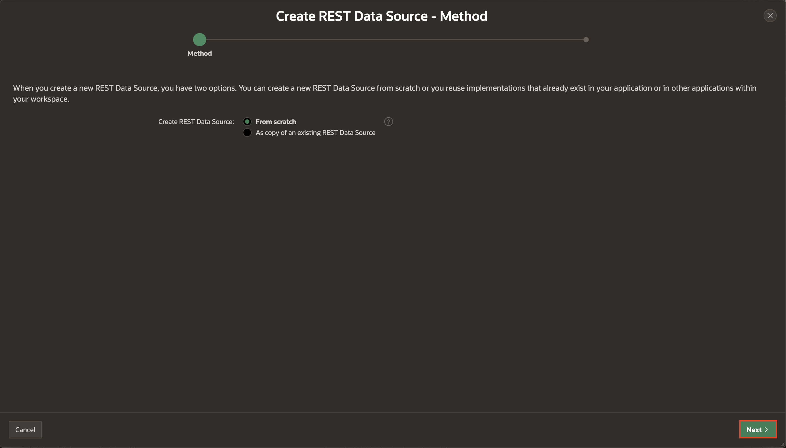

5. On Create REST Data Source dialog, enter/select the following:

    - Type : **Oracle REST Data Services**

    - Name: **Leads API**

    - Endpoint:  https://oracleapex.com/ords/t_crm/crm_leads/

    Click **Next**.

    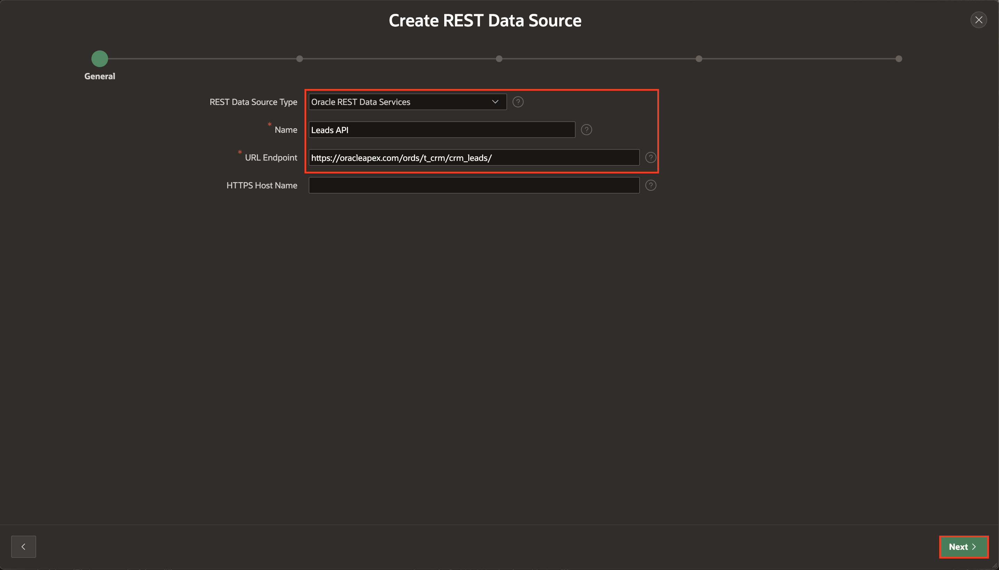

6. On Create REST Data Source - Remote Serve page, click **Next**.

    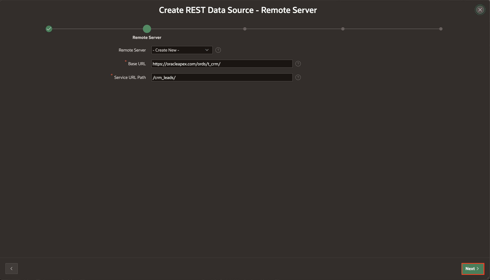

7. Click **Discover**.

    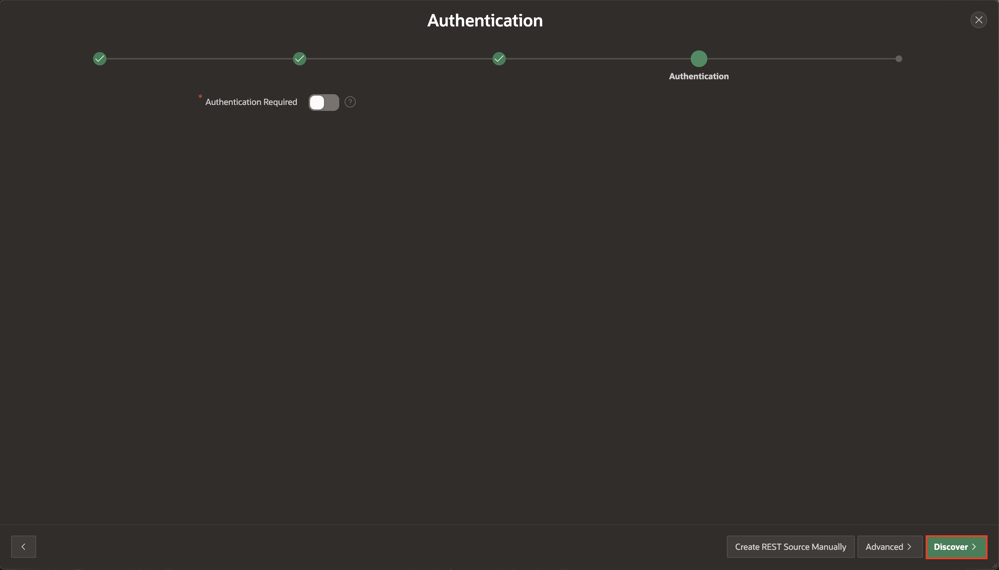

8. Click **Create REST Data Source**.

    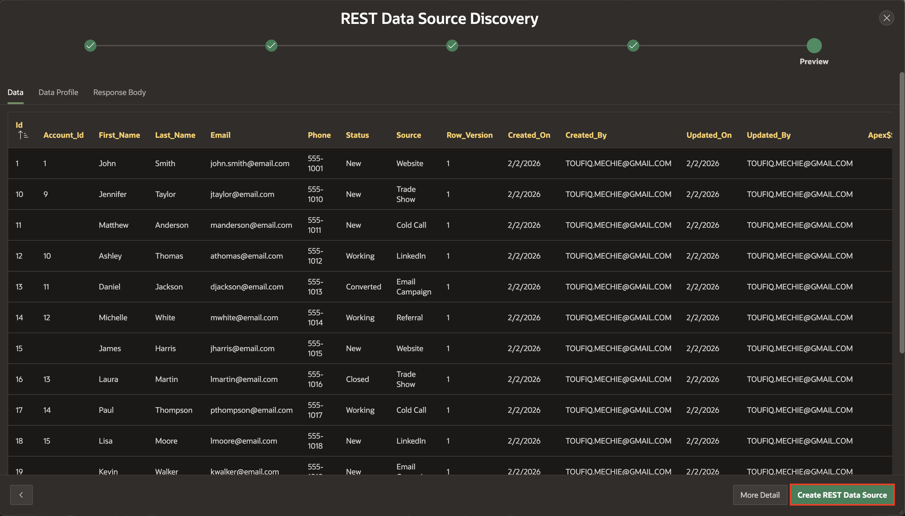

9. To enable Synchronization, click **N**o** in the Synchronized column.

    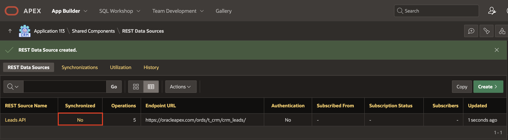

10. Under Details, enter/select the following:

    - Synchronize to: **Existing Table**

    - Table Name: **CRM_LEADS**

    Click **Save**.

    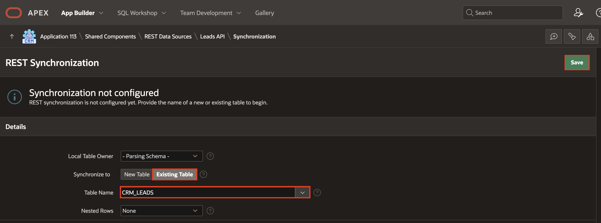

11. Under Details, enter/select the following:

    - Synchronization Type: **Merge**

    - Synchronization Schedule: Click on Settings button

    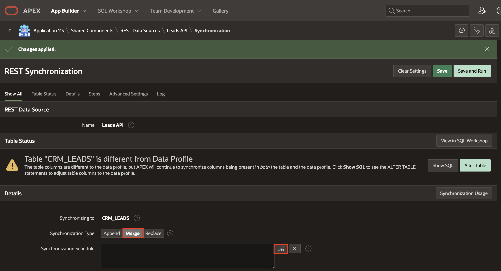

12. In the Interval Builder dialog, enter/select the following:

    - Frequency: **Minutely**

    - Interval: **15**

    Click **Set Execution Interval**.

    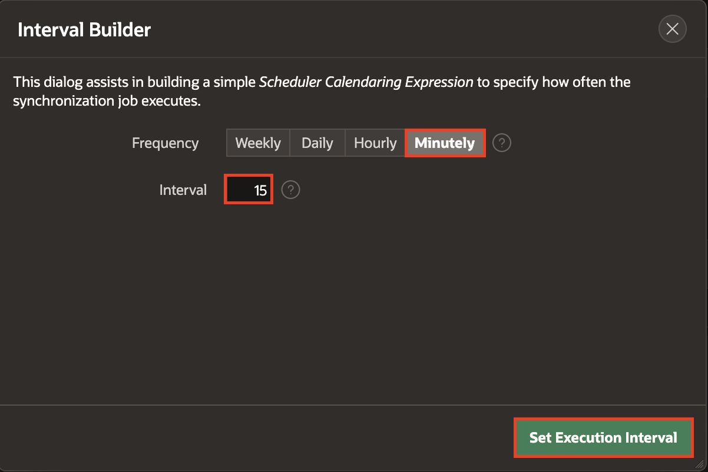

13. Click **Save And Run**.

    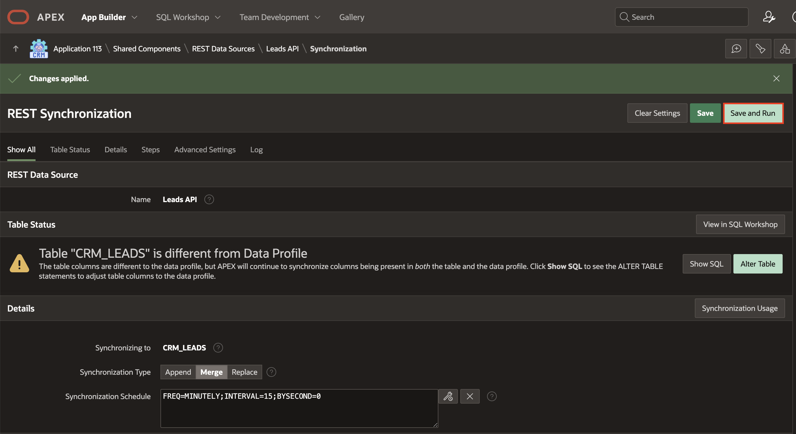

## Task 2 : Configure the REST Data Source in the Leads Report

Now that the REST Data Source has been created and synchronized, you will configure the Leads report region to use the REST source instead of directly querying the database table.

You will also prepare the local table for synchronization tracking.

1. In the runtime app, go to Faceted Search Page and **Quick Edit** on the Content row – Takes you to page designer, to the leads region.

    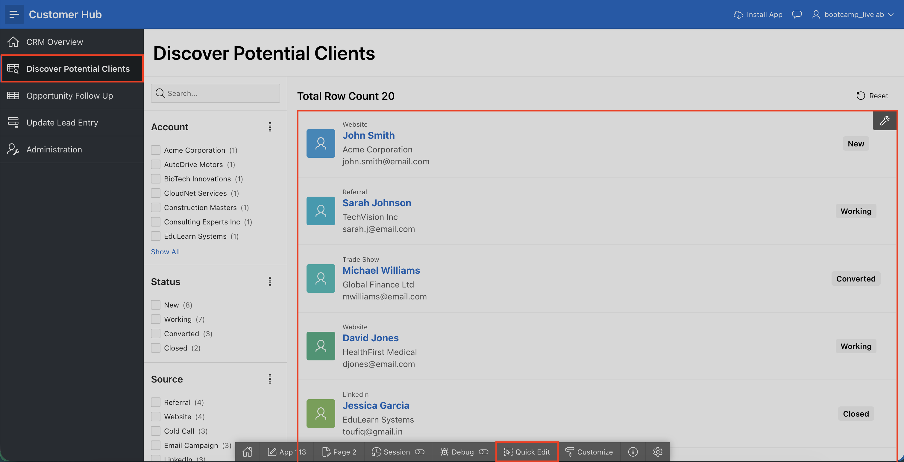

2. In the right pane, enter/select the following:

   - Under Source:

        - Location: REST Source

        - Rest Source: Leads API (created in Task 1)

        - REST Synchronization > Use Local table: Toggle **On**

    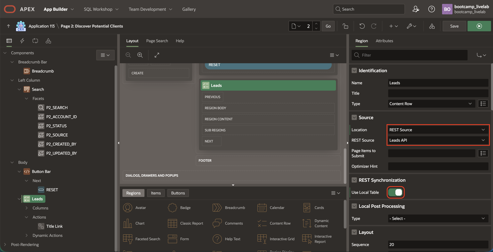

3. Click **Save**.

4. Now, navigate to **SQL Workshop** from the top Navigation bar.

    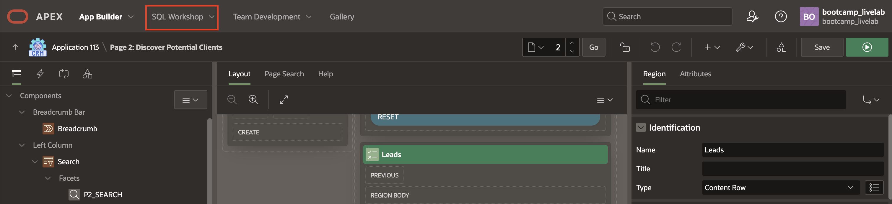

5. Click **SQL Commands**.

    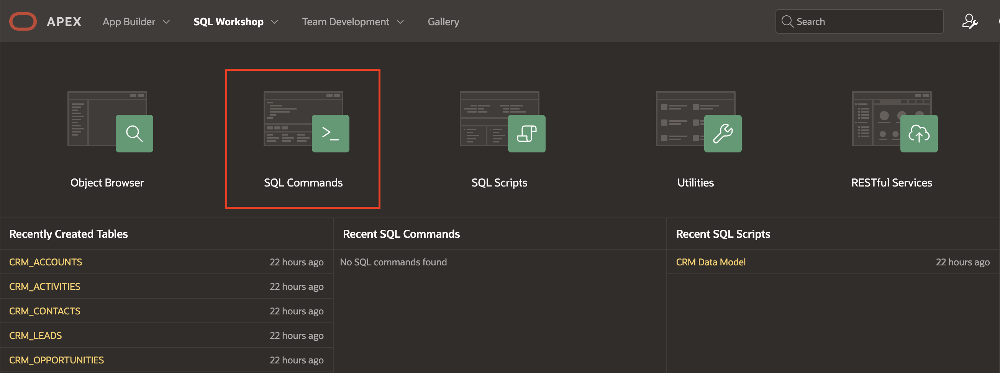

6. Copy and paste the following SQL command and click **Run**.

    ```
    <copy>
    ALTER TABLE CRM_LEADS
    ADD (
      APEX$ROW_SYNC_TIMESTAMP TIMESTAMP,
      APEX$SYNC_STEP_STATIC_ID VARCHAR2(255)
    );
    </copy>
    ```

    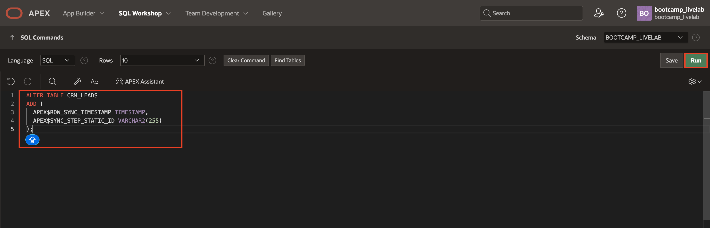

## Summary

In this lab, you:

- Created a REST Data Source using Oracle REST Data Services

- Enabled synchronization with an existing database table

- Scheduled automated merge operations

- Updated a report region to consume data from a REST source

You now understand how Oracle APEX enables seamless integration with external APIs while maintaining local performance and scheduled data synchronization.

## Acknowledgments

- **Author** - Ankita Beri, Senior Product Manager
- **Last Updated By/Date** - Ankita Beri, Senior Product Manager, February 2026
