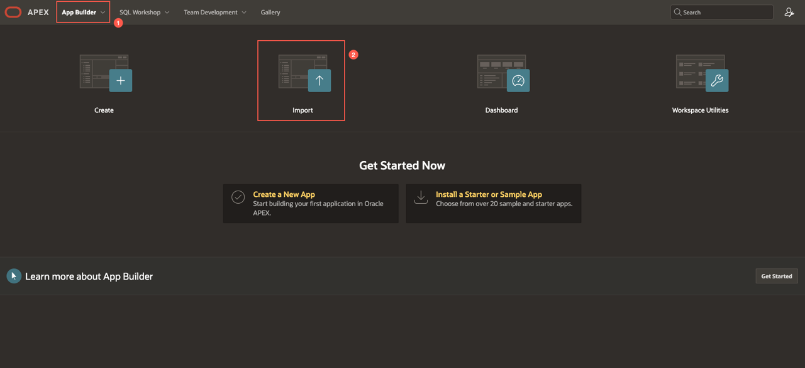
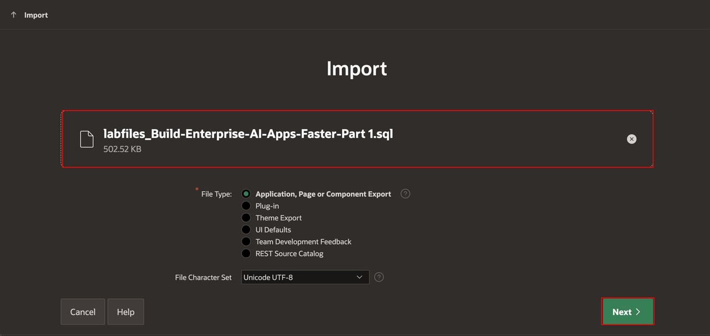
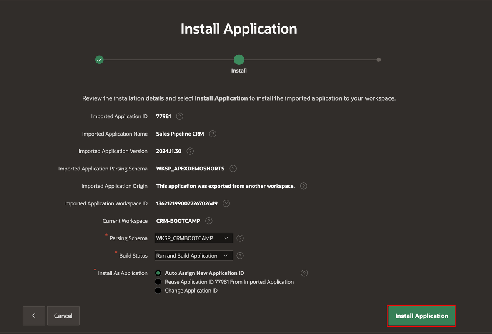
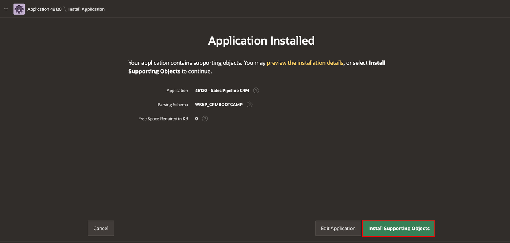
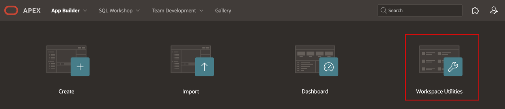
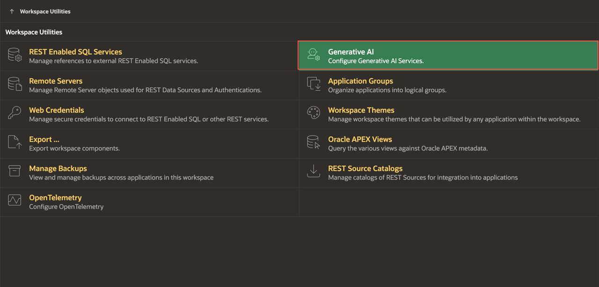
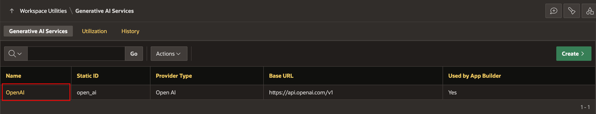
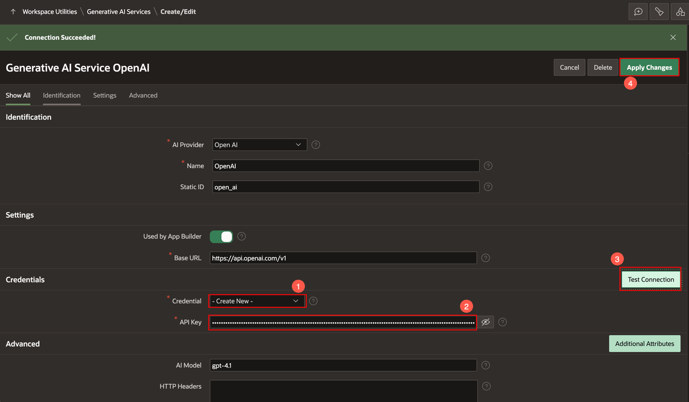

# Appendix: Download Instructions

## Introduction
This lab consists of instructions to import and install the downloaded app in case you are stuck at any point in the workshop.

Estimated Time: 5 minutes

## Objectives

In this lab, you will:
- Download and install the final export of the app.

## Task 1: Import the App into an APEX Workspace

1. Navigate to **App Builder** and click **Import**.

    

2. Drag and drop your downloaded zip file, then click **Next**.

    

3. Click **Install Application**.

    

5. Click **Install Supporting Objects**.

    

## Task 2: Configure Generative AI

To Enable Generative AI in Oracle APEX:

1. From the App Builder, click **Workspace Utilities**.

    

2. Click **Generative AI**.

    

3. Click **OCI Gen AI**.

    

9. Under Credentials, enter/select the following:
    - Credential: **-Create New-**
    - API Key: *Enter your API key*

    Click **Test Connection**. If the Connection is successful, click **Apply Changes**.

    

10. All set. You can now continue with the workshop.

## Acknowledgements

 - **Author** - Apoorva Srinivas, Principal Product Manager
 - **Last Updated By/Date** - Apoorva Srinivas, Principal Product Manager, February 2026
