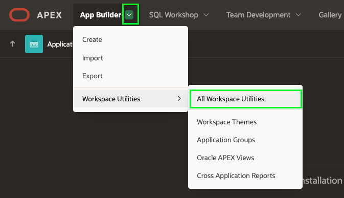
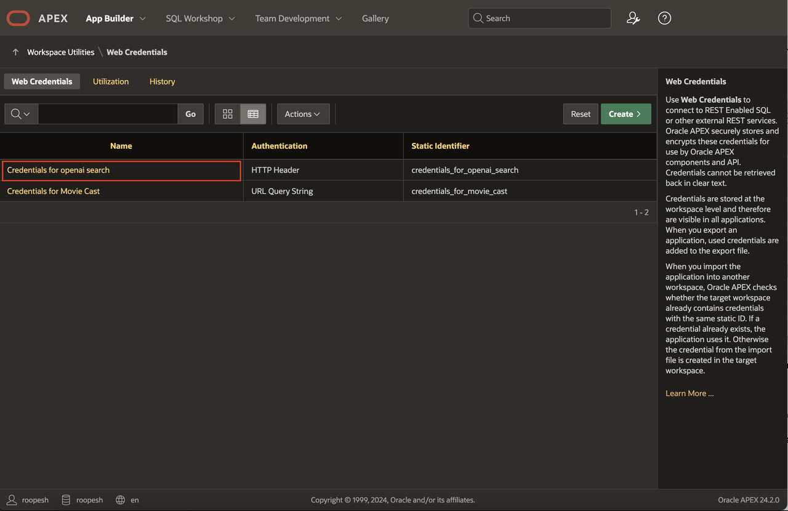
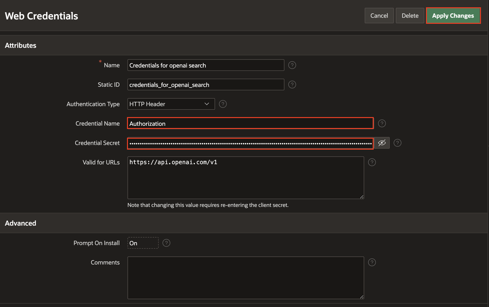

# Introduction

## About this Workshop

In this hands-on workshop, you will build and enhance a modern **CRM application** using Oracle APEX by combining low-code development, AI-powered capabilities, external data integrations, and custom authentication.

You will begin by **Configuring a Generative AI service** and proceed to use natural language prompts to **generate a complete CRM Data Model**. Instead of manually writing SQL or creating pages one by one, you will leverage AI to design and **build your application blueprint**. Additionally, you will enhance dashboards, reports, and forms using Oracle APEX’s powerful customization features.

Beyond core application development, you will extend your CRM by **integrating external REST APIs**, configuring data synchronization, and **implementing a custom security** framework. You will design secure authentication flows, **enforce role-based authorization**, and ensure that users only access data relevant to their roles.

You will also integrate Generative AI with **Retrieval-Augmented Generation (RAG)** to deliver intelligent, context-aware, and data-driven user experiences within your CRM application.

By the end of this workshop, you will have built a secure, extensible, and AI-enabled enterprise CRM application entirely using Oracle APEX’s low-code capabilities — demonstrating how AI and modern architecture can dramatically accelerate application development without compromising control, scalability, or security.

Total Workshop Time: 1 hour 30 minutes

### Objectives

- Create a Custom Data Model using Generative AI.

- Generate an application **blueprint** using APEX AI Assistant.

- Learn how to integrate and synchronize external REST APIs with your Oracle APEX application using REST Data Sources.

- Build a secure **Custom Authentication** and **role-based Authorization** framework within your Oracle APEX application.

- Enhance your CRM application with data validation, dynamic actions, and AI-powered chatbot using **Generative AI** and **RAG**.

## Prerequisites

- An APEX workspace.

- API key for the AI Provider of your choice. (OCI Gen AI, Open AI, Cohere)

- If you choose OCI Gen AI as your AI provider, the prerequisites are as follows:

    - A paid Oracle Cloud Infrastructure (OCI) account or a FREE Oracle Cloud account with $300 credits for 30 days to use on other services. Read more about it at: [oracle.com/cloud/free/](https://www.oracle.com/cloud/free/). The OCI account must be created in or subscribed to one of the regions that supports OCI Generative AI Service. Currently, OCI Generative AI Service is supported in the following regions:

        - Brazil East (Sao Paulo)
        - Germany Central (Frankfurt)
        - India South (Hyderabad)
        - Japan Central (Osaka)
        - Saudi Arabia Central (Riyadh)
        - UAE East (Dubai)
        - UK South (London)
        - US Midwest (Chicago)
        - US East (Ashburn)
        - US Midwest (Chicago)
        - US West (Phoenix)

    - OCI Generative AI service is available in limited regions. To see if your cloud region supports OCI Generative AI service, visit the [documentation](https://docs.oracle.com/en-us/iaas/Content/generative-ai/overview.htm#regions).

    - An OCI compartment. An Oracle Cloud account comes with two pre-configured compartments - The tenancy (root compartment) and ManagedCompartmentForPaaS (created by Oracle for Oracle Platform services).

    - The logged-in user should have the necessary privileges to create and manage Autonomous Database instances in this compartment. You can configure these privileges via an OCI IAM Policy. If you are using a Free Tier account, it is likely that you already have all the necessary privileges.

    *Note: This workshop assumes you are using Oracle APEX 24.2.2. Some of the features might not be available in prior releases and the instructions, flow, and screenshots might differ if you use an older version of Oracle APEX.*

## Labs

| S No. | Module | Est. Time |
|--- |--- | --- |
| 1 |[Configure Generative AI Service](?lab=1-configure-ai-keys) | 5 minutes |
| 2 |[Create a Data Model using AI](?lab=2-create-data-model-using-ai) | 10 minutes |
| 3 |[Build Enterprise AI Apps Faster - Part 1](?lab=3-create-app) | 20 minutes |
| 4|[Build Enterprise AI Apps Faster - Part 2](?lab=4-chat-bot) | 20 minutes |
| 5 |[Work with External Data Sources](?lab=5-data-sources) | 15 minutes |
| 6 | [Implement Custom Authentication and Role-Based Authorization](?lab=6-auth) | 20 minutes |

Total Estimated Time: **1 hour 30 minutes**

### **Let's Get Started!**

If the menu is not displayed, you can open by clicking the menu button () at the upper-left corner of the page.

## Downloads

If you are stuck or the App is not working as expected, you can download and install the completed App as follows:

1. **[Click here](https://c4u04.objectstorage.us-ashburn-1.oci.customer-oci.com/p/EcTjWk2IuZPZeNnD_fYMcgUhdNDIDA6rt9gaFj_WZMiL7VvxPBNMY60837hu5hga/n/c4u04/b/livelabsfiles/o/labfiles%2Fcrm-hol.sql)** to download the completed application.

2. Import the crm\_livelab\_export.sql file into your workspace. Follow the Install Application wizard steps to install the app along with the Supporting Objects.

3. Once the application is installed, follow the below steps to update the Web Credentials.

    - Click the Down Arrow next to **App Builder**, click **Workspace Utilities** and then select **All Workspace Utilities**.

    

    - Select **Web Credentials**.

    - Click **Credentials for Open AI**.

    

    - In the **Web Credentials** page, enter/select the following:

        - Credential Name: **Authorization**

        - Credential Secret: Enter **YOUR_KEY**

    - Click **Apply Changes**.

    

## Learn More - *Useful Links*

- APEX on Autonomous:   [https://apex.oracle.com/autonomous](https://apex.oracle.com/autonomous)
- APEX Collateral:   [http://oracle.com/apex](https://www.oracle.com/apex)
- Tutorials:   [https://apex.oracle.com/en/learn/tutorials](https://apex.oracle.com/en/learn/tutorials)
- Community:  [https://apex.oracle.com/community](https://apex.oracle.com/community)
- External Site + Slack:   [http://apex.world](http://apex.world)

## Acknowledgements

- **Author** - Ankita Beri, Senior Product Manager
- **Last Updated By/Date** - Ankita Beri, Senior Product Manager, Febuary 2026
