# Autonomous Transaction Processing Data Structure Configuration

## Before You Begin

### Introduction

In this lab you will use your Oracle Cloud Trial Account to upload a Data Pump export file to Object Storage and leverage SQL Developer Web to import the Data Pump export file into an Autonomous Transaction Processing (ATP) Database.

Estimated time: 30 minutes

### Objectives
- Log into OCI tenancy.
- Create an Oracle Cloud Infrastructure (OCI) Storage Bucket and Generate a User Authorization Token.
- Setup Product Catalog Microservice Data in Autonomous Transaction Processing (ATP) Database.
	- Connect to SQL Developer Web.
	- Create ATP Database user and DBMS_CLOUD Credential.
	- Import Data into ATP Database using Data Pump API call via PL/SQL.
	- Verify Data was Loaded.
- Setup User Catalog Microservice Data in Autonomous Transaction Processing (ATP) Database.
	- Connect to SQL Developer Web.
	- Create ATP Database user.
	- Create required tables.

### Prerequisites
- An Oracle Cloud account, Free Trail, Livelab or Paid account

*In addition to the workshop*, feel free to watch the walkthrough companion video by clicking on the following image:
[](youtube:vo_doCpX0KQ)

## Task 1: Log into your OCI Tenancy

   Log in to your OCI dashboard and retrieve information required to create resources.

1. From any browser go to oracle.com to access the Oracle Cloud.

    [https://www.oracle.com/](https://www.oracle.com/)

      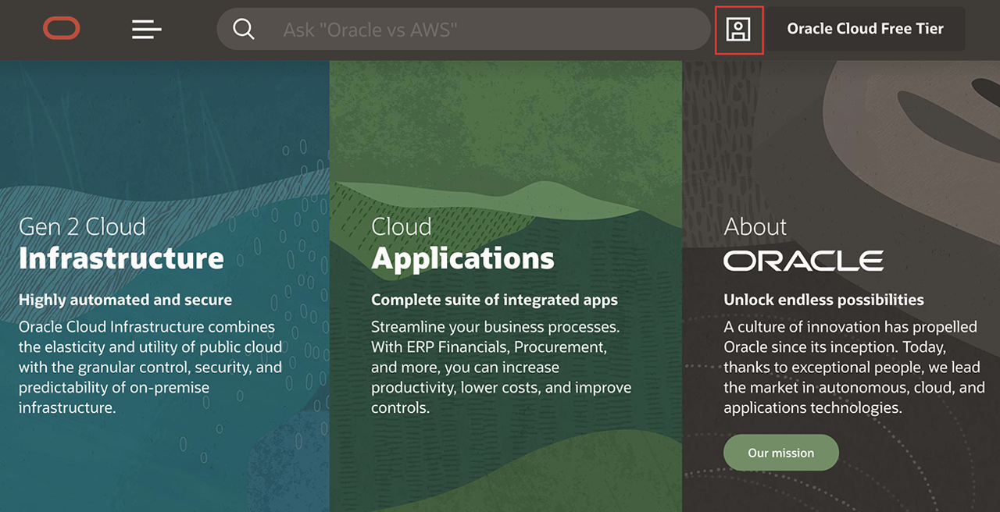

2. Click the icon in the upper right corner.  Click on **Sign in to Cloud** at the bottom of the drop down.   

      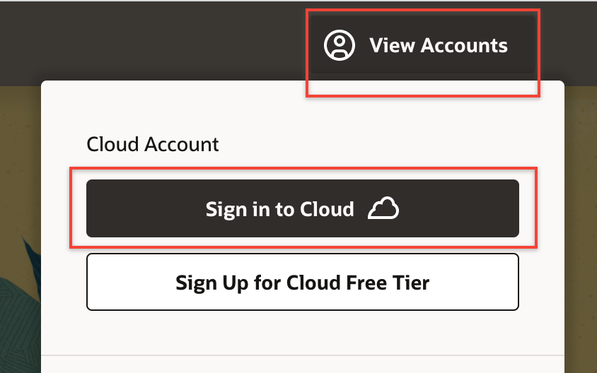   

3. Enter your **Cloud Account Name** in the input field and click the **Next** button.  *NOTE: this is NOT your email. This is the name of your tenancy noted in the email you received during signup. Do NOT click the Sign-In button, this will take you to Single Sign-On, not the Oracle Cloud.*

      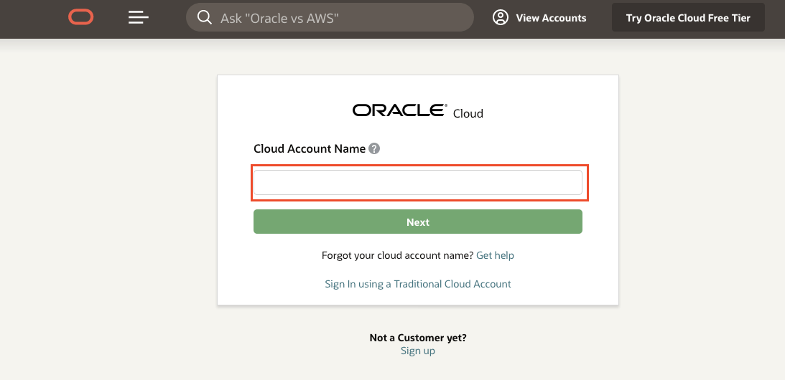   

4. Enter your username (this may be your email address) and password and click on **Sign In**. 
    

      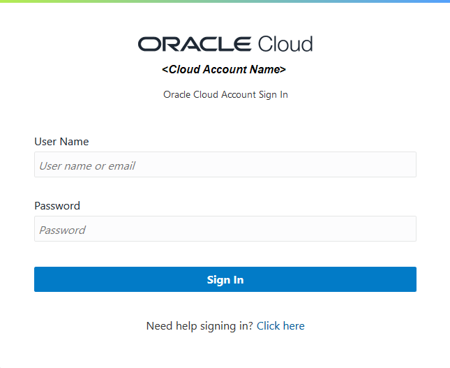  

## Task 2: Create User Auth Token, Storage Bucket and Upload Data Pump export file.

1.  Navigate to the user details page from the top, right-hand menu item as shown below

      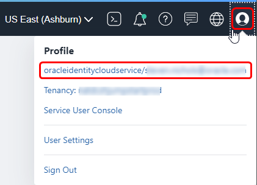

2.  Select **Auth Tokens** on the left, and then click **Generate Token**.

      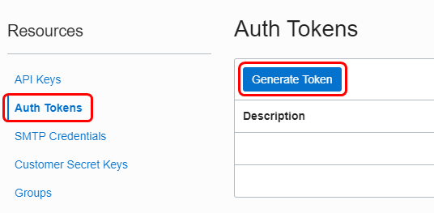

3.  Enter **`Token for DBMS_CLOUD.create_credential`** as the description and click **Generate Token**.

      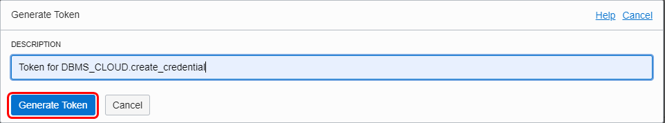

4.  Click **Copy** and save it in your notes.  You'll need it later when executing the **DBMS\_CLOUD.create\_credential** package. Click **Close** after copying the token.

      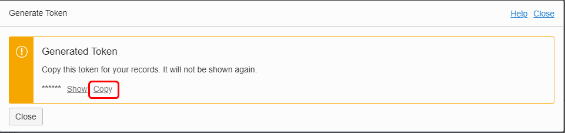

5.  Download the Data Pump Export File [Here](https://objectstorage.us-ashburn-1.oraclecloud.com/p/LNAcA6wNFvhkvHGPcWIbKlyGkicSOVCIgWLIu6t7W2BQfwq2NSLCsXpTL9wVzjuP/n/c4u04/b/livelabsfiles/o/developer-library/expdp_alpha121.dmp).

6.  Click the **Navigation Menu** in the upper left, navigate to **Storage**, and select **Buckets**.

	

7.  Select the **AppDev** Compartment and click **Create Bucket**

      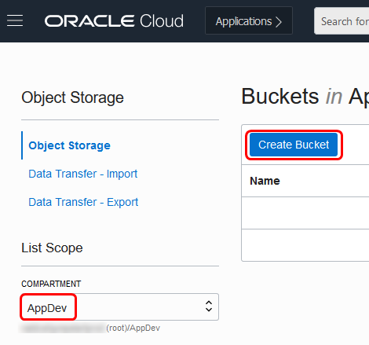

8.  In the Bucket Name field, enter **atpData** and click **Create Bucket**.  Once created, click on the **atpData** Bucket to view the details.

      

9.  Click **Upload Objects** and Drop or Select the **expdp_alpha121.dmp** you just downloaded and click **Upload Objects**.

      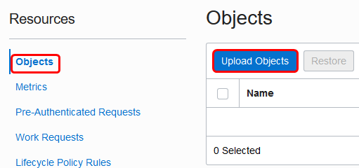

      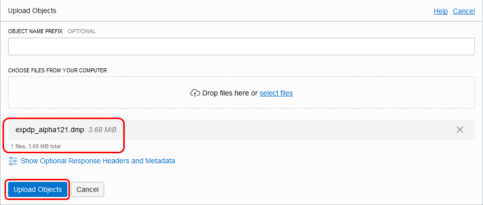

10.  Click the **View Object Details** to capture the Data Pump file URL used later in this lab.

      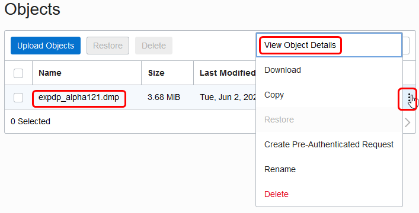

      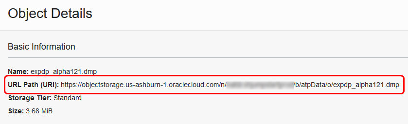

## Task 3: Setup Product Catalog MicroService Data in ATP

1.  Click the **Navigation Menu** in the upper left, navigate to **Oracle Database**, and select **Autonomous Transaction Processing**.

	

2.  Select the **AppDev** Compartment and click on **ProductCatalog** Database.

      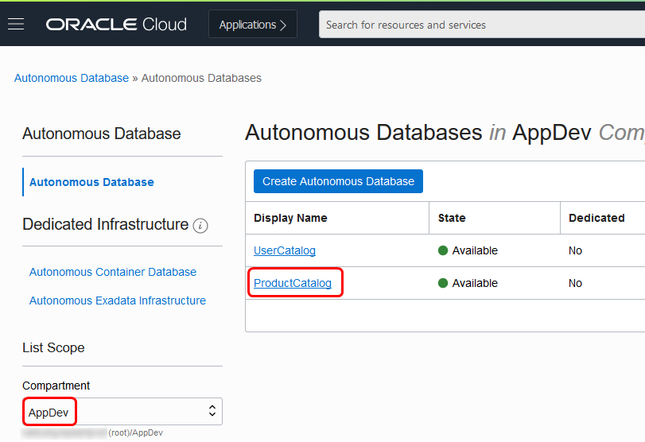

3.  Click on the **Tools** tab and then **Open SQL Developer Web**.

      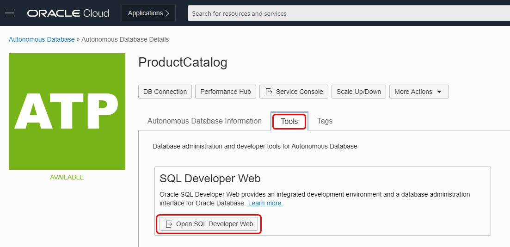

4.  Sign In with the Username **Admin** and Password **`AppD3v0ps01_`**

      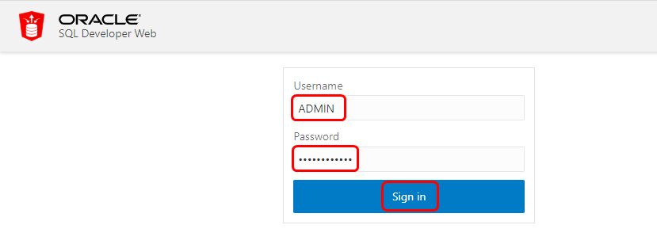

5.  At initial log-in, you are presented with guided tips, close the window for now.

      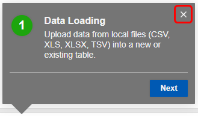

6.  Create the database user **alpha** by executing the following SQL Statements.

    ```
    <copy>create user alpha identified by "AppD3v0ps01_";
    grant dwrole to alpha;</copy>
    ```

     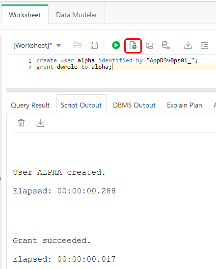

7.  In the same **SQL Developer Web Worksheet**, execute the following SQL Statements to create the DBMS\_CLOUD Credential **IMPDP\_OBJ\_STORE** using the **User** and **Auth Token** you generated in **STEP 2.3**. Look for the PL/SQL procedure to be successfully completed.

    **NOTE:**  Please be sure to include the complete username.  For example, **oracleidentitycloudservice/firstname.lastname@domain.com**

    ```
    <copy>BEGIN
      DBMS_CLOUD.CREATE_CREDENTIAL(
        credential_name => 'IMPDP_OBJ_STORE',
        username => '&lt;Cloud Account from Step 2.1&gt;',
        password => '&lt;Auth Token from Step 2.3 &gt;'
      );
    END;
    /</copy>
    ```

     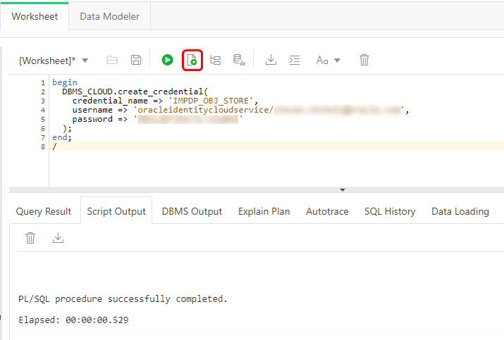

8.  Using the Data Pump API, run the following PL/SQL Script to load the data.

    **Note:**  Be sure to update the script below with the Data Pump File name URL captured in **Step 2.10**.

    ```
    <copy>set scan off
    set serveroutput on
    set escape off
    DECLARE
      s varchar2(1000);
      h1 number;
      errorvarchar varchar2(100):= 'ERROR';
      tryGetStatus number := 0;
    begin
      h1 := dbms_datapump.open (operation => 'IMPORT', job_mode => 'SCHEMA', job_name => 'IMPALPHA', version => 'COMPATIBLE');
      tryGetStatus := 1;
      dbms_datapump.set_parameter(h1, 'TRACE', 167144-96) ;
      dbms_datapump.metadata_transform(h1, 'DWCS_CVT_IOTS', 1);
      dbms_datapump.metadata_transform(h1, 'DWCS_CVT_CONSTRAINTS', 1);
      dbms_datapump.metadata_filter(h1, 'EXCLUDE_PATH_EXPR',         'IN ( ''CLUSTER'', ''CLUSTERING'', ''DB_LINK'' )');
      dbms_datapump.set_parallel(handle => h1, degree => 1);
      dbms_datapump.add_file(handle => h1, filename => 'IMPORT-'||to_char(sysdate,'hh24_mi_ss')||'.LOG', directory => 'DATA_PUMP_DIR', filetype=>DBMS_DATAPUMP.KU$_FILE_TYPE_LOG_FILE);
      dbms_datapump.set_parameter(handle => h1, name => 'KEEP_MASTER', value => 1);
      dbms_datapump.metadata_filter(handle => h1, name => 'SCHEMA_EXPR', value => 'IN(''ALPHA'')');
    -----------------------------------------------------
      dbms_datapump.add_file(handle => h1, filename => '&lt;Object Storage URL from Step 2.10&gt;', directory => 'IMPDP_OBJ_STORE', filetype => 5);
    -----------------------------------------------------
      dbms_datapump.set_parameter(handle => h1, name => 'INCLUDE_METADATA', value => 1);
      dbms_datapump.set_parameter(handle => h1, name => 'DATA_ACCESS_METHOD', value => 'AUTOMATIC');
      dbms_datapump.set_parameter(handle => h1, name => 'SKIP_UNUSABLE_INDEXES', value => 0);
      dbms_datapump.start_job(handle => h1, skip_current => 0, abort_step => 0);
      dbms_datapump.detach(handle => h1);
      errorvarchar := 'NO_ERROR';
    EXCEPTION
      WHEN OTHERS THEN
      BEGIN
        IF ((errorvarchar = 'ERROR')AND(tryGetStatus=1)) THEN
          DBMS_DATAPUMP.DETACH(h1);
          END IF;
        EXCEPTION
        WHEN OTHERS THEN
          NULL;
        END;
        RAISE;
    END;
    /</copy>
    ```

     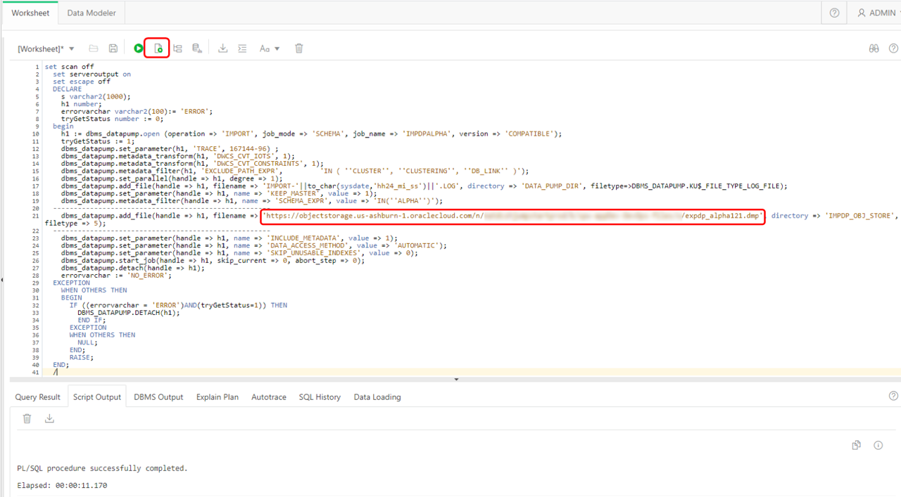

    **Note:**  If your auth token is not correct (eg password is wrong), you will receive an error (invalid setting).  To correct this you need to either drop and re-create the credential or create a new credential with a new name, and then re-run this script **WITH A NEW JOB NAME**.  If you create a new credential with a new name then update the credential in this code and then re-run this script **WITH A NEW JOB NAME**.

9.  To check on the status of the Data Pump job, execute the following SQL Statement.  The status will be **EXECUTING** until it is finished, then the status will change to **NOT RUNNING**

     ```
     <copy>
     select * from dba_datapump_jobs;
     </copy>
     ```
     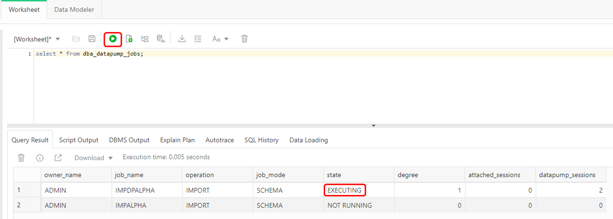

     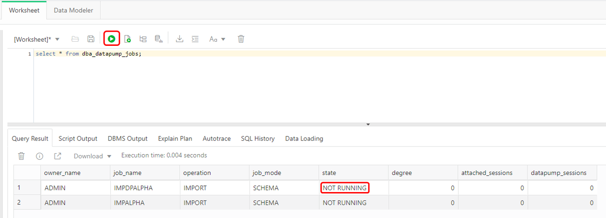

10.  Refresh the browser page

     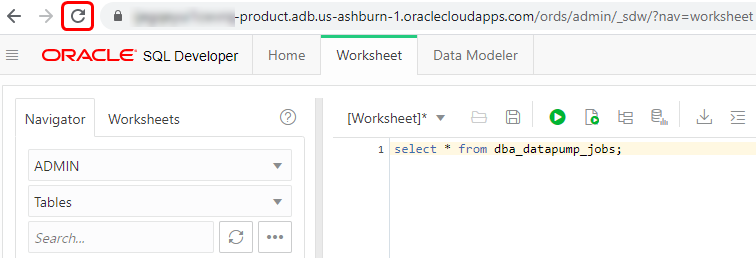

11.  Select the user **ALPHA**

     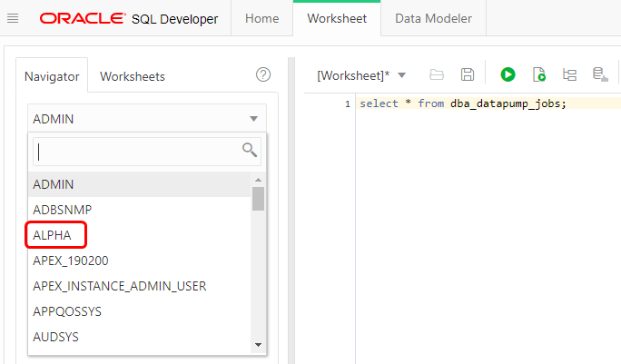

12.  Drag the **PRODUCTS** table into the Worksheet

     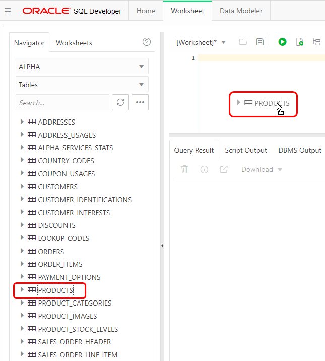

13.  Click on the **Select** type and click **Apply**.

     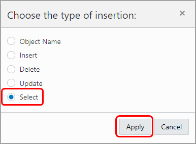

14.  Execute the inserted SQL Statement to verify data is in the **Products** table.

     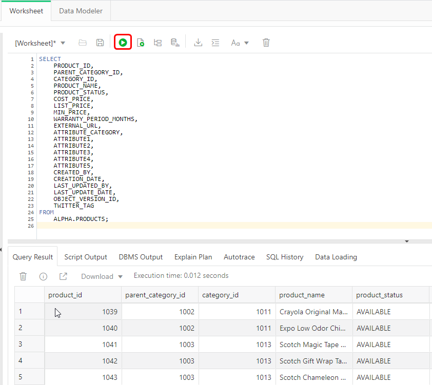


## Task 4: Setup User Catalog MicroService Data in ATP

1.  Click the **Navigation Menu** in the upper left, navigate to **Oracle Database**, and select **Autonomous Transaction Processing**.

	

2.  Select the **AppDev** Compartment and click on **UserCatalog** Database.

     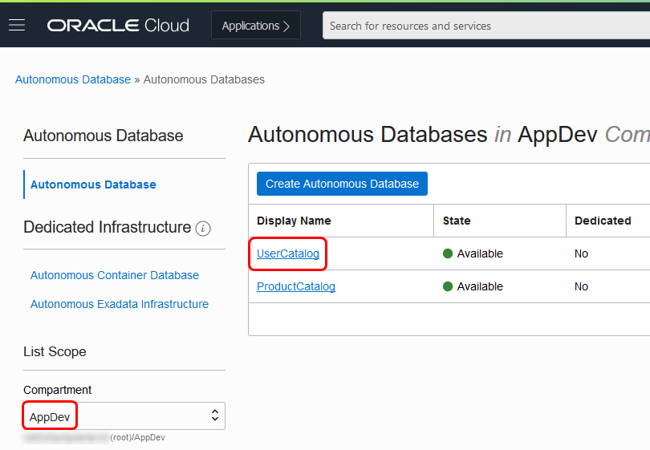

3.  Click on the **Tools** tab and then **Open SQL Developer Web**.

     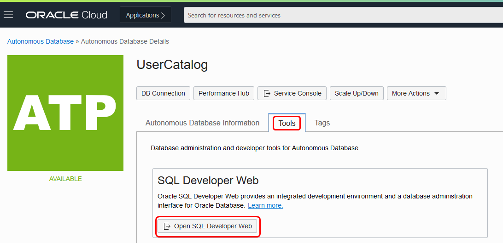

4.  Sign In with the Username **Admin** and Password **`AppD3v0ps01_`**

     

5.  At initial log-in, you are presented with guided tips, close the window for now.

     

6.  Create the database user **alpha** by executing the following SQL Statements.

    ```
    <copy>create user alpha identified by "AppD3v0ps01_";
    grant dwrole to alpha;
    grant connect, resource to alpha;
    grant unlimited tablespace to alpha;
    </copy>
    ```

     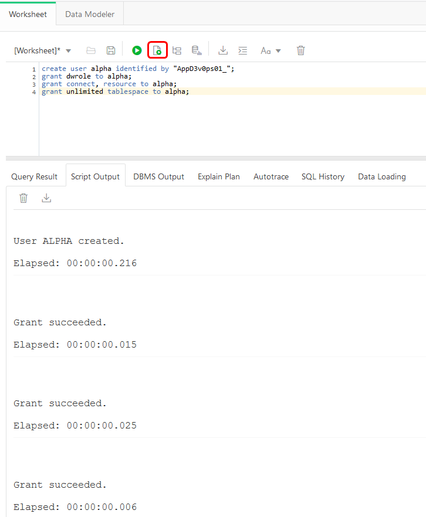

7.  In the same **SQL Developer Web Worksheet**, execute the following SQL Statement to create the table **users**  in the schema **alpha**.

    ```
    <copy>CREATE TABLE ALPHA.USERS(
    "ID" VARCHAR2(32 BYTE) DEFAULT ON NULL SYS_GUID(),
	"FIRST_NAME" VARCHAR2(50 BYTE) COLLATE "USING_NLS_COMP" NOT NULL ENABLE,
	"LAST_NAME" VARCHAR2(50 BYTE) COLLATE "USING_NLS_COMP" NOT NULL ENABLE,
	"USERNAME" VARCHAR2(50 BYTE) COLLATE "USING_NLS_COMP" NOT NULL ENABLE,
  	"PASSWORD" VARCHAR2(50 BYTE) COLLATE "USING_NLS_COMP" NOT NULL ENABLE,
	"CREATED_ON" TIMESTAMP (6) DEFAULT ON NULL CURRENT_TIMESTAMP,
	 CONSTRAINT "USER_PK" PRIMARY KEY ("ID"));

    CREATE TABLE ALPHA.REQUESTS(
    "ID" VARCHAR2(32 BYTE) DEFAULT ON NULL SYS_GUID() PRIMARY KEY,
    "CREATED_ON" TIMESTAMP (6) DEFAULT ON NULL CURRENT_TIMESTAMP,
    "REQUEST" BLOB
    CONSTRAINT ensure_json CHECK ("REQUEST" IS JSON));</copy>
    ```

     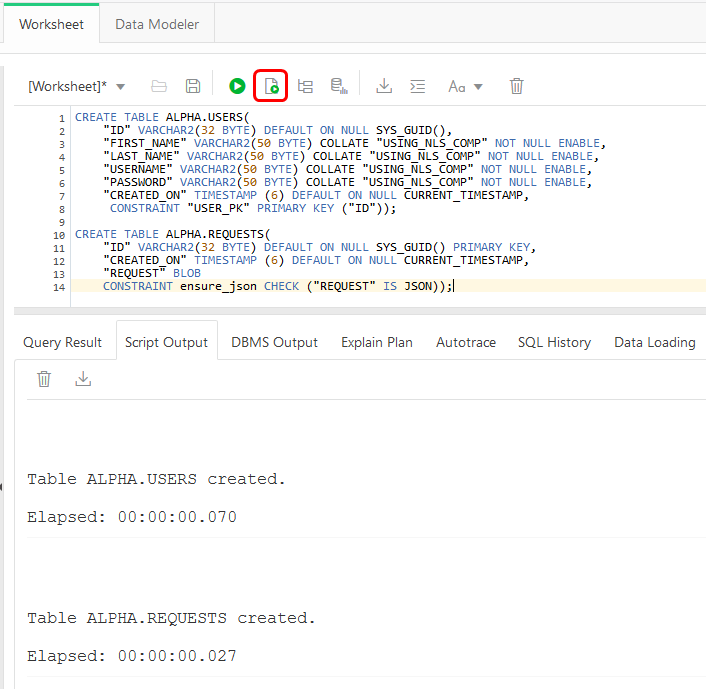

8.  To verify the table was created, **Refresh** the browser and select the **ALPHA** user.  You will see the **USERS** table.

     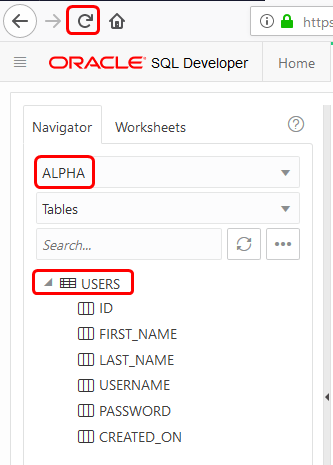

**This completes the Lab!**

**You are ready to proceed to** *Lab 2*

## Task 5: Grant Access to Alpha user to SQL Developer Web (Optional)

This step is optional and can be done in both the Product and User ATP instances.

1.  In SQL Developer Web connected as the user **ADMIN**, execute the following statements to grant user **alpha** to SQL Developer Web

    ```
    <copy>BEGIN
      ORDS_ADMIN.ENABLE_SCHEMA(
        p_enabled => TRUE,
        p_schema => 'ALPHA',
        p_url_mapping_type => 'BASE_PATH',
        p_url_mapping_pattern => 'alpha',
        p_auto_rest_auth => TRUE
      );
      COMMIT;
    END;
    /</copy>
    ```

    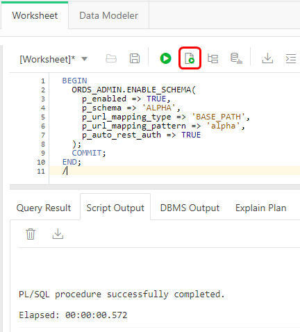

2.  Change the **URL** in your browser.  Change **admin** with **alpha** and hit enter to Sign in as Username **alpha** with the Password **AppD3v0ps01_**

    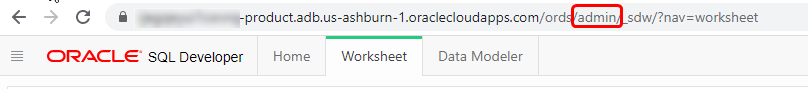

    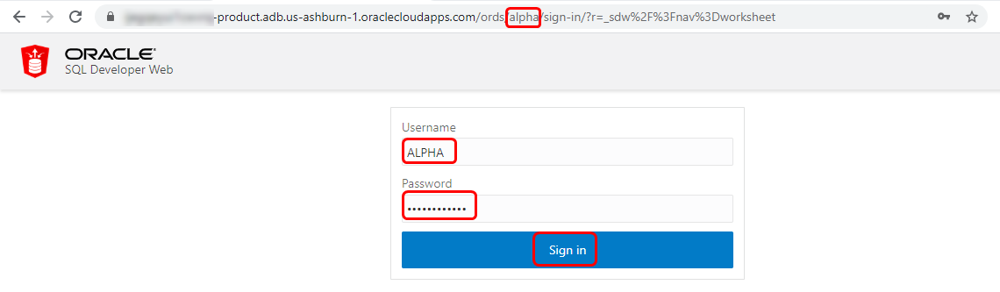

    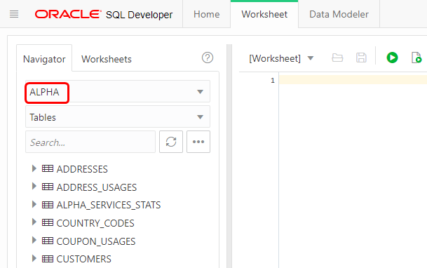

## Acknowledgements

- **Authors/Contributors** - Steven Nichols
- **Last Updated By/Date** -
- **Workshop Expiration Date** - May 31, 2021


