# Kubernetes REST Service Deployment

## Before You Begin

### Introduction

Thus far on our journey from a monolithic application to microservices, we have created our supporting infrastructure, populated our database, and packaged our Java application as a Docker container and deploy it to our Kubernetes Cluster using Visual Studio. Now we need to verify all REST services that it will be accessible to our customers, as well as be manageable, observable, and scalable -- a Kubernetes cluster.

During this lab, you will verify REST Services deployed in Lab 300 via Kubernetes Dashboard.

Estimated time: 20 minutes

### Objectives
- Verify Kubernetes Cluster up and running.
- Find Deployed REST Services URLs.
- Verify REST Services deployed in Lab 300.
- Test REST services.
- Simulate Pod failure and REST service recovery.

### Prerequisites
- Successful completion of Labs 1 and 2

*In addition to the workshop*, feel free to watch the walkthrough companion video by clicking on the following image:FPN_ggM1f3c
[](youtube:FPN_ggM1f3c)

- **Works better with the Chrome browser**.

## Task 1: Prerequisite: Add a Policy Statement for OKE

1. You should already have a browser tab logged in to the OCI Console. If you do not, log in again using the following URL.

    [https://cloud.oracle.com/en_US/sign-in](https://cloud.oracle.com/en_US/sign-in)

2.  Before the Oracle managed Kubernetes service can create compute instances in your OCI tenancy, we must explicitly give it permission to do so using a policy statement. From the OCI Console navigation menu, choose **Identity->Policies**.

  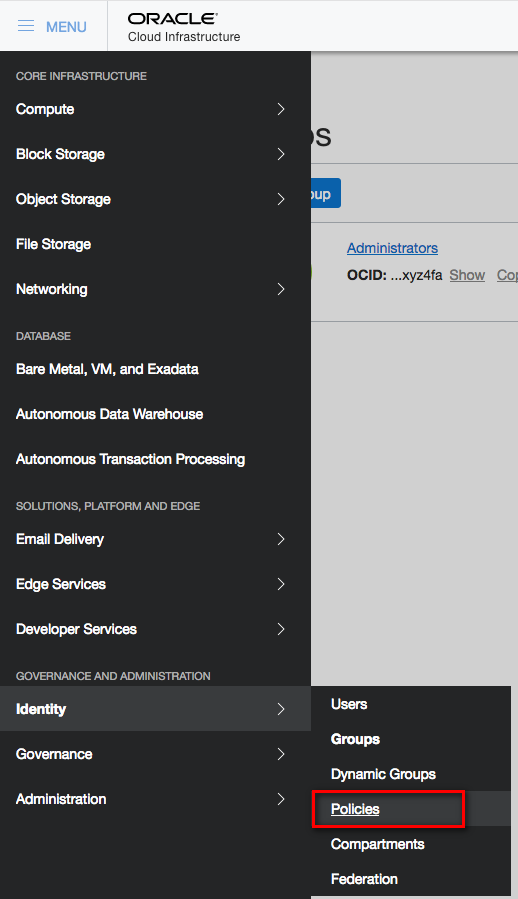

3.  In the Compartment drop down menu on the left side, choose the **root compartment**. It will have the same name as your OCI tenancy (Cloud Account Name).

4.  Click **PSM-root-policy**

  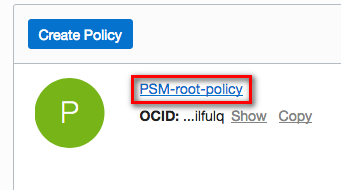

5.  Click the **Add Policy Statement** button

  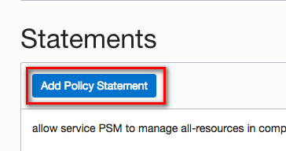

6.  In the Statement box, enter the below statement and click **Add Statement**
    ```
    <copy>allow service OKE to manage all-resources in tenancy</copy>
    ```

  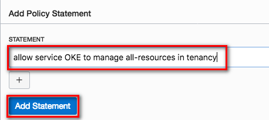

## Task 2: Verify Kubernetes Cluster up and running.
1.  Navigate to Container Cluster (OKE).
  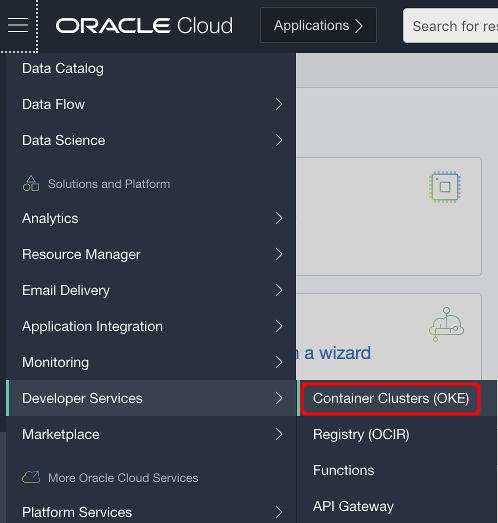
2.  Select the **AppDev** compartment and select **cluster1**.
  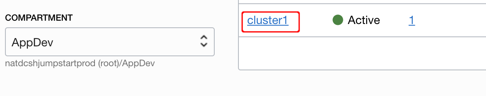
3.  Click **Access Cluster**.
  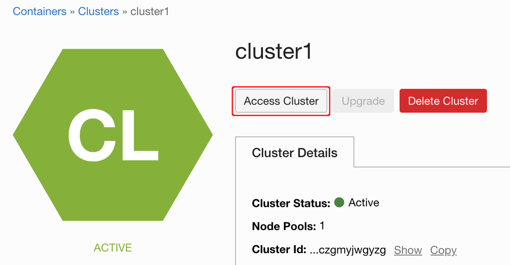
4.  Select **Lauch Cloud Shell** under Cloud Shell Access.
  
5.  Wait for Attaching your Oracle Cloud Home Directory
  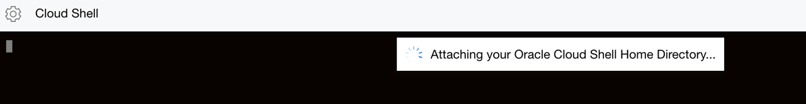
6.  You can see **Welcome to Oracle Cloud Shell**
  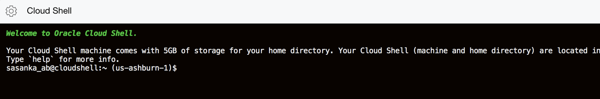
7.  To access the kubeconfig for your cluster, copy the following command to Cloud Shell
  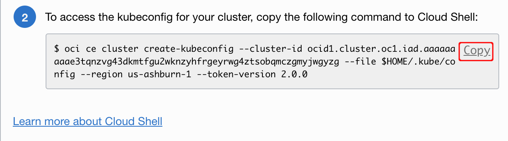
8.  Paste it into Cloud Shell.
  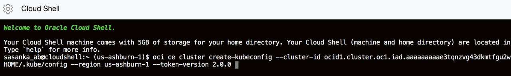
9.  Check your new config file successfully created or merged.
  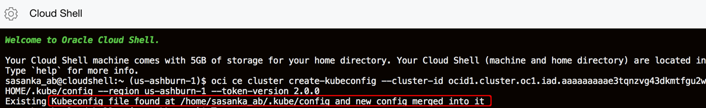
10.  Copy following command to see your cluster information
    
    ```
    <copy> kubectl cluster-info </copy>
    ```
  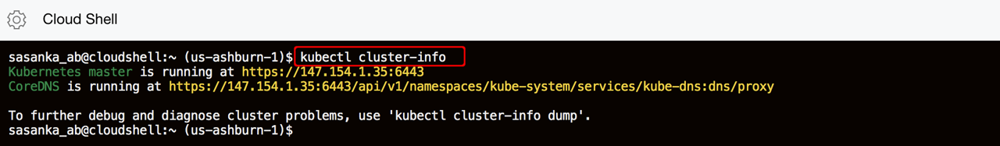
11.  Copy following command to see your worker nodes.
    ```
    <copy> kubectl get nodes </copy>
    ```
  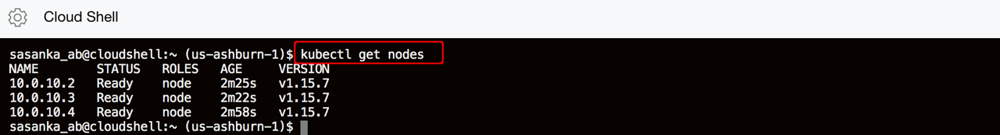

12.  Copy following command and see your pods are successfully deployed in Lab 200.
    ```
    <copy> kubectl get pods </copy>
    ```
  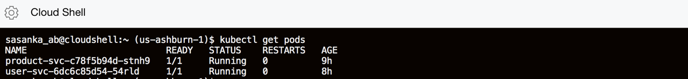

  **Note**: If your pods are not in a **Running** state you must need go back to the lab 200 and fix your errors before proceeding to the next step. 

  You can use following command to troubleshoot your errors in your pod.    
    ```
    <copy> kubectl describe pod [pod_name] </copy>
    ```

13.  Click **Close**.
  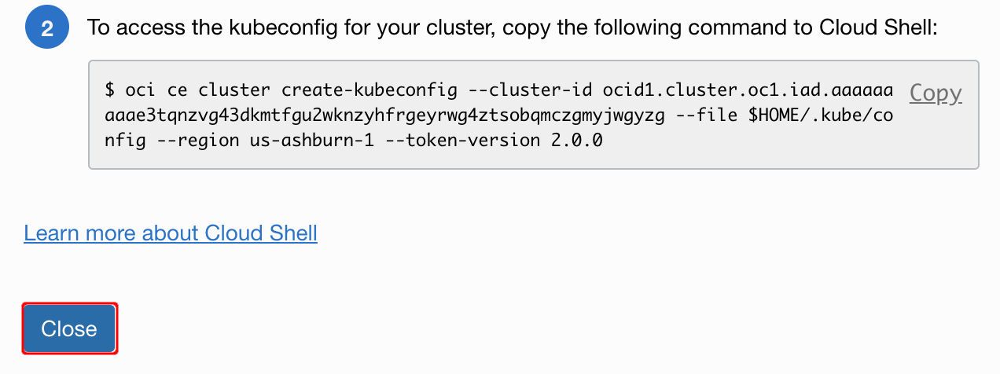
## Task 3: Find Deployed REST Services URLs.
 
1.  Copy following command and paste it to Cloud Shell to view deployed REST web-services
    ```
    <copy> kubectl get svc </copy>
    ```

  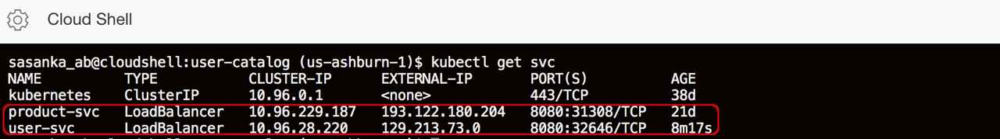 

## Task 4: Test REST services.
1.  Copy **product-svc** External IP. Append **:8080/product/list** to External IP and paste it in your browser.
  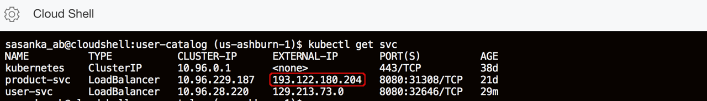 
2.  You can see all products available for the REST endpoint GET method.
  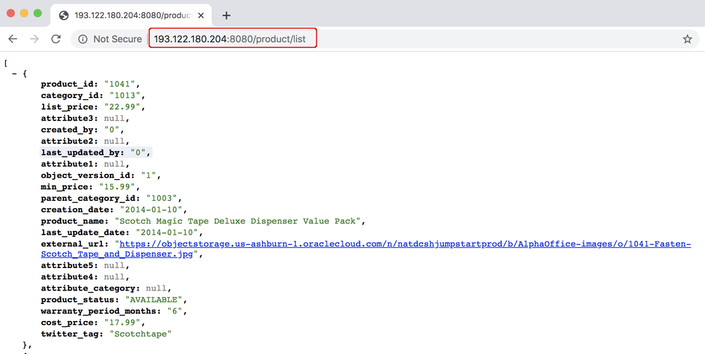
3.  You can also test product REST endpoint for a specific product as follows.
   
    ```
    <copy>curl -iX GET http://EXTERNAL_IP:8080/product/1038 </copy>
    ```

  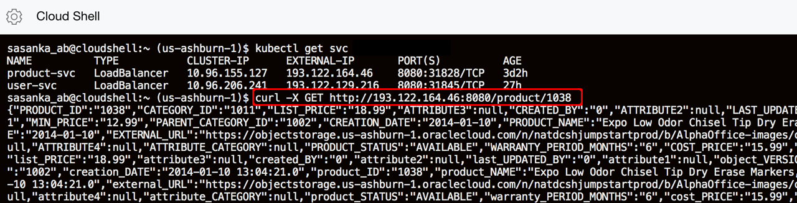

4. Copy **user-svc** External IP.  
   
  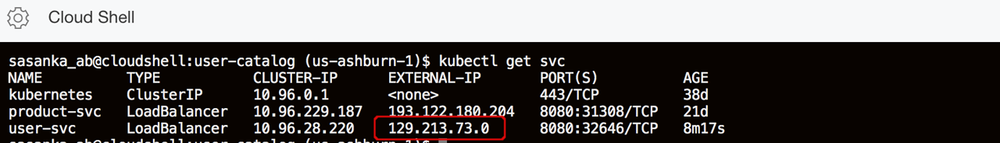
   
5. Copy and paste following command in Cloud Shell and replace **EXTERNAL_IP**  to test **user-svc**.
    ```
    <copy>curl -iX GET http://EXTERNAL_IP:8080/user </copy>
    ```
  
  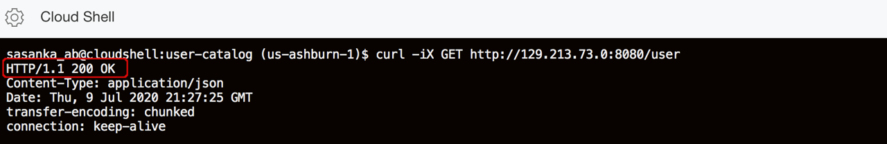  

  **Note**: If you can't access your REST endpoints you can use following command to troubleshoot your errors in your pod. If you find any errors, you must need to go back lab 200, fix your errors, and re-run build before proceeding to the next steps.

    ```
    <copy> kubectl logs [pod_name] </copy>
    ```
## Task 5: Simulate Pod failure and REST service recovery.
1.  Copy following command to get pods
   
    ```
    <copy> kubectl get pods </copy>
    ```
  
2.  Copy product-svc pod name and append it following command to delete pod.
   
    ```
    <copy>kubectl delete pod pod_name </copy>
    ```
  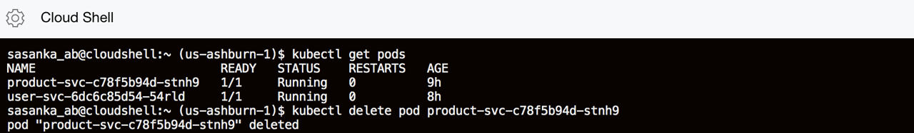
3.  Copy following command and paste to see status of your pod you deleted. It has been deleted and re-created automatically.
   
    ```
    <copy> kubectl get pods </copy>
    ```
  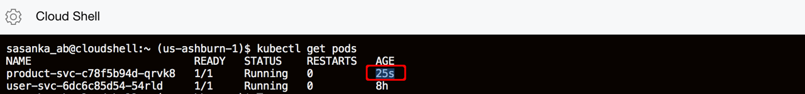


Now that our REST service is deployed to Kubernetes, let's build a user interface on top of it so that end users can consume our product catalog and user catalog.

**This completes the Lab!**

**You are ready to proceed to** *Lab 4*

## Acknowledgements

- **Authors/Contributors** - Sasanka Abeysinghe
- **Last Updated By/Date** - 
- **Workshop Expiration Date** - May 31, 2021


