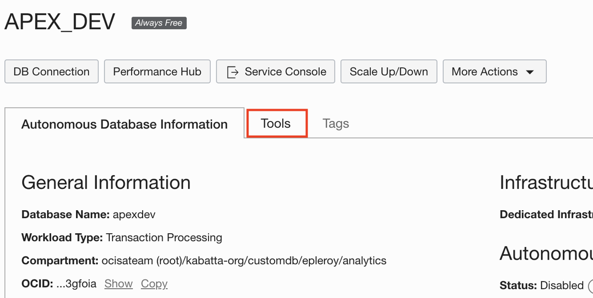
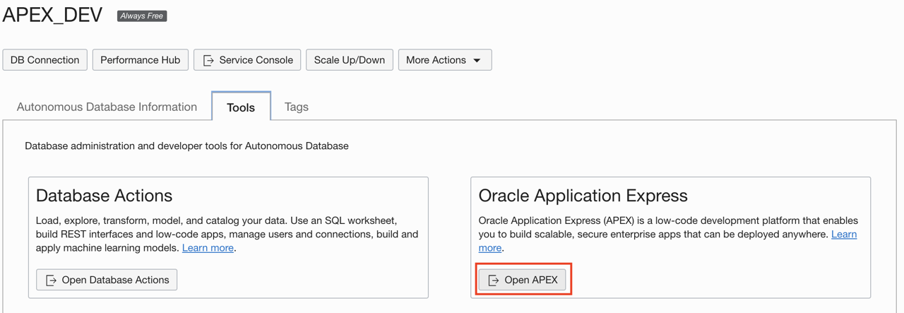
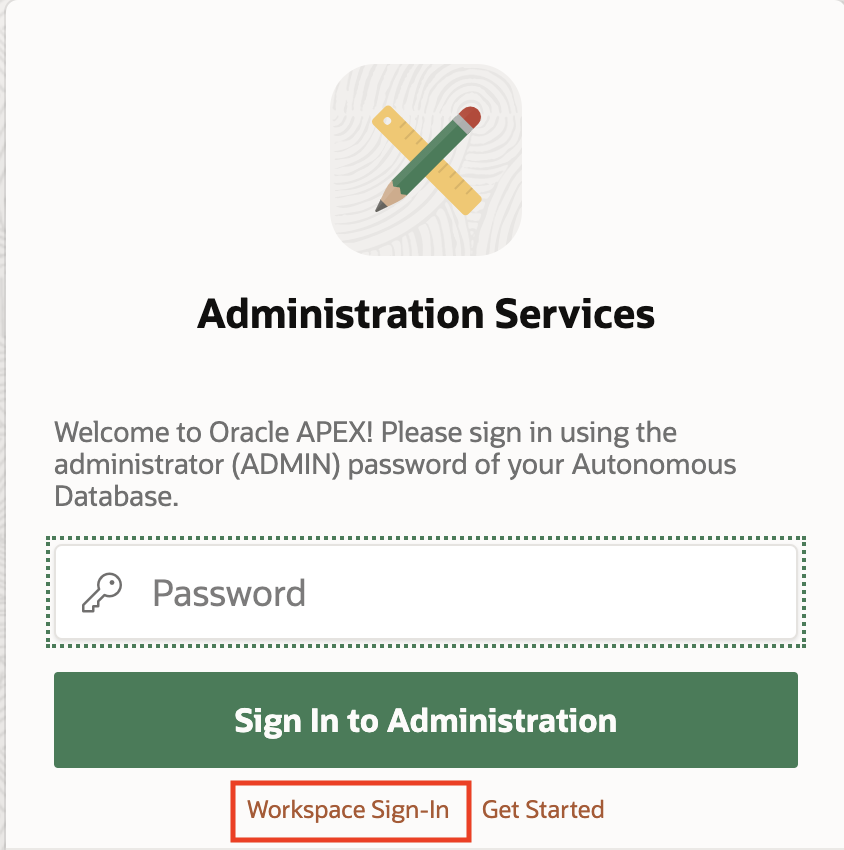
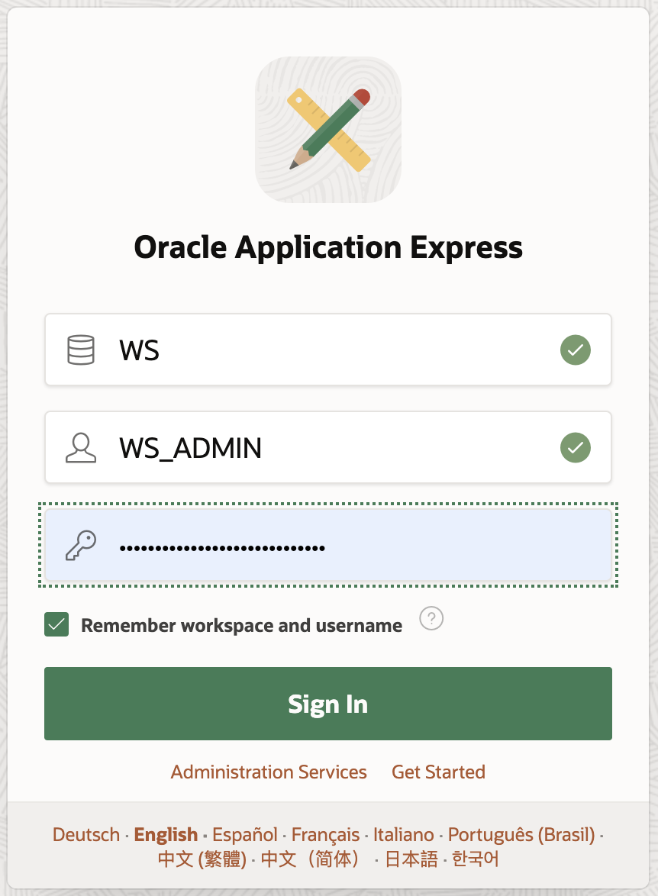
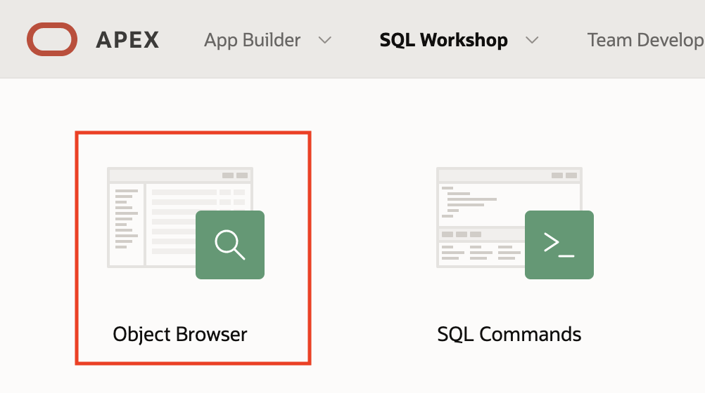
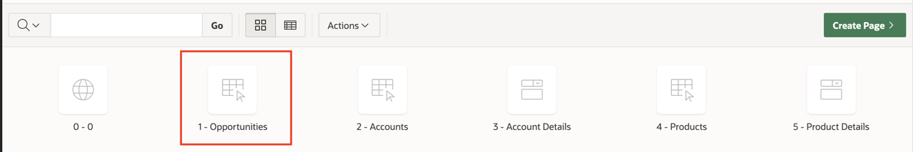
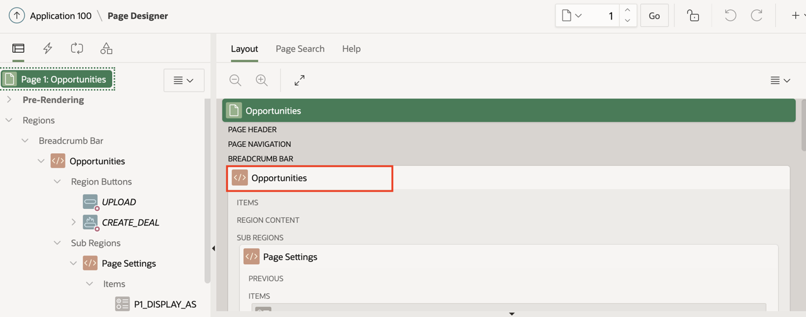

# Workflow

## Introduction

We will create a snapshot of the app state in *`dev`* and deploy it to the production *`prd`* environment.

We'll then make some changes, create a new snapshot and re-deploy the application to the production environment.

Estimated Completion Time: 15 minutes.

### Objectives

- Take a snapshot of the app state on *`dev`*, and deploy it to the *`prd`* environment.
- Make changes on *`dev`*, take a new snapshot and redeploy to *`prd`*.

## Task 1: Taking a Snapshot of the Application State

1. To take a snapshot of the application state in the *`dev`* environment, simply run:

    ```bash
    <copy>
    make snapshot ID=100
    </copy>
    ```

    The application installed previously has ID 100, so we're providing this ID here.

    This will create a changelog of the schema and export the app.

    You could run the two operations separately with:

    ```bash
    make changelog
    ```

    and

    ```bash
    make export-app ID=<app_id>
    ```

    *Note that there could be multiple applications in the workspace, but ideally they should be in separate SCHEMAS*

    *Multiple applications in the same SCHEMA must be deployed together as the schema change tracking is per schema, not per application*

2. Commit the current state to `git` for source control

    ```bash
    <copy>
    git add apps/
    git add changelogs/
    git commit -m"Initial state"
    git push origin master
    </copy>
    ```

3. To facilitate rollback, create a release branch

    ```bash
    <copy>
    git branch release/v1.0.0
    git push origin release/v1.0.0
    </copy>
    ```

## Task 2: Deploy the App to the Production Environment

1. With the app export and the schema changelog, we can reproduce the full application to another environment with:

    ```bash
    make update ENV=<environment> ID=<original_app_id> NEWID=<new_app_id>
    ```

    Note that APEX APP IDs must be *unique* within a single database (regardless of SCHEMA or WORKSPACE), so if you created the `prd` environment in the same database as the `dev` environment, the *`new_app_id`* MUST be different from the *`original_app_id`*. We recommend using a fixed offset (like 1000)

    If you are deploying on a separate database, the *`new_app_id`* can be ommitted and it will default to the current APP ID, so if you used the default setup in terraform, you can more simply use:

    ```bash
    <copy>
    make update ENV=prd ID=100
    </copy>
    ```

## Task 3: Check the Deployment

1. Log in to the Oracle Autonomous Database for *`prd`*:

  - Go to **Oracle Databases -> Autonomous Transaction Processing** in your compartment
  - Click the database for dev (*APEX_PRD* if you used the default names)

    

  - Click **Tools** tab

    

  - Under **Oracle Application Express**, click **Open APEX**

    

  - Click **Workspace Sign-in**

    

  - Enter the credentials for the Workspace Admin user (`WS_ADMIN` if you used the default names) found in the *`prd.env`* file (`WORKSPACE_ADMIN` and `WORKSPACE_ADMIN_PWD`)

    If you used the defaults, the values are as follow:
    - Worspace: `WS`
    - User: `WS_ADMIN`
    - Password: check in the `prd.env` file

    

2. You should find your application and be able to run it.

## Task 4: Make Some Changes

1. Back on the *`APEX_DEV`* database, we'll make some changes:

  For example, add a table, or add a column in an existing table, or modify a component of the application

2. Add a column in a table:

    - Go to **SQL Workshop**.

    

    - Click **Object Browser**.

    - In the list of tables, select **EBA\_SALES\_ACCESS\_LEVELS**.

    - Click **ADD COLUMN**.

    - Enter a new column named **BOGUS** for example.

    - Click **NEXT**.

    - On the next page click **FINISH**

    We've now added a column to a table.

3. Modify the application:

    - Go to **App Builder**.

    - Click the **Opportunity Tracker** application, it opens the dev tools.

    - Click the **Opportunities** page.

        

    - Click the **Opportunties** region.

        

    - Change the name of the header in the **Opportunities** region.

        

    - Click **Save**.

## Task 5: Create a New Snapshot

1. Create a new snapshot:

    ```bash
    <copy>
    make snapshot ID=100
    </copy>
    ```

2. Check your changes into git

    ```bash
    <copy>
    git add apps/
    git add changelogs/
    git commit -m"First state change"
    git push origin master
    </copy>
    ```

3. Create a new release branch

    ```bash
    <copy>
    git branch release/v1.0.1
    git push origin release/v1.0.1
    </copy>
    ```

## Task 6: Deploy the Changes to Production

1. Redeploy to prod

    ```bash
    <copy>
    make update ENV=prd ID=100
    </copy>
    ```

2. On the **APEX_PRD** Database, check that the changes have propagated.


## Acknowledgements

 - **Author** - Emmanuel Leroy, Vanitha Subramanyam, March 2021
 - **Last Updated By/Date** - Emmanuel Leroy, Vanitha Subramanyam, March 2021
