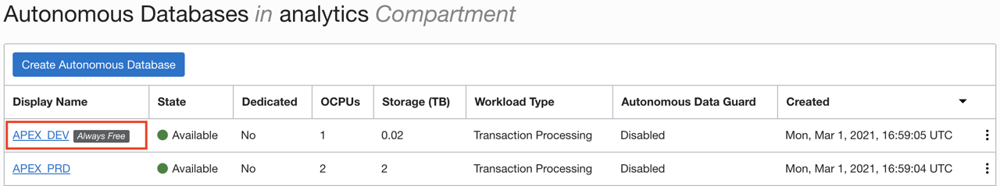
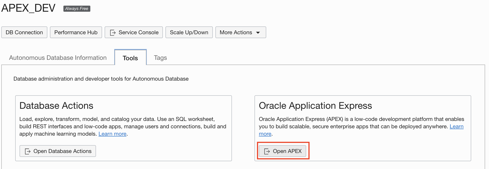
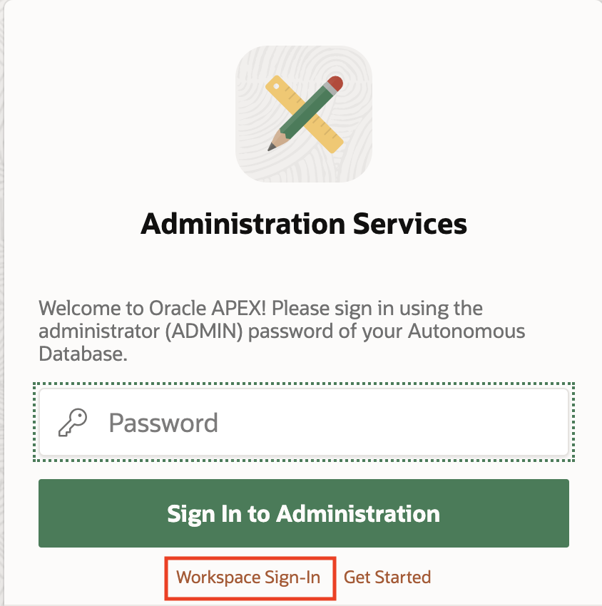
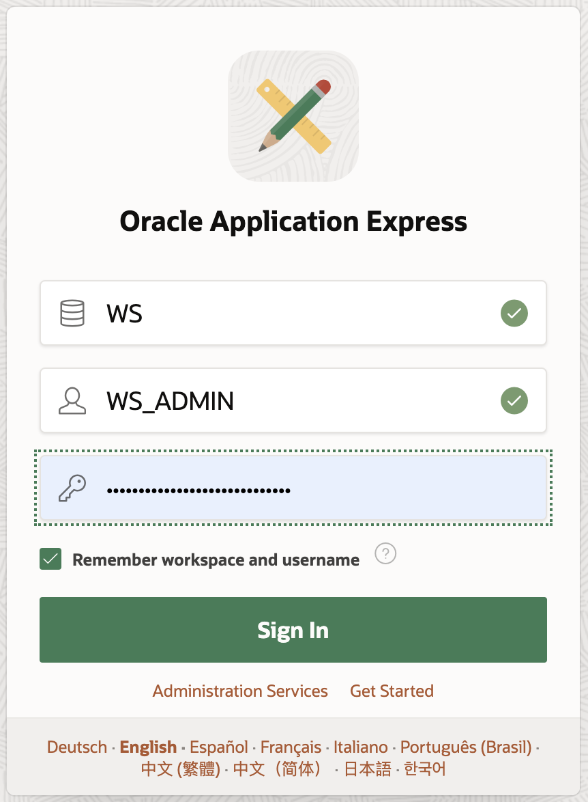
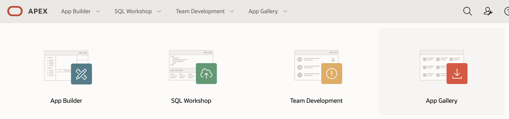
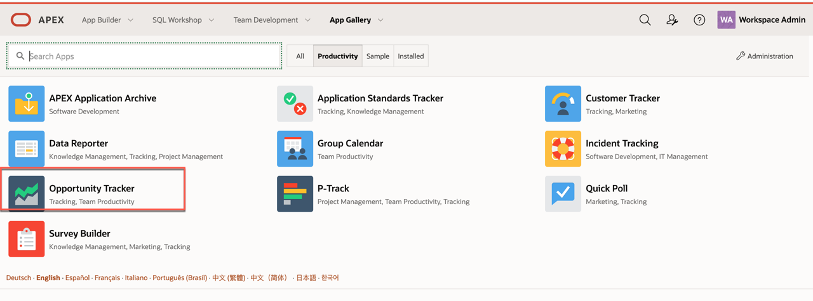
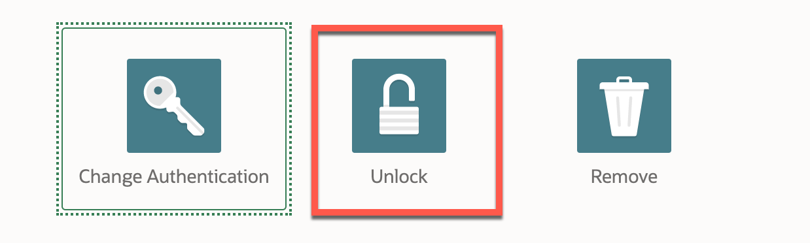

# Install Sample Application in dev

## Introduction

We will install a sample application in the *`dev`* environment.

Estimated Completion Time: 5 minutes.

### Objectives

We will install a sample app from the app library.

## Task 1: Install a Sample Application

1. Log in to the Oracle Autonomous Database for *`dev`*:

    - Go to **Oracle Databases** and select **Autonomous Transaction Processing** in your compartment.
    - Click the database for dev (*APEX\_DEV* if you used the default names).

      

    - Click **Tools** tab.

      

    - Under **Oracle Application Express**, click **Open APEX**.

      

    - Click **Workspace Sign-in**.

      

    - Enter the credentials for the Workspace Admin user (*WS\_ADMIN* if you used the default names) found in the *`dev.env`* file (WORKSPACE\_ADMIN and WORKSPACE\_ADMIN_PWD).

      If you used the defaults, the values are as follow:
      - Worspace: `WS`.
      - User: `WS_ADMIN`.
      - Password: check in the `dev.env` file.

    

## Task 2: Sample App from Gallery On APEX below 21.1

1. Click **App Gallery**.

    

2. Choose **Opportunity Tracker** application.

    

3. Click **Install**.

4. When installed, make sure to click **Manage** and then **Unlock** the app before the next steps:

  

## Task 3: Sample App on APEX 21.1 and Above

The application gallery was removed from version 20.1, it is now available on Github at [https://github.com/oracle/apex](https://github.com/oracle/apex).

1. Navigate to [https://github.com/oracle/apex/tree/21.1/starter-apps/opportunities](https://github.com/oracle/apex/tree/21.1/starter-apps/opportunities).

2. Download the `opportunities.zip` file.

3. In the APEX UI, navigate to **App Builder** then **Import**.

4. Drag and Drop the application .zip file and click **Next**.

5. Follow prompts using all defaults.

## Task 4: Run the Application

1. To run the application, sign in with the WS\_ADMIN credentials.

2. On first run, you're asked to configure the application. Click **Finish Configuration**.

## Acknowledgements

 - **Author** - Emmanuel Leroy, Vanitha Subramanyam, March 2021
 - **Last Updated By/Date** - Emmanuel Leroy, Vanitha Subramanyam, March 2021
