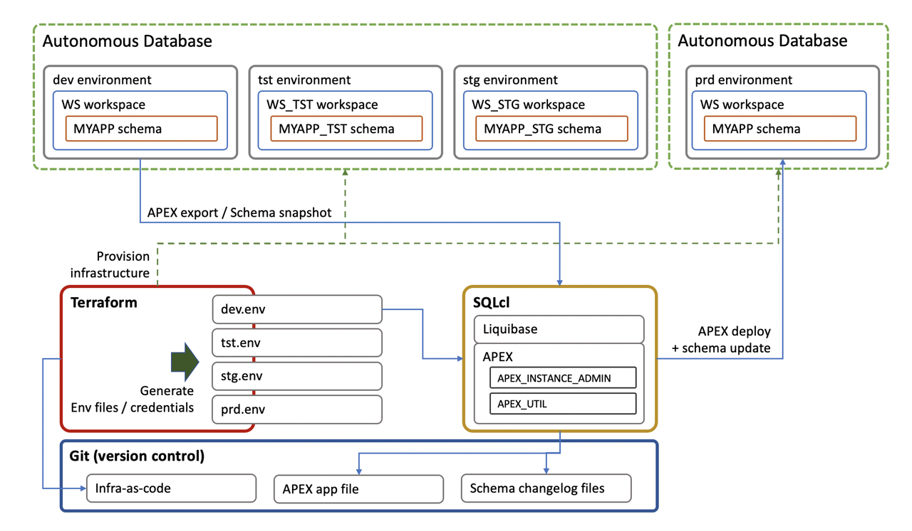

# Introduction

## About this Workshop

This workshop shows a scenario on how to achieve Continuous Integration / Continuous Delivery (CI/CD) in Oracle APEX.

This shows the flow to develop an APEX application and promote it from a development environment to production (or test or staging environment), using version control to keep track of application code changes as well as schema migrations.

The process takes advantage of Terraform to deploy the infrastructure, Liquibase which is integrated in the Oracle SQLcl command line tool, as well as git and APEX specific app management functionalities.



Estimated Completion Time: 45 minutes.

### Objectives

Learn how to setup an environment and process to develop and deploy APEX application across several environments.

In this workshop, you will:
- Get a repository template with scripts to implement a CI/CD type workflow.
- Install Oracle SQLcl required to run the commands.
- Deploy a development Oracle Autonomous Database with three pre-production environments (dev, tst, stg) and a production Oracle Autonomous Database with the production environment (prd), using Terraform.
- Install a sample application we'll use as a starting point on the dev environment.
- Snapshot the application and schema, deploy the application to production. Make changes to it and redeploy.
- Learn to rollback changes.

### Prerequisites

In order to run this workshop you need:

* A Mac OS X, Linux or Windows machine (on Windows, use the Windows Linux Subsystem).
* An Oracle Cloud Infrastructure (OCI) account with a Compartment setup.
* Java 11 or later.
* An Oracle account to download required software under license.
* Terraform installed.
* The OCI CLI installed and configured.

If you are not an administrator on your tenancy, you must insure that the following policies have been set for you:

```
<copy>
Allow group MyGroup to manage autonomous-database-family in compartment MyCompartment
</copy>
```


## Acknowledgements

 - **Author** - Emmanuel Leroy, Vanitha Subramanyam, March 2021
 - **Last Updated By/Date** - Emmanuel Leroy, Vanitha Subramanyam, March 2021
