# Sign up for an APEX Workspace

## Introduction

Oracle APEX is a low-code application platform for Oracle Database. APEX Application Development, Autonomous Data Warehouse (ADW), Autonomous Transaction Processing (ATP), and Autonomous JSON Database are fully managed services, pre-integrated and pre-configured with APEX, for rapidly building and deploying modern data-driven applications in Oracle Cloud. Business users, citizen, and application developers can create enterprise apps 20X faster with 100X less code — without having to learn complex web technologies with just a browser. To start with, you will need to decide on the service you are going to use for this workshop, and then create an APEX workspace accordingly. Continue reading further to learn which is the best service for you!

If you already have an APEX 23.2 Workspace provisioned, you can skip this lab.

Estimated Time: 5 minutes

Watch the video below for a quick walk through of the lab.

[](youtube:RcSCnZnDzDE)

### What is an APEX Workspace?
An APEX Workspace is a logical domain where you define APEX applications. Each workspace is associated with one or more database schemas (database users) which are used to store the database objects, such as tables, views, packages, and more. APEX applications are built on top of these database objects.

### How Do I Find My APEX Release?
To determine which release of Oracle APEX you are currently running, do one of the following:
* View the **release number** on the Workspace home page:
    - Sign in to Oracle APEX. The Workspace home page appears. The current release version displays at the bottom right corner.

    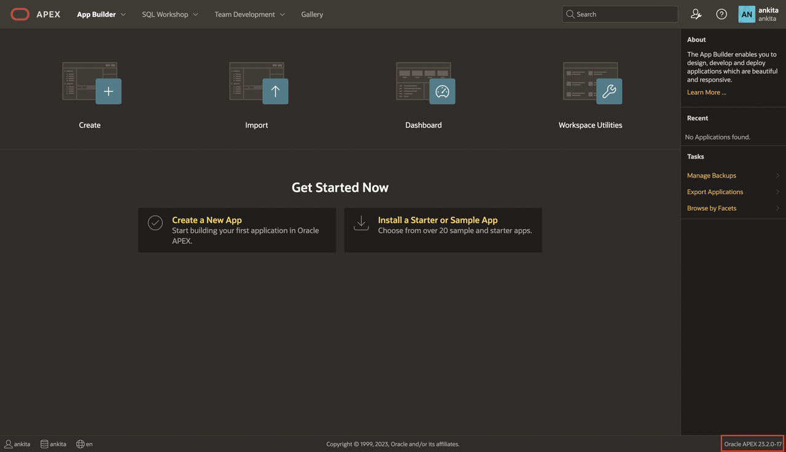
    

* View the **About Oracle APEX** page:
    - Sign in to Oracle APEX. The Workspace home page appears.
    - Click the **Help** menu at the top of the page and select **About**. The **About Oracle APEX** page appears.

  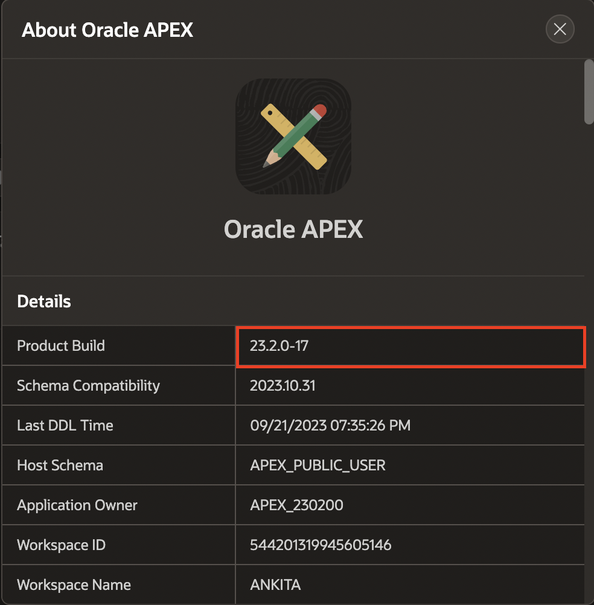

### Where to Run the Lab
You can run this lab in any Oracle Database with APEX 23.2 installed. This includes the new APEX Application Development Service, the Oracle Autonomous Database, the free, "Development Only" apex.oracle.com service, your on-premises Oracle Database (providing APEX 23.2 is installed), on a third party cloud provider where APEX 23.2 is installed, or even on your laptop by installing Oracle XE or Oracle VirtualBox App Dev VM and installing APEX 23.2.

Below are steps on how to sign up for either an *APEX Application Development* Service, an *Oracle Autonomous Database* cloud service or *apex.oracle.com* service.
- The APEX Application Development Service is great if you would like to go with a flexible paid option that allows to concentrate your efforts on APEX development without worrying about the database management. It provides 1 OCPU and 1 TB and can be extended as needed.
- The Always Free Oracle Autonomous Database option is ideal for learning about the Oracle Database and APEX, and provides 1 OCPU and 20 GB of compressed storage. This service can also be utilized for production applications, and can readily be upgraded to a paid service as necessary.
- On the other hand, apex.oracle.com is also a free service; however, it is only designated for evaluation purposes, and running production apps is not allowed.

For conducting labs in this workshop, either service can be utilized.


Click one of the options below to proceed.

## **Option 1**: APEX Service
Oracle Application Development (APEX Service) is a low cost Oracle Cloud service offering convenient access to the Oracle APEX platform. Visit [https://apex.oracle.com/en/platform/apex-service/](https://apex.oracle.com/en/platform/apex-service/) to learn more about APEX service on Oracle Cloud.

In this part, you will create an Oracle APEX Application Development Service trial account. Once you have signed up for the service, you will create an *APEX Service*. The final step in the process is to provision Oracle APEX workspace.

1. [Click this link to create your free account](https://signup.cloud.oracle.com/). When you complete the registration process, you'll receive an account with a $300 credit that you can utilize for various OCI services. 

2.  Once the Signup process is complete, you will be logged in automatically to the Oracle Cloud Infrastructure (OCI) Console.
    -  In case you have closed the browser, you can always refer to the **Get Started Now with Oracle Cloud** email that you should have received to login to OCI Console.   
    Make a note of your **Username**, **Password**, and **Cloud Account Name**.

        

    - Alternatively, you can login to your Oracle Cloud account by accessing the following URL from your browser:       
    [https://cloud.oracle.com](https://cloud.oracle.com)

        Enter your **Cloud Account Name** in the input field and click the **Next** button.

        

        Enter your **User Name** and **Password** in the input fields, and click **Sign In**.

        

3. From the Cloud Dashboard, click on the hamburger menu on the upper-left corner. From the navigation menu, select **Developer Services** and then **APEX Application Development** or **APEX Instances**. The APEX Instances page appears.

    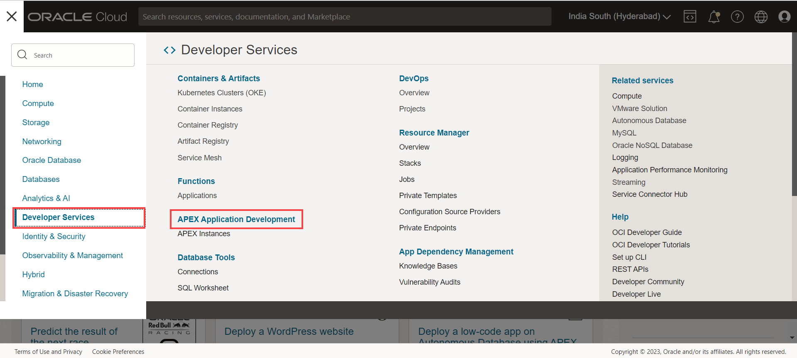

4. At the top of the APEX Instances page, click the **Create APEX Service** button.

    

5. Select the **Always Free** option, enter **```SecretPassw0rd```** for the ADMIN password, then click **Create APEX Service**.

    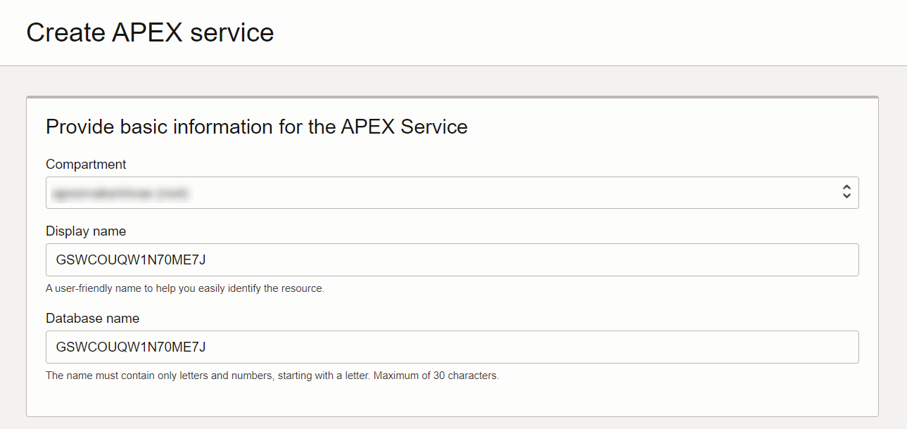

    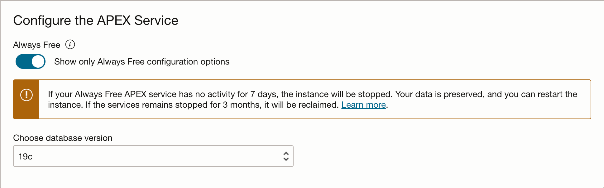

    

6. The APEX Instances Details displays again.

  When the provisioning process completes the APX logo turns from orange to green and the Launch APEX and Launch Database Actions buttons are enabled.

  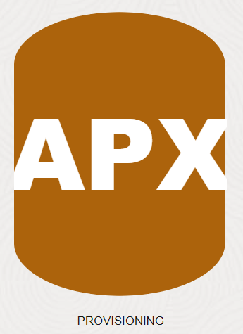

  

7. Before using a new APEX Service, you must set up your APEX Service instance by completing two tasks: create an initial APEX workspace and create an APEX user account.

    On the APEX Instance Details, click **Launch APEX**.

    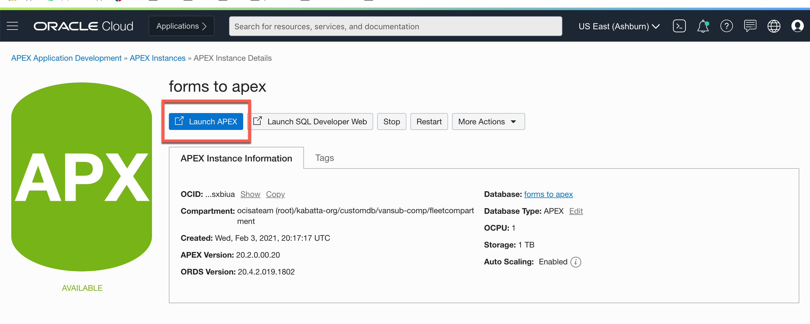

8. The Administration Services Sign In page appears. Enter the password for the Administration Services and click **Sign In to Administration**.
  The password is the same as the one entered for the ADMIN user when creating the APEX service: **```SecretPassw0rd```**
  

9. Click **Create Workspace**.

  

10. Depending on how you would like to create your workspace, select **New Schema** or **Existing Schema**. If you are getting started, select **New Schema**.

  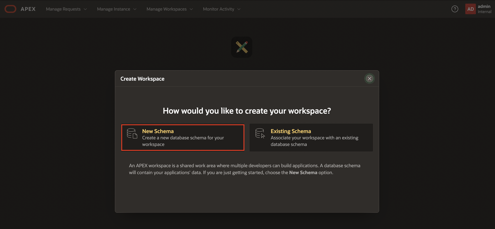

10. In the Create Workspace dialog, enter the following:

    | Property | Value |
    | --- | --- |
    | Workspace Name | DEMO |
    | Workspace Username | DEMO |
    | Workspace Password | **`SecretPassw0rd`** |

  Click **Create Workspace**.

  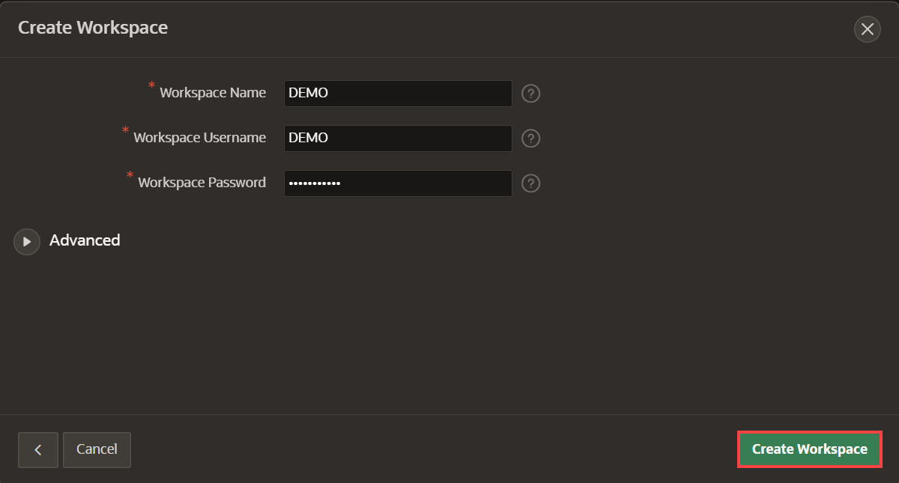

11. On the APEX Instance Administration page, click the **DEMO** link in the success message.         
  *Note: This will log you out of APEX Administration so that you can log into your new workspace.*

  

12. On the APEX Workspace log in page, enter **``SecretPassw0rd``** for the password, check the **Remember workspace and username** checkbox, and then click **Sign In**.

  


## **Option 2**: Autonomous Database in Oracle Cloud

  In this part, you will create an Oracle Cloud trial account. Once you have signed up for the service, you will create an *Autonomous Transaction Processing* database. The final step in the process is to provision Oracle APEX.

  1.  [Click this link to create your free account](https://signup.cloud.oracle.com). When you complete the registration process, you'll receive an account with a $300 credit and several "always free" services that will enable you to complete the workshop for free. You can then use any remaining credit to continue to explore the Oracle Cloud. The always free services will continue to work after the trial expires.

  2.  Soon after requesting your trial, you will receive a  **Get Started Now with Oracle Cloud** email.   
      Make note of your **Username**, **Password**, and **Cloud Account Name**.

      

  3. Now that you have a service, you will log into your Oracle Cloud account, so that you can start working with various services.        
      From any browser go to [https://cloud.oracle.com/en_US/sign-in](https://cloud.oracle.com/en_US/sign-in).

      Enter your **Cloud Account Name** in the input field and click the **Next** button.

      

  4. Enter your **User Name** and **Password** in the input fields, and click **Sign In**.

      

  5. From within your Oracle Cloud environment, you will create an instance of the Autonomous Transaction Processing database service.

      From the Cloud Dashboard, select the navigation menu icon in the upper left-hand corner and then select **Autonomous Transaction Processing**.

      

  6. Click **Create Autonomous Database**.

      

  7. Select the **Always Free** option, enter **```SecretPassw0rd```** for the ADMIN password, then click **Create Autonomous Database**.

      
      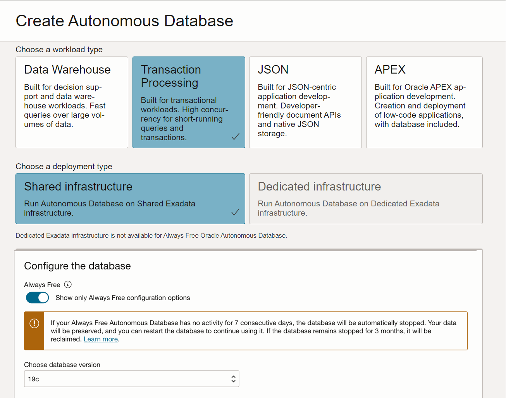
      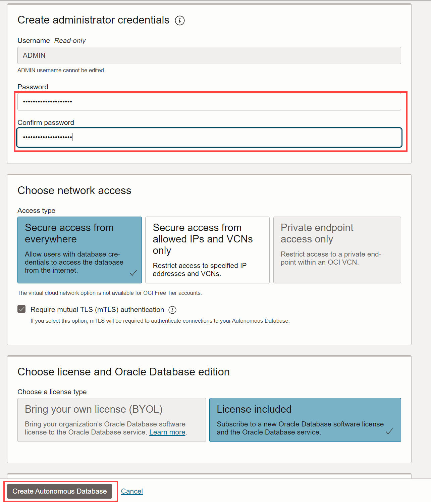

  8. After clicking **Create Autonomous Database**, you will be redirected to the Autonomous Database Details page for the new instance.

      Continue when the status changes from:

      

      to:

      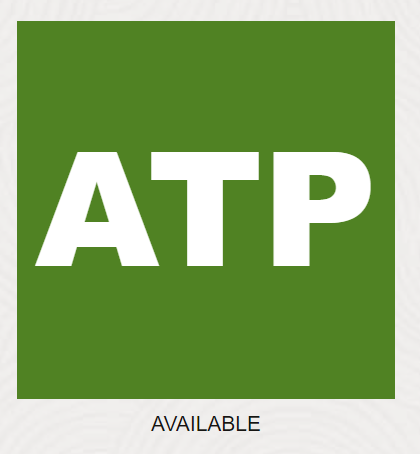

  9. Within your new database, APEX is not yet configured. Therefore, when you first access APEX, you will need to log in as an APEX Instance Administrator to create a workspace.
    Click the **Apex Instance URL** provided on the ATP overview screen.

    

  10. Now, click **Launch APEX**

    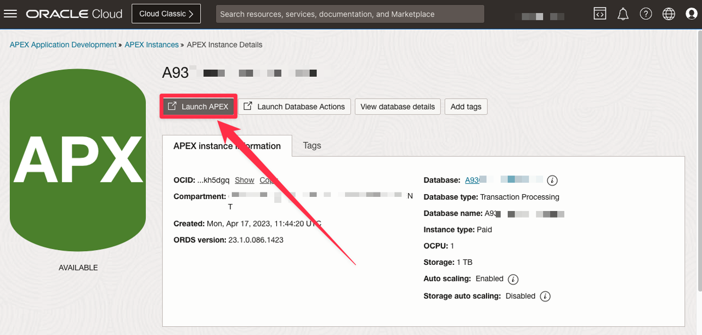


      *Note: Always Free Autonomous Database will be stopped after being inactive for 7 days. If that happens, you need to click **More Actions** and then **Start** to start your Autonomous Database, and then **Open APEX**.*

  11. Enter the password for the Administration Services and click **Sign In to Administration**.     
      The password is the same as the one entered for the ADMIN user when creating the ATP instance: **```SecretPassw0rd```**

      

  12. Click **Create Workspace**.

      

  13. Depending on how you would like to create your workspace, select **New Schema** or **Existing Schema**. If you are getting started, select **New Schema**.

    

  14. In the Create Workspace dialog, enter the following:

      | Property | Value |
      | --- | --- |
      | Workspace Name | DEMO |
      | Workspace Username | DEMO |
      | Workspace Password | **`SecretPassw0rd`** |


  Click **Create Workspace**.

  

  13. In the APEX Instance Administration page, click the **DEMO** link in the success message.         
      *Note: This will log you out of APEX Administration so that you can log into your new workspace.*

      

  14. On the APEX Workspace log in page, enter **``SecretPassw0rd``** for the password, check the **Remember workspace and username** checkbox, and then click **Sign In**.

      


## **Option 3**: apex.oracle.com
Signing up for apex.oracle.com is simply a matter of providing details on the workspace you wish to create and then waiting for the approval email.

1. Go to [https://apex.oracle.com](https://apex.oracle.com.).
2. Click **Start for Free Today**.

    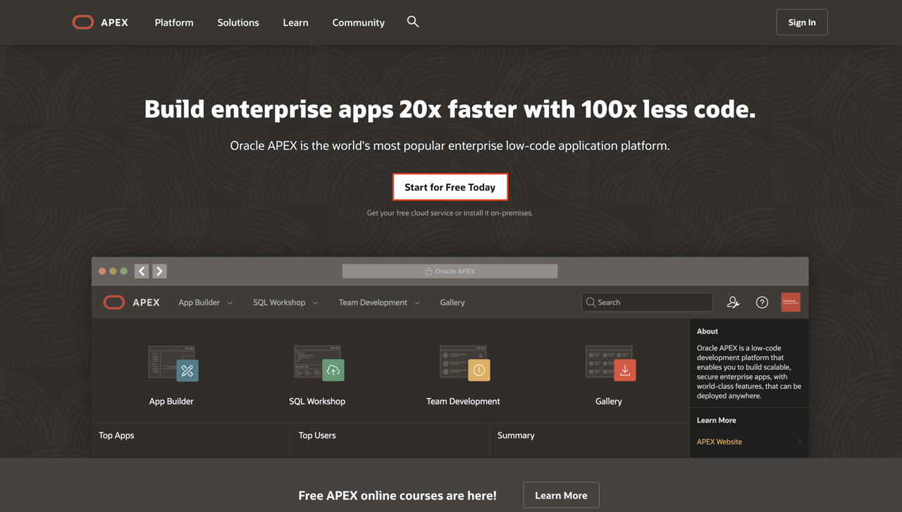

3. Under Free APEX Workspace, Click **Free Sign Up**.

    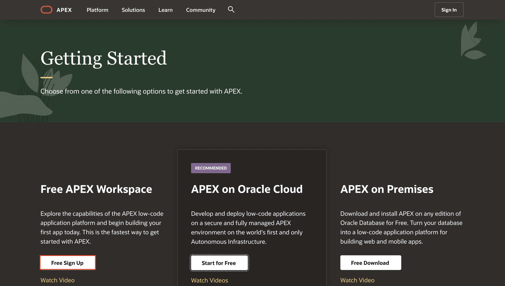

4. On the Request a Workspace page, enter your Identification details – First Name, Last Name, Email, Workspace.
   *Note: For workspace, enter a unique name, such as first initial and last name.*

    Click **Request Workspace**.

    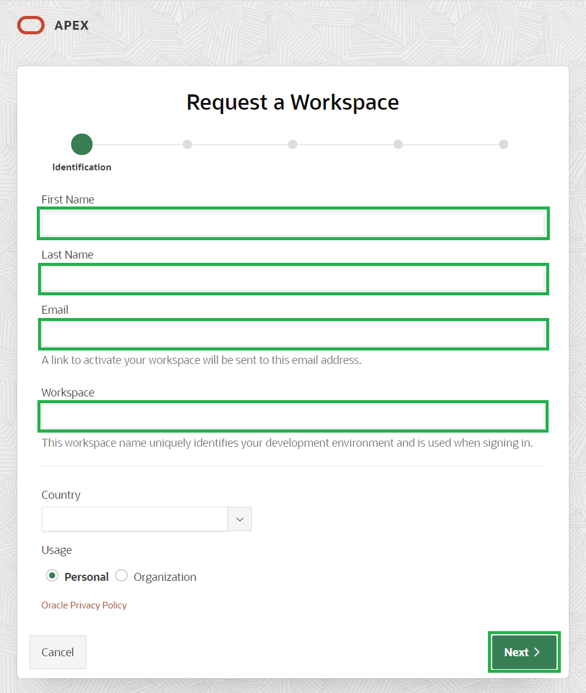

5. Complete the remaining wizard steps.

6. Check your email. You should receive an email from Oracle APEX within a few minutes.  
   *Note: If you don’t get an email go back to Step 3 and make sure to enter your email correctly.*

    Within the email body, click **Create Workspace**.

    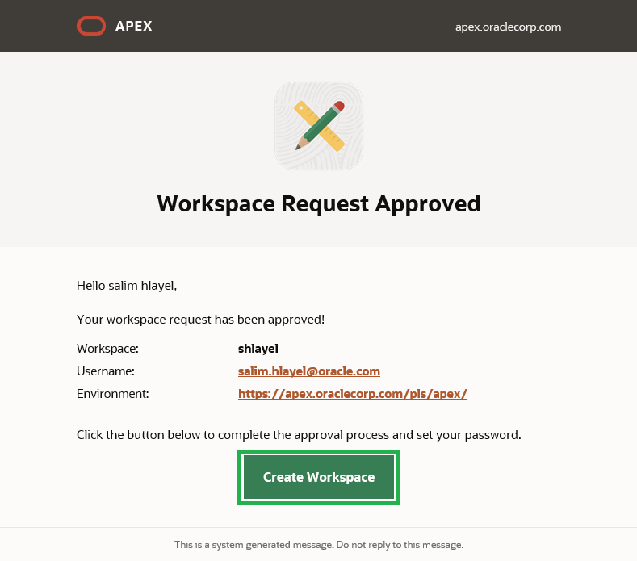

7. Click **Continue to Sign In Screen**.

  

8. Enter your password, and click **Change Password**.

9. You should now be in the APEX Builder.

    


## **Summary**

At this point, you know how to create an APEX Workspace and are ready to start building beautiful apps faster.

You may now **proceed to the next lab**.

## **Acknowledgements**

 - **Author** - Apoorva Srinivas, Senior Product Manager
 - **Contributors** - Salim Hlayel, Arabella Yao, Jaden McElvey
 - **Last Updated By/Date** - Ankita Beri, Product Manager, October 2023
