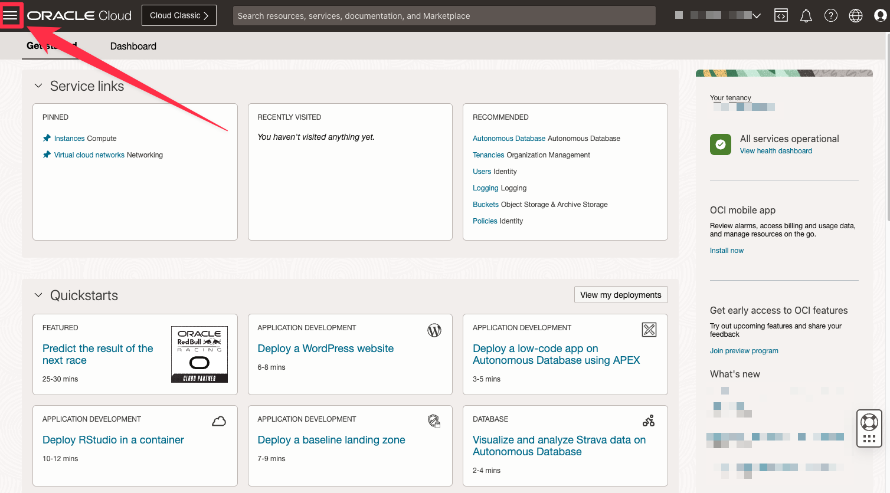
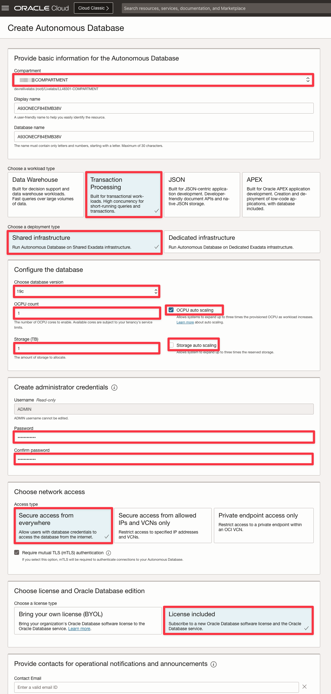

# Sign up for an APEX Workspace

## Introduction

This lab walks you through the steps to get started using Oracle APEX on Oracle Autonomous Database (Autonomous Transaction Processing [ATP]). In this lab, you provision a new ATP instance and create an APEX workspace.

Estimated Time: 5 minutes

Objectives

In this lab, you will:

- Navigate to the Oracle Autonomous Transaction Processing cloud service using the Oracle Cloud Infrastructure console.
- Provision a new Autonomous Transaction Processing database.
- Create an APEX workspace.


## Task 1: Create an ATP instance

1. Log in to the Oracle Cloud, as shown in the **Get Started** lab.

2. Once you are logged in, you are taken to the cloud services dashboard where you can see all the services available to you. Click the navigation menu in the upper left to show top level navigation choices.
    
Note: You can also directly access your Autonomous Data Warehouse or Autonomous Transaction Processing service in the Quick Actions section of the dashboard.

3. Select **Autonomous Transaction Processing**.
  


4. Use the List Scope drop-down menu to select a compartment. If you are using a LiveLabs environment, be sure to select the compartment provided by the environment from the List Scope drop-down menu.
    
5. You can see your current default region in the top, right hand corner of the page.

6. Click **Create Autonomous Database**.

7. Double check that you are using the compartment assigned to you
8. Select **Transaction Processing** as the workload.
9. Leave all the settings at their default values.
10.  Use **```SecretPassw0rd```** for the ADMIN password
11.  Select **License Included **, then click **Create Autonomous Database**.

12.  Check the following screenshot to verify your settings:

    

After clicking **Create Autonomous Database**, you will be redirected to the Autonomous Database Details page for the new instance.

Continue when the status changes from:

  

to:

  

## Task 2: Create a APEX workspace

1. Within your new database, APEX is not yet configured. Therefore, when you first access APEX, you will need to log in as an APEX Instance Administrator to create a workspace.

    Click the **Apex Instance URL** provided on the ATP overview screen.

    

2. Now, click **Launch APEX**

    


3. Enter the password for the Administration Services and click **Sign In to Administration**.     
    The password is the same as the one entered for the ADMIN user when creating the ATP instance: **```SecretPassw0rd```**

    

4. Click **Create Workspace**.

    

5. Depending on how you would like to create your workspace, select **New Schema** or **Existing Schema**. If you are getting started, select **New Schema**.

    

5. In the Create Workspace dialog, enter the following:

    | Property | Value |
    | --- | --- |
    | Workspace Name | DEMO |
    | Workspace Username | DEMO |
    | Workspace Password | **`SecretPassw0rd`** |

Click **Create Workspace**.

  

6. In the APEX Instance Administration page, click the **DEMO** link in the success message.         
    *Note: This will log you out of APEX Administration so that you can log into your new workspace.*

    

7. On the APEX Workspace log in page, enter **``SecretPassw0rd``** for the password, check the **Remember workspace and username** checkbox, and then click **Sign In**.

    


## **Summary**

  At this point, you know how to create an APEX Workspace and you are ready to start building amazing apps, fast.

  You may now **proceed to the next lab**.

## **Acknowledgements**
- **Author** - Apoorva Srinivas, Senior Product Manager
- **Last Updated By/Date** - Ankita Beri, Product Manager, October 2023
