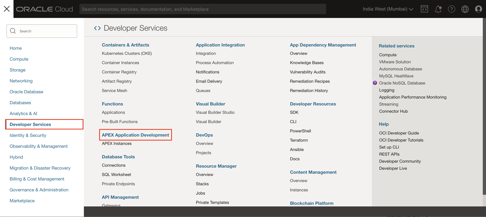
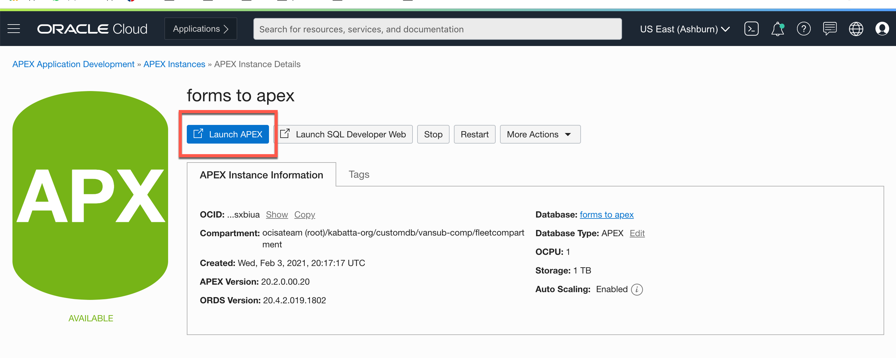

# Sign up for an APEX Workspace

## Introduction

Oracle APEX is a low-code application platform for Oracle Database. APEX Application Development, Autonomous Data Warehouse (ADW), Autonomous Transaction Processing (ATP), and Autonomous JSON Database are fully managed services, pre-integrated and pre-configured with APEX, for rapidly building and deploying modern data-driven applications in Oracle Cloud. Business users, citizen, and application developers can create enterprise apps 20X faster with 100X less code — without having to learn complex web technologies with just a browser. 

Estimated Time: 5 minutes

### What is an APEX Workspace?

An APEX Workspace is a logical domain where you define APEX applications. Each workspace is associated with one or more database schemas (database users) which are used to store the database objects, such as tables, views, packages, and more. APEX applications are built on top of these database objects.

## Create an APEX Service Instance


1.  From the Oracle Cloud Dashboard, click on the hamburger menu on the upper-left corner. From the navigation menu, select **Developer Services** and then **APEX Application Development** or **APEX Instances**. The APEX Instances page appears.

    

2. At the top of the APEX Instances page, Select your Compartment and click the **Create APEX Service** button.

    

3. Select the **Always Free** option, enter **```SecretPassw0rd```** for the ADMIN password, then click **Create APEX Service**.

    

    

    

4. The APEX Instances Details displays again.

  When the provisioning process completes the APX logo turns from orange to green and the Launch APEX and Launch Database Actions buttons are enabled.

  

  

5. Before using a new APEX Service, you must set up your APEX Service instance by completing two tasks: create an initial APEX workspace and create an APEX user account.

    On the APEX Instance Details, click **Launch APEX**.

    

6. The Administration Services Sign In page appears. Enter the password for the Administration Services and click **Sign In to Administration**.
  The password is the same as the one entered for the ADMIN user when creating the APEX service: **```SecretPassw0rd```**
  

7. Click **Create Workspace**.

  

8. Depending on how you would like to create your workspace, select **New Schema** or **Existing Schema**. If you are getting started, select **New Schema**.

  

9. In the Create Workspace dialog, enter the following:

    | Property | Value |
    | --- | --- |
    | Workspace Name | DEMO |
    | Workspace Username | DEMO |
    | Workspace Password | **`SecretPassw0rd`** |

  Click **Create Workspace**.

  

10. On the APEX Instance Administration page, click the **DEMO** link in the success message.
  *Note: This will log you out of APEX Administration so that you can log into your new workspace.*

  

11. On the APEX Workspace log in page, enter **``SecretPassw0rd``** for the password, check the **Remember workspace and username** checkbox, and then click **Sign In**.

  


## Acknowledgements

- **Author** - Apoorva Srinivas, Senior Product Manager
- **Last Updated By/Date** - Apoorva Srinivas, Senior Product Manager, July 2024