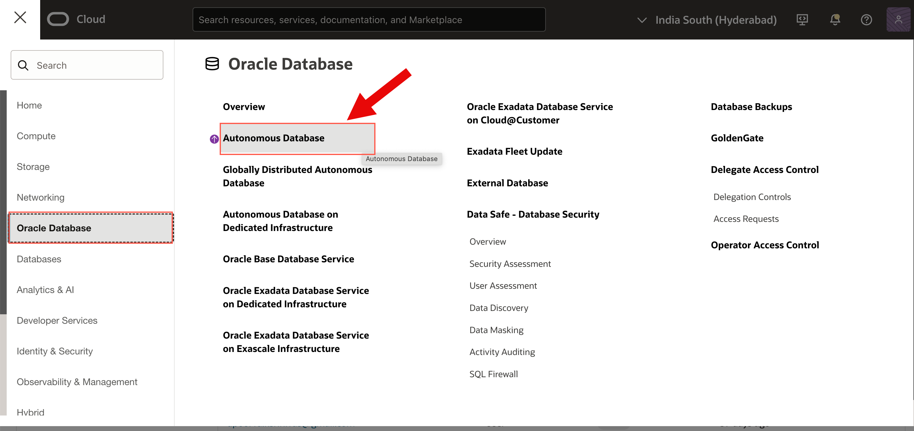
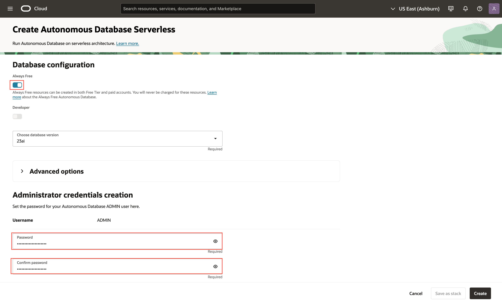
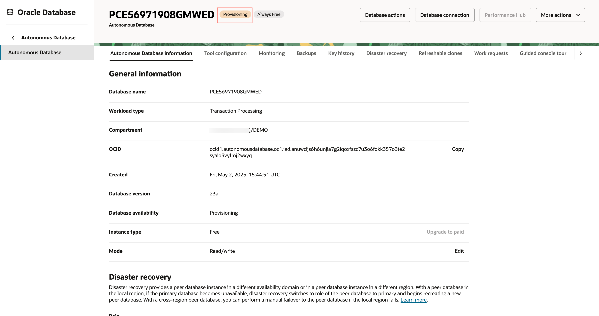
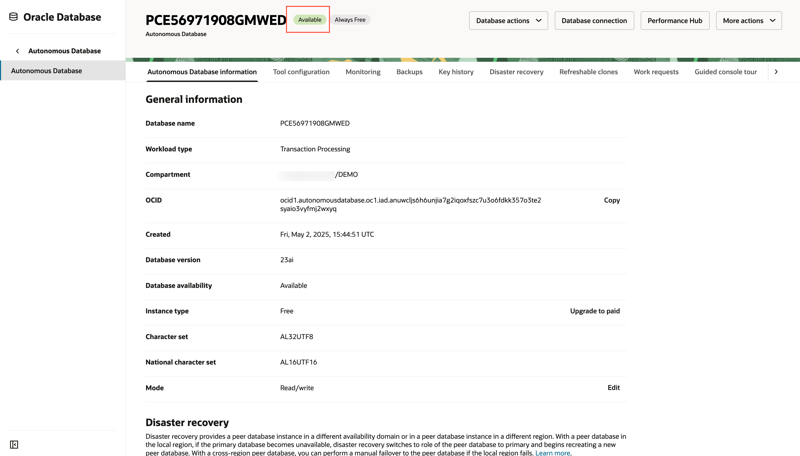
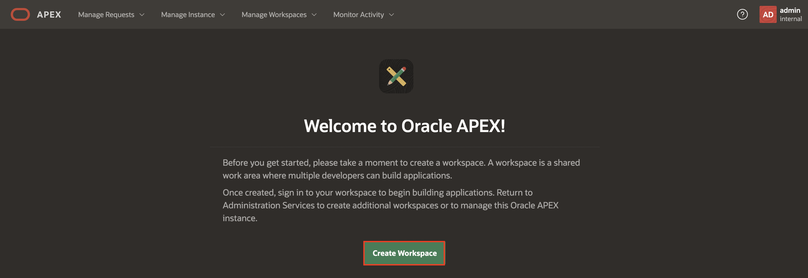

# Provision an APEX Workspace

## Introduction

Oracle APEX is the world's most popular enterprise low-code application platform that enables you to build scalable, secure web and mobile apps, with world-class features, that can be deployed anywhere – cloud or on premises. APEX Application Development, Autonomous Data Warehouse (ADW), and Autonomous Transaction Processing (ATP) are fully managed services, pre-integrated and pre-configured with APEX, for rapidly building and deploying modern data-driven applications in Oracle Cloud. Business users, citizens, and application developers can create enterprise apps 20X faster with 100X less code — without having to learn complex web technologies with just a browser. To start, you will need to decide on the service you are going to use for this workshop and then create an APEX workspace accordingly.


Estimated Time: 5 minutes

### What is an APEX Workspace?

An APEX Workspace is a logical domain where you define APEX applications. Each workspace is associated with one or more database schemas (database users) which are used to store the database objects, such as tables, views, packages, and more. APEX applications are built on top of these database objects.

## Create an APEX Workspace using Autonomous AI Database in Oracle Cloud

From within your Oracle Cloud environment, you will create an instance of the Autonomous AI Database service.

1. From the Cloud Dashboard, select the navigation menu icon in the upper left-hand corner, navigate to **Oracle AI Database** and then select **Autonomous AI Database**.

   

2. Click **Create Autonomous AI Database**.

   

3. Enter/ select the following:
    - Workload Type: **Transaction Processing** 
    - Always Free: Toggle **ON**
    - Choose database version: **26ai**
    - Admin Password: enter a **```SecretPassw0rd```** password for ADMIN 
    Click **Create**.

    

    

    

4. You will be redirected to the Autonomous Database Details page for the new instance.

    Continue when the status changes from 'Provisioning' to 'Available':

    

    to

    

5. Within your new database, APEX is not yet configured. Therefore, when you first access APEX, you will need to log in as an APEX Instance Administrator to create a workspace.

    Navigate to **Tool Configuration**. Under Oracle APEX, click **Copy** to copy the public access URL and open in a different tab.


    

    *Note: Always Free Autonomous Database will be stopped after being inactive for 7 days. If that happens, you need to click **More Actions** and then **Start** to start your Autonomous Database, and then **Open APEX**.*

6. Enter the password for the Administration Services and click **Sign In to Administration**.

    The password is the same as the one entered for the ADMIN user when creating the ATP instance: **```SecretPassw0rd```**

    

7. Click **Create Workspace**.

    

8. Depending on how you would like to create your workspace, select **New Schema** or **Existing Schema**. If you are getting started, select **New Schema**.

    

9. In the Create Workspace dialog, enter the following:

      | Property | Value |
      | --- | --- |
      | Workspace Name | DEMO |
      | Workspace Username | DEMO |
      | Workspace Password | **`SecretPassw0rd`** |

    Click **Create Workspace**.

    

10. In the APEX Instance Administration page, click the **DEMO** link in the success message.

    *Note: This will log you out of APEX Administration so that you can log into your new workspace.*

    

11. On the APEX Workspace log in page, enter **``SecretPassw0rd``** for the password, check the **Remember Workspace and Username** checkbox, and then click **Sign In**.

    

## Acknowledgements

- **Author** - Apoorva Srinivas, Principal Product Manager
- **Last Updated By/Date** - Apoorva Srinivas, Principal Product Manager, December 2025