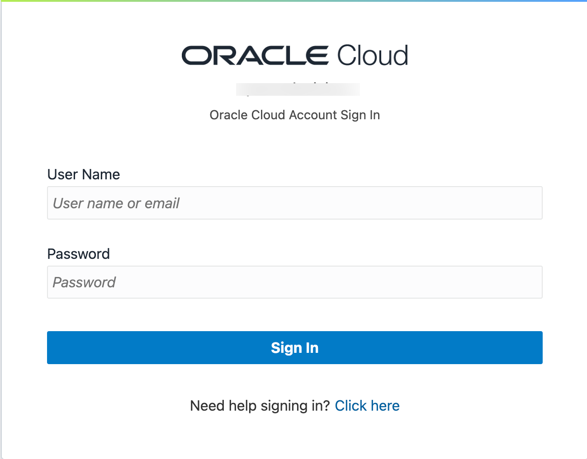

# Sign up for an APEX Workspace

## Introduction

Oracle APEX is a low-code application platform for Oracle Database. APEX Application Development, Autonomous Data Warehouse (ADW), Autonomous Transaction Processing (ATP), and Autonomous JSON Database are fully managed services, pre-integrated and pre-configured with APEX, for rapidly building and deploying modern data-driven applications in Oracle Cloud. Business users, citizen, and application developers can create enterprise apps 20X faster with 100X less code — without having to learn complex web technologies with just a browser. 

Estimated Time: 5 minutes

### What is an APEX Workspace?

An APEX Workspace is a logical domain where you define APEX applications. Each workspace is associated with one or more database schemas (database users) which are used to store the database objects, such as tables, views, packages, and more. APEX applications are built on top of these database objects.

## Create an APEX Service Instance

In this part, you will create an Oracle APEX Application Development Service. Once you have signed up for the service, you will create an *APEX Service* instance. The final step in the process is to provision Oracle APEX workspace.

1. Please [click this link to create your free account](https://signup.cloud.oracle.com/). When you complete the registration process, you'll receive an account with a $300 credit that you can utilize to create an APEX Service. You can then use any remaining credit to continue to explore the Oracle Cloud.

2. Once the Sign up process is complete, you will be logged in automatically to the Oracle Cloud Infrastructure (OCI) Console.

    - In case you have closed the browser, you can always refer to the **Get Started Now with Oracle Cloud** email that you should have received to login to OCI Console.
    Make a note of your **Username**, **Password**, and **Cloud Account Name**.

    

    - Alternatively, you can login to your Oracle Cloud account by accessing the following URL from your browser:
    [https://cloud.oracle.com](https://cloud.oracle.com).
    Enter your **Cloud Account Name** in the input field and click the **Next** button.

    

    - Enter your **User Name** and **Password** in the input fields, and click **Sign In**.

    

3. From the Cloud Dashboard, click on the hamburger menu on the upper-left corner. From the navigation menu, select **Developer Services** and then **APEX Application Development** or **APEX Instances**.

    

4. At the top of the APEX Instances page, click the **Create APEX Service**.

    

5. Select the **Always Free** option, enter **```SecretPassw0rd```** for the ADMIN password, then click **Create APEX service**.

    

    

6. The APEX Instances Details displays again.

   When the provisioning process completes, an orange 'Provisioning' badge changes to a green 'Available' badge. The Launch APEX button is enabled.

   

   

7. Before using a new APEX Service, you must set up your APEX Service instance by completing two tasks: create an initial APEX workspace and create an APEX user account.

   On the APEX Instance Details, click Launch APEX.

   

8. The Administration Services Sign In page appears. Enter the password for the Administration Services and click **Sign In to Administration**.
The password is the same as the one entered for the ADMIN user when creating the APEX service: **```SecretPassw0rd```**

   

9. Click **Create Workspace**.

   

10. Depending on how you would like to create your workspace, select **New Schema** or **Existing Schema**. If you are getting started, select **New Schema**.

    

11. In the Create Workspace dialog, enter the following:

    | Property | Value |
    | --- | --- |
    | Workspace Name | DEMO |
    | Workspace Username | DEMO |
    | Workspace Password | **`SecretPassw0rd`** |

    Click **Create Workspace**.

    

12. In the APEX Instance Administration page, click the **DEMO** link in the success message.

    *Note: This will log you out of APEX Administration so that you can log into your new workspace.*

    

13. On the APEX Workspace log in page, enter **``SecretPassw0rd``** for the password, check the **Remember Workspace and Username** checkbox, and then click **Sign In**.

    

## Acknowledgements

- **Author** - Apoorva Srinivas, Senior Product Manager
- **Last Updated By/Date** - Apoorva Srinivas, Senior Product Manager, July 2024