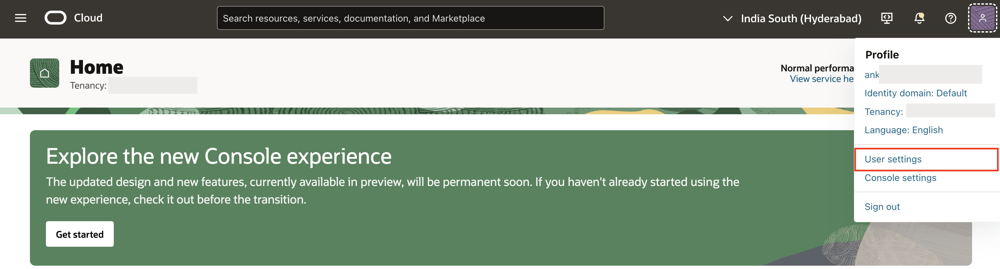

# Configure OCI API Keys and a Bucket

## Introduction

In this lab, you learn how to configure the OCI API keys and create buckets in OCI object storage. In Oracle Cloud Infrastructure (OCI), API keys are used for secure authentication when accessing OCI resources through REST APIs, and a bucket refers to a logical container used to store and manage data objects within an Object Storage service.

OCI API keys have two parts: a **Public key** and a **Private key**. You use the OCI console to generate the Private/Public key pair.

Estimated Time: 10 Minutes

### Objectives

In this lab, you:

- Generate API Keys using OCI Console.

- Create a Bucket in OCI Object Storage.

## Task 1: Generate API Keys using OCI Console

To Generate the API Keys using OCI Console:

1. Login into your OCI Account.

   

2. Click **My Profile** at the top-right corner and select **User settings**.

    

3. Under **Tokens and keys** tab and click **Add API key**.

    

4. The Add API key dialog is displayed. Select **Generate API key pair** to create a new key pair.

5. Click **Download private key**. A **.pem** file will be saved to your local device. You do not need to download the public key.

   >*Note: You will use this private key while configuring the web credentials in Oracle APEX in the upcoming lab.*

6. Click **Add**.

    

7. The key is added, and the Configuration file preview is displayed. Copy and save the configuration file snippet from the text box into a notepad. You will use this information to create Oracle APEX Web Credentials.

    

## Task 2: Create a Bucket in OCI Object Storage

To create a Bucket using OCI Console, login to your OCI Account.

1. To access the Object Storage service, click on the menu icon **(☰)** at the top-left corner.

   

2. Under Storage, select **Buckets**.

   

3. Select the compartment where you want to create the Bucket. You can choose an existing compartment or create a new one if needed. Now, select **Create Bucket**.

   

4. Enter/select the following:

    - Bucket Name: **OCIDocAI**

    - Default Storage Tier: **Standard**

    Click **Create**.

    

5. Navigate to **OCIDocAI** Bucket.

    

6. Copy and save **Bucket Name** and **Namespace** from the bucket details into a notepad. You will use this information to upload an invoice to OCI Object Storage using Invoke API.

    

## Summary

You now know how to generate API Keys and create Bucket using the OCI console.

You may now proceed to the next lab.

## Acknowledgements

- **Author(s)** - Roopesh Thokala, Senior Product Manager; Ankita Beri, Product Manager
- **Last Updated By/Date** - Ankita Beri, Product Manager, May 2025
