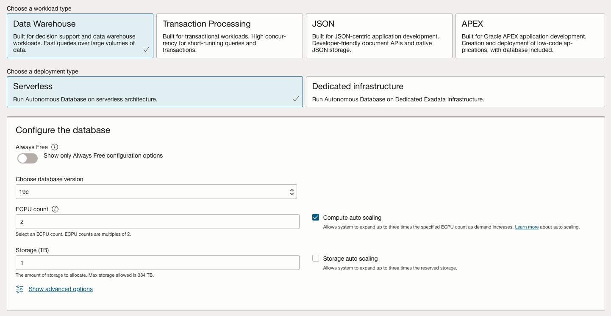
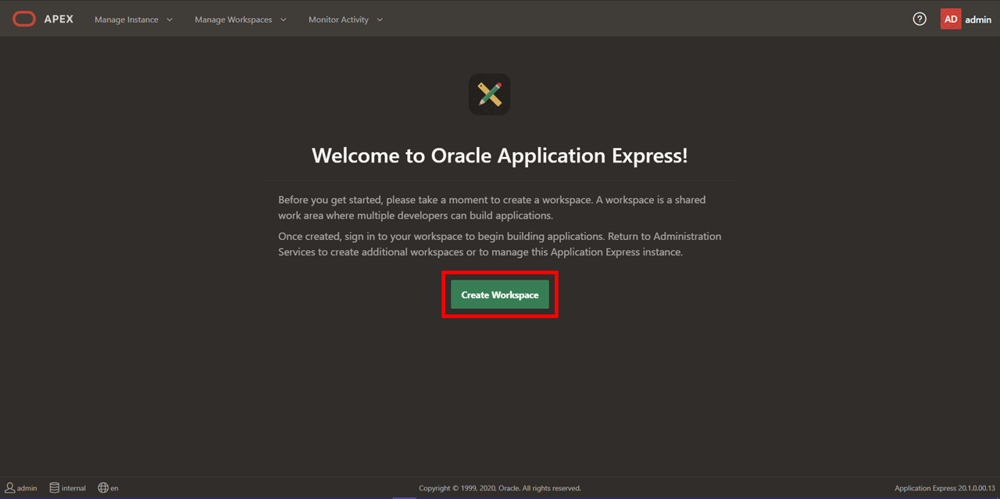

# Create an Oracle APEX Workspace

## Introduction

Oracle Application Express (APEX) is a feature of Oracle Database, including the Autonomous Data Warehouse (ADW) and Autonomous Transaction Processing (ATP) services. To start, you will need to decide which Oracle Database you are going to use for the workshop, and then create an APEX workspace in that database.

Estimated Time: 5 minutes

### What is an APEX Workspace?
An APEX Workspace is a logical domain where you define APEX applications. Each workspace is associated with one or more database schemas (database users) which are used to store the database objects, such as tables, views, packages, and more. These database objects are generally what APEX applications are built on top of.

### Where to Run the Lab
This lab is designed for a [a LiveLabs environment](http://bit.ly/golivelabs). If you haven't already done so, reserve an environment to run this workshop.

## Task 1: Create an APEX Workspace on an Autonomous Transaction Processing instance

In this step, you will create an *Autonomous Transaction Processing* database and provision an Oracle APEX Workspace.

1. From within your Oracle Cloud environment, you will create an instance of the Autonomous Transaction Processing database service.

    From the Cloud Dashboard, select the navigation menu icon in the upper left-hand corner and then select **Autonomous Transaction Processing**.

    

<if type="livelabs">

2. Select your compartment from the List Scope on the left by entering all or part of your LiveLabs user id in the search text field. Then select the compartment assigned to you for your reservation.

    
</if>

2. Click **Create Autonomous Database**.

    

3. Select your compartment. *If you are using a LiveLabs environment, use the default compartment provided by the environment*. Leave Always Free unchecked, enter **```SecretPassw0rd```** for the ADMIN password, then click **Create Autonomous Database**.  

    
    
    

    *LiveLabs ONLY - NOTE:  If you get an error stating "Authorization failed or requested resource not found", go back to your compartment and make sure you did NOT choose the root compartment.  Choose the compartment you were assigned*

4. After clicking **Create Autonomous Database**, you will be redirected to the Autonomous Database Details page for the new instance.

    Continue when the status changes from:

    

    to:

    

5. Within your new database, APEX is not yet configured. Therefore, when you first access APEX, you will need to log in as an APEX Instance Administrator to create a workspace.

    Click the **Tools** tab.
    Click **Open APEX**.

    

6. Enter the password for the Administration Services and click **Sign In to Administration**.     
    The password is the same as the one entered for the ADMIN user when creating the ATP instance: **```SecretPassw0rd```**

    

7. Click **Create Workspace**.

    

8. In the Create Workspace dialog, enter the following:

    | Property | Value |
    | --- | --- |
    | Database User | DEMO |
    | Password | **`SecretPassw0rd`** |
    | Workspace Name | DEMO |

    Click **Create Workspace**.

    

9.  In the APEX Instance Administration page, click the **DEMO** link in the success message.         
    *Note: This will log you out of APEX Administration so that you can log into your new workspace.*

    

10. On the APEX Workspace log in page, enter **``SecretPassw0rd``** for the password, check the **Remember workspace and username** checkbox, and then click **Sign In**.

    


## Summary

This completes the lab setup. At this point, you know how to create an APEX Workspace and you are ready to start building amazing apps, fast.

You may now *proceed to the next lab*.

## Acknowledgements

 - **Author/Contributors** -  Salim Hlayel, Principle Product Manager
 - **Contributor** - Oracle LiveLabs Team (Arabella Yao, Product Manager Intern | Jaden McElvey, Technical Lead)
 - **Last Updated By/Date** - Madhusudhan Rao, Apr 2022
